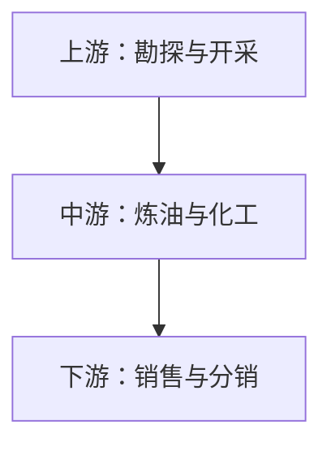
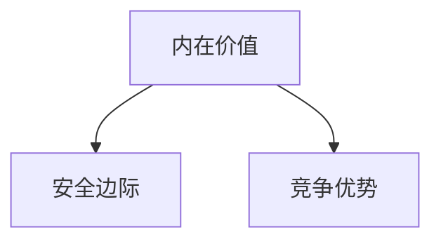
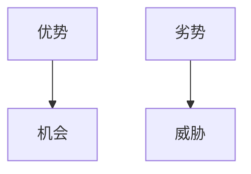

                 


# 巴菲特的石油行业投资：能源领域的机遇

---

## 关键词：
巴菲特、石油行业、能源投资、价值投资、长期投资、能源转型

---

## 摘要：
本文深入分析巴菲特在石油行业的投资策略和成功经验，探讨能源领域的机遇与挑战。通过解析巴菲特的价值投资理念、行业分析方法、风险管理策略以及实际案例，揭示如何在能源转型中抓住投资机会，实现长期稳健收益。

---

## 目录大纲：

1. 引言
2. 石油行业的背景与现状
3. 巴菲特的投资理念与策略
4. 石油行业分析与投资评估
5. 投资策略与风险管理
6. 实际案例分析
7. 未来展望
8. 投资模拟实战
9. 结论

---

## 第1章：引言

### 1.1 巴菲特的投资哲学
- **价值投资的核心理念**：寻找具有持续竞争优势的公司，关注内在价值，而非短期市场波动。
- **巴菲特的投资风格**：长期持有、集中投资、注重安全边际。
- **石油行业的重要性**：作为全球能源的重要组成部分，石油行业的稳定性和增长性吸引了巴菲特的关注。

### 1.2 石油行业的现状与未来趋势
- **行业背景**：石油作为全球主要能源，需求稳定增长，但面临环保压力和能源转型的挑战。
- **能源转型**：全球向可再生能源转型的趋势对石油行业的影响，以及行业如何应对这一变化。
- **巴菲特的长期看法**：石油行业作为基础能源，长期需求依然强劲，具备投资价值。

### 1.3 本书的目的与结构
- **目的**：通过分析巴菲特的投资策略和案例，为读者提供在石油行业投资的深度指导。
- **结构**：从行业背景、投资理念、分析方法、风险管理到实际案例，系统性地展开论述。

---

## 第2章：石油行业的背景与现状

### 2.1 石油行业的产业链与价值链
- **上游**：勘探与开采，决定石油的供应量。
- **中游**：炼油与化工，将原油转化为成品。
- **下游**：销售与分销，直接面向消费者。

#### 图2-1：石油行业产业链图（Mermaid图）


### 2.2 石油行业的财务指标分析
- **关键指标**：市盈率（P/E）、市净率（P/B）、股息率、ROE（净资产收益率）。
- **公式**：
  - 市盈率 = 股价 / 每股收益
  - 市净率 = 股价 / 每股净资产
  - 股息率 = 每股股息 / 股价

### 2.3 石油行业的竞争优势分析
- **成本优势**：低成本开采和炼油能力。
- **资源储备**：拥有丰富石油储备的公司更具竞争力。
- **品牌与市场地位**：知名品牌在市场中更具优势。

---

## 第3章：巴菲特的投资理念与策略

### 3.1 价值投资的核心要素
- **安全边际**：买入价格低于内在价值，确保投资的安全性。
- **竞争优势**：寻找具有持续竞争优势的公司，如低成本、高市场占有率。

#### 图3-1：价值投资模型（Mermaid图）


### 3.2 巴菲特的长期投资策略
- **集中投资**：将资金集中在少数优质公司，而非分散投资。
- **长期持有**：买入后长期持有，避免频繁交易。

### 3.3 投资决策的数学模型
- **内在价值计算**：
  内在价值 = 净利润 × 股东权益回报率 / 股东权益回报率
  - 示例：假设某公司净利润为100亿，股东权益回报率为15%，则内在价值为 \( 100亿 / 0.15 = 666.67亿 \)。

---

## 第4章：石油行业分析与投资评估

### 4.1 行业分析方法
- **SWOT分析**：评估公司优势、劣势、机会和威胁。
- **PEST分析**：分析政治、经济、社会和技术因素对行业的影响。

#### 图4-1：SWOT分析框架（Mermaid图）


### 4.2 投资评估的步骤
1. **基本面分析**：分析公司的财务状况、盈利能力、成长性。
2. **行业地位分析**：评估公司在行业中的地位和竞争优势。
3. **估值分析**：比较当前股价与内在价值，确定投资性价比。

---

## 第5章：投资策略与风险管理

### 5.1 投资策略
- **分散投资**：避免过度集中，降低风险。
- **价值陷阱识别**：识别那些看似便宜但基本面不佳的公司。

### 5.2 风险管理
- **宏观经济因素**：关注油价波动、全球经济形势等。
- **行业周期分析**：石油行业周期性较强，需注意周期性风险。

#### 图5-1：风险管理框架（Mermaid图）


---

## 第6章：实际案例分析

### 6.1 巴菲特投资Exxon的案例
- **背景**：Exxon是全球领先的石油公司，具备强大的成本优势和资源储备。
- **分析**：通过基本面分析和估值，巴菲特判断Exxon具有投资价值。
- **结果**：长期持有带来稳定的收益。

### 6.2 投资Chevron的逻辑
- **竞争优势**：Chevron在炼油和化工领域具有领先地位。
- **风险管理**：通过分散投资降低风险。

---

## 第7章：未来展望

### 7.1 石油行业的可持续性
- **技术进步**：石油开采和炼油技术的不断进步降低成本。
- **能源转型**：传统石油企业向新能源领域转型的机会。

### 7.2 未来投资机会
- **新能源投资**：巴菲特也开始关注新能源领域的投资机会。
- **行业整合**：石油行业的整合和并购将带来新的投资机会。

---

## 第8章：投资模拟实战

### 8.1 环境安装
- **工具安装**：安装Python和相关库（如pandas、numpy）。
- **数据获取**：获取石油行业的历史数据和公司财务数据。

### 8.2 核心实现
- **代码示例**：
  ```python
  import pandas as pd
  import numpy as np

  # 假设我们有一个包含公司财务数据的DataFrame
  df = pd.DataFrame({
      '公司': ['Exxon', 'Chevron', '壳牌'],
      '净利润': [100, 80, 90],
      '股东权益': [500, 400, 450]
  })

  # 计算ROE
  df['ROE'] = df['净利润'] / df['股东权益']

  print(df)
  ```

### 8.3 实战分析
- **选择公司**：基于巴菲特的投资策略，选择具有竞争优势的公司。
- **制定策略**：制定长期投资计划，并定期评估。

---

## 第9章：结论

### 9.1 投资理念总结
- **长期投资**：巴菲特的长期持有策略证明了时间的力量。
- **价值投资**：关注公司的内在价值，寻找具有竞争优势的公司。

### 9.2 投资建议
- **分散投资**：避免过度集中，降低风险。
- **持续学习**：关注行业动态，不断优化投资策略。

### 9.3 注意事项
- **风险提示**：石油行业波动较大，需谨慎评估。
- **长期视角**：投资需耐心，长期才能见效。

---

## 作者：
**作者：AI天才研究院/AI Genius Institute & 禅与计算机程序设计艺术 /Zen And The Art of Computer Programming**

---

**全文完。**

