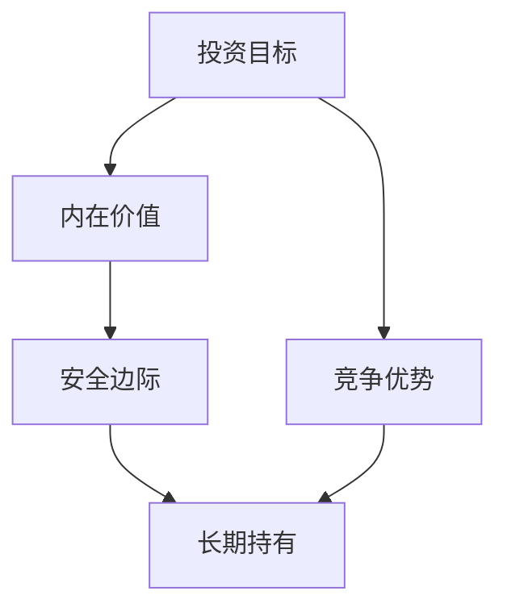
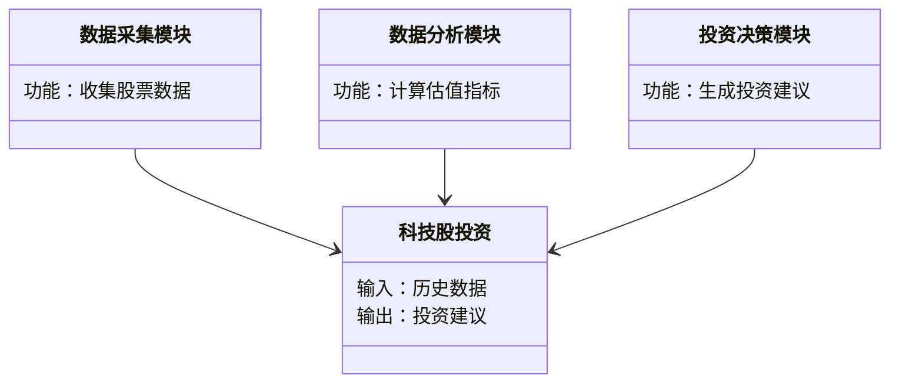
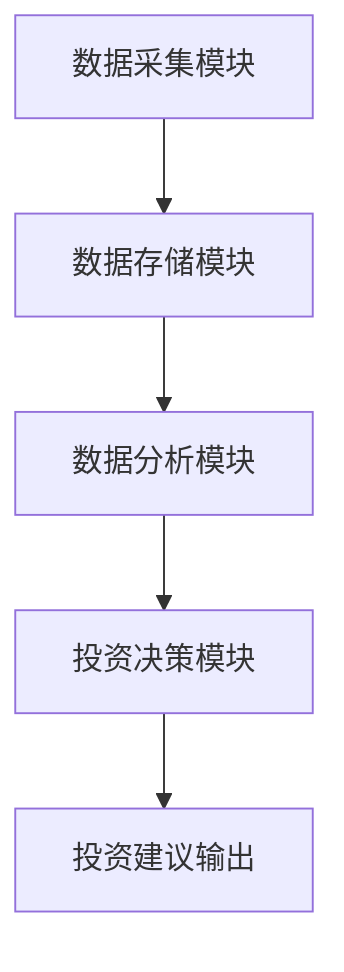
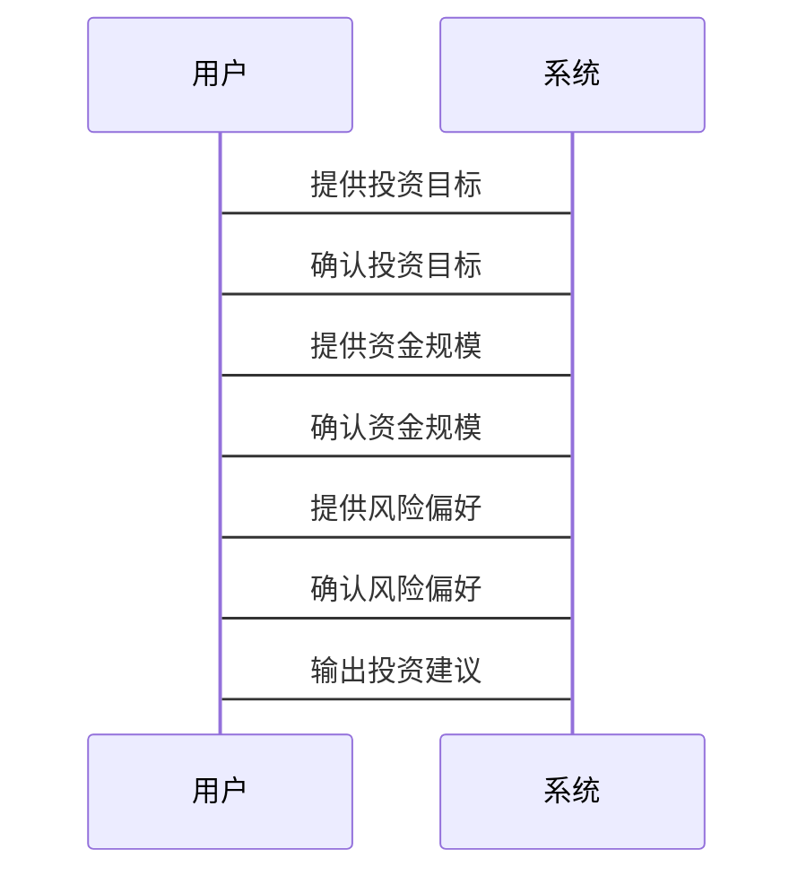

                 


# 巴菲特的科技股投资转变：从规避到拥抱的历程分析

> 关键词：巴菲特，科技股，投资策略，价值投资，苹果，亚马逊

> 摘要：本文详细分析了巴菲特从规避科技股到拥抱科技股的投资转变历程。通过对比科技股与传统行业的特点，阐述了巴菲特投资理念的变化及其背后的逻辑。同时，本文结合具体案例，如苹果和亚马逊的投资，深入探讨了科技股的投资逻辑、核心特征及长期价值。文章最后总结了巴菲特科技股投资的成功经验，并提出了对投资者的启示。

---

# 第一部分：巴菲特的投资理念与科技股的碰撞

## 第1章：巴菲特的价值投资理论概述

### 1.1 价值投资的核心理念

价值投资是一种以基本面分析为基础的投资策略，强调以低于内在价值的价格购买优质资产。巴菲特的价值投资理论主要包括以下几点：

1. **安全边际**：买入价格低于内在价值，确保有一定的安全空间。
2. **长期持有**：避免频繁交易，专注于优质资产的长期增值。
3. **护城河**：投资具有强大竞争优势的企业，确保长期盈利能力。

**图1-1：价值投资的核心要素**



### 1.2 巴菲特对传统行业的偏爱

在早期的投资生涯中，巴菲特更倾向于投资传统行业，如制造业、零售业和公用事业等。这些行业具有稳定的现金流、可预测的业绩和较低的波动性，符合巴菲特对“确定性”的追求。

### 1.3 科技股在巴菲特投资中的特殊地位

科技股的特点是高增长、高波动性和高风险。早期的巴菲特认为科技股难以理解和预测，因此选择规避。然而，随着科技行业的快速发展，科技股逐渐成为巴菲特投资组合中的重要组成部分。

---

## 第2章：科技股的核心特征与投资逻辑

### 2.1 科技股的定义与分类

科技股是指那些主要业务涉及科技研发、生产或应用的公司股票。根据业务模式，科技股可以分为以下几类：

1. **硬件制造**：如苹果、英特尔。
2. **软件开发**：如微软、谷歌。
3. **互联网服务**：如亚马逊、Facebook。
4. **半导体**：如英伟达、AMD。

### 2.2 科技股的投资逻辑

科技股的投资逻辑与传统行业有所不同，主要体现在以下几个方面：

1. **高增长潜力**：科技行业具有较高的增长空间，尤其是人工智能、云计算和5G等领域。
2. **竞争优势**：科技公司需要具备强大的研发能力和市场垄断地位。
3. **风险与挑战**：科技股的波动性较大，且技术更新换代快，投资风险较高。

### 2.3 巴菲特对科技股投资逻辑的转变

随着科技行业的崛起，巴菲特逐渐意识到科技股的长期价值。以下是其投资逻辑的转变：

1. **从规避到关注**：巴菲特开始关注科技行业的龙头公司，如苹果和亚马逊。
2. **从短期波动到长期价值**：巴菲特不再关注短期股价波动，而是专注于公司的长期盈利能力。
3. **从传统行业到科技+传统结合**：巴菲特的投资组合逐渐向科技+传统行业的结合模式转变。

---

## 第3章：巴菲特科技股投资的标志性案例分析

### 3.1 苹果公司投资案例

#### 3.1.1 苹果公司的核心竞争力

苹果公司是全球最具创新力的科技公司之一，其核心竞争力体现在以下几个方面：

1. **品牌价值**：苹果品牌具有极高的市场认知度和客户忠诚度。
2. **产品创新**：苹果不断创新推出革命性产品，如iPhone、iPad和Mac。
3. **生态系统**：苹果构建了完整的生态系统，从硬件到软件再到服务，形成了强大的协同效应。

#### 3.1.2 巴菲特对苹果的投资决策

巴菲特对苹果的投资始于2016年。当时，苹果的市盈率较低，且具有强大的竞争优势。巴菲特认为苹果不仅是一家科技公司，更是一家消费品公司，符合其对“护城河”的定义。

#### 3.1.3 苹果投资的收益与启示

截至2023年，苹果是巴菲特投资组合中最大的科技股持仓，占其持仓市值的约60%。苹果的投资收益不仅来源于股价的上涨，还源于其稳定的股息回报。这表明，科技股的投资需要结合长期价值和短期收益。

### 3.2 亚马逊投资案例

#### 3.2.1 亚马逊的业务模式

亚马逊是全球最大的电商平台之一，其业务模式包括电商、云计算（AWS）、智能硬件和内容服务（如Prime Video）。亚马逊的核心竞争力在于其强大的物流体系和技术创新能力。

#### 3.2.2 巴菲特对亚马逊的投资逻辑

巴菲特对亚马逊的投资主要基于以下几点：

1. **长期增长潜力**：亚马逊的云计算业务具有巨大的增长空间。
2. **竞争优势**：亚马逊在电商和云计算领域的市场占有率遥遥领先。
3. **管理层质量**：亚马逊的管理层具有卓越的执行力和创新能力。

#### 3.2.3 亚马逊投资的长期价值

亚马逊的投资回报不仅体现在股价的持续增长，还体现在其商业模式的延展性。亚马逊的成功证明了科技股投资的长期价值。

---

## 第4章：科技股投资的系统分析与架构设计

### 4.1 系统功能设计

#### 4.1.1 领域模型

**图4-1：科技股投资领域的核心要素**



#### 4.1.2 系统架构

**图4-2：科技股投资分析系统的架构**



### 4.2 系统接口设计

科技股投资分析系统的接口设计包括数据输入接口、数据输出接口和用户交互接口。以下是具体接口的设计：

1. **数据输入接口**：用于接收历史股票数据和市场信息。
2. **数据输出接口**：用于输出投资建议和分析报告。
3. **用户交互接口**：用于用户与系统的交互，包括输入参数和查看结果。

### 4.3 系统交互设计

**图4-3：系统交互流程**



---

## 第5章：项目实战

### 5.1 环境安装

#### 5.1.1 Python环境搭建

安装Python和必要的库：

```bash
pip install numpy pandas matplotlib
```

#### 5.1.2 数据采集工具安装

安装股票数据采集工具，如Yahoo Finance API：

```bash
pip install yfinance
```

### 5.2 核心实现

#### 5.2.1 数据采集

使用yfinance库采集苹果和亚马逊的历史数据：

```python
import pandas as pd
import yfinance as yf

# 采集数据
apple = yf.Ticker("AAPL")
amzn = yf.Ticker("AMZN")

# 获取历史数据
apple_data = apple.history(period="max")
amzn_data = amzn.history(period="max")
```

#### 5.2.2 数据分析

计算苹果和亚马逊的市盈率（P/E）和市净率（P/B）：

```python
def calculate_pe(stock_data):
    pe = stock_data['Close'] / stock_data['Earnings Per Share']
    return pe

def calculate_pb(stock_data):
    pb = stock_data['Close'] / stock_data['Book Value Per Share']
    return pb

apple_pe = calculate_pe(apple_data)
apple_pb = calculate_pb(apple_data)

amzn_pe = calculate_pe(amzn_data)
amzn_pb = calculate_pb(amzn_data)
```

#### 5.2.3 数据可视化

绘制苹果和亚马逊的股价趋势图：

```python
import matplotlib.pyplot as plt

plt.figure(figsize=(10, 6))
plt.plot(apple_data['Close'], label='Apple')
plt.plot(amzn_data['Close'], label='Amazon')
plt.title('Stock Price Trend')
plt.xlabel('Date')
plt.ylabel('Price')
plt.legend()
plt.show()
```

### 5.3 案例分析

以苹果和亚马逊为例，分析科技股的投资价值：

1. **苹果**：苹果的市盈率较低，且具有强大的品牌竞争力，符合巴菲特的价值投资理念。
2. **亚马逊**：亚马逊的市盈率较高，但其云计算业务具有巨大的增长潜力，符合巴菲特对长期价值的关注。

---

## 第6章：结论与展望

### 6.1 结论

巴菲特的投资理念从规避科技股到拥抱科技股的转变，体现了他对市场变化的敏锐洞察和对长期价值的坚持。科技股的投资需要结合基本面分析和长期价值判断，而不仅仅是关注短期股价波动。

### 6.2 展望

随着科技行业的快速发展，科技股的投资价值将更加凸显。投资者需要关注科技公司的竞争优势、管理层能力和长期增长潜力，才能在科技股投资中获得超额收益。

---

# 作者：AI天才研究院 & 禅与计算机程序设计艺术

---

通过以上思考步骤，我们可以清晰地看到巴菲特科技股投资的转变历程，并为投资者提供有价值的参考和启示。

