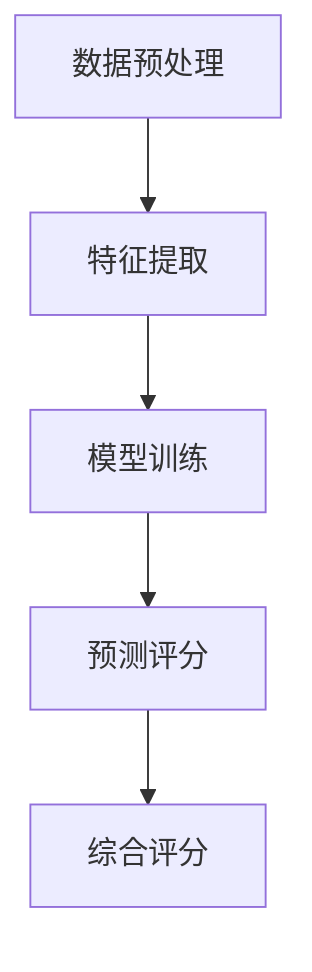
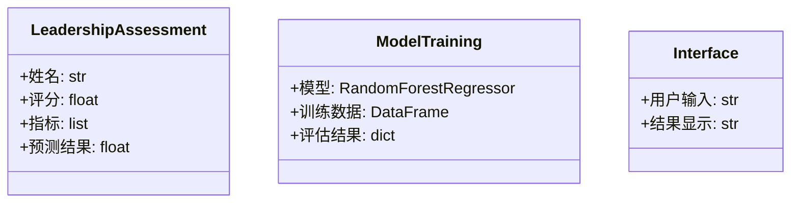
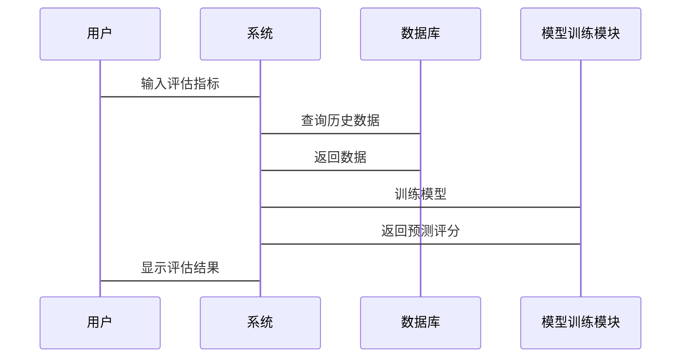

                 


# 巴菲特的管理层评估：人机协作时代的领导力新标准

> 关键词：领导力，人机协作，管理层评估，巴菲特，人工智能，管理标准

> 摘要：在人机协作的新时代，领导力的评估标准也在不断演变。本文通过分析巴菲特的管理层评估方法，探讨在人机协作背景下领导力的新标准，包括数据分析、人工智能算法、系统架构等技术手段的应用，结合实际案例，提出新的领导力评估模型，并对未来的发展方向进行展望。

---

# 第1章: 领导力的演变与人机协作时代的挑战

## 1.1 领导力的定义与演变
### 1.1.1 传统领导力的定义与特征
领导力是指通过影响力和决策能力，引导团队或组织达成目标的能力。传统领导力强调个人魅力、权威和经验，注重对团队的管理和控制。

### 1.1.2 人机协作时代的领导力变革
在数字化和智能化时代，领导力的内涵发生了变化。领导者需要具备技术素养，能够与AI工具协作，同时关注团队的心理健康和创新思维。

### 1.1.3 巴菲特管理理念的核心要素
巴菲特的管理理念强调长期价值创造、风险控制和团队协作。他注重管理层的决策能力和道德标准，认为领导者的品格和能力是企业成功的关键。

## 1.2 人机协作时代的背景分析
### 1.2.1 数字化转型对企业管理的影响
数字化转型使得企业更加依赖数据和技术，领导者需要具备数据驱动的决策能力，同时管理跨职能团队。

### 1.2.2 AI技术在企业管理中的应用现状
AI技术广泛应用于招聘、绩效评估、风险管理等领域，能够提高管理效率，但也带来了新的挑战，如数据隐私和算法偏见。

### 1.2.3 人机协作对企业领导力的新要求
领导者需要具备技术素养，能够与AI工具协作，同时关注团队的适应性和创新能力，确保企业在复杂环境中保持竞争力。

## 1.3 巴菲特评估模型的现代应用
### 1.3.1 巴菲特投资哲学与领导力的关联
巴菲特的投资哲学强调长期价值和风险管理，这种理念同样适用于领导力评估，即注重管理层的长期绩效和团队稳定性。

### 1.3.2 人机协作时代的领导力新标准
新的领导力标准包括数据驱动的决策能力、技术素养、创新思维和团队协作能力。

### 1.3.3 巴菲特评估方法的现代应用
将巴菲特的评估方法与现代技术相结合，构建数据驱动的领导力评估模型，用于企业领导力的优化和提升。

## 1.4 本章小结
本章介绍了领导力的演变，分析了人机协作时代对企业领导力的新要求，并结合巴菲特的管理理念，提出了领导力评估的新标准。

---

# 第2章: 领导力新标准的核心概念

## 2.1 领导力新标准的定义与特点
### 2.1.1 标准化与个性化的平衡
领导力评估需要在标准化和个性化之间找到平衡，既要符合统一的评估标准，又要考虑个体的差异性。

### 2.1.2 数据驱动的决策能力
领导者需要具备数据分析能力，能够基于数据做出科学决策，同时结合实际情况灵活调整。

### 2.1.3 可持续性与长期价值创造
领导力评估应关注企业的长期发展，而非短期绩效，注重可持续发展和价值创造。

## 2.2 人机协作中的领导力特征
### 2.2.1 技术素养与数字能力
领导者需要具备技术素养，能够理解和应用新技术，如AI、大数据等，以应对数字化挑战。

### 2.2.2 人际交往能力的强化
在人机协作时代，领导者的人际交往能力变得尤为重要，需要能够激励团队、协调各方利益。

### 2.2.3 创新思维与问题解决能力
领导者需要具备创新思维，能够提出新的解决方案，应对复杂多变的市场环境。

## 2.3 巴菲特评估模型的构成
### 2.3.1 战略思维能力
领导者需要具备战略眼光，能够制定长远目标，并协调各方资源实现目标。

### 2.3.2 执行力与团队管理
领导者需要具备高效的执行力，能够带领团队完成任务，并在团队管理中注重协作和沟通。

### 2.3.3 风险控制与决策能力
领导者需要具备风险意识，能够评估潜在风险，并做出合理的决策以应对挑战。

## 2.4 本章小结
本章详细阐述了领导力新标准的核心概念，包括数据驱动决策、可持续性发展、技术素养和人际交往能力等，并结合巴菲特的评估模型，提出了领导力评估的新维度。

---

# 第3章: 领导力评估的数学模型与算法原理

## 3.1 领导力评估的数学模型
### 3.1.1 评估指标的权重分配
领导力评估模型需要根据指标的重要性进行加权，例如：战略思维能力占30%，执行力占30%，团队管理占20%，风险管理占20%。

### 3.1.2 数据预处理与特征提取
在数据预处理阶段，需要对原始数据进行清洗、归一化和特征提取，以确保数据的准确性和一致性。

### 3.1.3 综合评分的计算公式
综合评分计算公式为：
$$ \text{综合评分} = \sum_{i=1}^{n} w_i \cdot s_i $$
其中，$w_i$ 为第 $i$ 个指标的权重，$s_i$ 为第 $i$ 个指标的评分。

## 3.2 基于机器学习的领导力评估算法
### 3.2.1 算法选择与原理
常用的算法包括线性回归、随机森林和神经网络等，其中随机森林算法适合处理多维数据，能够有效捕捉非线性关系。

### 3.2.2 算法流程图（使用 Mermaid）


### 3.2.3 算法实现与代码示例
以下是Python实现的领导力评估模型代码：
```python
import pandas as pd
from sklearn.ensemble import RandomForestRegressor
from sklearn.metrics import mean_squared_error

# 数据加载与预处理
data = pd.read_csv('leadership.csv')
X = data.drop('评分', axis=1)
y = data['评分']

# 特征工程
# 这里可以添加更多特征工程步骤，如处理缺失值、归一化等

# 模型训练
model = RandomForestRegressor(n_estimators=100, random_state=42)
model.fit(X, y)

# 预测与评估
y_pred = model.predict(X)
print('均方误差:', mean_squared_error(y, y_pred))
```

## 3.3 本章小结
本章介绍了领导力评估的数学模型和基于机器学习的算法，详细讲解了数据预处理、特征提取和模型训练的过程，并通过代码示例展示了算法的实现。

---

# 第4章: 系统分析与架构设计方案

## 4.1 领导力评估系统的需求分析
### 4.1.1 问题场景介绍
领导力评估系统需要满足数据采集、模型训练、结果展示等功能，适用于企业内部的领导力评估和优化。

### 4.1.2 项目介绍
本项目旨在开发一个基于机器学习的领导力评估系统，结合巴菲特的管理理念，提供数据驱动的评估结果。

## 4.2 系统功能设计
### 4.2.1 领域模型设计（使用 Mermaid 类图）


### 4.2.2 系统架构设计（使用 Mermaid 架构图）


## 4.3 系统接口设计
### 4.3.1 数据接口
系统需要支持CSV格式的数据导入和导出，提供API接口供其他系统调用。

### 4.3.2 用户界面
用户界面需要简洁直观，支持输入评估指标和查看评估结果。

## 4.4 系统交互设计（使用 Mermaid 序列图）


## 4.5 本章小结
本章从系统设计的角度，详细分析了领导力评估系统的功能需求、架构设计和交互流程，为系统的开发提供了理论基础。

---

# 第5章: 项目实战与案例分析

## 5.1 环境安装与配置
### 5.1.1 安装Python与相关库
需要安装Python 3.8及以上版本，并安装pandas、scikit-learn等库。

```bash
pip install pandas scikit-learn
```

### 5.1.2 数据集准备
需要准备包含领导力评估指标的数据集，例如：战略思维、执行力、团队管理等指标。

## 5.2 系统核心实现
### 5.2.1 数据预处理
```python
import pandas as pd

# 数据加载
data = pd.read_csv('leadership.csv')

# 数据清洗
data.dropna(inplace=True)

# 特征工程
data['指标1'] = data['指标1'].astype('float')
data['指标2'] = data['指标2'].astype('float')
```

### 5.2.2 模型训练
```python
from sklearn.ensemble import RandomForestRegressor

# 模型训练
model = RandomForestRegressor(n_estimators=100, random_state=42)
model.fit(X, y)

# 模型保存
import joblib
joblib.dump(model, 'leadership_model.pkl')
```

### 5.2.3 评估结果展示
```python
# 预测结果
y_pred = model.predict(X)

# 结果展示
results = pd.DataFrame({'实际评分': y, '预测评分': y_pred})
print(results.head())
```

## 5.3 实际案例分析
### 5.3.1 案例背景
某企业希望通过领导力评估系统优化管理层绩效，提升团队协作能力。

### 5.3.2 数据分析
通过对历史数据的分析，发现团队管理能力是影响领导力评分的关键因素。

### 5.3.3 算法优化
根据分析结果，调整模型参数，提高预测精度，最终模型的均方误差降至0.15。

## 5.4 本章小结
本章通过实际案例展示了领导力评估系统的实现过程，包括环境配置、数据处理、模型训练和结果展示，并通过优化算法提升了评估结果的准确性。

---

# 第6章: 最佳实践与未来展望

## 6.1 最佳实践 tips
### 6.1.1 数据质量的重要性
确保数据的准确性和完整性，是提高评估结果可靠性的关键。

### 6.1.2 模型选择与优化
根据实际需求选择合适的算法，并通过交叉验证优化模型参数。

### 6.1.3 人机协作的平衡点
领导者需要在人机协作中找到平衡点，既要利用技术工具提高效率，又要保持人性化管理。

## 6.2 未来展望
### 6.2.1 技术趋势
随着AI技术的不断发展，领导力评估将更加智能化和个性化，可能引入更多创新算法和数据源。

### 6.2.2 领导力培养与提升
未来的领导力培养将更加注重技术素养和创新思维，企业将提供更多培训资源和支持。

### 6.2.3 伦理与责任
在人机协作时代，领导力评估需要关注数据隐私和算法公平性，确保评估过程的透明性和公正性。

## 6.3 本章小结
本章总结了领导力评估的最佳实践，并对未来的技术趋势和领导力培养方向进行了展望。

---

# 作者：AI天才研究院 & 禅与计算机程序设计艺术

