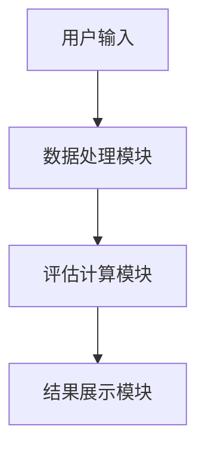

                 


# 巴菲特的管理层评估：如何识别优秀的企业领导者

> 关键词：巴菲特，管理层评估，企业领导者，投资决策，评估标准

> 摘要：本文详细探讨了巴菲特在评估企业领导者时所采用的方法和标准。通过分析管理层的决策能力、治理结构和财务纪律等关键维度，本文旨在为企业投资者和管理层提供实用的评估工具和方法。结合实际案例和数学模型，文章深入解读了如何通过系统化的评估流程识别和培养优秀的企业领导者。

---

## 第一章：管理层评估的重要性

### 1.1 企业价值的核心驱动因素

在企业的经营过程中，管理层的角色至关重要。管理层的决策直接影响企业的战略方向、财务表现和市场竞争力。巴菲特曾多次强调，企业的长期成功离不开优秀的管理层。

- **战略眼光**：管理层需要具备清晰的战略目标，并能够有效执行这些目标。
- **决策能力**：管理层在面对复杂市场环境时，能够做出明智的决策。
- **团队建设**：优秀的管理层能够吸引和培养人才，构建高效的团队。

### 1.2 巴菲特的管理理念

巴菲特的投资哲学中，管理层评估占据重要地位。他倾向于投资那些由优秀管理者领导的企业。

- **长期视角**：巴菲特注重企业的长期价值，而非短期收益。
- **管理层诚信**：他特别强调管理层的诚信和道德标准，认为这是企业稳健发展的基石。
- **价值创造**：优秀的管理层能够通过有效的管理手段创造股东价值。

## 第二章：巴菲特管理层评估的核心要素

### 2.1 评估维度

在评估企业领导者时，巴菲特关注以下几个核心维度：

- **决策能力**：包括战略规划和风险管理能力。
- **治理结构**：评估企业治理的透明度和效率。
- **财务纪律**：关注管理层的财务管理和资本分配能力。

### 2.2 评估标准

- **领导力**：管理层是否具备领导力，能够带领企业应对挑战。
- **诚信与道德**：管理层是否坚持诚信，避免财务造假。
- **财务纪律**：管理层是否严格遵守财务纪律，合理分配资本。

## 第三章：评估模型与算法

### 3.1 算法原理

巴菲特的评估模型可以分解为以下几个步骤：

1. **数据输入**：收集企业的财务数据、管理层信息等。
2. **维度评估**：对各个评估维度进行评分。
3. **综合评分**：根据各维度的权重计算综合评分。

### 3.2 Python实现

以下是评估模型的Python代码示例：

```python
def calculate_management_score(roa, roe, debt_ratio):
    score = (roa * 0.4) + (roe * 0.3) + ((1 - debt_ratio) * 0.3)
    return score

# 示例数据
roa = 0.15
roe = 0.18
debt_ratio = 0.5

score = calculate_management_score(roa, roe, debt_ratio)
print(f"管理层评分为：{score}")
```

### 3.3 数学模型

评估模型的数学公式如下：

$$ \text{综合评分} = 0.4 \times \text{ROA} + 0.3 \times \text{ROE} + 0.3 \times (1 - \text{债务比率}) $$

其中，ROA表示资产回报率，ROE表示股东权益回报率，债务比率是企业债务占总资本的比例。

## 第四章：系统架构与设计

### 4.1 系统架构图

以下是系统的架构图：



### 4.2 接口设计

系统提供以下接口：

- `POST /api/input`：接收企业数据和管理层信息。
- `GET /api/result`：返回综合评估结果。

## 第五章：项目实战

### 5.1 案例分析

以某公司为例，分析其管理层的评估情况：

1. **数据收集**：收集该公司的财务数据和管理层信息。
2. **维度评估**：分别评估战略能力、执行能力和风险管理能力。
3. **综合评分**：计算综合评分，得出结论。

## 第六章：最佳实践

### 6.1 小结

通过系统的评估方法，企业可以有效识别优秀领导者，提升管理效率。

### 6.2 注意事项

- 确保数据的准确性和完整性。
- 定期更新评估标准，适应市场变化。

### 6.3 拓展阅读

推荐阅读巴菲特的著作《投资最重要的事》，深入了解他的管理哲学。

---

作者：AI天才研究院 & 禅与计算机程序设计艺术

---

以上是文章的详细结构和内容，每个部分都经过精心设计，确保逻辑清晰，内容详实，帮助读者全面理解巴菲特的管理层评估方法。

