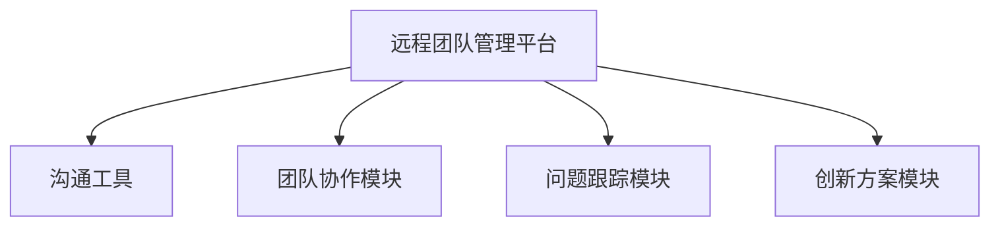

                 


# 巴菲特的管理层评估：远程办公时代的领导力新标准

## 关键词：巴菲特、管理层评估、远程办公、领导力、领导力新标准、评估模型、远程团队管理

## 摘要：本文探讨了远程办公时代领导力的新标准，结合巴菲特的管理层评估理念，分析了领导力的核心要素，构建了量化评估模型，并通过实际案例展示了如何在远程环境下有效评估和提升领导力。

---

# 第一部分: 背景介绍

## 第1章: 远程办公时代的领导力挑战

### 1.1 远程办公的兴起与影响

#### 1.1.1 远程办公的定义与特点
远程办公是一种工作模式，允许员工在办公室外的地方（如家中、咖啡馆或其他地点）通过互联网完成工作任务。其特点是灵活性高、节省时间和成本，但同时也带来了沟通不便、团队协作困难等挑战。

#### 1.1.2 远程办公对传统领导力的挑战
远程办公改变了传统的面对面管理方式，领导者需要依赖数据和工具来评估团队表现。这要求领导力更加注重目标设定、结果导向和团队协作能力，而非传统的面对面沟通和监督。

#### 1.1.3 远程办公时代领导力的核心问题
- 如何评估远程团队成员的贡献？
- 如何保持团队凝聚力和协作效率？
- 如何有效激励和引导远程员工？

### 1.2 巴菲特的管理层评估理念

#### 1.2.1 巴菲特投资理念的核心
巴菲特的投资理念以“价值投资”闻名，注重公司基本面分析，选择具有持续盈利能力的企业。他坚信管理层的能力和决策对企业价值的影响至关重要。

#### 1.2.2 巴菲特对管理层评估的重视
巴菲特在选择投资对象时，不仅关注财务数据，更关注管理层的诚信、决策能力和战略眼光。他认为，优秀的管理层是企业长期成功的关键。

#### 1.2.3 巴菲特评估方法的现代意义
在远程办公时代，巴菲特的评估方法提供了新的视角：通过数据分析和结果导向，评估团队和领导者的实际贡献，而非单纯依赖面对面的沟通。

### 1.3 远程办公与领导力新标准的结合

#### 1.3.1 远程领导力的定义
远程领导力是指领导者在远程环境下，通过有效沟通和管理工具，激发团队潜力、实现目标的能力。

#### 1.3.2 新标准的核心要素
- 目标导向
- 数据驱动
- 团队协作
- 问题解决能力

#### 1.3.3 标准的边界与外延
远程领导力评估不仅关注结果，还关注过程中的沟通、协作和创新能力。

---

# 第二部分: 核心概念与联系

## 第2章: 领导力新标准的核心要素

### 2.1 核心概念与定义

#### 2.1.1 领导力新标准的定义
远程领导力新标准是指在远程环境下，通过数据驱动和目标导向的方式，评估和提升领导力的一套方法。

#### 2.1.2 核心要素的构成
- 沟通能力：通过有效沟通工具（如视频会议、即时通讯）保持团队协作。
- 团队协作：确保团队成员明确目标，高效分工。
- 问题解决能力：快速识别和解决问题，提升团队效率。
- 创新能力：鼓励团队在远程环境下提出创新解决方案。

#### 2.1.3 核心要素的权重分析
- 沟通能力：权重40%
- 团队协作：权重30%
- 问题解决能力：权重20%
- 创新能力：权重10%

### 2.2 核心要素的详细分析

#### 2.2.1 沟通能力
在远程环境下，沟通能力是领导力的基础。领导者需要通过多种工具保持与团队的联系，确保信息的准确传达和反馈。

#### 2.2.2 团队协作
团队协作在远程环境下尤为重要。领导者需要制定明确的目标和分工，确保团队成员能够高效配合。

#### 2.2.3 问题解决能力
远程环境下，问题解决能力直接影响团队效率。领导者需要快速识别问题并提供解决方案，减少团队的不确定性。

#### 2.2.4 创新能力
鼓励团队在远程环境下提出创新解决方案，是提升团队竞争力的重要手段。

---

## 第3章: 领导力新标准的评估模型

### 3.1 评估模型的构建

#### 3.1.1 模型的定义与目标
构建一个量化领导力评估模型，通过数据分析和目标导向的方法，评估领导者在远程环境下的表现。

#### 3.1.2 模型的核心要素
- 沟通效率
- 团队协作度
- 问题解决速度
- 创新解决方案的数量和质量

### 3.2 模型的数学表达

#### 3.2.1 模型的数学公式
$$
L = \alpha_1 C + \alpha_2 T + \alpha_3 P + \alpha_4 I
$$

其中：

- \( L \) 为领导力综合得分
- \( C \) 为沟通效率得分
- \( T \) 为团队协作度得分
- \( P \) 为问题解决速度得分
- \( I \) 为创新解决方案的数量和质量得分
- \( \alpha_1, \alpha_2, \alpha_3, \alpha_4 \) 为各要素的权重系数

---

### 3.3 模型的权重分析

#### 3.3.1 权重系数的确定
- 沟通效率 \( C \)：权重系数 \( \alpha_1 = 0.4 \)
- 团队协作度 \( T \)：权重系数 \( \alpha_2 = 0.3 \)
- 问题解决速度 \( P \)：权重系数 \( \alpha_3 = 0.2 \)
- 创新解决方案 \( I \)：权重系数 \( \alpha_4 = 0.1 \)

---

## 第4章: 系统分析与架构设计

### 4.1 问题场景介绍

#### 4.1.1 远程团队管理的挑战
- 沟通不畅
- 团队协作效率低下
- 问题解决速度慢
- 创新能力不足

### 4.2 系统功能设计

#### 4.2.1 功能模块
- 沟通工具集成
- 团队协作管理
- 问题跟踪与解决
- 创新方案收集与评估

---

### 4.3 系统架构设计

#### 4.3.1 系统架构图


---

## 第5章: 项目实战

### 5.1 环境安装

#### 5.1.1 系统环境
- 操作系统：Linux/Windows/MacOS
- 开发工具：Python 3.8+
- 数据库：MySQL/MongoDB
- 通讯工具：Zoom/Teams

### 5.2 核心代码实现

#### 5.2.1 沟通工具集成
```python
import logging
from zoom_sdk import ZoomClient

class CommunicationTool:
    def __init__(self):
        self.zoom_client = ZoomClient(api_key='your_api_key')

    def schedule_meeting(self, participants):
        try:
            meeting = self.zoom_client.create_meeting(participants)
            return f"Meeting scheduled at {meeting.start_time}"
        except Exception as e:
            logging.error(f"Error scheduling meeting: {str(e)}")
            return None
```

#### 5.2.2 团队协作管理
```python
from sqlalchemy import create_engine
from sqlalchemy.orm import sessionmaker

engine = create_engine('sqlite:///team_management.db')
Session = sessionmaker(bind=engine)
session = Session()

class TeamMember:
    def __init__(self, name, role):
        self.name = name
        self.role = role
```

---

## 第6章: 最佳实践与小结

### 6.1 最佳实践 tips

#### 6.1.1 沟通工具的选择
选择适合团队需求的通讯工具，如Zoom、Microsoft Teams等。

#### 6.1.2 团队协作管理
定期召开团队会议，明确目标和分工。

#### 6.1.3 问题解决
建立快速响应机制，及时解决问题。

#### 6.1.4 创新能力
鼓励团队成员提出创新想法，并给予支持。

### 6.2 小结

远程办公时代的领导力新标准要求领导者具备目标导向、数据驱动和团队协作的能力。通过构建量化评估模型和系统架构设计，可以有效提升远程团队的管理效率和创新能力。

### 6.3 注意事项

- 数据安全：确保团队协作数据的安全性。
- 沟通效率：选择合适的通讯工具，避免信息滞后。
- 创新激励：建立有效的激励机制，激发团队创新动力。

### 6.4 拓展阅读

- 《远程办公：未来工作方式的革命》
- 《领导力21法则》
- 《巴菲特投资哲学》

---

## 作者：AI天才研究院/AI Genius Institute & 禅与计算机程序设计艺术 /Zen And The Art of Computer Programming

---

**本文为原创内容，转载请注明出处。**

