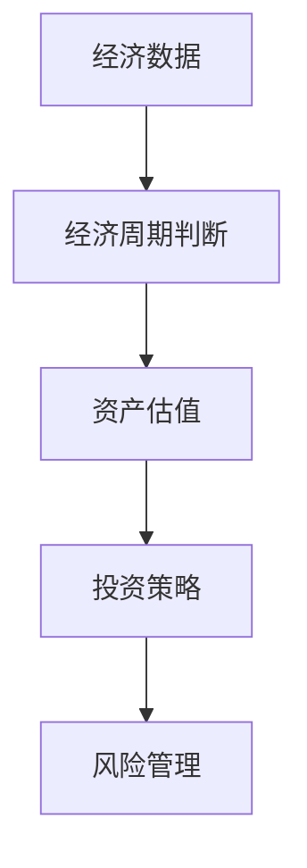

                 


# 巴菲特的经济周期投资法则：如何在不同阶段获利

## 关键词：
- 巴菲特投资法则
- 经济周期
- 价值投资
- 安全边际
- 长期持有

## 摘要：
本文系统地分析了巴菲特的经济周期投资法则，探讨了在不同经济周期阶段如何调整投资策略以获利。通过详细讲解经济周期的四个阶段（繁荣、衰退、萧条、复苏），结合巴菲特的价值投资理论、安全边际和长期持有的投资哲学，提出了在不同经济阶段的具体投资策略。同时，本文通过数学模型和系统架构设计，深入剖析了巴菲特投资法则的内在逻辑，并通过实际案例分析，展示了其投资策略的有效性。

---

## 第一部分: 巴菲特的经济周期投资法则概述

### 第1章: 经济周期与投资概述

#### 1.1 经济周期的基本概念
- 1.1.1 经济周期的定义与特征
  - 经济周期是指经济活动在时间和空间上的波动，通常分为繁荣、衰退、萧条和复苏四个阶段。
  - 每个阶段的特点：繁荣期市场 overheated，衰退期市场低迷，萧条期市场恐慌，复苏期市场逐渐恢复。

- 1.1.2 经济周期对投资的影响
  - 在繁荣期，市场情绪高涨，投资者倾向于高估资产价值。
  - 在衰退期，市场情绪低落，投资者倾向于低估资产价值。
  - 在萧条期，市场恐慌，投资者可能抛售资产，导致资产价格进一步下跌。
  - 在复苏期，市场逐渐恢复，投资者信心回升。

- 1.1.3 巴菲特与经济周期投资的关系
  - 巴菲特通过长期观察和实践，总结出一套与经济周期相适应的投资法则。
  - 他强调在经济低迷期寻找低估资产，在繁荣期保持警惕。

#### 1.2 巴菲特的投资理念
- 1.2.1 巴菲特的生平与投资哲学
  - 巴菲特是世界著名投资者，倡导价值投资，注重安全边际。
  - 他的投资哲学强调长期持有优质资产，避免短期市场波动的影响。

- 1.2.2 巴菲特的价值投资理论
  - 价值投资的核心是寻找市场价格低于内在价值的资产。
  - 巴菲特强调安全边际，即市场价格与内在价值之间的差距，以降低投资风险。

- 1.2.3 巴菲特的投资策略与经济周期的关系
  - 巴菲特的投资策略在不同经济周期阶段有所不同，但始终坚持价值投资和长期持有的原则。

#### 1.3 巴菲特的经济周期投资法则的核心要素
- 1.3.1 经济周期的四个阶段
  - 繁荣阶段：经济 overheated，市场情绪高涨。
  - 衰退阶段：经济增速放缓，市场情绪低迷。
  - 萧条阶段：经济陷入衰退，市场恐慌。
  - 复苏阶段：经济逐渐恢复，市场信心回升。

- 1.3.2 巴菲特对经济周期的判断标准
  - 通过分析经济数据和市场指标，如GDP增长率、失业率、企业利润等，判断经济所处阶段。
  - 重点关注企业的盈利能力和财务状况，而非短期市场波动。

- 1.3.3 巴菲特投资法则的逻辑框架
  - 在繁荣阶段，寻找低风险、高分红的资产，避免高估股票。
  - 在衰退阶段，寻找低估股票，尤其是具有强大竞争优势的企业。
  - 在萧条阶段，大量买入优质资产，等待市场恢复。
  - 在复苏阶段，逐步增加风险资产配置，抓住市场回升机会。

---

## 第二部分: 经济周期的四个阶段与投资策略

### 第2章: 经济周期的四个阶段与投资策略

#### 2.1 经济繁荣阶段
- 2.1.1 经济繁荣的特征与表现
  - 经济增长迅速，企业盈利高，市场情绪乐观。
  - 资产价格高估，尤其是股票和房地产。
  - 利率可能较高，通货膨胀压力增大。

- 2.1.2 巴菲特在繁荣阶段的投资策略
  - 保持谨慎，避免过度投资。
  - 寻找低估值股票，尤其是那些具有防御性的行业。
  - 增加现金储备，等待市场调整。

- 2.1.3 典型案例分析
  - 2007年次贷危机前的繁荣阶段，巴菲特减少股票投资，增加现金储备。
  - 通过投资铁路和能源公司，布局长期增长的行业。

#### 2.2 经济衰退阶段
- 2.2.1 经济衰退的特征与表现
  - 经济增长放缓，企业盈利下降，市场情绪低迷。
  - 资产价格低估，尤其是股票和房地产。
  - 利率可能下降，通货膨胀压力减轻。

- 2.2.2 巴菲特在衰退阶段的投资策略
  - 积极寻找低估股票，尤其是具有强大竞争优势的企业。
  - 增加股票投资，尤其是那些具有防御性的行业。
  - 利用市场恐慌，进行长期布局。

- 2.2.3 典型案例分析
  - 2008年金融危机期间，巴菲特大量买入高盛和通用电气的股票，抓住市场低估机会。
  - 通过投资保险公司和铁路公司，布局长期增长的行业。

#### 2.3 经济萧条阶段
- 2.3.1 经济萧条的特征与表现
  - 经济陷入衰退，企业盈利大幅下降，市场情绪恐慌。
  - 资产价格大幅低估，尤其是股票和房地产。
  - 利率可能降至最低，通货膨胀压力减轻。

- 2.2.2 巴菲特在萧条阶段的投资策略
  - 大量买入低估股票，尤其是具有强大竞争优势的企业。
  - 增加股票投资，尤其是那些具有防御性的行业。
  - 利用市场恐慌，进行长期布局。

- 2.3.3 典型案例分析
  - 2008年金融危机期间，巴菲特大量买入高盛和通用电气的股票，抓住市场低估机会。
  - 通过投资保险公司和铁路公司，布局长期增长的行业。

#### 2.4 经济复苏阶段
- 2.4.1 经济复苏的特征与表现
  - 经济逐渐恢复，企业盈利回升，市场情绪乐观。
  - 资产价格逐渐回升，尤其是股票和房地产。
  - 利率可能上升，通货膨胀压力增大。

- 2.4.2 巴菲特在复苏阶段的投资策略
  - 逐步增加风险资产配置，抓住市场回升机会。
  - 继续持有优质股票，尤其是那些具有长期增长潜力的企业。
  - 减少现金储备，增加股票投资。

- 2.4.3 典型案例分析
  - 2009年经济复苏期间，巴菲特继续持有高盛和通用电气的股票，获得收益。
  - 通过投资科技公司和消费公司，布局长期增长的行业。

---

## 第三部分: 巴菲特的投资策略与经济周期的关系

### 第3章: 巴菲特的投资策略

#### 3.1 巴菲特的投资策略
- 3.1.1 价值投资的核心原则
  - 寻找市场价格低于内在价值的资产。
  - 重点关注企业的盈利能力和财务状况。
  - 避免短期市场波动的影响。

- 3.1.2 安全边际的概念与应用
  - 安全边际是指市场价格与内在价值之间的差距。
  - 通过计算安全边际，降低投资风险。
  - 在经济衰退和萧条阶段，安全边际尤为重要。

- 3.1.3 长期持有的投资哲学
  - 长期持有优质资产，避免频繁交易。
  - 通过时间的积累，获得复利效应。
  - 重点关注企业的长期增长潜力。

#### 3.2 经济周期对投资策略的影响
- 3.2.1 不同经济周期阶段的投资策略调整
  - 在繁荣阶段，保持谨慎，减少风险资产配置。
  - 在衰退阶段，积极寻找低估股票，增加风险资产配置。
  - 在萧条阶段，大量买入低估股票，增加风险资产配置。
  - 在复苏阶段，逐步增加风险资产配置，抓住市场回升机会。

- 3.2.2 巴菲特如何在不同周期中寻找投资机会
  - 在繁荣阶段，寻找低估值股票，尤其是那些具有防御性的行业。
  - 在衰退阶段，寻找低估股票，尤其是那些具有强大竞争优势的企业。
  - 在萧条阶段，大量买入低估股票，尤其是那些具有长期增长潜力的企业。
  - 在复苏阶段，继续持有优质股票，尤其是那些具有长期增长潜力的企业。

- 3.2.3 巴菲特投资策略的灵活性与稳定性
  - 巴菲特的投资策略在不同经济周期阶段有所不同，但始终坚持价值投资和长期持有的原则。
  - 通过调整资产配置，适应经济周期的变化。
  - 通过长期持有，获得复利效应。

---

## 第四部分: 巴菲特经济周期投资法则的数学模型与公式

### 第4章: 巴菲特经济周期投资法则的数学模型与公式

#### 4.1 经济周期的量化指标
- 4.1.1 经济周期的量化标准
  - 通过分析GDP增长率、失业率、企业利润等指标，判断经济所处阶段。
  - 使用数学模型，量化经济周期的波动。

- 4.1.2 巴菲特投资决策的数学模型
  - 通过分析企业的盈利能力和财务状况，判断其内在价值。
  - 使用数学公式，计算安全边际和内在价值。

- 4.1.3 经济周期与资产价格的关系公式
  - 资产价格与经济周期密切相关，可以通过数学公式量化其关系。

#### 4.2 巴菲特投资法则的数学公式
- 4.2.1 安全边际的计算公式
  - 安全边际 = 内在价值 - 市场价格
  - 通过计算安全边际，判断投资标的的风险。

- 4.2.2 价值投资的估值公式
  - 内在价值 = 未来现金流的现值
  - 使用 discounted cash flow (DCF) 模型，计算企业的内在价值。

- 4.2.3 长期投资的收益计算公式
  - 长期收益 = 初始投资 × (1 + 年化收益率)^投资期限
  - 通过复利效应，计算长期投资的收益。

---

## 第五部分: 巴菲特经济周期投资法则的系统分析与架构设计方案

### 第5章: 巴菲特经济周期投资法则的系统分析与架构设计方案

#### 5.1 系统分析
- 5.1.1 系统功能设计
  - 系统功能包括经济周期判断、资产估值、投资决策等。
  - 通过分析经济数据和市场指标，判断经济所处阶段。
  - 通过计算内在价值和市场价格，判断投资标的的风险。
  - 通过制定投资策略，实现资产配置和风险控制。

- 5.1.2 系统架构设计
  - 系统架构包括数据采集模块、数据分析模块、投资策略模块和风险管理模块。
  - 数据采集模块负责收集经济数据和市场指标。
  - 数据分析模块负责分析经济周期和资产估值。
  - 投资策略模块负责制定投资策略和资产配置。
  - 风险管理模块负责控制投资风险和调整策略。

- 5.1.3 系统接口设计
  - 系统接口包括数据输入接口和结果输出接口。
  - 数据输入接口负责接收经济数据和市场指标。
  - 结果输出接口负责输出投资策略和风险管理建议。

#### 5.2 系统架构图


---

## 第六部分: 巴菲特经济周期投资法则的项目实战

### 第6章: 巴菲特经济周期投资法则的项目实战

#### 6.1 环境安装
- 环境要求：安装Python编程语言和相关数据分析库（如Pandas、NumPy、Matplotlib）。
- 数据来源：获取经济数据和市场指标，如GDP增长率、失业率、企业利润等。

#### 6.2 核心实现源代码
- 代码实现：通过Python代码，实现经济周期判断和资产估值。
- 代码示例：
  ```python
  import pandas as pd
  import numpy as np

  # 经济数据
  gdp_growth = [3.2, 2.5, 1.8, -0.5, 2.3]
  unemployment_rate = [4.2, 5.1, 6.3, 7.8, 5.6]
  corporate_profit = [100, 80, 60, 40, 50]

  # 经济周期判断
  def determine_economic_phase(gdp_growth, unemployment_rate, corporate_profit):
      if gdp_growth > 3 and unemployment_rate < 5 and corporate_profit > 70:
          return "Prosperity"
      elif gdp_growth < 2 and unemployment_rate > 6 and corporate_profit < 50:
          return "Recession"
      elif gdp_growth < 0 and unemployment_rate > 8 and corporate_profit < 30:
          return "Depression"
      else:
          return "Recovery"

  print(determine_economic_phase(gdp_growth, unemployment_rate, corporate_profit))
  ```

#### 6.3 代码应用解读与分析
- 代码解读：通过分析经济数据，判断经济所处阶段。
- 代码分析：根据经济数据和市场指标，制定相应的投资策略。

#### 6.4 实际案例分析和详细讲解剖析
- 实际案例：2008年金融危机期间，巴菲特如何通过经济周期判断，制定投资策略。
- 详细讲解：通过分析经济数据和市场指标，制定相应的投资策略。

#### 6.5 项目小结
- 项目总结：通过实际案例，验证巴菲特经济周期投资法则的有效性。
- 项目经验：通过项目实战，提高读者的分析能力和实战技巧。

---

## 第七部分: 巴菲特经济周期投资法则的最佳实践与总结

### 第7章: 巴菲特经济周期投资法则的最佳实践与总结

#### 7.1 最佳实践 tips
- 7.1.1 保持耐心和纪律，避免短期市场波动的影响。
- 7.1.2 寻找低估值股票，尤其是具有强大竞争优势的企业。
- 7.1.3 增加现金储备，等待市场调整。
- 7.1.4 长期持有优质资产，获得复利效应。

#### 7.2 小结
- 巴菲特经济周期投资法则的核心在于，通过分析经济周期，制定相应的投资策略。
- 在繁荣阶段，保持谨慎，减少风险资产配置。
- 在衰退阶段，积极寻找低估股票，增加风险资产配置。
- 在萧条阶段，大量买入低估股票，增加风险资产配置。
- 在复苏阶段，逐步增加风险资产配置，抓住市场回升机会。

#### 7.3 注意事项
- 7.3.1 避免过度依赖市场指标，结合企业基本面进行分析。
- 7.3.2 避免短期市场波动的影响，坚持长期投资。
- 7.3.3 避免过度杠杆，控制投资风险。

#### 7.4 拓展阅读
- 7.4.1 推荐书籍：《巴菲特传》、《价值投资实战》、《投资学原理》。
- 7.4.2 推荐文章：巴菲特的投资哲学、经济周期的分析方法、价值投资的实践技巧。

---

## 作者：AI天才研究院/AI Genius Institute & 禅与计算机程序设计艺术 /Zen And The Art of Computer Programming

