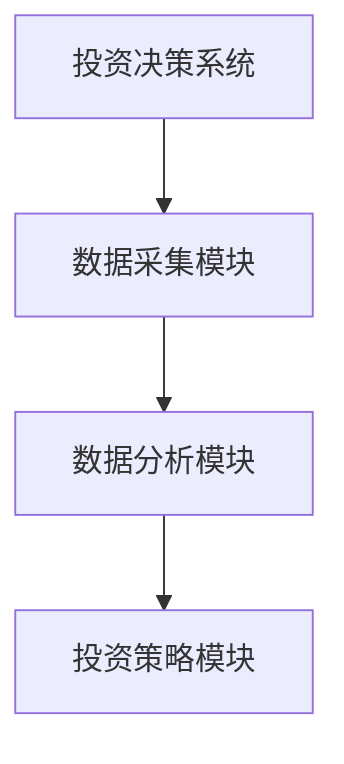
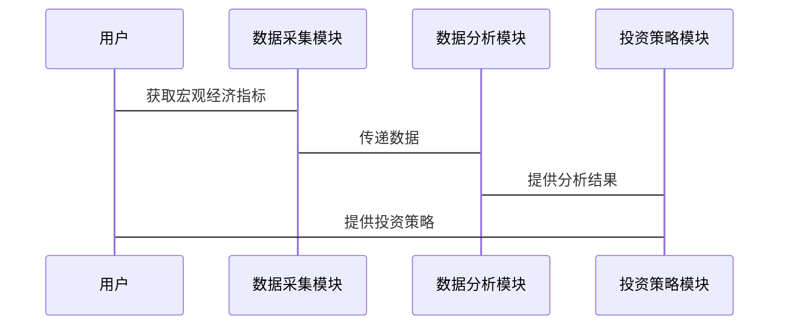

                 


# 巴菲特的经济周期投资策略

## 关键词：巴菲特，经济周期，投资策略，价值投资，安全边际，内在价值

## 摘要： 巴菲特的经济周期投资策略是其价值投资体系的重要组成部分。本文将深入探讨巴菲特的投资理念，分析其在不同经济周期阶段的投资策略，并结合数学模型和系统架构，详细阐述其投资决策的逻辑与方法。通过实际案例分析和代码实现，本文旨在为投资者提供一套可操作的投资策略。

---

# 第一部分: 巴菲特的经济周期投资策略概述

## 第1章: 投资的基本概念与巴菲特的投资理念

### 1.1 投资的基本概念

#### 1.1.1 投资的定义与分类

投资是指将资金投入到某种资产或项目中，以期望在未来获得超过初始投入的价值。根据投资对象的不同，可以将其分为股票、债券、房地产等多种类型。

#### 1.1.2 投资的基本原则

1. 长期投资：投资的本质是寻找能够长期增值的资产。
2. 分散投资：通过多样化投资降低风险。
3. 价值投资：以低于内在价值的价格买入优质资产。

#### 1.1.3 投资与投机的区别

- 投资：基于基本面分析，追求长期稳定收益。
- 投机：基于市场情绪，追求短期价差。

### 1.2 巴菲特的投资理念

#### 1.2.1 价值投资的定义

价值投资是一种通过分析企业的基本面，寻找市场价格低于其内在价值的股票进行投资的策略。

#### 1.2.2 巴菲特的价值投资策略

- 买入并持有优质企业的股票。
- 避免短期市场波动，关注企业的长期价值。

#### 1.2.3 巴菲特的投资哲学

- “价格是你可以买到的东西，价值是你要买的东西。”
- “只有当潮水退去，你才会知道谁在游泳。”

### 1.3 经济周期与投资策略的关系

#### 1.3.1 经济周期的定义与阶段划分

经济周期通常分为四个阶段：衰退、复苏、增长和过热。

#### 1.3.2 不同经济周期阶段的投资策略

- 衰退阶段：寻找估值低的股票。
- 复苏阶段：逐步增加股票配置。
- 增长阶段：集中投资优质企业。
- 过热阶段：谨慎投资，关注风险。

#### 1.3.3 巴菲特对经济周期的分析方法

- 关注宏观经济发展趋势。
- 分析企业的盈利能力和竞争优势。

## 1.4 本章小结

本章介绍了投资的基本概念，详细阐述了巴菲特的价值投资理念，并分析了经济周期对投资策略的影响。巴菲特的投资策略强调长期、价值导向，并根据不同经济周期阶段进行动态调整。

---

## 第2章: 巴菲特的投资策略核心要素

### 2.1 财务报表分析

#### 2.1.1 财务报表的基本构成

- 资产负债表：反映企业财务状况。
- 利润表：反映企业盈利能力。
- 现金流量表：反映企业现金流情况。

#### 2.1.2 财务报表分析的重要性

财务报表是评估企业内在价值的重要工具。

#### 2.1.3 财务报表分析的步骤

1. 分析企业的盈利能力。
2. 分析企业的财务健康状况。
3. 评估企业的成长潜力。

#### 2.1.4 财务指标分析

- 市盈率（P/E）：当前股价与每股收益的比率。
- 市净率（P/B）：当前股价与每股净资产的比率。
- 净利润率：净利润与营业收入的比率。

### 2.2 内在价值的计算

#### 2.2.1 内在价值的定义

内在价值是企业未来现金流的现值。

#### 2.2.2 内在价值的计算方法

使用DCF模型（Discounted Cash Flow）计算企业未来现金流的现值。

#### 2.2.3 内在价值与市场价值的关系

- 当市场价值低于内在价值时，投资机会出现。
- 当市场价值高于内在价值时，应考虑卖出。

### 2.3 安全边际的概念

#### 2.3.1 安全边际的定义

安全边际是市场价格与内在价值之间的差额，用于降低投资风险。

#### 2.3.2 安全边际的重要性

- 提供了投资的安全性。
- 降低了市场波动对企业的影响。

#### 2.3.3 安全边际的计算方法

安全边际 = 内在价值 - 市场价格

---

## 第3章: 巴菲特的经济周期投资策略

### 3.1 经济周期的四个阶段

#### 3.1.1 衰退阶段

- 经济增长放缓，企业盈利下降。
- 投资者应寻找估值低的股票。

#### 3.1.2 恢复阶段

- 经济开始复苏，企业盈利逐渐恢复。
- 投资者可以逐步增加股票配置。

#### 3.1.3 增长阶段

- 经济快速发展，企业盈利持续增长。
- 投资者应集中投资优质企业。

#### 3.1.4 过热阶段

- 经济过热，市场可能出现泡沫。
- 投资者应谨慎投资，关注风险。

### 3.2 不同经济周期阶段的投资策略

#### 3.2.1 衰退阶段的投资策略

- 重点投资于防御性行业，如公用事业、医疗保健等。
- 寻找估值低的股票。

#### 3.2.2 恢复阶段的投资策略

- 增加股票配置，投资于周期性行业。
- 寻找估值回升的股票。

#### 3.2.3 增长阶段的投资策略

- 集中投资于成长型企业。
- 关注行业龙头股。

#### 3.2.4 过热阶段的投资策略

- 减少股票配置，转向债券等固定收益资产。
- 关注市场风险。

### 3.3 巴菲特的经济周期投资策略总结

#### 3.3.1 巴菲特的经济周期分析方法

- 关注宏观经济指标。
- 分析企业的竞争优势。

#### 3.3.2 巴菲特的经济周期投资策略的应用

- 根据经济周期阶段调整投资组合。
- 选择具有长期竞争优势的企业。

#### 3.3.3 巴菲特的经济周期投资策略的优缺点

- 优点：注重长期价值，降低投资风险。
- 缺点：需要准确判断经济周期阶段，操作难度较大。

---

## 第4章: 巴菲特投资策略的数学模型与算法原理

### 4.1 内在价值的数学模型

#### 4.1.1 内在价值的计算公式

$$
\text{内在价值} = \sum_{t=1}^{n} \frac{\text{现金流}_t}{(1 + r)^t}
$$

其中，\( r \) 是折现率，\( \text{现金流}_t \) 是第 \( t \) 年的现金流。

#### 4.1.2 内在价值的计算步骤

1. 预测未来现金流。
2. 选择合适的折现率。
3. 计算未来现金流的现值。

#### 4.1.3 内在价值的计算实例

假设某企业未来三年的现金流分别为100万、120万和150万，折现率为10%。

$$
\text{内在价值} = \frac{100}{1.1} + \frac{120}{(1.1)^2} + \frac{150}{(1.1)^3} \approx 100 + 98.18 + 82.64 \approx 280.82 \text{万元}
$$

### 4.2 安全边际的数学模型

#### 4.2.1 安全边际的计算公式

$$
\text{安全边际} = \text{内在价值} - \text{市场价格}
$$

#### 4.2.2 安全边际的计算步骤

1. 计算企业的内在价值。
2. 确定当前市场价格。
3. 计算安全边际。

#### 4.2.3 安全边际的计算实例

假设某企业内在价值为300万元，市场价格为250万元。

$$
\text{安全边际} = 300 - 250 = 50 \text{万元}
$$

### 4.3 经济周期分析的算法原理

#### 4.3.1 经济周期的指标分析

- 失业率
- GDP增长率
- 消费者价格指数（CPI）

#### 4.3.2 经济周期的预测模型

使用回归分析或时间序列分析预测经济周期。

#### 4.3.3 经济周期的预测实例

利用历史数据，建立回归模型，预测未来经济周期。

---

## 第5章: 巴菲特投资策略的系统架构与实现

### 5.1 投资决策系统的功能设计

#### 5.1.1 系统功能模块划分

- 数据采集模块：收集宏观经济指标和企业财务数据。
- 数据分析模块：计算内在价值和安全边际。
- 投资策略模块：根据经济周期阶段制定投资策略。

#### 5.1.2 系统功能模块的实现

1. 数据采集模块：使用爬虫技术获取数据。
2. 数据分析模块：利用Python进行数据分析。
3. 投资策略模块：根据分析结果制定投资策略。

### 5.2 投资决策系统的架构设计

#### 5.2.1 系统架构图



#### 5.2.2 系统接口设计

- 数据采集接口：提供API用于获取宏观经济指标。
- 数据分析接口：提供API用于计算内在价值和安全边际。
- 投资策略接口：提供API用于制定投资策略。

#### 5.2.3 系统交互序列图



---

## 第6章: 巴菲特投资策略的项目实战

### 6.1 环境安装

#### 6.1.1 Python环境安装

安装Python和必要的库，如Pandas、NumPy、Scipy。

#### 6.1.2 数据获取

使用爬虫或API获取宏观经济指标和企业财务数据。

### 6.2 系统核心实现源代码

#### 6.2.1 内在价值计算代码

```python
def calculate_intrinsic_value(cash_flows, discount_rate):
    intrinsic_value = 0
    for t in range(len(cash_flows)):
        intrinsic_value += cash_flows[t] / (1 + discount_rate) ** t
    return intrinsic_value
```

#### 6.2.2 安全边际计算代码

```python
def calculate_margin_of_safety(intrinsic_value, market_price):
    return intrinsic_value - market_price
```

### 6.3 代码应用解读与分析

#### 6.3.1 内在价值计算实例

```python
cash_flows = [100, 120, 150]
discount_rate = 0.1
intrinsic_value = calculate_intrinsic_value(cash_flows, discount_rate)
print("内在价值:", intrinsic_value)
```

#### 6.3.2 安全边际计算实例

market_price = 250
margin_of_safety = calculate_margin_of_safety(intrinsic_value, market_price)
print("安全边际:", margin_of_safety)

---

## 第7章: 巴菲特投资策略的最佳实践

### 7.1 小结

巴菲特的经济周期投资策略强调长期价值投资，注重内在价值和安全边际。投资者应根据经济周期阶段调整投资策略，选择具有长期竞争优势的企业。

### 7.2 注意事项

- 投资者需具备一定的财务分析能力。
- 需要持续关注宏观经济和企业基本面。
- 投资需结合市场实际情况进行调整。

### 7.3 拓展阅读

- 《巴菲特传》
- 《价值投资实战》
- 《投资学原理》

---

## 作者：AI天才研究院/AI Genius Institute & 禅与计算机程序设计艺术 /Zen And The Art of Computer Programming

