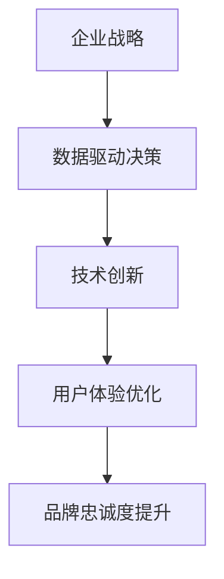
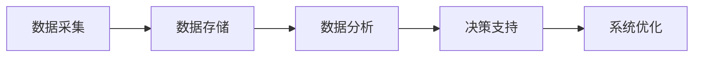
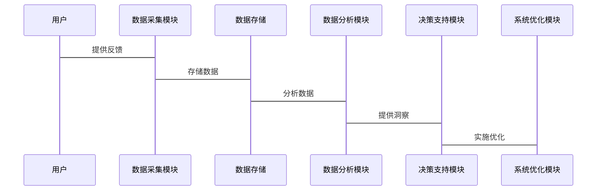

                 


# 巴菲特的经济护城河更新：数字时代的竞争优势

## 关键词
- 经济护城河
- 数字时代
- 企业竞争优势
- 数字化转型
- 技术创新

## 摘要
本文探讨了巴菲特的经济护城河理论在数字时代的演变，分析了数据资产、技术创新和用户粘性等新型竞争优势要素，结合系统架构和实战案例，详细讲解了如何在数字时代构建和更新经济护城河，为企业持续竞争优势提供新的视角和策略。

---

# 正文

## 第一部分：经济护城河的背景与基础

### 第1章：经济护城河的定义与核心要素

#### 1.1 经济护城河的定义与核心要素

**1.1.1 经济护城河的定义**  
经济护城河是指企业在市场竞争中，由于资源、技术、品牌或其他因素形成的难以被竞争对手复制或超越的竞争优势。这种优势使得企业能够在特定市场中长期保持高利润率。

**1.1.2 护城河的四种类型**  
- **成本优势**：企业通过规模经济或专有技术降低成本，使竞争对手难以匹敌。
- **差异化优势**：通过独特的产品或服务，满足特定客户群体的需求，形成差异化竞争。
- **网络效应**：随着用户数量的增加，产品或服务的价值提升，形成正反馈循环。
- **规模经济**：随着产量增加，单位成本下降，形成成本优势。

**1.1.3 护城河在企业竞争优势中的作用**  
经济护城河是企业抵御竞争、保持长期盈利能力的关键。通过构建护城河，企业可以有效防御竞争对手，巩固市场地位。

#### 1.2 巴菲特投资理念中的护城河

**1.2.1 巴菲特的长期投资策略**  
巴菲特偏好投资那些具备持久竞争优势的企业，这些企业拥有强大的护城河，能够在长期内保持稳定的收益。

**1.2.2 护城河在巴菲特选股中的重要性**  
巴菲特认为，护城河是企业抵御竞争的关键。他倾向于投资那些具备独特竞争优势的企业，这些优势通常包括专利、品牌、成本控制或市场准入壁垒。

**1.2.3 护城河与企业持续盈利能力的关系**  
具备强大护城河的企业能够在市场中保持较高的定价能力，从而实现持续的盈利增长。

---

### 第2章：数字时代对企业竞争优势的影响

#### 2.1 数字技术对企业竞争优势的重塑

**2.1.1 数字技术如何改变传统商业模式**  
数字技术（如大数据、人工智能和云计算）正在改变企业的运营方式，推动商业模式从传统向数字化转型。

**2.1.2 数字化对企业成本结构的影响**  
通过数字化转型，企业可以优化流程、提高效率，降低运营成本。

**2.1.3 数字化对企业客户关系的重构**  
数字技术使得企业能够更精准地了解客户需求，提供个性化服务，增强客户粘性。

#### 2.2 数字时代的新护城河要素

**2.2.1 数据资产：从数据到决策优势**  
数据成为数字时代的核心资产，企业通过收集和分析数据，获取洞察，制定更有效的商业策略。

**2.2.2 技术创新：技术壁垒的构建**  
技术创新是数字时代的核心竞争优势，企业通过持续创新，建立技术壁垒，防止竞争对手模仿。

**2.2.3 用户粘性：数字平台的网络效应**  
通过构建用户粘性，企业可以形成网络效应，进一步巩固竞争优势。

**2.2.4 快速迭代能力：敏捷开发的优势**  
敏捷开发使得企业能够快速响应市场变化，推出新产品，保持竞争优势。

---

### 第3章：数字时代下护城河的更新与演变

#### 3.1 传统护城河的局限性

**3.1.1 成本优势在数字化转型中的挑战**  
随着技术的进步，成本优势可能被快速复制，企业需要寻找新的竞争优势。

**3.1.2 差异化优势的持续性问题**  
差异化优势可能随着技术的变化而减弱，企业需要不断创新以保持差异化。

**3.1.3 网络效应的可扩展性限制**  
网络效应在特定市场中可能面临扩展性问题，限制其在更大范围内的应用。

#### 3.2 新型护城河的构建策略

**3.2.1 数据驱动的护城河构建**  
通过数据的收集、分析和应用，企业可以构建数据驱动的护城河，提升决策能力。

**3.2.2 技术创新作为核心竞争力**  
企业应加大对技术研发的投入，通过持续创新，建立技术壁垒，巩固竞争优势。

**3.2.3 用户体验与品牌忠诚度的结合**  
通过提升用户体验，增强用户粘性，形成品牌忠诚度，构建长期的竞争优势。

---

## 第四部分：数字时代经济护城河的系统分析与架构

### 第4章：企业竞争优势的系统分析

#### 4.1 企业竞争优势的系统模型

**4.1.1 系统模型的构建**  
企业竞争优势的系统模型包括企业内部资源、外部环境、客户关系和技术支持等多个因素。

**4.1.2 关键成功要素的识别**  
通过分析企业的核心竞争力，识别关键成功要素，构建竞争优势模型。

#### 4.2 数字化竞争优势的系统架构

**4.2.1 系统架构设计（使用mermaid）**  


**4.2.2 功能模块设计**  
- 数据采集与分析模块
- 技术研发模块
- 用户体验优化模块
- 品牌管理模块

**4.2.3 技术选型**  
- 数据库：分布式数据库（如MongoDB）
- 分析工具：Python（Pandas, NumPy）
- AI工具：TensorFlow

---

### 第5章：企业竞争优势的系统实现

#### 5.1 系统设计与实现

**5.1.1 系统功能模块划分**  
- 数据采集模块：负责收集市场数据和用户反馈
- 数据分析模块：对数据进行处理和分析，生成洞察
- 技术研发模块：推动技术创新，开发新产品
- 用户体验模块：优化用户界面和交互设计

**5.1.2 系统架构设计（使用mermaid）**  


**5.1.3 关键接口设计与交互流程（使用mermaid序列图）**  


#### 5.2 系统实现的技术选型与代码示例

**5.2.1 数据库选择与设计**  
使用分布式数据库存储海量数据，支持高并发访问。

**5.2.2 前端与后端技术选型**  
前端：React框架  
后端：Python的Django框架

**5.2.3 核心代码实现示例**  
以下是数据采集模块的Python代码示例：
```python
import requests
from bs4 import BeautifulSoup

def scrape_data(url):
    response = requests.get(url)
    soup = BeautifulSoup(response.text, 'html.parser')
    data = []
    for item in soup.find_all('div', class_='product-item'):
        title = item.find('h3').text
        price = item.find('p', class_='price').text
        data.append({'title': title, 'price': price})
    return data

scrape_data('https://example.com/products')
```

---

## 第五部分：数字时代的经济护城河更新

### 第6章：项目实战与案例分析

#### 6.1 数字化转型的实战案例

**6.1.1 案例背景介绍**  
以某电商平台为例，分析其如何通过数据驱动和技术创新构建护城河。

**6.1.2 系统实现与代码解读**  
展示电商平台的数据分析模块，使用Python和机器学习模型预测用户行为，优化推荐算法。

**6.1.3 实际案例分析与详细解读**  
分析该平台的竞争优势，包括数据驱动的决策、技术创新和用户体验优化。

---

## 第六部分：最佳实践与总结

### 第7章：最佳实践与小结

#### 7.1 小结

**7.1.1 关键点回顾**  
- 数据驱动的决策
- 技术创新的核心地位
- 用户体验与品牌忠诚度的结合

**7.1.2 注意事项**  
- 数据隐私和安全的重要性
- 技术创新的持续投入
- 用户体验的持续优化

**7.1.3 未来趋势**  
随着技术的不断进步，护城河的构建将更加依赖于数据和技术的结合，企业需要不断创新以保持竞争优势。

---

## 作者信息

作者：AI天才研究院 & 禅与计算机程序设计艺术

---

这篇文章全面探讨了巴菲特的经济护城河理论在数字时代的演变，分析了数据资产、技术创新和用户粘性等新型竞争优势要素，结合系统架构和实战案例，详细讲解了如何在数字时代构建和更新经济护城河，为企业持续竞争优势提供新的视角和策略。

