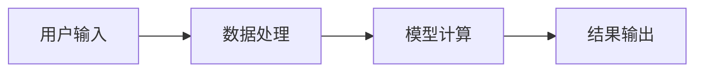
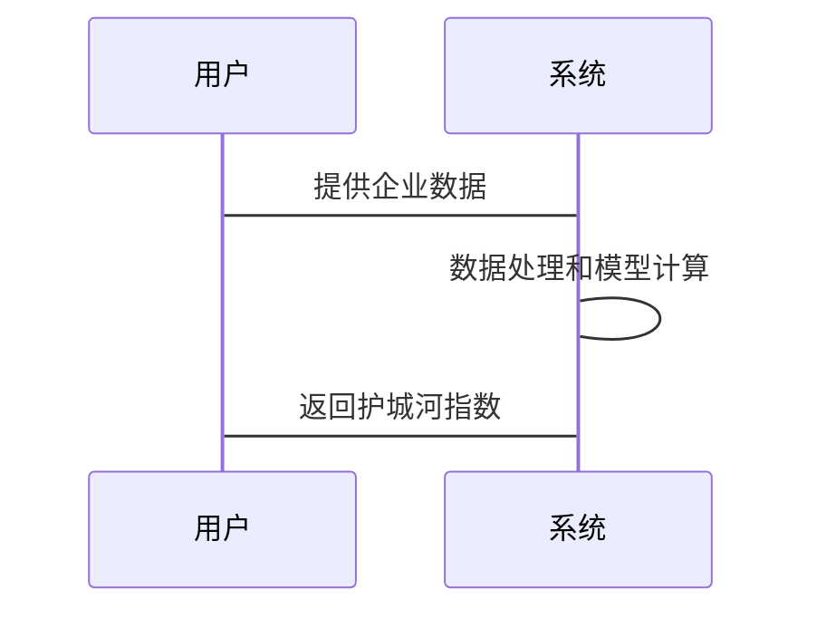

                 


# 巴菲特的经济护城河概念及其识别

> 关键词：巴菲特，经济护城河，竞争优势，投资分析，企业分析

> 摘要：本文系统阐述了巴菲特提出的经济护城河概念，分析了其核心要素、类型及其识别方法。通过详细讲解经济护城河的数学模型、系统架构设计和实战案例，为读者提供了一套完整的分析框架，帮助投资者和企业管理者更好地识别和构建经济护城河。

---

## 第一部分：经济护城河的背景与重要性

### 第1章：经济护城河的背景与重要性

#### 1.1 经济护城河的定义与背景
经济护城河（Economic Moat）是巴菲特投资理论中的核心概念之一，指的是企业在竞争市场中建立的长期竞争优势，能够有效防止竞争对手的侵蚀。这些竞争优势可以是成本优势、品牌影响力、技术壁垒或网络效应等。

经济护城河的背景可以追溯到古典经济学中的“比较优势”理论，但在现代商业环境中，经济护城河的内涵更加丰富，尤其是在互联网和数字化时代，护城河的构建方式发生了显著变化。

#### 1.2 巴菲特投资理念的核心
巴菲特的价值投资理论强调长期投资和企业基本面分析。他认为，一个具有强大经济护城河的企业能够在长期的竞争中保持领先地位，并为股东创造持续的超额收益。

#### 1.3 经济护城河在投资中的重要性
经济护城河是企业抵御竞争的核心能力，能够帮助企业：
1. 提高市场份额。
2. 降低竞争压力。
3. 实现长期稳定的收益。

---

## 第二部分：经济护城河的核心概念与分析框架

### 第2章：经济护城河的核心概念与分析框架

#### 2.1 经济护城河的类型
经济护城河可以分为以下几种类型：

| 类型       | 特征描述                              | 示例企业                     |
|------------|---------------------------------------|-----------------------------|
| 品牌优势   | 强大的品牌影响力，消费者对其有高度依赖 | 可口可乐、苹果               |
| 成本优势   | 通过规模效应或技术优化降低成本       | 沃尔玛、亚马逊               |
| 资源优势   | 拥有独特的资源或专利                   | 好莱坞电影公司、制药企业     |
| 网络效应   | 用户数量的增加会增强平台的价值       | Facebook、支付宝             |

#### 2.2 经济护城河的核心要素
经济护城河的核心要素包括：
1. **核心竞争力**：企业独特的竞争优势，如技术创新、管理能力等。
2. **市场壁垒**：进入市场的门槛，如专利、许可证等。
3. **客户粘性**：客户对企业产品或服务的依赖程度。

#### 2.3 经济护城河的构建与强化
企业可以通过以下方式构建经济护城河：
1. **技术创新**：投入研发，保持技术领先。
2. **品牌建设**：通过营销和用户体验提升品牌影响力。
3. **成本控制**：优化供应链和生产流程，降低边际成本。

---

### 第3章：经济护城河的识别方法

#### 3.1 经济护城河的定性分析
定性分析主要从以下几个方面入手：
1. **品牌影响力**：评估企业在市场上的认知度和美誉度。
2. **市场地位**：分析企业在行业中的排名和市场份额。
3. **竞争对手分析**：研究竞争对手的优劣势，评估企业在竞争中的相对位置。

#### 3.2 经济护城河的定量分析
定量分析通过财务指标和市场数据进行评估：
1. **财务指标分析**：
   - 净利润率（Net Profit Margin）
   - 资产回报率（Return on Assets, ROA）
   - 股东权益回报率（Return on Equity, ROE）

2. **市场占有率分析**：通过市场份额数据评估企业的市场地位。
3. **企业盈利能力分析**：分析企业的收入增长和利润率变化趋势。

#### 3.3 综合评估模型
综合评估模型的构建如下：

$$ EHI = \frac{C + M + R}{3} $$

其中：
- $C$：成本优势指数（1-5分）
- $M$：市场优势指数（1-5分）
- $R$：资源优势指数（1-5分）

---

### 第4章：经济护城河的数学模型与公式

#### 4.1 经济护城河指数的计算
经济护城河指数（Economic Moat Index）用于量化企业的护城河强度：

$$ EHI = \frac{C + M + R}{3} $$

其中：
- $C$：成本优势指数（1-5分）
- $M$：市场优势指数（1-5分）
- $R$：资源优势指数（1-5分）

#### 4.2 动态评估模型
动态评估模型用于长期跟踪企业的护城河变化：

$$ D_{t+1} = D_t + \alpha \cdot (EHI - D_t) $$

其中：
- $D_t$：当前护城河强度
- $EHI$：经济护城河指数
- $\alpha$：调整系数（0 < $\alpha$ < 1）

---

### 第5章：经济护城河的系统分析与架构设计

#### 5.1 系统分析框架
1. **问题场景**：识别企业是否具备经济护城河。
2. **工具与方法**：使用数据分析工具（如Excel、Python）和行业报告。
3. **系统目标**：构建一个可量化的企业护城河评估系统。

#### 5.2 系统架构设计
系统架构包括以下模块：



#### 5.3 系统接口与交互设计
系统交互流程如下：



---

### 第6章：经济护城河的项目实战

#### 6.1 项目环境与工具安装
1. **环境要求**：Python 3.8+
2. **工具安装**：安装Python的数据分析库（如Pandas、Scikit-learn）。

#### 6.2 核心代码实现
以下是经济护城河指数计算的Python代码：

```python
def calculate_economic_moat(C, M, R):
    return (C + M + R) / 3

# 示例数据
C = 4
M = 5
R = 3

EHI = calculate_economic_moat(C, M, R)
print(f"经济护城河指数为：{EHI}")
```

#### 6.3 案例分析
以某互联网企业为例，计算其经济护城河指数：

```python
C = 4  # 成本优势
M = 5  # 市场优势
R = 3  # 资源优势

EHI = (4 + 5 + 3) / 3
print(f"经济护城河指数为：{EHI}")
```

---

## 结论

经济护城河是巴菲特投资理论中的核心概念，也是企业长期竞争优势的重要来源。通过本文的分析，读者可以系统地识别和评估企业的经济护城河，并为其投资决策提供有力支持。

---

作者：AI天才研究院 & 禅与计算机程序设计艺术

