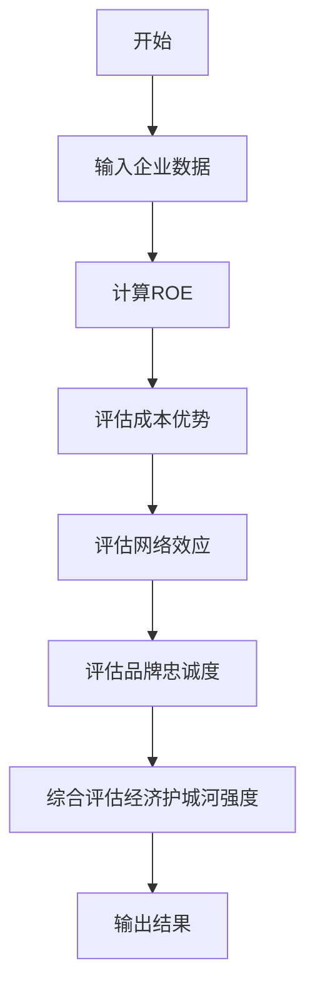
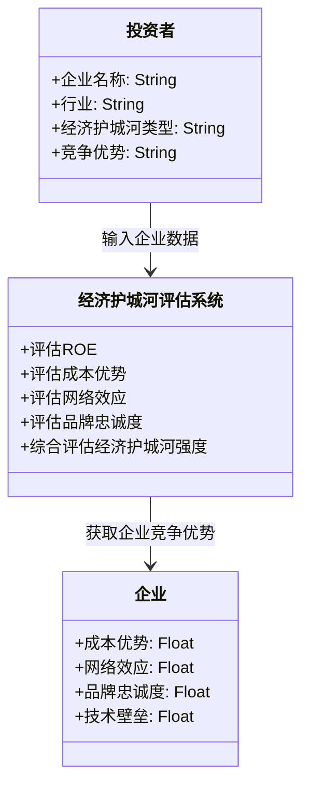

                 


# 巴菲特的经济护城河概念详解

## 关键词：巴菲特，经济护城河，投资策略，竞争优势，企业分析，投资哲学

## 摘要：  
本文将详细解析巴菲特的经济护城河概念，从定义到实际应用，结合数学模型和系统架构分析，帮助读者全面理解如何识别和评估企业的竞争优势。通过实际案例分析和项目实战，本文将深入探讨经济护城河在投资中的重要作用，并提供实用的投资策略和建议。

---

## 第1章: 巴菲特投资理念概述

### 1.1 巴菲特生平与投资哲学  
- 巴菲特的生平简介  
- 巴菲特的投资哲学与理念  
- 巴菲特的长期投资策略  

### 1.2 经济护城河的定义与重要性  
- 什么是经济护城河  
- 经济护城河的核心作用  
- 经济护城河与企业竞争优势  

---

## 第2章: 经济护城河的背景与问题背景

### 2.1 问题背景与问题描述  
- 企业竞争优势的永恒挑战  
- 投资者如何识别企业竞争优势  
- 经济护城河在投资中的重要性  

### 2.2 经济护城河的边界与外延  
- 经济护城河的边界界定  
- 经济护城河的外延扩展  
- 经济护城河与其他竞争优势的关系  

---

## 第3章: 经济护城河的核心概念与联系

### 3.1 核心概念原理  
- 经济护城河的构成要素  
- 经济护城河的动态演变  
- 经济护城河的可持续性分析  

### 3.2 核心概念属性特征对比表格  
- 经济护城河与竞争优势的对比  
- 不同类型经济护城河的特征对比  
- 经济护城河与企业生命周期的关系  

### 3.3 ER实体关系图架构  
```mermaid
erDiagram
    actor 投资者 {
        <属性> 企业名称
        <属性> 行业
        <属性> 经济护城河类型
        <属性> 竞争优势
    }
    actor 企业 {
        <属性> 成本优势
        <属性> 网络效应
        <属性> 品牌忠诚度
        <属性> 技术壁垒
    }
    relation 竞争优势
    relation 经济护城河类型
```

---

## 第4章: 经济护城河的数学模型与公式

### 4.1 经济护城河的数学模型  
- 经济护城河的量化指标：ROE（净资产收益率）  
  $$ROE = \frac{\text{净利润}}{\text{净资产}}$$  
- 经济护城河的动态评估模型：  
  $$\text{经济护城河强度} = \text{成本优势} + \text{网络效应} \times \text{用户粘性} + \text{品牌忠诚度} \times \text{市场份额}$$  

### 4.2 经济护城河的算法实现  


### 4.3 经济护城河的Python实现  
```python
def calculate_roe(net_profit, equity):
    return net_profit / equity

def assesscompetitive_advantage(cost_advantage, network_effect, brand Loyalty, market_share):
    roe = calculate_roe(net_profit, equity)
    economic_moor = cost_advantage + network_effect * brand_Loyalty * market_share
    return economic_moor

# 示例数据
net_profit = 100
equity = 500
cost_advantage = 0.8
network_effect = 0.7
brand_Loyalty = 0.9
market_share = 0.6

result = assesscompetitive_advantage(cost_advantage, network_effect, brand_Loyalty, market_share)
print(f"经济护城河强度: {result}")
```

---

## 第5章: 经济护城河的系统分析与架构设计

### 5.1 问题场景介绍  
- 投资者如何通过系统架构分析企业竞争优势  

### 5.2 系统功能设计  


### 5.3 系统架构设计  


---

## 第6章: 经济护城河的项目实战

### 6.1 环境安装与数据准备  
- 数据获取与清洗  

### 6.2 核心实现与代码分析  
```python
import pandas as pd

def load_data(filename):
    df = pd.read_csv(filename)
    return df

def calculate_roe(df):
    df['ROE'] = df['净利润'] / df['净资产']
    return df

def assesscompetitive_advantage(df):
    df['经济护城河强度'] = df['成本优势'] + df['网络效应'] * df['品牌忠诚度'] * df['市场份额']
    return df

# 示例代码
filename = '企业数据.csv'
df = load_data(filename)
df = calculate_roe(df)
df = assesscompetitive_advantage(df)
print(df.head())
```

### 6.3 案例分析与结果解读  
- 案例：亚马逊的经济护城河分析  

### 6.4 项目小结  

---

## 第7章: 总结与展望

### 7.1 投资建议与注意事项  
- 如何选择具有强大经济护城河的企业  
- 投资中的风险与机会  

### 7.2 最佳实践 tips  
- 定期评估企业的经济护城河强度  
- 关注企业的长期竞争优势  

### 7.3 未来展望  
- 经济护城河理论的未来发展  

---

## 作者：AI天才研究院/AI Genius Institute & 禅与计算机程序设计艺术 /Zen And The Art of Computer Programming

