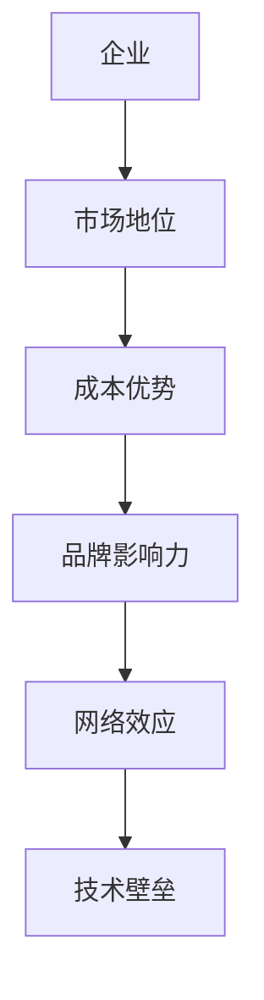

                 

# 巴菲特的经济护城河理论：如何识别持久竞争优势

**关键词：** 巴菲特, 经济护城河, 竞争优势, 企业战略, 投资分析

**摘要：** 本文将详细探讨巴菲特的经济护城河理论，分析其核心概念、类型、评估方法以及实际应用。通过系统的结构化分析，帮助读者识别企业的持久竞争优势，从而做出更明智的投资决策。

---

# 第一部分：经济护城河理论的核心概念

## 第1章：巴菲特经济护城河理论的背景与基础

### 1.1 巴菲特投资理念概述

#### 1.1.1 巴菲特的生平与投资哲学

沃伦·巴菲特（Warren Buffett）是世界上最著名的职业投资者之一。他出生于1930年，毕业于哥伦比亚大学，师从本杰明·格雷厄姆（Benjamin Graham），并深受其影响。巴菲特的投资理念强调长期价值、安全边际和企业的持久竞争优势。

巴菲特的投资哲学可以概括为两点：**价值投资**和**长期持有**。他认为，市场短期可能会波动，但长期来看，企业的真实价值将决定其股价走势。因此，识别那些具备持久竞争优势的企业至关重要。

#### 1.1.2 巴菲特投资理念的核心思想

巴菲特的核心思想是寻找那些具备“经济护城河”的企业。他认为，经济护城河是企业能够在长期竞争中保持优势地位的关键因素。具体来说，经济护城河可以是成本优势、品牌影响力、技术壁垒或网络效应等，这些因素使得竞争对手难以复制或超越。

#### 1.1.3 经济护城河理论的提出背景

在20世纪90年代，巴菲特开始系统地阐述经济护城河理论。他意识到，仅仅关注企业的财务指标是不够的，还需要关注企业的竞争优势和未来的可持续性。经济护城河理论成为他评估企业价值的重要工具。

---

### 1.2 经济护城河的定义与特征

#### 1.2.1 经济护城河的定义

经济护城河（Economic Moat）是指企业在与其竞争对手的竞争中所具有的独特优势，这些优势能够保护企业免受竞争的侵蚀，并为企业创造超额利润。经济护城河可以是结构性的（如成本优势）或基于品牌、网络效应、技术专利等。

#### 1.2.2 经济护城河的核心特征

经济护城河的核心特征包括：

1. **持久性**：护城河能够长期存在，不会因为市场变化而消失。
2. **宽度**：护城河越宽，竞争对手越难跨越。
3. **深度**：护城河越深，企业竞争优势越明显。
4. **灵活性**：护城河能够适应市场变化，保持竞争优势。

#### 1.2.3 经济护城河与企业竞争优势的关系

经济护城河是企业竞争优势的核心来源。竞争优势决定了企业在行业中的地位和盈利能力。通过构建和维护经济护城河，企业可以确保其竞争优势的可持续性。

---

### 1.3 经济护城河的类型与分类

#### 1.3.1 成本优势型护城河

成本优势型护城河是指企业通过规模经济、技术改进或供应链优化等手段，降低生产成本，从而在价格竞争中占据优势。例如，零售巨头沃尔玛（Wal-Mart）通过其高效的供应链管理，实现了成本优势。

#### 1.3.2 品牌优势型护城河

品牌优势型护城河是指企业通过强大的品牌影响力和客户忠诚度，获得竞争优势。例如，可口可乐（Coca-Cola）通过其强大的品牌认知度和全球分销网络，建立了强大的市场地位。

#### 1.3.3 网络效应型护城河

网络效应型护城河是指企业通过构建一个庞大的用户网络，使得用户的增加会反过来吸引更多用户。例如，社交媒体平台Facebook通过其庞大的用户网络，形成了强大的网络效应。

#### 1.3.4 技术壁垒型护城河

技术壁垒型护城河是指企业通过拥有独特的技术专利或创新，形成技术壁垒，防止竞争对手复制。例如，科技巨头苹果（Apple）通过其创新的产品设计和专利技术，形成了强大的技术壁垒。

---

## 第2章：经济护城河的核心要素与结构

### 2.1 经济护城河的核心要素

#### 2.1.1 市场地位

市场地位是指企业在市场中的位置和影响力。强大的市场地位通常意味着企业能够主导市场价格、产品标准和行业趋势。

#### 2.1.2 竞争优势

竞争优势是企业在市场上相对于竞争对手的独特优势。竞争优势可以是成本、质量、创新、服务等。

#### 2.1.3 财务表现

财务表现是企业经济护城河的重要体现。健康的财务状况、稳定的盈利能力和强大的现金流，表明企业具备持久的竞争优势。

#### 2.1.4 管理团队

优秀的管理团队是企业成功的关键。具备战略眼光和执行力的管理团队，能够更好地维护和扩展企业的经济护城河。

---

### 2.2 经济护城河的结构分析

#### 2.2.1 护城河的层次划分

经济护城河可以分为以下几个层次：

1. **核心竞争优势**：企业的核心竞争力，如技术创新、成本优势等。
2. **市场地位**：企业在市场中的影响力和占有率。
3. **财务表现**：企业的盈利能力和财务健康状况。
4. **管理能力**：管理团队的能力和战略眼光。

#### 2.2.2 护城河的动态变化

经济护城河并非一成不变，它会随着市场环境的变化而动态调整。企业需要不断优化其竞争优势，以应对新的挑战和机会。

#### 2.2.3 护城河的可持续性评估

评估经济护城河的可持续性，需要考虑以下几个方面：

1. **竞争优势的强度**：竞争优势是否足够强大，能够抵御竞争对手的攻击。
2. **市场的变化速度**：市场变化的速度是否会影响护城河的有效性。
3. **企业的创新能力**：企业是否能够不断创新，保持竞争优势。

---

## 第3章：经济护城河理论的数学模型与公式

### 3.1 经济护城河的评估指标

#### 3.1.1 市场占有率公式

$$ \text{市场占有率} = \frac{\text{企业销售额}}{\text{行业销售额}} $$

市场占有率是衡量企业市场地位的重要指标。高市场占有率表明企业在市场上占据重要地位，具有较强的议价能力和品牌影响力。

#### 3.1.2 成本优势评估公式

$$ \text{成本优势} = \frac{\text{行业平均成本}}{\text{企业实际成本}} $$

成本优势是衡量企业成本竞争力的重要指标。当企业实际成本低于行业平均水平时，企业具备成本优势。

---

### 3.2 经济护城河的竞争力分析

#### 3.2.1 竞争优势的量化模型

$$ \text{竞争优势指数} = \sum \text{（成本优势 + 市场地位 + 品牌影响力）} $$

竞争优势指数是一个综合指标，用于衡量企业在市场上的整体竞争优势。指数越高，表明企业的竞争优势越强。

---

## 第4章：经济护城河的系统分析与架构设计

### 4.1 经济护城河的系统架构

#### 4.1.1 护城河系统的组成模块

经济护城河系统可以分为以下几个模块：

1. **市场分析模块**：分析市场趋势和竞争对手的动态。
2. **竞争优势识别模块**：识别企业的核心竞争优势。
3. **财务评估模块**：评估企业的财务健康状况。
4. **战略规划模块**：制定和优化企业的战略规划。

#### 4.1.2 护城河系统的交互流程

经济护城河系统的交互流程如下：

1. **市场分析**：收集市场数据，分析市场趋势。
2. **竞争优势识别**：识别企业的核心竞争优势。
3. **财务评估**：评估企业的财务状况，确认经济护城河的可行性。
4. **战略规划**：制定和优化企业的战略规划，确保竞争优势的可持续性。

#### 4.1.3 护城河系统的动态演化

经济护城河系统需要根据市场环境的变化进行动态调整。企业需要不断优化其竞争优势，以应对新的挑战和机会。

---

### 4.2 经济护城河的系统架构图

---

## 第5章：经济护城河的评估与应用

### 5.1 经济护城河的评估方法

#### 5.1.1 财务指标分析

通过分析企业的财务指标，如净利润率、毛利率、ROE（净资产收益率）等，评估企业的财务健康状况和盈利能力。

#### 5.1.2 竞争优势分析

通过分析企业的核心竞争优势，如成本优势、品牌影响力等，评估企业的竞争优势是否持久。

#### 5.1.3 对手分析

分析竞争对手的优劣势，评估企业在市场上的相对位置。

---

### 5.2 经济护城河的应用

#### 5.2.1 投资决策

投资者可以通过分析企业的经济护城河，选择那些具备持久竞争优势的企业进行投资。

#### 5.2.2 企业战略

企业可以通过构建和维护经济护城河，提升自身的竞争优势，确保长期发展。

---

## 第6章：成功案例分析

### 6.1 成功案例：可口可乐的经济护城河

可口可乐通过强大的品牌影响力、全球分销网络和成本优势，建立了强大的经济护城河。其品牌认知度和客户忠诚度使其在市场上占据领先地位。

### 6.2 成功案例：亚马逊的经济护城河

亚马逊通过强大的网络效应、技术创新和客户忠诚度，建立了强大的经济护城河。其庞大的物流网络和数据优势使其在电子商务领域占据领先地位。

---

## 第7章：经济护城河的挑战与未来展望

### 7.1 经济护城河的挑战

#### 7.1.1 技术变革

技术变革可能削弱企业的技术壁垒型护城河。企业需要不断创新，保持技术优势。

#### 7.1.2 市场变化

市场变化可能导致经济护城河的有效性下降。企业需要根据市场环境的变化，动态调整其竞争优势。

#### 7.1.3 竞争对手的模仿

竞争对手可能通过模仿或创新，削弱企业的经济护城河。企业需要不断创新，保持竞争优势。

---

### 7.2 未来展望

随着技术的进步和市场的变化，经济护城河的内涵和形式将不断演变。企业需要不断创新，适应新的市场环境，保持竞争优势。

---

## 结语

经济护城河理论是巴菲特投资理念的核心，也是企业战略管理的重要工具。通过识别和构建经济护城河，企业和投资者可以更好地应对市场竞争，实现长期价值增长。

---

**作者：AI天才研究院/AI Genius Institute & 禅与计算机程序设计艺术 /Zen And The Art of Computer Programming**

---

以上是文章的详细大纲和部分内容。如果您需要完整的文章，我可以根据这个大纲进一步扩展每个部分的内容。

