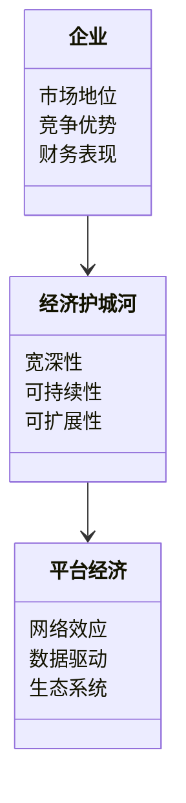
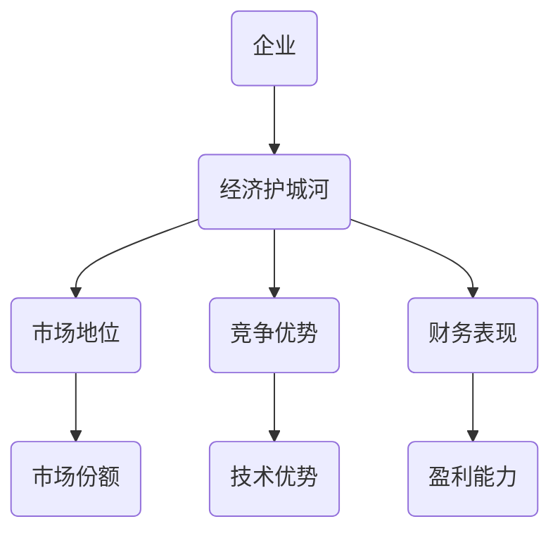

                 


# 巴菲特的经济护城河理论：平台经济时代的新定义

## 关键词：巴菲特，经济护城河，平台经济，商业模式，投资策略

## 摘要：  
本文探讨了巴菲特的经济护城河理论在平台经济时代的新定义。首先介绍了经济护城河的基本概念和巴菲特的理论背景，然后分析了平台经济的特点及其对经济护城河的影响。接着，提出了量化经济护城河的算法模型，并设计了系统架构来分析护城河在平台经济中的作用。最后，通过实际案例分析，验证了理论的可行性和实用性。

---

# 第1章: 巴菲特的经济护城河理论概述

## 1.1 经济护城河的定义与核心概念

### 1.1.1 经济护城河的定义  
经济护城河是指企业在市场竞争中建立的长期竞争优势，使其能够抵御竞争对手的侵蚀并保持持续的盈利能力。这种优势可以是成本优势、网络效应、品牌忠诚度等。

### 1.1.2 经济护城河的核心要素  
1. **市场地位**：企业在市场中的份额和影响力。
2. **竞争优势**：企业独有的资源、技术或模式。
3. **财务表现**：企业的盈利能力、现金流和资产负债表的健康状况。

### 1.1.3 经济护城河的分类与特点  
1. **成本优势**：低成本生产模式。
2. **网络效应**：用户越多，平台价值越大。
3. **品牌忠诚度**：消费者对品牌的依赖。

## 1.2 巴菲特的经济护城河理论背景

### 1.2.1 巴菲特投资理念的形成  
巴菲特的投资理念基于价值投资，他寻找那些具有持续竞争优势的企业进行长期投资。

### 1.2.2 经济护城河理论的提出  
巴菲特提出，企业只有建立强大的经济护城河，才能在竞争中立于不败之地。

### 1.2.3 理论在投资实践中的应用  
通过分析企业的护城河，巴菲特选择那些具有宽深护城河的企业进行投资。

## 1.3 平台经济时代的经济护城河新定义

### 1.3.1 平台经济的基本特征  
平台经济是一种基于互联网的商业模式，通过连接供需双方创造价值。

### 1.3.2 平台经济中的经济护城河  
在平台经济中，护城河主要表现为网络效应、数据驱动和生态系统优势。

### 1.3.3 平台经济时代经济护城河的变化  
1. **网络效应增强**：用户数量和互动频率成为关键。
2. **数据成为核心资产**：数据驱动的决策能力成为竞争优势。
3. **生态系统的重要性**：平台能否吸引和整合更多参与者决定了其护城河的宽度。

---

# 第2章: 经济护城河的核心要素与分析框架

## 2.1 经济护城河的核心要素与属性

### 2.1.1 核心要素对比分析  
| 要素 | 特点 | 示例 |
|------|------|------|
| 市场地位 | 企业的市场份额和行业影响力 | 苹果在智能手机市场的地位 |
| 竞争优势 | 企业的独特资源和技术 | 微软的Windows操作系统 |
| 财务表现 | 企业的盈利能力 | 亚马逊的现金流 |

### 2.1.2 经济护城河的属性特征  
1. **宽深性**：护城河的宽度和深度决定了企业的竞争能力。
2. **可持续性**：护城河能否长期维持。
3. **可扩展性**：护城河能否随着企业规模扩大而增强。

## 2.2 经济护城河的系统架构设计

### 2.2.1 领域模型设计  


### 2.2.2 系统架构图  


---

# 第3章: 平台经济时代经济护城河的数学模型与算法原理

## 3.1 经济护城河的量化分析方法

### 3.1.1 量化指标  
1. **市场份额**：企业的市场占有率。
2. **用户粘性**：用户的活跃度和忠诚度。
3. **成本优势**：单位成本的比较。

### 3.1.2 数学模型  
$$CR = \sum_{i=1}^{n} (\frac{S_i}{S_{\text{total}}})^2$$  
其中，CR是市场集中度指数，$S_i$是各企业的市场份额，$S_{\text{total}}$是市场总份额。

### 3.1.3 算法流程  
1. 数据收集：获取企业市场份额和用户活跃数据。
2. 计算CR指数：评估企业的市场集中度。
3. 分析用户粘性：通过活跃率判断用户忠诚度。

---

# 第4章: 平台经济时代经济护城河的系统分析与架构设计

## 4.1 系统分析与设计

### 4.1.1 领域模型设计  


### 4.1.2 系统架构设计  


---

# 第5章: 项目实战：平台企业经济护城河的分析与设计

## 5.1 环境安装与数据收集

### 5.1.1 环境安装  
安装必要的数据分析工具，如Python、Pandas、Matplotlib。

### 5.1.2 数据收集  
收集目标企业的市场份额、用户活跃数据和财务报表。

## 5.2 核心实现与代码示例

### 5.2.1 数据分析代码  
```python
import pandas as pd
import matplotlib.pyplot as plt

# 假设我们有一个包含市场份额的数据框 df
# 计算市场集中度指数 CR
def calculate_cr(df):
    market_share = df['市场份额']
    total = sum(market_share)
    cr = sum([(s / total) ** 2 for s in market_share])
    return cr

cr = calculate_cr(df)
print(f"市场集中度指数 CR = {cr}")
```

### 5.2.2 可视化分析  
```python
plt.bar(df['企业'], df['市场份额'])
plt.title('市场份额分布')
plt.xlabel('企业')
plt.ylabel('市场份额')
plt.show()
```

---

# 第6章: 总结与展望

## 6.1 总结  
本文通过分析平台经济的特点，重新定义了经济护城河的内涵和外延。通过数学模型和系统架构设计，提出了量化分析的方法，并通过案例分析验证了理论的可行性。

## 6.2 展望  
未来，随着技术的进步，数据驱动的护城河将更加重要。企业需要不断创新，才能在平台经济中建立并巩固自己的经济护城河。

---

作者：AI天才研究院/AI Genius Institute & 禅与计算机程序设计艺术 /Zen And The Art of Computer Programming

