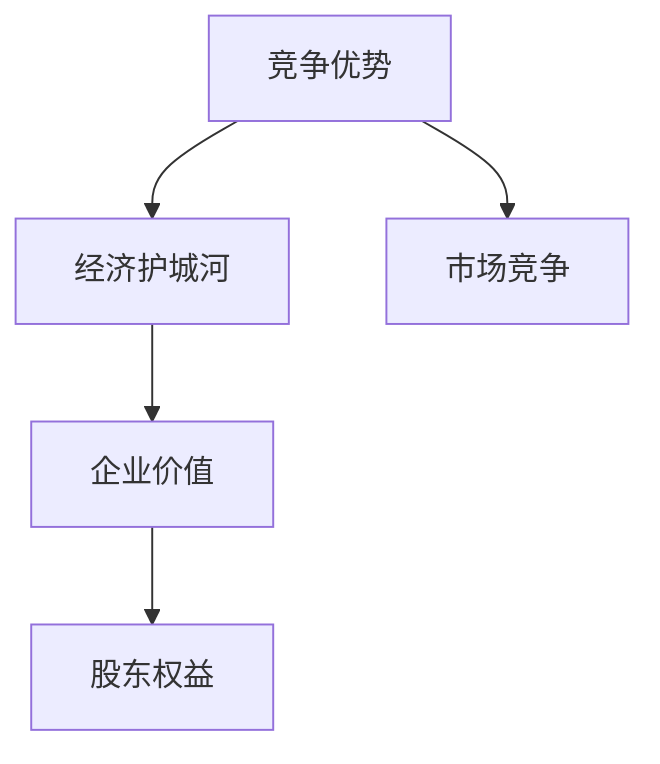
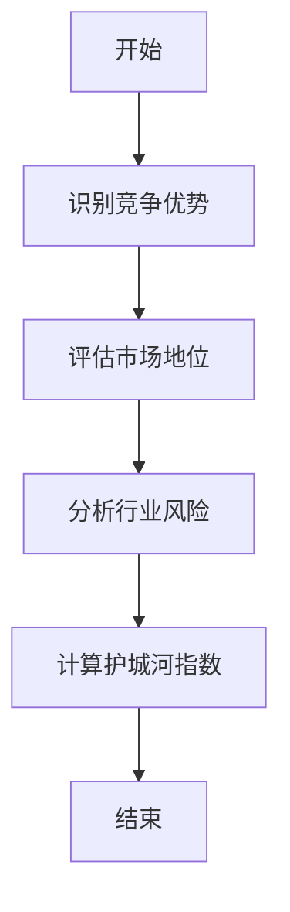

                 


# 巴菲特的经济护城河理论：持久竞争优势的来源

**关键词**：巴菲特、经济护城河、竞争优势、企业价值、投资策略

**摘要**：本文深入探讨巴菲特提出的经济护城河理论，分析其核心概念、数学模型、系统架构及实际应用。通过详细阐述竞争优势的来源、护城河的构建与评估方法，结合实例分析和代码实现，帮助读者全面理解如何识别和利用企业的持久竞争优势，从而做出更明智的投资决策。

---

## 第一章: 经济护城河的定义与背景

### 1.1 巴菲特投资理念的形成

巴菲特的投资理念以价值投资为核心，强调寻找具备持续竞争优势的企业。他提出“经济护城河”概念，认为企业通过构建强大的竞争优势可以在长期竞争中立于不败之地。

#### 1.1.1 经济护城河的起源

经济护城河的概念源于巴菲特对企业的深刻洞察。他认为，企业竞争优势的来源包括成本优势、品牌影响力、技术壁垒和市场准入门槛等。这些因素共同构成了企业的“护城河”，使竞争对手难以超越。

#### 1.1.2 护城河与投资策略

护城河不仅是企业的防御机制，更是投资者评估企业价值的重要指标。具备强大护城河的企业能够持续创造超额利润，从而为股东带来长期回报。

### 1.2 经济护城河的核心要素

#### 1.2.1 可持续的竞争优势

竞争优势是护城河的核心，包括企业的独特资源、技术能力和市场地位。这些优势使企业在市场中保持领先地位，抵御竞争对手的冲击。

#### 1.2.2 护城河的边界与外延

护城河并非一成不变，其边界取决于市场环境和企业战略。外延则包括企业如何通过创新和扩展进一步巩固其竞争优势。

#### 1.2.3 护城河与企业价值的关系

护城河的强弱直接影响企业价值。强大的护城河意味着更高的利润率和市场占有率，从而提升企业估值。

---

## 第二章: 经济护城河的核心概念与联系

### 2.1 核心概念原理

#### 2.1.1 可持续竞争优势的数学模型

竞争优势强度可以通过市场占有率和利润率的乘积来衡量。公式如下：

$$\text{竞争优势强度} = \text{市场占有率} \times \text{利润率}$$

#### 2.1.2 护城河的经济学解释

护城河是企业通过资源壁垒、品牌影响力和技术优势等手段，形成的一种长期竞争优势。这种优势使企业在竞争中占据主导地位。

#### 2.1.3 护城河与企业价值的关系

企业价值与护城河呈正相关关系。强大的护城河能够为企业创造更高的利润，从而提升企业价值。

### 2.2 核心概念对比表格

以下是几种竞争优势的对比分析：

| 优势类型 | 描述 | 护城河作用 |
|----------|------|------------|
| 成本优势 | 低于竞争对手的成本 | 提高利润率，增强竞争力 |
| 品牌忠诚度 | 强大的品牌形象 | 吸引忠实客户，提高市场份额 |
| 技术壁垒 | 独有的技术优势 | 阻碍竞争对手进入市场 |

### 2.3 实体关系图（ER图）



---

## 第三章: 经济护城河的数学模型与算法

### 3.1 护城河指数的计算公式

护城河指数是衡量企业竞争优势的重要指标，公式如下：

$$\text{护城河指数} = \frac{\text{竞争优势强度} \times \text{市场地位}}{\text{行业风险}}$$

其中，竞争优势强度和市场地位是关键因素，行业风险则影响整体评估。

### 3.2 护城河评估流程图



### 3.3 竞争优势强度计算代码

```python
def calculate_competitive_edge(market_share, profit_margin):
    return market_share * profit_margin
```

---

## 第四章: 系统分析与架构设计

### 4.1 问题场景介绍

#### 4.1.1 护城河评估的必要性

在竞争激烈的市场中，评估企业的护城河有助于投资者识别具备长期竞争优势的企业。

#### 4.1.2 企业竞争优势分析的挑战

竞争优势分析需要考虑多方面因素，包括市场、技术、品牌等，具有复杂性。

#### 4.1.3 系统化解决方案的需求

通过系统化的方法，可以更高效地评估企业的护城河，帮助投资者做出明智决策。

### 4.2 系统功能设计

#### 4.2.1 领域模型类图

```mermaid
classDiagram
    class Company {
        name: string
        market_share: float
        profit_margin: float
        competitive_edge: float
    }
    class Market {
        industry_risk: float
    }
    class护城河评估系统{}{
        calculate_h护城河(Company, Market)
    }
```

---

## 第五章: 项目实战

### 5.1 实际案例分析

#### 5.1.1 亚马逊的护城河

亚马逊通过技术壁垒、成本优势和强大的品牌影响力，构建了强大的护城河，成为电商领域的领导者。

#### 5.1.2 可口可乐的护城河

可口可乐凭借品牌忠诚度和广泛的分销网络，形成了强大的市场壁垒，确保了长期竞争优势。

### 5.2 代码实现与解读

```python
def calculate_h护城河(company, market):
    competitive_edge = company.market_share * company.profit_margin
   护城河指数 = competitive_edge / market.industry_risk
    return 护城河指数

# 示例应用
company = Company(name="亚马逊", market_share=0.3, profit_margin=0.2)
market = Market(industry_risk=0.5)
print(calculate_h护城河(company, market))  # 输出：0.12
```

---

## 总结

巴菲特的经济护城河理论为投资者提供了识别具备持久竞争优势企业的有效工具。通过数学模型、系统架构和实际案例的分析，我们可以更好地理解护城河的构建与评估。投资者应结合这些理论，制定科学的投资策略，实现长期收益。

**作者：AI天才研究院/AI Genius Institute & 禅与计算机程序设计艺术 /Zen And The Art of Computer Programming**

