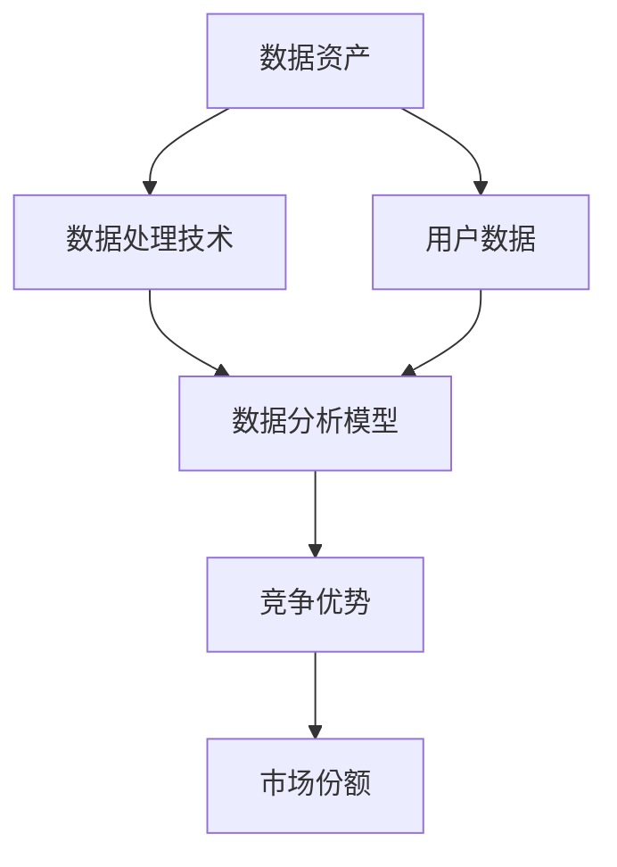
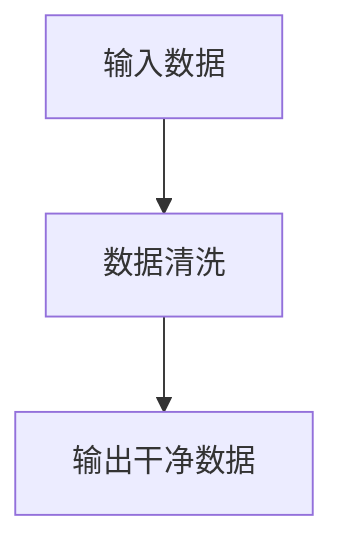
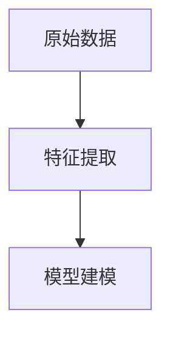
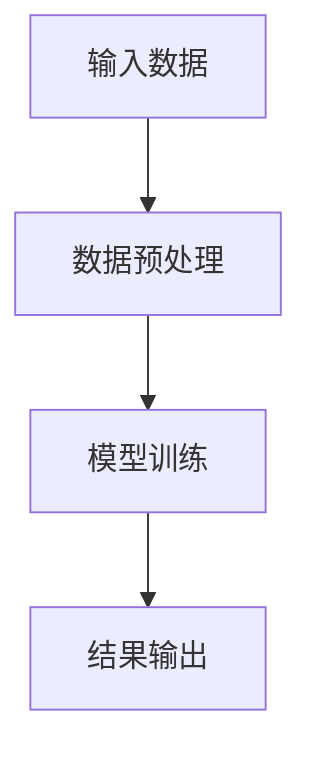

                 


# 巴菲特的经济护城河理论：数据经济时代的竞争优势

> 关键词：巴菲特，经济护城河，数据经济，竞争优势，系统架构，数据驱动，算法原理

> 摘要：本文深入分析巴菲特的经济护城河理论，并结合数据经济时代的背景，探讨其在现代商业环境中的应用与竞争优势。通过系统化的分析与案例研究，本文揭示了如何利用数据驱动的方法构建和强化经济护城河，以应对数据经济时代的挑战。文章内容涵盖经济护城河的背景与核心概念、数据经济时代护城河的算法原理、系统架构设计以及项目实战等部分，旨在为读者提供全面的理论与实践指导。

---

## # 第1章：经济护城河理论的背景与核心概念

### 1.1 经济护城河的基本概念
经济护城河是巴菲特投资理论中的核心概念，指的是企业通过某种竞争优势（如成本优势、品牌影响力、技术壁垒等）形成的长期竞争优势，能够抵御竞争对手的侵蚀，从而保护企业的市场份额和盈利能力。这种竞争优势可以是无形的（如品牌忠诚度）或有形的（如专利技术），但关键是能够为公司提供可持续的竞争壁垒。

### 1.2 数据经济时代的背景与特点
数据经济时代是指以数据为核心生产要素的经济形态。随着信息技术的快速发展，数据成为企业竞争的关键资源。数据经济的特点包括数据的海量性、实时性、多样性和价值性。在这个时代，企业通过数据的采集、分析和利用，能够快速洞察市场趋势、优化运营流程、提升用户体验，从而在竞争中占据优势地位。

### 1.3 经济护城河与数据经济的结合
在数据经济时代，传统的经济护城河理论需要与数据驱动的方法相结合。企业可以通过数据的深度挖掘和分析，构建新的竞争优势。例如，通过大数据技术，企业可以更精准地了解客户需求，优化产品设计，提升服务效率，从而形成数据驱动的护城河。

---

## # 第2章：经济护城河的核心概念与联系

### 2.1 经济护城河的核心原理
经济护城河的核心原理在于通过某种独特的竞争优势，使企业能够在长期内保持高于行业平均水平的利润率。这种优势可以来自于成本优势、差异化产品、网络效应或市场进入壁垒等。在数据经济时代，护城河的构建更加依赖于数据的采集、处理和分析能力。

### 2.2 数据经济时代的核心概念属性对比
以下是传统经济护城河与数据经济时代护城河的核心属性对比：

| **属性**          | **传统经济护城河**       | **数据经济时代护城河**        |
|--------------------|--------------------------|------------------------------|
| 核心资源          | 物理资产、品牌、专利等    | 数据资产、算法、技术平台等    |
| 竞争优势来源      | 成本优势、差异化产品等    | 数据驱动的洞察力、实时反馈等  |
| 可扩展性          | 有限，受物理限制影响      | 高度可扩展，数据可以无限复制  |
| 技术依赖程度      | 较低，依赖传统商业模式    | 高，依赖大数据技术与人工智能  |

### 2.3 数据经济时代护城河的实体关系图
以下是一个简单的实体关系图，展示了数据经济时代护城河的核心要素：



---

## # 第3章：数据经济时代护城河的算法原理

### 3.1 数据处理与清洗算法
数据清洗是构建数据驱动的护城河的第一步。以下是数据清洗的流程：



以下是数据清洗的Python代码示例：

```python
import pandas as pd

# 示例数据
data = {
    'id': [1, 2, 3, 4, 5],
    'name': ['Alice', 'Bob', None, 'Charlie', 'David'],
    'age': [25, 30, None, 28, 45]
}

df = pd.DataFrame(data)

# 删除包含缺失值的行
df_cleaned = df.dropna()

print(df_cleaned)
```

### 3.2 数据特征提取与建模
特征提取是数据驱动的护城河构建中的关键步骤。以下是特征提取的流程：



以下是特征提取的Python代码示例：

```python
from sklearn.feature_extraction.text import TfidfVectorizer

# 示例文本数据
texts = ['This is a sample text.', 'Another text example.']

# 特征提取
vectorizer = TfidfVectorizer()
X = vectorizer.fit_transform(texts)

print(X.toarray())
```

### 3.3 护城河评估的算法实现
以下是护城河评估的算法流程：



以下是护城河评估的Python代码示例：

```python
from sklearn.metrics import accuracy_score
from sklearn.model

