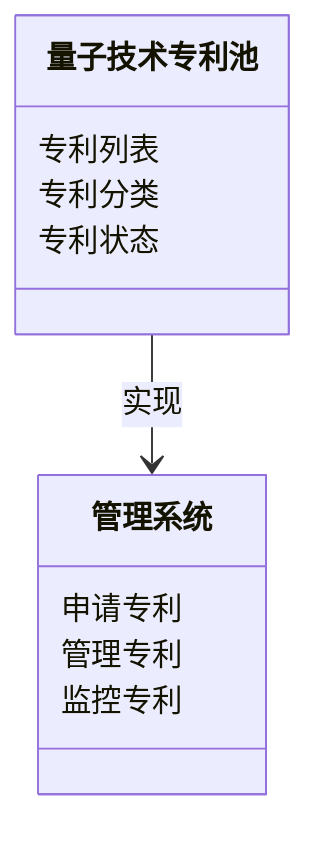

                 


# 巴菲特的经济护城河理论：量子技术专利池的竞争优势

## 关键词：
巴菲特，经济护城河，量子技术，专利池，竞争优势，知识产权

## 摘要：
本文探讨了巴菲特的经济护城河理论在量子技术专利池中的应用，分析了量子技术专利池作为经济护城河的竞争优势，详细阐述了专利池的构建、管理及其对企业的长期价值。

---

## 第一部分：经济护城河理论的背景与基础

### 第1章：经济护城河理论概述

#### 1.1 经济护城河的核心概念

**1.1.1 护城河的定义与分类**
- 护城河是企业竞争优势的核心，可分为成本优势、网络效应、技术壁垒等类型。

**1.1.2 巴菲特的经济护城河理论**
- 巴菲特强调企业必须具备可持续的竞争优势，护城河是企业长期盈利的关键。

**1.1.3 护城河在企业竞争优势中的作用**
- 护城河帮助企业抵御竞争，保持市场份额和盈利能力。

#### 1.2 量子技术的特殊性与护城河构建

**1.2.1 量子技术的定义与特点**
- 量子技术利用量子叠加和纠缠效应，具有并行计算和超强计算能力。

**1.2.2 量子技术的市场现状与竞争格局**
- 当前量子技术处于发展初期，主要参与者包括Google、IBM、Intel等科技巨头。

**1.2.3 量子技术专利池的形成机制**
- 通过持续的研发投入，企业积累量子技术专利，形成池塘。

#### 1.3 专利池与经济护城河的关系

**1.3.1 专利池的定义与作用**
- 专利池是企业积累技术优势，形成市场垄断的重要手段。

**1.3.2 专利池在量子技术中的独特价值**
- 量子技术专利池能够构建技术壁垒，确保企业领先地位。

**1.3.3 专利池与经济护城河的结合**
- 专利池是经济护城河的重要组成部分，能够巩固企业的市场地位。

---

## 第二部分：量子技术专利池的竞争优势

### 第2章：量子技术专利池的构建与管理

#### 2.1 专利池的构建策略

**2.1.1 专利池的形成过程**
- 通过技术研发、收购、合作等方式，逐步积累专利。

**2.1.2 专利池的规模与质量**
- 专利池的规模和质量直接影响其市场竞争力。

**2.1.3 专利池的布局与优化**
- 在关键领域布局专利，定期审查和优化专利组合。

#### 2.2 量子技术专利池的竞争优势

**2.2.1 技术领先性**
- 专利池代表了企业的技术优势，能够保持领先地位。

**2.2.2 成本优势**
- 规模化专利池降低了研发和维护成本，形成成本优势。

**2.2.3 市场垄断性**
- 专利池能够限制竞争对手的发展，形成市场垄断。

#### 2.3 专利池的保护与防御

**2.3.1 专利池的法律保护**
- 通过法律手段保护专利，防止侵权和抄袭。

**2.3.2 专利池的防御策略**
- 主动监控市场，及时应对侵权行为。

**2.3.3 专利池的国际布局**
- 在全球范围内申请专利，扩大市场影响力。

---

## 第三部分：经济护城河理论在量子技术中的应用

### 第3章：经济护城河的构建与量子技术专利池的结合

#### 3.1 经济护城河的构建过程

**3.1.1 核心竞争力的打造**
- 通过技术研发和专利积累，构建企业的核心竞争力。

**3.1.2 技术壁垒的建立**
- 通过专利池形成技术壁垒，防止竞争对手进入市场。

**3.1.3 市场地位的巩固**
- 利用专利池巩固市场地位，提升品牌影响力。

#### 3.2 量子技术专利池的经济价值

**3.2.1 专利池的市场价值**
- 专利池能够提升企业的市场估值和竞争力。

**3.2.2 专利池的财务价值**
- 专利池可以通过许可、出售等方式带来直接收益。

**3.2.3 专利池的长期收益**
- 长期来看，专利池能够为企业发展提供持续动力。

#### 3.3 专利池对经济护城河的强化作用

**3.3.1 技术领先性的强化**
- 专利池确保企业在技术上的领先地位。

**3.3.2 市场垄断的强化**
- 专利池能够进一步巩固企业的市场垄断地位。

**3.3.3 长期竞争优势的强化**
- 专利池为企业的长期竞争优势提供了保障。

---

## 第四部分：量子技术专利池的系统分析与架构设计

### 第4章：量子技术专利池的系统架构设计

#### 4.1 问题场景介绍

**4.1.1 系统目标**
- 构建一个高效的量子技术专利池管理系统。

**4.1.2 项目介绍**
- 开发一个专利池管理平台，实现专利的申请、管理和监控。

#### 4.2 系统功能设计

**4.2.1 领域模型设计**
- 使用Mermaid类图展示专利池的组成部分和关系。



#### 4.3 系统架构设计

**4.3.1 系统架构图**
- 使用Mermaid架构图展示系统架构。


#### 4.4 系统接口设计

**4.4.1 系统接口设计**
- 专利池管理系统与外部系统的交互接口。

#### 4.5 系统交互设计

**4.5.1 交互流程图**
- 使用Mermaid序列图展示系统的交互流程。

```mermaid
sequenceDiagram
    用户 -> 管理系统: 提交专利申请
    管理系统 -> 数据库: 存储专利信息
    用户 <- 管理系统: 确认申请
```

---

## 第五部分：量子技术专利池的项目实战

### 第5章：量子技术专利池的项目实战

#### 5.1 环境安装

**5.1.1 开发环境**
- 使用Python、Django框架和MySQL数据库。

#### 5.2 系统核心实现源代码

**5.2.1 专利池管理代码**
- 示例代码展示专利池的管理功能。

```python
class PatentPool:
    def __init__(self):
        self.patents = []

    def add_patent(self, patent):
        self.patents.append(patent)
        print(f"专利 {patent} 已添加到池中。")

    def remove_patent(self, patent):
        if patent in self.patents:
            self.patents.remove(patent)
            print(f"专利 {patent} 已从池中移除。")
```

#### 5.3 代码应用解读与分析

**5.3.1 代码功能分析**
- 代码实现专利池的添加和移除功能。

#### 5.4 实际案例分析

**5.4.1 案例分析**
- 通过具体案例分析专利池的构建和管理过程。

#### 5.5 项目小结

**5.5.1 项目总结**
- 总结项目实施的经验和教训，提出改进建议。

---

## 第六部分：量子技术专利池的最佳实践

### 第6章：最佳实践与小结

#### 6.1 最佳实践

**6.1.1 小结**
- 总结全文，强调量子技术专利池的重要性。

**6.1.2 注意事项**
- 提醒读者注意专利池的法律风险和维护成本。

**6.1.3 未来展望**
- 展望量子技术专利池的未来发展。

---

## 作者：AI天才研究院 & 禅与计算机程序设计艺术

---

**摘要**：本文系统地探讨了巴菲特的经济护城河理论在量子技术专利池中的应用，详细分析了专利池的竞争优势及其构建策略，为企业在量子技术领域构建经济护城河提供了实践指导。

**关键词**：巴菲特，经济护城河，量子技术，专利池，竞争优势，知识产权

---

通过以上结构，文章详细讲解了量子技术专利池作为经济护城河的竞争优势，从理论到实践，为企业提供了全面的指导。

