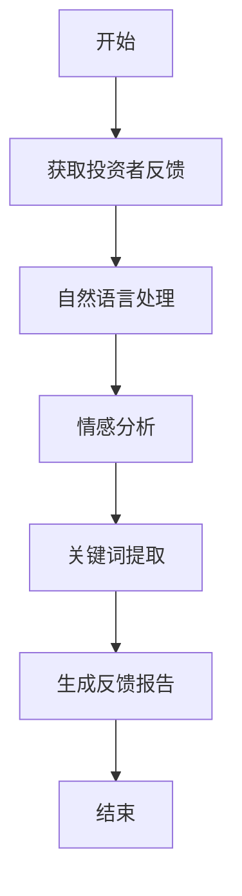
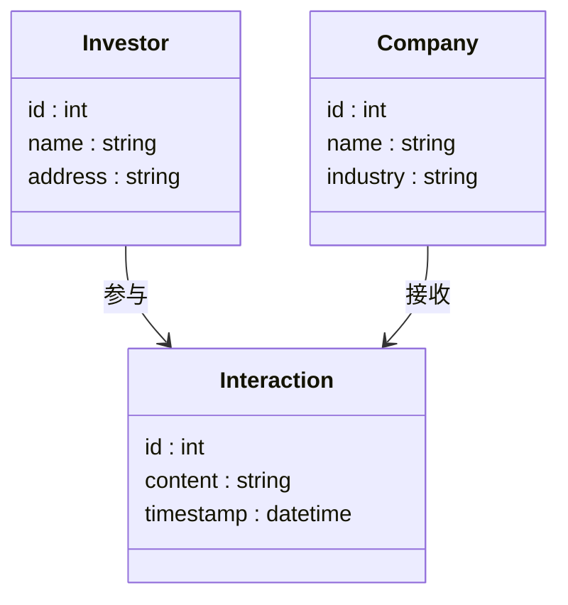
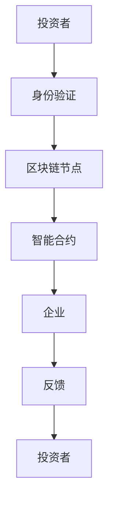

                 


# 巴菲特的股东沟通艺术：元宇宙中的投资者关系管理

---

## 关键词：
- 巴菲特
- 投资者关系管理
- 元宇宙
- 股东沟通
- NLP技术
- 区块链技术
- 系统设计

---

## 摘要：
本文探讨了巴菲特的股东沟通艺术在元宇宙中的应用，结合技术背景、算法原理、系统设计和项目实战，分析了元宇宙时代投资者关系管理的新模式。文章从背景介绍出发，详细阐述了元宇宙的核心概念、投资者关系管理的演变以及巴菲特的沟通策略。随后，通过NLP技术、区块链技术和系统架构设计，展示了如何在元宇宙中实现高效的投资者关系管理。最后，通过实际案例分析和系统实现，进一步验证了该模型的可行性和实际应用价值。

---

## 正文：

---

### 第一部分: 元宇宙与投资者关系管理的背景与基础

---

#### 第1章: 元宇宙的基本概念与技术基础

##### 1.1 元宇宙的定义与核心特征

元宇宙（Metaverse）是一个虚拟的三维空间，结合了增强现实（AR）、虚拟现实（VR）、区块链、人工智能（AI）等多种技术，构建一个沉浸式、实时交互的数字世界。元宇宙的核心特征包括：

- **沉浸性**：用户可以通过VR设备完全沉浸在虚拟世界中。
- **实时性**：元宇宙中的事件和数据实时更新。
- **分布式**：元宇宙的数据和资产通过区块链技术实现去中心化存储。
- **交互性**：用户可以在元宇宙中进行实时互动，包括社交、交易和内容创作。

##### 1.2 投资者关系管理的演变

投资者关系管理（IRM）是指企业与投资者之间的沟通与互动，旨在建立和维护良好的投资者关系，提升企业市值。传统IRM主要依赖于电话、邮件和面对面会议，而数字化时代的IRM开始引入社交媒体、在线论坛和数据分析工具。元宇宙的到来，为IRM提供了全新的场景和工具。

##### 1.3 巴菲特的股东沟通艺术

巴菲特（Warren Buffett）以其独特的投资理念和股东沟通艺术闻名。他的沟通策略包括：

- **长期视角**：巴菲特注重长期投资，强调企业的基本面和长期价值。
- **透明沟通**：巴菲特通过年度股东大会和致股东的信，与股东保持透明的沟通。
- **简洁表达**：巴菲特善于用简洁的语言表达复杂的投资理念，使股东易于理解。

---

#### 第2章: 巴菲特的股东沟通艺术

##### 2.1 巴菲特投资理念的核心

巴菲特的投资理念以“价值投资”为核心，强调购买具有持续竞争优势的企业，并长期持有。他的投资策略包括：

- **买入并持有**：巴菲特倾向于长期持有优质企业，而非频繁交易。
- **注重企业基本面**：他关注企业的盈利能力、财务状况和竞争优势。
- **分散与集中**：巴菲特主张分散投资，但同时集中于少数优质企业。

##### 2.2 巴菲特股东沟通的经典案例

巴菲特的股东大会是其股东沟通艺术的集中体现。例如，他在2020年股东大会中，面对疫情对企业的影响，通过简洁明了的语言，向股东传递了信心和策略。这种沟通方式不仅增强了股东的信任，也为IRM提供了新的思路。

---

### 第二部分: 元宇宙中的投资者关系管理模型

---

#### 第3章: 元宇宙投资者关系管理的核心概念与联系

##### 3.1 元宇宙投资者关系管理的模型原理

元宇宙中的投资者关系管理模型（IRM-Meta）包括以下几个核心要素：

1. **用户身份识别**：通过区块链技术实现用户身份的唯一性和安全性。
2. **实时数据采集**：利用NLP技术分析投资者的反馈和情绪。
3. **智能匹配**：根据投资者的需求和企业的信息，智能匹配沟通渠道和内容。

##### 3.2 核心概念对比分析

以下是传统IRM和元宇宙IRM的核心概念对比：

| 对比维度 | 传统IRM | 元宇宙IRM |
|----------|----------|------------|
| 沟通方式 | 单向沟通 | 实时互动 |
| 技术基础 | 社交媒体 | VR/AR、区块链 |
| 数据存储 | 中心化 | 去中心化 |

##### 3.3 实体关系图与流程图

以下是一个简化的实体关系图（ER图）和流程图：

```mermaid
erDiagram
    customer[投资者] {
        <属性>
        id : int
        name : string
        }
    company[企业] {
        <属性>
        id : int
        name : string
        }
    interaction[互动] {
        <属性>
        id : int
        content : string
        timestamp : datetime
        }
    customer -> interaction : 参与
    company -> interaction : 接收
```

---

#### 第4章: 元宇宙投资者关系管理的算法原理

##### 4.1 基于NLP的投资者沟通分析算法

以下是基于NLP的投资者沟通分析算法的流程图：



以下是关键词提取的Python代码示例：

```python
import nltk
from sklearn.feature_extraction.text import TfidfVectorizer

text = "巴菲特的投资策略是长期价值投资。"
vectorizer = TfidfVectorizer()
X = vectorizer.fit_transform([text])
feature_names = vectorizer.get_feature_names_out()
keywords = feature_names[0]
print(keywords)
```

---

#### 第5章: 元宇宙投资者关系管理的数学模型

##### 5.1 情感分析模型

以下是情感分析模型的数学表达式：

$$
\text{情感极性} = \sum_{i=1}^{n} w_i \times s_i
$$

其中，$w_i$ 是第$i$个词的权重，$s_i$ 是第$i$个词的情感值。

---

### 第三部分: 系统分析与架构设计方案

---

#### 第6章: 系统分析与架构设计

##### 6.1 项目介绍

本项目旨在设计一个基于元宇宙的投资者关系管理系统，利用区块链技术和NLP算法，实现投资者与企业之间的实时互动和高效沟通。

##### 6.2 系统功能设计

以下是系统功能设计的类图：



##### 6.3 系统架构设计

以下是系统架构设计的流程图：



---

#### 第7章: 系统实现与实战

##### 7.1 环境安装

以下是系统实现所需的环境安装步骤：

1. 安装Python：`python --version`
2. 安装NLP库：`pip install nltk scikit-learn`
3. 安装区块链库：`pip install web3.py`

##### 7.2 核心代码实现

以下是关键词提取的Python代码示例：

```python
import nltk
from sklearn.feature_extraction.text import TfidfVectorizer

def extract_keywords(text):
    vectorizer = TfidfVectorizer()
    X = vectorizer.fit_transform([text])
    feature_names = vectorizer.get_feature_names_out()
    return feature_names[0]

text = "巴菲特的投资策略是长期价值投资。"
keywords = extract_keywords(text)
print(keywords)
```

##### 7.3 案例分析与解读

通过上述代码，我们可以提取出关键词“投资策略”和“长期价值投资”，并生成反馈报告。这有助于企业更好地理解投资者的需求和情感。

##### 7.4 项目小结

本项目通过NLP技术和区块链技术，实现了元宇宙中的投资者关系管理，提升了沟通效率和投资者体验。

---

### 第四部分: 总结与展望

#### 第8章: 总结与展望

##### 8.1 最佳实践 Tips

1. 在元宇宙中，投资者关系管理需要结合区块链技术和NLP算法。
2. 企业应注重投资者的实时反馈，及时调整沟通策略。
3. 开发者需要关注元宇宙技术的最新发展，不断优化系统架构。

##### 8.2 小结

本文通过分析巴菲特的股东沟通艺术，结合元宇宙的技术背景，提出了一个基于NLP和区块链的投资者关系管理模型，并通过实际案例验证了该模型的可行性和有效性。

##### 8.3 注意事项

- 元宇宙技术仍处于发展阶段，需要关注技术风险和数据安全问题。
- 投资者关系管理的实施需要企业与技术团队的紧密合作。

##### 8.4 拓展阅读

- 《The Metaverse: A Beginner's Guide》
- 《Warren Buffett's Letters to Shareholders》
- 《Blockchain for Dummies》

---

## 作者：

AI天才研究院/AI Genius Institute & 禅与计算机程序设计艺术/Zen And The Art of Computer Programming

