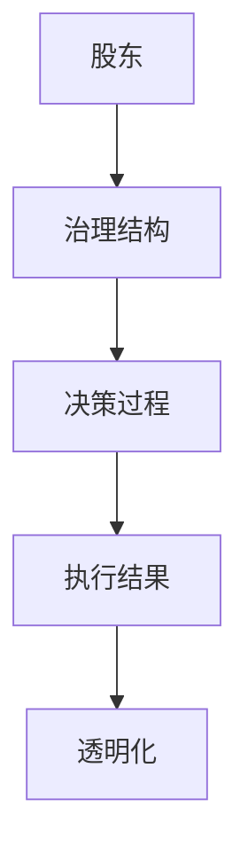
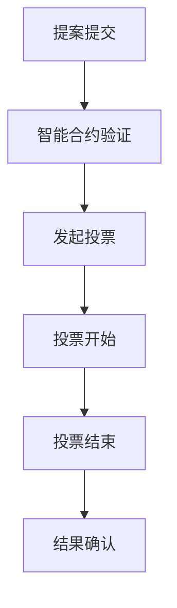

                 


# 巴菲特的股东沟通艺术：去中心化自治组织的治理模式

---

## 关键词
- 巴菲特投资哲学
- 股东沟通艺术
- 去中心化自治组织（DAO）
- 治理模式
- 分布式决策机制

---

## 摘要
本文探讨了巴菲特的股东沟通艺术与去中心化自治组织（DAO）治理模式的结合。通过分析巴菲特的投资哲学、股东沟通策略以及DAO的去中心化特点，提出了将巴菲特的沟通艺术应用于DAO治理中的创新方法。文章从背景介绍、核心概念、算法原理、系统架构、项目实战到最佳实践，全面解析了这一结合的可行性与实际应用。

---

## 第一部分：背景介绍

### 第1章：巴菲特的股东沟通艺术

#### 1.1 问题背景与问题描述
- 传统企业治理中，股东与管理层之间的信息不对称问题严重，导致信任缺失和治理效率低下。
- 巴菲特以其独特的投资哲学和透明的股东沟通方式，成为企业治理的典范。
- 去中心化自治组织（DAO）作为一种新兴的组织形式，强调透明化和分布式决策，与巴菲特的治理理念有诸多契合点。

#### 1.2 去中心化自治组织（DAO）的定义与特点
- DAO是一种基于区块链技术的组织形式，通过智能合约实现自治治理。
- DAO的特点包括去中心化、透明化、分布式决策和不可篡改性。
- DAO与传统企业的区别主要体现在治理结构、决策机制和信任机制上。

#### 1.3 巴菲特股东沟通艺术与DAO治理的结合
- 巴菲特的沟通方式强调透明和信任，这与DAO的去中心化特点高度契合。
- 巴菲特的投资哲学注重长期价值，这为DAO治理中的决策提供了重要参考。
- 将巴菲特的沟通艺术融入DAO治理，可以提升组织的透明度和治理效率。

---

## 第二部分：核心概念与联系

### 第2章：股东沟通与DAO治理的核心要素

#### 2.1 核心概念原理
- 股东沟通的核心原则包括透明性、及时性和一致性。
- DAO治理的决策机制基于分布式账本和智能合约，确保决策的透明和公平。
- 巴菲特的投资哲学强调长期价值，这为DAO治理提供了价值判断标准。

#### 2.2 核心概念属性对比
| 对比维度 | 传统企业治理 | DAO治理 |
|----------|--------------|----------|
| 治理结构 | 中央化决策 | 分布式决策 |
| 信息透明度 | 低 | 高 |
| 决策效率 | 依赖管理层 | 分布式投票 |

#### 2.3 ER实体关系图


---

## 第三部分：算法原理讲解

### 第3章：DAO治理中的投票机制

#### 3.1 投票机制的算法流程


#### 3.2 投票机制的代码实现
```python
class Voter:
    def __init__(self, address):
        self.address = address
        self.votes = {}

    def vote(self, proposal_id, support):
        self.votes[proposal_id] = support

class Proposal:
    def __init__(self, proposer, proposal_id):
        self.proposer = proposer
        selfproposal_id = proposal_id
        self.votes = {}

    def add_vote(self, voter, support):
        self.votes[voter.address] = support

class DAO:
    def __init__(self):
        self.proposals = []
        self.voters = []

    def submit_proposal(self, proposer):
        new_proposal = Proposal(proposer, len(self.proposals))
        self.proposals.append(new_proposal)
        return new_proposal

    def vote(self, proposal_id, voter, support):
        proposal = self.proposals[proposal_id]
        proposal.add_vote(voter, support)

    def tally_votes(self, proposal_id):
        proposal = self.proposals[proposal_id]
        total_support = 0
        total反对 = 0
        for voter in self.voters:
            if voter.address in proposal.votes:
                if proposal.votes[voter.address]:
                    total_support += 1
                else:
                    total反对 += 1
        return total_support, total反对
```

#### 3.3 投票机制的数学模型
- 投票权重计算公式：
  $$ \text{权重} = \frac{\text{投票数}}{\text{总投票数}} \times 100\% $$
- 投票结果判定：
  $$ \text{支持率} > 50\% \Rightarrow \text{提案通过} $$

---

## 第四部分：系统分析与架构设计

### 第4章：DAO治理系统的架构设计

#### 4.1 项目背景与目标
- 项目目标：构建一个基于DAO的去中心化治理系统，实现透明的股东沟通和高效的决策机制。

#### 4.2 系统功能设计
- 领域模型：
  ```mermaid
  graph TD
      User --> Proposal
      Proposal --> Vote
      Vote --> Result
  ```

- 系统架构：
  ```mermaid
  graph TD
      Client --> SmartContract
      SmartContract --> Blockchain
      Blockchain --> Database
  ```

- 系统交互：
  ```mermaid
  graph TD
      Client ->SmartContract: 提交提案
      SmartContract ->Blockchain: 验证提案
      Blockchain ->Client: 返回结果
  ```

---

## 第五部分：项目实战

### 第5章：基于DAO的治理系统实现

#### 5.1 环境安装
- 安装Python和Solidity开发环境。
- 配置区块链节点（以太坊测试网）。

#### 5.2 核心代码实现
```python
def submit_proposal(proposer):
    # 提交提案到智能合约
    proposal = Proposal(proposer)
    contract.submitProposal(proposal.id)
    return proposal

def vote(proposal_id, voter, support):
    # 提案投票
    contract.vote(proposal_id, voter.address, support)
```

#### 5.3 代码解读与实际案例分析
- 案例分析：假设一个DAO社区需要决定是否投资一个新的项目，通过智能合约提交提案并进行投票，最终根据投票结果决定是否通过。

---

## 第六部分：最佳实践

### 第6章：DAO治理中的最佳实践

#### 6.1 经验总结
- 透明化是DAO治理的核心，确保所有决策过程公开可查。
- 分布式决策机制需要完善的投票系统和激励机制。

#### 6.2 小结
- 巴菲特的股东沟通艺术为DAO治理提供了重要的理论支持。
- DAO治理模式的优势在于去中心化和透明化，但需要克服技术和信任方面的挑战。

#### 6.3 注意事项
- 在实际应用中，需注意智能合约的安全性，避免漏洞导致决策失败。
- DAO治理中的激励机制设计需合理，避免“搭便车”问题。

#### 6.4 拓展阅读
- 推荐阅读《区块链：重新定义价值信任的新一代互联网》和《巴菲特的股东文化》。

---

## 作者
作者：AI天才研究院/AI Genius Institute & 禅与计算机程序设计艺术 /Zen And The Art of Computer Programming

---

通过以上结构，文章详细探讨了巴菲特的股东沟通艺术与DAO治理的结合，从理论到实践，层层深入，为读者提供了全面的视角。

