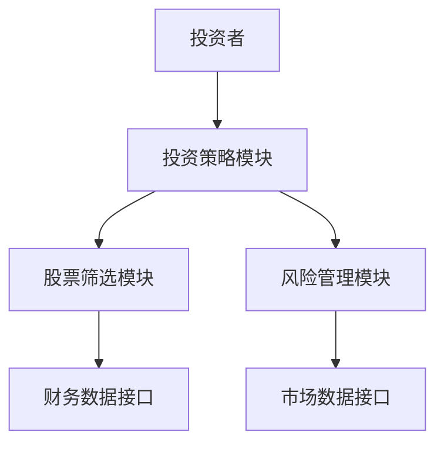
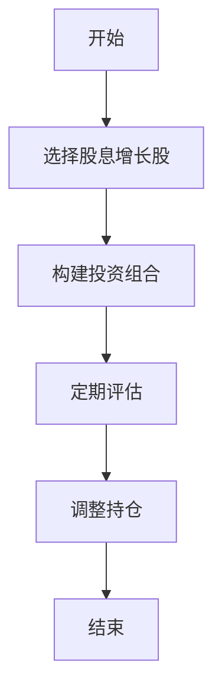
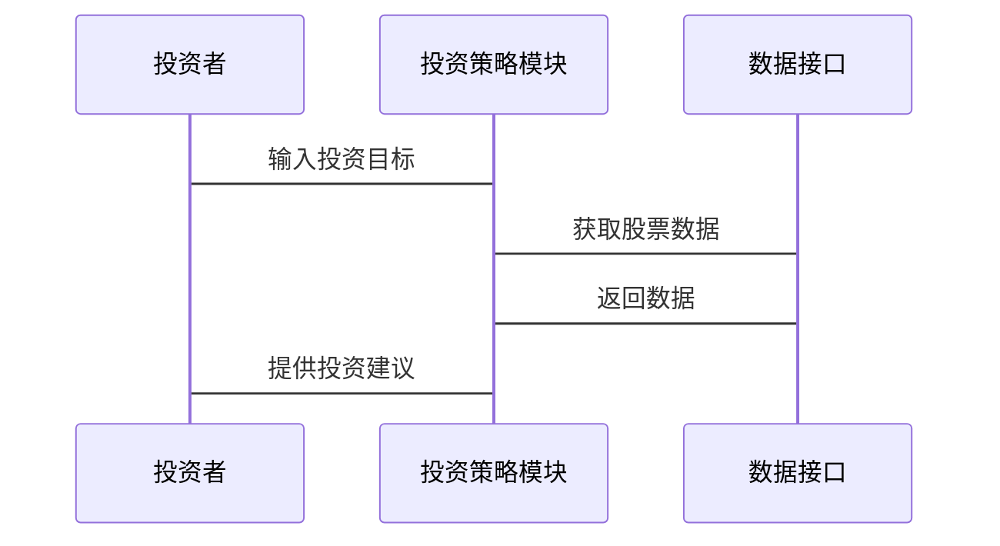

                 


# 巴菲特的股息增长策略：稳定现金流的长期价值

## 关键词：巴菲特，股息增长策略，稳定现金流，长期价值，投资策略，股息收益率

## 摘要：本文深入探讨了巴菲特的股息增长策略，分析其背后的哲学、数学模型和选股标准，结合实例分析，揭示其如何通过稳定股息增长实现长期价值。

---

# 第一部分：巴菲特的股息增长策略概述

## 第1章：巴菲特投资理念与股息增长策略

### 1.1 巴菲特的投资哲学

#### 1.1.1 价值投资的定义与核心理念
价值投资是一种长期投资策略，核心在于购买价格低于内在价值的资产。巴菲特将其发扬光大，强调企业基本面分析和安全边际。

#### 1.1.2 巴菲特的投资风格与成功案例
巴菲特的投资风格以稳健著称，偏好那些具有持续盈利能力、强大竞争优势和良好管理团队的企业。例如，他的长期投资标的如可口可乐和苹果，体现了他对品牌和管理层的信任。

#### 1.1.3 股息增长策略的起源与发展
股息增长策略起源于巴菲特早期的投资实践，他发现那些能够持续增长股息的公司往往具备稳定的盈利能力，从而能够为股东创造长期价值。

### 1.2 股息增长策略的核心概念

#### 1.2.1 股息增长策略的定义
股息增长策略是指选择那些能够持续提高股息支付能力的公司，通过长期持有这些股票，实现稳定的现金流和资本增值。

#### 1.2.2 股息增长策略的特点
- **稳定性**：公司盈利和股息支付能力稳定。
- **可持续性**：公司具备持续增长的股息能力。
- **防御性**：在市场波动中表现较为稳定。

#### 1.2.3 股息增长策略与其他投资策略的对比
| 策略类型       | 核心目标                     | 适用场景                     |
|----------------|------------------------------|------------------------------|
| 股息增长策略    | 稳定现金流，长期资本增值     | 长期投资者，追求稳定收益     |
| 股息收益率策略  | 高股息收益率                 | 追求当前收益，短期投资者     |
| 增长股策略      | 高成长性企业                 | 高风险承受能力，长期增长     |

### 1.3 股息增长策略的适用场景

#### 1.3.1 适合长期投资者的策略
股息增长策略适合那些愿意长期持有股票的投资者，能够通过复利效应实现财富增长。

#### 1.3.2 适合保守型投资者的策略
对于风险承受能力较低的投资者，股息增长策略提供了一种相对稳健的投资方式，能够在市场波动中提供稳定的现金流。

#### 1.3.3 股息增长策略的局限性
- **成长性不足**：部分高股息公司的增长潜力有限。
- **市场波动风险**：股息增长公司也可能受到市场整体波动的影响。

## 第2章：股息增长策略的核心要素

### 2.1 股息增长策略的关键指标

#### 2.1.1 股息率的定义与计算
股息率是衡量股票股息收益的重要指标，计算公式为：
$$ \text{股息率} = \frac{\text{股息支付额}}{\text{股价}} \times 100\% $$

#### 2.1.2 股息支付率的定义与计算
股息支付率是公司实际支付的股息与净利润的比率，计算公式为：
$$ \text{股息支付率} = \frac{\text{股息支付额}}{\text{净利润}} \times 100\% $$

#### 2.1.3 股息增长速度的定义与计算
股息增长速度是公司过去几年股息增长的平均速率，计算公式为：
$$ \text{股息增长速度} = \frac{\text{最新股息} - \text{初始股息}}{\text{初始股息}} \times 100\% $$

### 2.2 股息增长策略的选股标准

#### 2.2.1 公司基本面分析
基本面分析包括对公司收入、利润、资产负债表等的评估，确保公司具备稳定的盈利能力和良好的财务状况。

#### 2.2.2 财务健康状况评估
评估公司的财务健康状况，包括现金流、负债水平、盈利能力等指标，确保公司具备持续支付股息的能力。

#### 2.2.3 行业地位与竞争优势
选择那些在行业中具有领先地位和竞争优势的公司，这些公司通常具备更强的盈利能力和增长潜力。

### 2.3 股息增长策略的风险管理

#### 2.3.1 市场风险的定义与应对
市场风险是由于整体市场波动导致的投资组合价值下降的风险，可以通过分散投资来降低风险。

#### 2.3.2 公司风险的定义与应对
公司风险是指特定公司因自身经营问题导致股价下跌的风险，可以通过深入的公司基本面分析来识别和规避。

#### 2.3.3 利率风险的定义与应对
利率上升会增加债券收益率，导致股票价格可能下跌。可以通过关注高股息率股票的相对优势来应对利率风险。

---

## 第3章：股息增长策略的数学模型与公式

### 3.1 股息增长模型的数学表达

#### 3.1.1 股息增长模型的公式推导
股息增长模型假设股息以恒定速率g增长，股票的内在价值可以用以下公式计算：
$$ P = \frac{D_1}{r - g} $$
其中，P为股票价值，D_1为下一期股息，r为折现率，g为股息增长率。

#### 3.1.2 股息增长模型的假设条件
- 股息以恒定速率增长。
- 投资者要求的回报率r固定。

#### 3.1.3 股息增长模型的应用场景
适用于那些股息增长稳定、公司基本面良好的企业。

### 3.2 股息增长模型的实例分析

#### 3.2.1 实例一：假设公司A的股息增长分析
假设公司A当前股息为1元，预计股息每年增长5%，投资者要求的回报率为10%。根据股息增长模型，股票的内在价值为：
$$ P = \frac{1.05}{0.10 - 0.05} = 21 \text{元} $$

#### 3.2.2 实例二：假设公司B的股息增长分析
公司B当前股息为1.2元，预计股息每年增长6%，投资者要求的回报率为8%。股票的内在价值为：
$$ P = \frac{1.26}{0.08 - 0.06} = 63 \text{元} $$

### 3.3 股息增长模型的优缺点

#### 3.3.1 模型的优点
- 计算简单，易于理解。
- 能够反映股息增长的内在价值。

#### 3.3.2 模型的缺点
- 假设股息以恒定速率增长，现实中可能存在波动。
- 忽略了市场的整体波动对股价的影响。

#### 3.3.3 模型的改进方向
可以引入更多变量，如股息增长率的变化、市场波动等，使模型更加贴近实际情况。

---

## 第4章：股息增长策略的系统分析与架构设计

### 4.1 问题场景介绍
股息增长策略的应用需要考虑市场环境、公司基本面等多个因素，构建一个系统化的投资框架。

### 4.2 系统功能设计

#### 4.2.1 投资组合管理
- 股票筛选：根据股息增长率、股息支付率等指标筛选股票。
- 资产配置：根据风险承受能力分配资产比例。

#### 4.2.2 风险管理模块
- 风险评估：定期评估投资组合的风险敞口。
- 风险控制：通过调整持仓比例降低风险。

### 4.3 系统架构设计

#### 4.3.1 系统架构图


#### 4.3.2 投资流程图


### 4.4 系统接口设计
- 数据接口：与财务数据供应商（如Yahoo Finance、Morningstar）对接，获取实时数据。
- 用户界面：提供简单的配置界面，方便投资者进行资产配置和风险控制。

### 4.5 系统交互序列图


---

## 第5章：股息增长策略的项目实战

### 5.1 环境安装
- 数据获取：使用Yahoo Finance获取历史股息数据。
- 工具安装：安装Python和相关库（如pandas、numpy、matplotlib）。

### 5.2 核心实现源代码

#### 5.2.1 数据获取与处理
```python
import pandas as pd
import yfinance as yf

# 下载苹果公司历史股息数据
apple = yf.Ticker('AAPL')
dividends = apple.dividends
```

#### 5.2.2 股息增长分析
```python
# 计算股息增长率
dividends_growth = (dividends.pct_change()).mean() * 100
```

#### 5.2.3 股票筛选与分析
```python
# 筛选股息支付率大于50%的股票
stocks = ['AAPL', 'PG', 'KO']
data = pd.DataFrame()
for stock in stocks:
    ticker = yfinance.Ticker(stock)
    data[stock] = ticker.dividends
```

### 5.3 代码应用解读与分析
通过上述代码，可以获取股票的历史股息数据，并计算其股息增长率，从而筛选出符合条件的股息增长股。

### 5.4 实际案例分析
以苹果公司为例，分析其股息支付率和增长情况，说明如何通过股息增长策略进行投资决策。

### 5.5 项目小结
通过实战项目，读者可以掌握如何利用Python进行股息增长分析，以及如何基于分析结果构建投资组合。

---

## 第6章：总结与展望

### 6.1 本章小结
股息增长策略通过选择能够持续增长股息的公司，实现稳定现金流和长期资本增值。该策略适合长期投资者，能够在市场波动中提供相对稳定的收益。

### 6.2 未来展望
随着科技股的崛起，股息增长策略的应用可能会扩展到更多领域。同时，ESG（环境、社会、治理）因素也逐渐成为投资者关注的重点，未来可能会有更多的股息增长股来自ESG表现优异的公司。

---

## 作者：AI天才研究院/AI Genius Institute & 禅与计算机程序设计艺术 /Zen And The Art of Computer Programming

