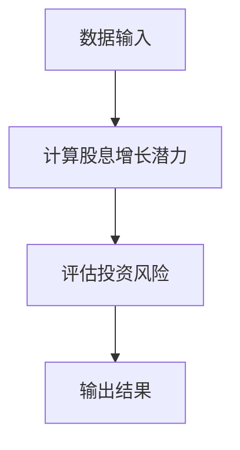
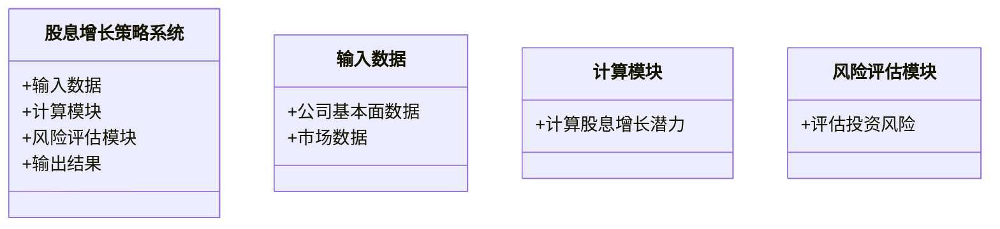
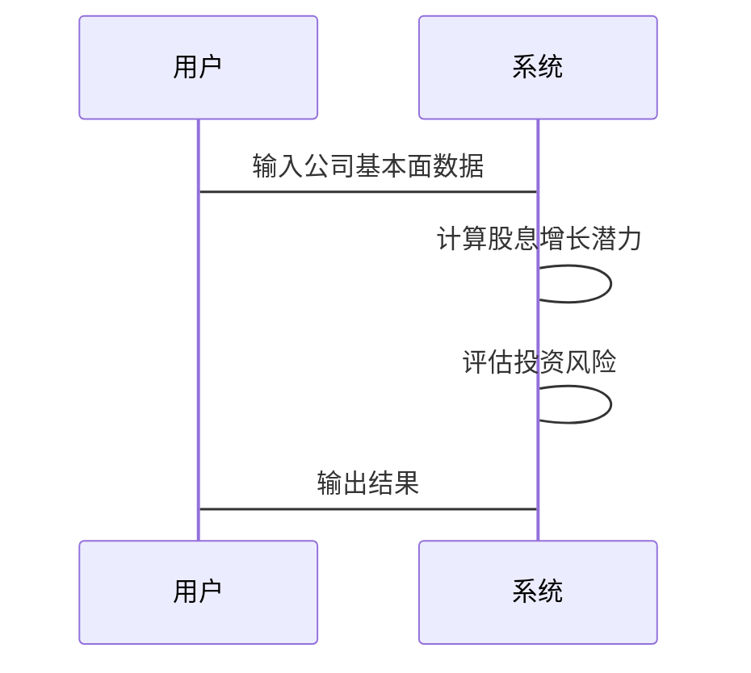

                 


# 巴菲特的股息增长策略：量子金融衍生品的收益来源

> 关键词：巴菲特，股息增长策略，量子金融，金融衍生品，收益来源，投资策略，风险管理

> 摘要：本文将深入探讨巴菲特的股息增长策略在量子金融衍生品中的应用，分析其收益来源、风险控制机制以及与传统金融策略的差异。通过结合金融理论与实际案例，揭示股息增长策略在量子金融环境下的独特优势，并从技术角度分析其数学模型和系统实现。

---

# 目录大纲结构：

1. 第1章: 股息增长策略的背景与基础
   - 1.1 股息增长策略的定义与特点
   - 1.2 巴菲特的股息投资理念
   - 1.3 股息增长策略的适用场景

2. 第2章: 量子金融衍生品的基本概念
   - 2.1 量子金融的定义与特点
   - 2.2 金融衍生品的基本类型
   - 2.3 量子金融衍生品的创新与应用

3. 第3章: 巴菲特股息增长策略与量子金融的结合
   - 3.1 股息增长策略在量子金融中的应用
   - 3.2 量子金融衍生品的收益来源
   - 3.3 巴菲特股息增长策略在量子金融中的实现

4. 第4章: 股息增长策略的数学模型与算法分析
   - 4.1 股息增长模型的数学公式
   - 4.2 股息增长策略的算法实现
   - 4.3 股息增长策略的风险评估

5. 第5章: 系统分析与架构设计
   - 5.1 系统功能设计
   - 5.2 系统架构图
   - 5.3 系统接口设计
   - 5.4 系统交互流程

6. 第6章: 项目实战：构建基于股息增长策略的量子金融系统
   - 6.1 环境配置与数据准备
   - 6.2 系统核心代码实现
   - 6.3 案例分析与效果展示

7. 第7章: 总结与展望
   - 7.1 研究总结
   - 7.2 未来研究方向

---

# 第1章: 股息增长策略的背景与基础

## 1.1 股息增长策略的定义与特点

股息增长策略是一种长期投资策略，强调通过投资那些能够持续增长股息的公司来实现资产增值。与只关注股息收益率的传统策略不同，股息增长策略更注重股息的长期增长潜力。其核心在于选择那些具备稳定盈利能力和持续分红能力的公司。

### 1.1.1 股息增长策略的定义
股息增长策略是指投资者通过投资那些股息收益率较低但股息增长潜力较高的公司，逐步积累股息收入并实现资产增值的投资策略。

### 1.1.2 股息增长策略的核心特点
- **持续增长性**：股息增长策略的核心在于公司股息的持续增长能力，而非仅仅依赖当前的股息收益率。
- **长期性**：该策略通常需要较长时间才能显现效果，适合长期投资者。
- **稳定性**：选择具备稳定盈利能力和良好财务状况的公司，以确保股息的持续增长。

### 1.1.3 股息增长策略与股息收益率的区别
- 股息增长策略关注的是股息的增长潜力，而股息收益率关注的是当前的股息收入。
- 股息增长策略更注重公司的基本面和长期盈利能力，而股息收益率更关注短期股息收入。

## 1.2 巴菲特的股息投资理念

### 1.2.1 巴菲特的投资哲学
巴菲特的投资哲学以“价值投资”为核心，强调投资于具备持续盈利能力的优秀企业，并长期持有。

### 1.2.2 巴菲特对股息投资的重视
巴菲特认为，股息是企业盈利能力的体现，持续增长的股息意味着企业具备稳定的盈利能力。因此，他倾向于投资那些能够持续增长股息的公司。

### 1.2.3 巴菲特股息投资的成功案例
以巴菲特投资可口可乐为例，可口可乐长期保持稳定的股息增长，且公司具备强大的市场地位和盈利能力，是巴菲特股息增长策略的经典案例。

## 1.3 股息增长策略的适用场景

### 1.3.1 长期投资与股息增长策略
股息增长策略适合长期投资者，尤其是那些希望资产稳定增长的投资者。

### 1.3.2 股息增长策略在不同市场环境下的表现
- 在牛市中，股息增长策略能够带来资本增值和股息收入的双重收益。
- 在熊市中，股息增长策略能够通过股息收入提供一定的下行保护。

### 1.3.3 股息增长策略的优缺点分析
- **优点**：股息增长策略能够实现资产的长期稳定增长，且具备较高的风险分散能力。
- **缺点**：股息增长策略需要较长的时间周期，且对公司的基本面要求较高。

---

# 第2章: 量子金融衍生品的基本概念

## 2.1 量子金融的定义与特点

### 2.1.1 量子金融的定义
量子金融是利用量子计算技术在金融领域的应用，包括金融建模、风险管理、投资决策等领域。

### 2.1.2 量子金融的核心特点
- **计算能力**：量子计算机能够处理复杂的金融模型，提高计算效率。
- **风险管理**：量子金融能够更精确地评估金融风险。
- **投资决策**：量子金融通过量子算法优化投资组合。

## 2.2 金融衍生品的基本类型

### 2.2.1 期权
期权是一种金融衍生品，赋予持有者在特定时间内以特定价格买入或卖出标的资产的权利。

### 2.2.2 期货
期货是一种标准化的合约，约定在未来特定时间以特定价格买入或卖出标的资产。

### 2.2.3 股票指数期货
股票指数期货是以股票指数为标的的期货合约，用于对冲股票市场的系统性风险。

### 2.2.4 互换
互换是一种金融衍生品，约定在未来特定时间内以特定价格交换标的资产或现金流。

## 2.3 量子金融衍生品的创新与应用

### 2.3.1 量子计算在金融衍生品中的应用
量子计算能够提高金融衍生品的定价和风险管理能力。

### 2.3.2 量子金融衍生品的创新类型
- 量子期权：基于量子计算的期权定价模型。
- 量子期货：利用量子计算优化的期货合约。

### 2.3.3 量子金融衍生品的风险与收益
- **收益**：量子金融衍生品能够通过量子算法优化投资组合，提高收益。
- **风险**：量子金融衍生品的风险主要来自于量子计算的复杂性和市场的不确定性。

---

# 第3章: 巴菲特股息增长策略与量子金融的结合

## 3.1 股息增长策略在量子金融中的应用

### 3.1.1 股息增长策略与量子金融的关系
股息增长策略通过选择具备稳定股息增长能力的公司，与量子金融的高计算能力和风险管理能力相结合，能够提高投资收益。

### 3.1.2 股息增长策略在量子金融中的具体应用
- 利用量子计算筛选具备稳定股息增长能力的公司。
- 通过量子金融模型优化股息增长策略的投资组合。

### 3.1.3 股息增长策略在量子金融中的优势
- 提高投资组合的收益。
- 降低投资风险。

## 3.2 量子金融衍生品的收益来源

### 3.2.1 股息收益
股息收益是股息增长策略的核心来源之一。

### 3.2.2 股价波动收益
股价波动收益是通过持有股票获得的资本增值。

### 3.2.3 金融衍生品的杠杆效应
通过金融衍生品的杠杆效应，能够放大投资收益。

## 3.3 巴菲特股息增长策略在量子金融中的实现

### 3.3.1 股息增长策略的具体实施步骤
- 筛选具备稳定股息增长能力的公司。
- 利用量子计算优化投资组合。

### 3.3.2 量子金融衍生品的收益结构分析
- 股息收益与股价波动收益相结合。
- 通过金融衍生品放大收益。

### 3.3.3 股息增长策略在量子金融中的风险控制
- 利用量子金融模型进行风险评估。
- 通过分散投资降低风险。

---

# 第4章: 股息增长策略的数学模型与算法分析

## 4.1 股息增长模型的数学公式

### 4.1.1 股息增长模型的公式
$$ D_{n} = D_{0} \times (1 + g)^n $$
其中，\( D_{n} \) 表示第n年的股息，\( D_{0} \) 表示初始股息，\( g \) 表示股息增长率。

### 4.1.2 股息增长模型的假设条件
- 股息增长率 \( g \) 是恒定的。
- 投资的无风险利率 \( r \) 是恒定的。

### 4.1.3 股息增长模型的适用性
股息增长模型适用于股息稳定增长的公司。

## 4.2 股息增长策略的算法实现

### 4.2.1 算法流程图
```mermaid
graph TD
    A[开始] --> B[输入参数：初始股息D0，增长率g，时间n]
    B --> C[计算Dn = D0*(1+g)^n]
    C --> D[结束]
```

### 4.2.2 Python代码实现
```python
def calculate_dividend_growth(D0, g, n):
    Dn = D0 * (1 + g) ** n
    return Dn

# 示例
D0 = 100  # 初始股息
g = 0.05  # 股息增长率
n = 10    # 时间（年）
Dn = calculate_dividend_growth(D0, g, n)
print(f"第{n}年的股息为：{Dn}")
```

## 4.3 股息增长策略的风险评估

### 4.3.1 风险评估的数学公式
$$ R = \sqrt{ \sum_{i=1}^{n} (D_i - \bar{D})^2 } $$
其中，\( R \) 表示风险，\( D_i \) 表示第i年的股息，\( \bar{D} \) 表示股息的平均值。

### 4.3.2 风险评估的算法实现
```python
def calculate_risk(dividends):
    n = len(dividends)
    average = sum(dividends) / n
    risk = (sum((d - average)**2 for d in dividends) ** 0.5) / n
    return risk

# 示例
dividends = [100, 105, 110, 115, 120]
risk = calculate_risk(dividends)
print(f"风险值为：{risk}")
```

---

# 第5章: 系统分析与架构设计

## 5.1 系统功能设计

### 5.1.1 系统功能模块
- 数据输入模块：输入公司基本面数据。
- 计算模块：计算股息增长潜力。
- 风险评估模块：评估投资风险。

### 5.1.2 功能流程图


## 5.2 系统架构图

### 5.2.1 系统架构


## 5.3 系统接口设计

### 5.3.1 系统接口
- 输入接口：接收公司基本面数据。
- 输出接口：输出股息增长潜力和投资风险。

## 5.4 系统交互流程

### 5.4.1 系统交互流程图


---

# 第6章: 项目实战：构建基于股息增长策略的量子金融系统

## 6.1 环境配置与数据准备

### 6.1.1 环境配置
- 安装Python
- 安装必要的库（如numpy、pandas）

### 6.1.2 数据准备
- 获取公司基本面数据
- 获取市场数据

## 6.2 系统核心代码实现

### 6.2.1 核心代码
```python
import numpy as np
import pandas as pd

def calculate_dividend_growth(D0, g, n):
    return D0 * (1 + g) ** n

def calculate_risk(dividends):
    return np.std(dividends)

# 示例
D0 = 100
g = 0.05
n = 10
dividends = [calculate_dividend_growth(D0, g, i) for i in range(n)]
risk = calculate_risk(dividends)
print(f"股息增长潜力：{dividends}")
print(f"风险值：{risk}")
```

## 6.3 案例分析与效果展示

### 6.3.1 案例分析
以可口可乐为例，分析其股息增长潜力和投资风险。

### 6.3.2 效果展示
通过数据可视化展示股息增长潜力和风险评估结果。

---

# 第7章: 总结与展望

## 7.1 研究总结

### 7.1.1 核心发现
- 股息增长策略与量子金融的结合能够提高投资收益。
- 量子计算在股息增长策略中的应用前景广阔。

### 7.1.2 研究意义
本文为股息增长策略在量子金融中的应用提供了理论和实践依据。

## 7.2 未来研究方向

### 7.2.1 量子计算在股息增长策略中的进一步应用
- 探索更多量子算法在股息增长策略中的应用。

### 7.2.2 股息增长策略的优化与创新
- 开发新的股息增长策略模型。
- 探索股息增长策略与其他金融策略的结合。

---

# 作者：AI天才研究院/AI Genius Institute & 禅与计算机程序设计艺术 /Zen And The Art of Computer Programming

---

以上是完整的内容框架和思考过程，希望对您有所帮助！

