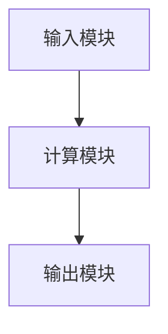

                 


# 巴菲特的股息增长策略：零利率时代的收益来源

> 关键词：巴菲特，股息增长策略，零利率时代，投资收益，股息再投资，复利效应

> 摘要：本文深入分析了巴菲特的股息增长策略在零利率时代的应用，探讨了股息增长策略的核心原理、数学模型、系统架构以及实际投资案例。通过详细的分析和实例，展示了如何在低利率环境下利用股息增长策略实现稳健的收益。

---

## 第一部分：背景介绍

### 第1章：巴菲特投资理念与股息增长策略

#### 1.1 巴菲特的生平与投资哲学

巴菲特，被誉为“股神”，是全球最成功的投资者之一。他出生于1934年，早年通过投资俱乐部和合伙企业积累了丰富的投资经验。巴菲特的投资哲学以价值投资为核心，强调长期持有优质资产，追求安全边际和稳定的收益。

**关键点：**
- 巴菲特的价值投资理念强调选择优质的公司，而不是短期市场波动。
- 他注重企业的基本面分析，包括盈利能力、财务健康状况和行业地位。

#### 1.2 股息增长策略的背景与重要性

在零利率时代，传统的固定收益投资（如债券）收益率极低，投资者需要寻找新的收益来源。股息增长策略作为一种长期投资策略，能够在低利率环境下提供稳定的现金流和资本增值。

**关键点：**
- 股息增长策略的核心是选择那些能够持续增长股息的公司。
- 这种策略在零利率时代尤其重要，因为传统的债券收益率无法满足投资者的需求。

#### 1.3 股息增长策略的适用场景

股息增长策略适用于那些追求长期稳定收益的投资者。特别是以下场景：
1. 长期持有的优质股票。
2. 股息收益率较高且能够持续增长的公司。
3. 需要通过股息再投资实现复利效应的投资者。

---

## 第二部分：核心概念与联系

### 第2章：股息增长策略的核心概念

#### 2.1 股息再投资的原理

股息再投资是指将获得的股息用于购买更多的股票，从而实现资本的复利增长。这种策略能够最大化投资收益，尤其是在股息增长的情况下。

**数学公式：**
$$ P = \frac{D_1}{r - g} $$
其中，$P$ 为股票价值，$D_1$ 为第一期股息，$r$ 为折现率，$g$ 为股息增长率。

#### 2.2 股息增长模型的数学分析

股息增长模型是股息增长策略的核心工具。它通过数学公式预测股票的内在价值，帮助投资者判断是否值得投资。

**公式推导：**
$$ V = \frac{D_0}{(r - g)} $$
其中，$V$ 为股票价值，$D_0$ 为初始股息，$r$ 为折现率，$g$ 为股息增长率。

#### 2.3 股息收益率与股息增长比率

股息收益率是股息与股票价格的比率，而股息增长比率是股息增长率与当前股息的比率。两者结合可以更好地评估股息增长的潜力。

**对比表格：**

| 指标       | 定义                                   | 重要性                 |
|------------|--------------------------------------|------------------------|
| 股息收益率 | 股息/股价                             | 短期收益的衡量标准     |
| 股息增长比率 | 股息增长率/当前股息                   | 长期增长的衡量标准     |

---

## 第三部分：算法原理讲解

### 第3章：股息增长模型的数学推导

#### 3.1 股息增长模型的公式推导

股息增长模型基于永续增长假设，假设股息将永远以固定速度增长。其公式为：
$$ V = \frac{D_1}{r - g} $$

**示例：**
假设某股票当前股息为$1，股息增长率$g=5\%$，折现率$r=10\%$，则股票价值为：
$$ V = \frac{1.05}{0.10 - 0.05} = 21 $$

#### 3.2 股息增长模型的假设条件

1. 股息将永远以固定速度增长。
2. 投资者要求的回报率恒定。
3. 没有交易成本和其他费用。

#### 3.3 股息增长模型的优缺点分析

**优点：**
- 简单易懂，适用于长期投资。
- 能够预测股票的内在价值。

**缺点：**
- 假设条件过于理想化，实际市场波动较大。
- 忽略了宏观经济环境的影响。

---

## 第四部分：系统分析与架构设计方案

### 第4章：股息增长策略的系统分析

#### 4.1 系统分析与架构设计

股息增长策略的系统架构包括以下几个部分：
1. **输入模块**：接收股票的基本信息（股息、股价、增长率）。
2. **计算模块**：根据股息增长模型计算股票价值。
3. **输出模块**：显示计算结果和投资建议。

**架构图：**


#### 4.2 系统功能设计

1. **数据输入**：用户输入股票的基本信息。
2. **计算股票价值**：根据股息增长模型计算股票价值。
3. **生成投资建议**：基于计算结果给出投资建议。

---

## 第五部分：项目实战

### 第5章：股息增长策略的实际应用

#### 5.1 环境安装

需要安装Python和相关库（如numpy、pandas）。

#### 5.2 核心代码实现

```python
import numpy as np

def calculate_stock_value(dividend, growth_rate, discount_rate):
    return dividend * (1 + growth_rate) / (discount_rate - growth_rate)

# 示例
dividend = 1
growth_rate = 0.05
discount_rate = 0.10
value = calculate_stock_value(dividend, growth_rate, discount_rate)
print("股票价值为：", value)
```

#### 5.3 实际案例分析

以苹果公司为例，假设当前股息为$3，股息增长率为5%，折现率为10%。则股票价值为：
$$ V = \frac{3.15}{0.10 - 0.05} = 63 $$

---

## 第六部分：总结与展望

### 6.1 总结

巴菲特的股息增长策略在零利率时代具有重要意义。通过选择股息收益率高且能够持续增长的公司，投资者可以在低利率环境下实现稳健的收益。

### 6.2 注意事项

1. 股息增长模型的假设条件可能与实际情况不符。
2. 需要关注宏观经济环境和公司基本面的变化。

### 6.3 拓展阅读

1. 巴菲特的《 Intelligent Investor》。
2. 股息增长模型的相关文献。

---

作者：AI天才研究院/AI Genius Institute & 禅与计算机程序设计艺术 /Zen And The Art of Computer Programming

