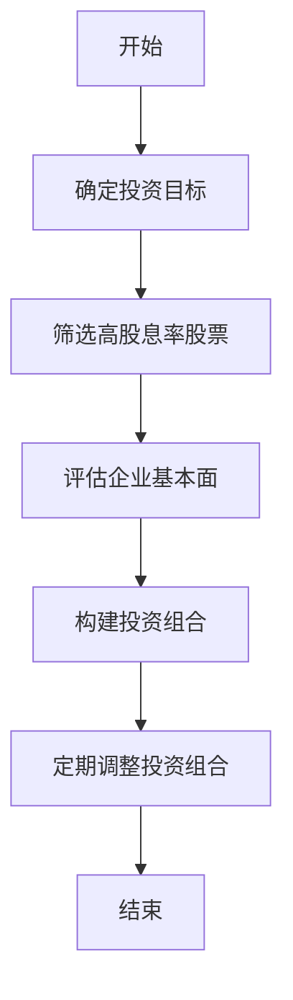

                 

# 巴菲特的股息投资策略：稳定现金流的重要性

---

## 关键词：巴菲特、股息投资、现金流、稳定收益、价值投资、股息率、投资策略

---

## 摘要：巴菲特作为全球最著名的投资者之一，其股息投资策略以追求稳定现金流为核心。本文详细分析了股息投资的背景、核心概念、策略实施、风险管理以及实际案例，揭示了稳定现金流在投资组合中的重要性，帮助投资者理解如何通过股息投资实现长期稳健的收益。

---

# 第一部分：背景介绍

## 第1章：巴菲特的投资理念

### 1.1 巴菲特的生平与投资哲学

- 巴菲特的早年经历：从童年开始对投资的兴趣，到哈佛大学的优异成绩。
- 价值投资的核心理念：买入并持有优质资产，长期关注企业的内在价值。
- 对市场的长期看法：市场短期是投票器，长期是称重机。

### 1.2 股息投资的重要性

- 股息的基本概念：股息是企业分配给股东的利润部分。
- 股息在投资组合中的作用：提供稳定的现金流，降低整体投资组合的波动性。
- 巴菲特对股息投资的重视：股息是企业盈利能力的体现，也是抵御市场风险的重要手段。

---

# 第二部分：核心概念与联系

## 第2章：现金流的核心意义

### 2.1 现金流的定义与分类

- 现金流的定义：企业在一定时期内现金和现金等价物的流入和流出。
- 现金流的分类：经营活动现金流、投资活动现金流、筹资活动现金流。

### 2.2 现金流对企业价值的影响

- 自由现金流的概念：企业在扣除所有成本和投资后的剩余现金流。
- 自由现金流的计算公式：
  $$ \text{自由现金流} = \text{营业收入} - \text{营业成本} - \text{税金及附加} - \text{折旧} - \text{摊销} $$
- 自由现金流在企业估值中的应用：自由现金流贴现模型（DCF模型）。

### 2.3 现金流对投资组合稳定性的作用

- 稳定现金流的来源：优质企业的股息收入和本金复利增长。
- 现金流波动对企业价值的影响：稳定的现金流意味着企业具有更强的抗风险能力。

---

## 第3章：股息与现金流的关系

### 3.1 股息率的合理区间

- 股息率的定义：股息收益率 = 每股股息 / 每股股价 × 100%。
- 合理股息率的判断标准：股息率过低可能意味着企业盈利不足，过高可能意味着股价被高估。

### 3.2 股息与企业盈利能力的关系

- 股息是企业盈利能力的直接体现，高股息率通常意味着企业具有较强的盈利能力和稳定的现金流。

### 3.3 现金流与股息支付能力的关系

- 现金流充足的企业能够持续支付股息，而现金流不足的企业可能难以维持股息支付。

---

# 第三部分：股息投资策略分析

## 第4章：巴菲特的股息投资策略

### 4.1 选股标准

- 企业基本面分析：关注企业的盈利能力、财务健康状况和竞争优势。
- 股息率的合理区间：巴菲特通常选择股息率适中、股息增长稳定的公司。
- 企业的持续盈利能力：关注企业的ROE（净资产收益率）和ROA（资产回报率）。

### 4.2 投资组合管理

- 投资组合的构建原则：分散投资，降低风险。
- 股息再投资的策略：将股息用于再投资，实现复利增长。
- 投资组合的定期调整：根据市场变化和企业状况进行动态调整。

---

## 第5章：风险与应对策略

### 5.1 股息投资的主要风险

- 利率变化的影响：利率上升可能导致股息收益率下降。
- 企业盈利下降的风险：企业盈利能力下降可能导致股息减少或暂停支付。
- 市场波动的冲击：股市波动可能影响股息投资的短期收益。

### 5.2 应对风险的策略

- 选择具有防御性的企业：投资于具有稳定现金流和持续盈利能力的企业。
- 分散投资：通过投资多个行业和公司的股票降低风险。
- 长期持有与价值投资：长期持有优质股票，避免短期波动的影响。

---

# 第四部分：实际案例分析

## 第6章：巴菲特的经典投资案例

### 6.1 可口可乐的投资历程

- 投资背景：可口可乐的稳定现金流和持续增长的盈利能力。
- 投资策略：长期持有，定期再投资。
- 案例分析：可口可乐的股息增长和股价上涨带来的丰厚回报。

### 6.2 富国银行的投资策略

- 投资背景：富国银行的高股息率和强大的盈利能力。
- 投资策略：关注银行的净息差和资产质量。
- 案例分析：富国银行在经济危机中的表现和股息支付能力。

---

## 第7章：系统化股息投资策略

### 7.1 投资系统的构建

- 投资目标的设定：明确投资目标、风险承受能力和投资期限。
- 投资策略的制定：制定股息投资的具体策略和操作流程。
- 投资组合的优化：根据市场变化和企业状况进行动态优化。

### 7.2 系统化投资的数学模型

- 股息收益率计算公式：
  $$ \text{股息收益率} = \frac{\text{每股股息}}{\text{股价}} \times 100\% $$
- 股息增长率模型：
  $$ \text{股息增长率} = \frac{\text{当前股息} - \text{上期股息}}{\text{上期股息}} \times 100\% $$

### 7.3 系统化投资的流程图

---

# 第五部分：项目实战

## 第8章：股息投资组合的模拟

### 8.1 投资组合的构建

- 选择具有稳定股息支付能力和良好成长性的企业。
- 模拟投资组合：例如，投资于可口可乐、富国银行和麦当劳等企业。

### 8.2 投资组合的表现分析

- 股票价格的波动分析。
- 股息收入的累计情况。
- 投资组合的总体收益和风险分析。

---

## 第9章：总结与展望

### 9.1 总结

- 巴菲特的股息投资策略的核心是追求稳定现金流和长期价值增长。
- 通过选择优质企业进行长期投资，能够实现稳健的收益。

### 9.2 展望

- 股息投资在当前市场环境中的应用前景。
- 技术分析与基本面分析的结合：利用技术指标辅助股息投资策略的优化。

---

## 作者：AI天才研究院/AI Genius Institute & 禅与计算机程序设计艺术 /Zen And The Art of Computer Programming

