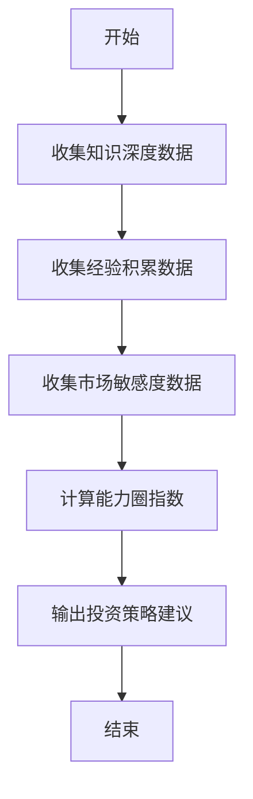
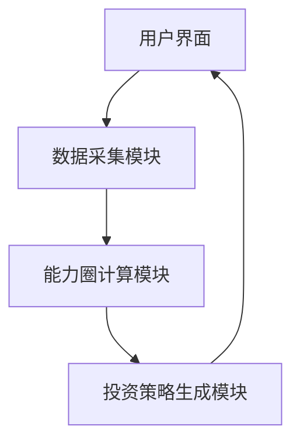

                 


# 巴菲特的能力圈理论：了解自己的优势和局限

> 关键词：巴菲特，能力圈理论，投资决策，风险管理，价值投资

> 摘要：巴菲特的能力圈理论是价值投资的重要基石，它强调投资者必须了解自己的知识边界和能力范围，从而做出明智的投资决策。本文从理论背景、核心概念、算法实现、系统设计、项目实战等多方面详细阐述能力圈理论，并提供实际应用的最佳实践和注意事项。

---

## 第1章: 背景介绍

### 1.1 巴菲特的投资哲学

#### 1.1.1 价值投资的起源

价值投资是一种投资策略，起源于20世纪初，由本杰明·格雷厄姆和戴维·多德提出。他们认为市场上的股票价格通常会偏离其内在价值，投资者应以低于其内在价值的价格购买股票，并长期持有，直到市场认识到其真实价值。

#### 1.1.2 巴菲特的投资理念

巴菲特是价值投资的忠实追随者，他强调以下几点：

1. **安全边际**：购买价格低于内在价值的股票，以确保投资的安全性。
2. **长期思维**：关注公司的长期价值，而非短期市场波动。
3. **集中投资**：将资金集中在少数具有强大竞争优势的公司上。

#### 1.1.3 能力圈理论的提出

能力圈理论由巴菲特提出，强调投资者应专注于自己熟悉的企业和行业，避免涉足自己不熟悉的领域。这一理论帮助投资者在市场中做出更明智的决策，降低投资风险。

---

### 1.2 能力圈理论的核心思想

#### 1.2.1 能力圈的定义与特征

能力圈（Circle of Competence）是指投资者在知识、经验和资源等方面具备优势的领域。以下是能力圈的几个关键特征：

- **知识深度**：对行业、公司和商业模式有深入的理解。
- **经验积累**：通过长期投资实践积累的经验。
- **可量化性**：能够通过数据和指标评估公司的内在价值。

#### 1.2.2 能力圈的边界与外延

能力圈的边界是指投资者在知识和经验上的极限。超出这个边界的投资行为可能会带来不可控的风险。能力圈的外延则包括那些与核心能力相关的领域，投资者可以逐步扩展自己的能力范围。

#### 1.2.3 能力圈与投资决策的关系

能力圈理论的核心在于，投资者应该只在自己熟悉的能力圈内进行投资。这不仅降低了投资风险，还能提高投资决策的准确性。

---

## 第2章: 能力圈的核心要素

### 2.1 知识储备

#### 2.1.1 专业知识

投资者需要具备与投资领域相关的专业知识，包括财务分析、行业分析、公司估值等。

#### 2.1.2 行业经验

了解目标行业的市场动态、竞争格局和商业模式是能力圈的重要组成部分。

#### 2.1.3 市场理解

对市场的整体走势和周期性变化有深刻理解，能够帮助投资者做出更明智的决策。

### 2.2 经验积累

#### 2.2.1 投资经验

通过实际投资实践，积累经验，识别潜在风险和机会。

#### 2.2.2 复盘分析

定期回顾投资决策，分析成功和失败的原因，不断优化投资策略。

### 2.3 投资心态

#### 2.3.1 耐心与纪律

耐心等待市场机会，严格遵守投资纪律，避免冲动交易。

#### 2.3.2 理性与情绪控制

保持理性，避免因市场波动而做出情绪化决策。

#### 2.3.3 风险意识

具备风险意识，能够在不确定的市场环境中做出合理决策。

---

## 第3章: 能力圈理论的数学模型与算法

### 3.1 能力圈评估的数学模型

#### 3.1.1 能力圈的量化指标

能力圈可以通过以下几个量化指标来评估：

- **知识深度**：对行业和公司的了解程度（0-10分）。
- **经验积累**：过往投资经验的数量和质量。
- **市场敏感度**：对市场变化的敏感性和适应能力。

#### 3.1.2 能力圈的评估公式

能力圈的综合评估公式如下：

$$
\text{能力圈指数} = \frac{\text{知识深度} + \text{经验积累} + \text{市场敏感度}}{3}
$$

#### 3.1.3 动态调整模型

能力圈是一个动态调整的过程，随着市场变化和投资经验的积累，需要不断更新和优化。

---

### 3.2 算法实现

#### 3.2.1 算法原理

能力圈评估算法通过收集和分析投资者的知识、经验和市场敏感度数据，计算能力圈指数，并根据指数结果推荐适合的投资策略。

#### 3.2.2 算法流程图



#### 3.2.3 Python代码实现

```python
def calculate_competence_circle_index(knowledge_depth, experience, market_sensitivity):
    return (knowledge_depth + experience + market_sensitivity) / 3

# 示例数据
knowledge_depth = 8
experience = 7
market_sensitivity = 6

index = calculate_competence_circle_index(knowledge_depth, experience, market_sensitivity)
print(f"能力圈指数为：{index}")
```

---

## 第4章: 系统分析与架构设计

### 4.1 系统功能设计

#### 4.1.1 功能模块

- **数据采集模块**：收集知识深度、经验积累和市场敏感度数据。
- **评估模块**：计算能力圈指数。
- **决策支持模块**：根据能力圈指数推荐投资策略。

#### 4.1.2 功能流程图

```mermaid
graph TD
    A[数据采集] --> B[知识深度]
    A --> C[经验积累]
    A --> D[市场敏感度]
    B, C, D --> E[能力圈指数计算]
    E --> F[投资策略建议]
```

### 4.2 系统架构设计

#### 4.2.1 系统架构图



---

## 第5章: 项目实战

### 5.1 项目环境与工具安装

#### 5.1.1 开发环境配置

- 操作系统：Windows 10或macOS
- Python版本：3.8以上
- 开发工具：PyCharm或VS Code

#### 5.1.2 工具安装与配置

安装必要的库：

```bash
pip install pandas numpy matplotlib
```

#### 5.1.3 数据源获取与处理

从可靠的数据源获取行业和公司数据，清洗数据并进行初步分析。

### 5.2 核心功能实现

#### 5.2.1 能力圈评估模块实现

```python
def calculate_competence_circle_index(knowledge_depth, experience, market_sensitivity):
    return (knowledge_depth + experience + market_sensitivity) / 3

# 示例数据
knowledge_depth = 8
experience = 7
market_sensitivity = 6

index = calculate_competence_circle_index(knowledge_depth, experience, market_sensitivity)
print(f"能力圈指数为：{index}")
```

#### 5.2.2 投资策略生成模块实现

根据能力圈指数生成相应的投资策略，例如：

- 如果指数高于7，建议集中投资。
- 如果指数在5-7之间，建议分散投资。
- 如果指数低于5，建议避免投资。

### 5.3 案例分析

假设一位投资者对科技行业有深厚的知识（知识深度=9），有10年的投资经验（经验积累=8），并且对市场变化敏感（市场敏感度=7）。计算能力圈指数：

$$
\text{能力圈指数} = \frac{9 + 8 + 7}{3} = 8
$$

由于指数高于7，建议该投资者集中投资于科技行业内的优质公司。

---

## 第6章: 最佳实践与小结

### 6.1 最佳实践

#### 6.1.1 知识储备

持续学习和更新知识，扩大能力圈的广度和深度。

#### 6.1.2 经验总结

定期复盘投资决策，分析成功和失败的原因，不断优化投资策略。

#### 6.1.3 心态调整

保持耐心和纪律，避免情绪化决策，理性面对市场波动。

### 6.2 注意事项

#### 6.2.1 避免过度自信

不要因为一时的成功而过度自信，忽视市场风险。

#### 6.2.2 避免盲目跟风

坚持自己的投资策略，避免盲目跟随市场潮流。

#### 6.2.3 避免忽略市场变化

定期评估市场环境的变化，及时调整投资策略。

---

## 作者：AI天才研究院 & 禅与计算机程序设计艺术

---

通过以上步骤，我们可以系统地理解巴菲特的能力圈理论，并将其应用于实际投资决策中。希望这篇文章能为您提供有价值的见解和实践指导。

