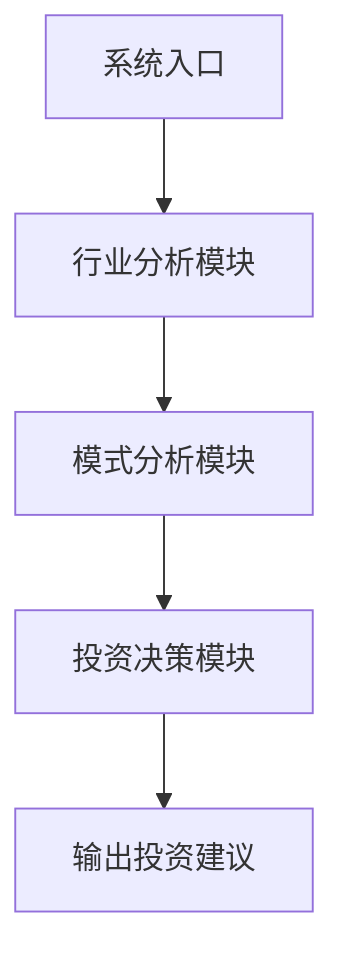
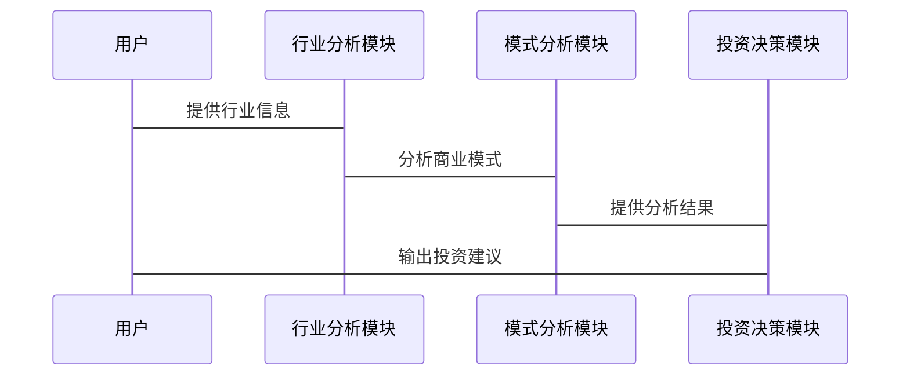

                 


# 巴菲特的行业分析方法：了解商业模式的重要性

---

## 关键词
巴菲特，价值投资，行业分析，商业模式，投资策略，ROE，PE，系统架构，项目实战

---

## 摘要
本文深入探讨了巴菲特的行业分析方法及其对商业模式的理解。通过分析巴菲特的投资理念、行业分析框架、商业模式的重要性，结合系统分析和项目实战，帮助读者掌握如何通过商业模式评估企业价值，并在投资决策中应用这些方法。文章还提供了详细的数学公式、Mermaid图和Python代码示例，以增强对巴菲特行业分析方法的理解和应用能力。

---

## 正文

---

### 第1章 巴菲特投资理念的核心思想

#### 1.1 价值投资的定义与核心原则

##### 1.1.1 价值投资的起源与发展
价值投资是一种以基本面分析为基础的投资策略，起源于20世纪初。它强调通过分析企业的财务状况、行业地位和盈利能力，寻找市场价格低于其内在价值的企业进行投资。巴菲特是价值投资的代表人物之一，他通过长期持有优质股票，实现财富的稳步增长。

##### 1.1.2 价值投资的核心理念
价值投资的核心理念是“买入低于内在价值的股票”。巴菲特认为，市场的短期波动可能会影响股价，但长期来看，股价会回归其内在价值。因此，投资者应关注企业的基本面，寻找那些具有持续盈利能力、竞争优势和良好财务状况的企业。

##### 1.1.3 巴菲特的选股标准
巴菲特的选股标准包括以下几点：
1. **高ROE（净资产收益率）**：ROE是衡量企业盈利能力的重要指标，高ROE表明企业能够高效利用股东资产创造利润。
2. **低市盈率（P/E）**：低市盈率意味着股价相对于企业盈利水平较低，具有较高的安全边际。
3. **竞争优势明显**：企业应具备强大的竞争优势，如品牌、技术、成本优势等，以确保其长期盈利能力。

#### 1.2 巴菲特的安全边际概念

##### 1.2.1 安全边际的定义与计算方法
安全边际是指市场价格与内在价值之间的差距。计算公式为：
$$ \text{安全边际} = \text{内在价值} - \text{市场价格} $$

##### 1.2.2 安全边际在投资决策中的作用
安全边际为投资者提供了风险缓冲，即使市场波动或企业盈利出现短期下滑，投资者也能避免重大损失。巴菲特建议投资者在买入股票时，留出至少50%的安全边际。

#### 1.3 巴菲特的选股公式
巴菲特的选股公式综合考虑了ROE、P/E和P/B（市净率）等指标。公式如下：
$$ \text{选股评分} = \text{ROE} \times \text{P/E} \times \text{P/B} $$

---

### 第2章 巴菲特的行业分析框架

#### 2.1 行业分析的核心要素

##### 2.1.1 行业生命周期
行业生命周期分为导入期、成长期、成熟期和衰退期。巴菲特倾向于投资处于成熟期的行业，因为这些行业的增长稳定，风险较低。

##### 2.1.2 行业竞争结构
使用波特五力模型分析行业竞争结构：
1. 新进入者的威胁
2. 替代品的威胁
3. 买方的议价能力
4. 供应方的议价能力
5. 行业内的竞争程度

##### 2.1.3 行业增长潜力
行业增长潜力可以通过市场容量和增长率来评估。巴菲特倾向于投资那些市场容量大、增长稳定的行业。

#### 2.2 巴菲特的行业评估标准

##### 2.2.1 行业门槛
行业门槛高意味着进入壁垒高，竞争较少。例如，垄断行业或需要大量资本投入的行业。

##### 2.2.2 行业前景
行业前景可以通过长期增长趋势来评估。巴菲特倾向于投资那些具有持续增长潜力的行业。

##### 2.2.3 行业风险
行业风险包括政策风险、经济周期风险和技术风险。巴菲特倾向于选择那些风险较低的行业。

#### 2.3 巴菲特行业分析的误区与注意事项

##### 2.3.1 避免过度乐观或悲观
投资者应避免对行业前景的过度乐观或悲观，保持理性和客观。

##### 2.3.2 关注行业政策
政策变化可能对行业产生重大影响，投资者应密切关注相关行业政策。

##### 2.3.3 考虑经济周期
不同行业的表现受到经济周期的影响，投资者应根据经济周期调整投资策略。

---

### 第3章 巴菲特的商业模式分析

#### 3.1 商业模式的定义与构成要素

##### 3.1.1 商业模式的定义
商业模式是企业创造和传递价值的方式，包括收入来源、成本结构和核心资源。

##### 3.1.2 商业模式的构成要素
1. 收入来源：企业如何获得收入
2. 成本结构：企业的主要成本
3. 核心资源：企业的核心竞争力

#### 3.2 巴菲特的商业模式分析方法

##### 3.2.1 商业模式的重要性
商业模式决定了企业的盈利能力和可持续发展能力。巴菲特倾向于投资那些具有强大商业模式的企业。

##### 3.2.2 如何识别好的商业模式
1. 收入稳定且可预测
2. 成本结构低且可控
3. 核心资源独特且难以复制

#### 3.3 巴菲特的商业模式评估

##### 3.3.1 企业盈利能力
盈利能力是商业模式成功的关键指标。巴菲特通过ROE、净利润率等指标评估企业盈利能力。

##### 3.3.2 企业成长性
企业成长性包括收入增长率、市场份额增长率等指标。巴菲特倾向于投资那些具有持续成长潜力的企业。

##### 3.3.3 企业竞争优势
竞争优势包括品牌优势、技术优势、成本优势等。巴菲特倾向于投资那些具有强大竞争优势的企业。

---

### 第4章 系统分析与架构设计

#### 4.1 系统分析

##### 4.1.1 问题场景介绍
本文构建一个基于巴菲特行业分析方法的系统，用于评估企业的商业模式和投资价值。

##### 4.1.2 项目介绍
项目目标是通过系统化的方法，分析企业的商业模式和投资价值，提供投资决策支持。

##### 4.1.3 系统功能设计
系统功能包括：
1. 行业分析模块：分析行业前景、竞争结构和风险。
2. 模式分析模块：评估企业的商业模式和竞争优势。
3. 投资决策模块：基于分析结果提供投资建议。

##### 4.1.4 系统架构设计
使用Mermaid图展示系统架构：



##### 4.1.5 系统接口设计
系统接口包括：
1. 输入接口：接收企业财务数据和行业信息。
2. 输出接口：输出投资建议和分析报告。

##### 4.1.6 系统交互设计
使用Mermaid图展示系统交互流程：



---

### 第5章 项目实战

#### 5.1 环境安装

##### 5.1.1 安装Python
安装Python 3.8及以上版本。

##### 5.1.2 安装依赖库
安装pandas、numpy、matplotlib等库：
```bash
pip install pandas numpy matplotlib
```

#### 5.2 核心实现

##### 5.2.1 计算ROE
编写Python代码计算ROE：
```python
import pandas as pd

def calculate_roe(net_income, equity):
    return net_income / equity

# 示例数据
net_income = 10000000  # 净利润
equity = 50000000     # 股东权益
roe = calculate_roe(net_income, equity)
print(f"ROE: {roe:.2f}%")
```

##### 5.2.2 计算PE
编写Python代码计算PE：
```python
import pandas as pd

def calculate_pe(net_income, shares_outstanding):
    return net_income / shares_outstanding

# 示例数据
net_income = 10000000  # 净利润
shares_outstanding = 1000000  # 流通股数
pe = calculate_pe(net_income, shares_outstanding)
print(f"PE: {pe:.2f}")
```

##### 5.2.3 数据可视化
使用matplotlib绘制ROE和PE的趋势图：
```python
import matplotlib.pyplot as plt

# 示例数据
roe_data = [15, 20, 25, 30, 35]
pe_data = [10, 15, 20, 25, 30]

plt.figure(figsize=(10, 6))
plt.plot(roe_data, label='ROE', linestyle='-', marker='o')
plt.plot(pe_data, label='PE', linestyle='--', marker='x')
plt.title('ROE and PE Trend')
plt.xlabel('Year')
plt.ylabel('Value')
plt.legend()
plt.show()
```

---

### 第6章 最佳实践与小结

#### 6.1 投资中的注意事项
1. **分散投资**：避免将所有资金投入单一行业或企业。
2. **长期视角**：关注企业的长期增长潜力，避免短期波动影响决策。
3. **持续学习**：保持对行业和市场的关注，及时调整投资策略。

#### 6.2 投资中的风险提示
1. **市场波动风险**：市场波动可能会影响股价，投资者需具备风险承受能力。
2. **企业风险**：企业自身经营状况可能影响投资回报，需谨慎选择企业。
3. **政策风险**：政策变化可能对行业和企业产生重大影响，需密切关注。

#### 6.3 未来的研究方向
1. **人工智能在投资中的应用**：探索如何利用AI技术辅助行业分析和投资决策。
2. **多因素模型的优化**：进一步优化多因素模型，提高投资决策的准确性。

---

## 结语
通过对巴菲特的行业分析方法的深入探讨，我们了解了如何通过商业模式评估企业价值，并在投资决策中应用这些方法。希望本文能为投资者提供有价值的参考和指导。

---

## 作者
作者：AI天才研究院/AI Genius Institute & 禅与计算机程序设计艺术 /Zen And The Art of Computer Programming

