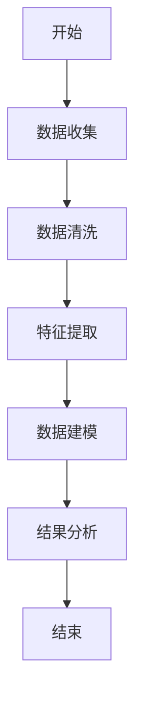
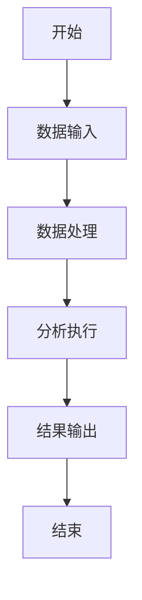

                 


```markdown
# 巴菲特的行业分析方法：应对产业边界模糊化的挑战

> 关键词：巴菲特，行业分析，产业边界，投资策略，模糊化挑战

> 摘要：本文深入探讨巴菲特的行业分析方法，结合当前产业边界模糊化的挑战，通过系统分析和实战案例，详细阐述如何运用巴菲特的方法应对复杂市场环境，实现长期投资价值。

---

## 第一部分：背景介绍

### 第1章：行业分析方法的背景与重要性

#### 1.1 投资与行业分析的基本概念
##### 1.1.1 投资的基本定义
投资是指将资金投入某个项目或资产，期望在未来获得收益或资本增值。行业分析是投资决策中的关键环节，帮助投资者评估行业前景和公司潜力。

##### 1.1.2 行业分析在投资中的作用
行业分析通过研究行业结构、竞争格局、增长潜力等因素，帮助投资者识别高增长行业和优质企业，降低投资风险，提高投资回报。

##### 1.1.3 产业边界模糊化的现状和挑战
随着技术进步和商业模式的创新，产业之间的界限逐渐模糊。例如，科技与金融的融合催生了金融科技行业，传统行业与新兴行业的界限不再清晰，这使得行业分析更具挑战性。

### 第2章：巴菲特的投资理念与方法
#### 2.1 巴菲特的投资哲学
巴菲特强调长期价值投资，注重公司基本面和管理层质量，避免短期市场波动的影响。他主张投资具有持续竞争优势和良好治理的企业。

#### 2.2 巴菲特的行业分析核心
巴菲特的行业分析注重行业前景、竞争优势和财务健康。他倾向于投资那些在稳定或增长行业中具有领先地位的企业。

#### 2.3 成功案例分析
通过分析巴菲特投资的案例，如可口可乐和苹果，探讨他如何选择行业和企业，以及这些选择背后的逻辑。

---

## 第二部分：核心概念与联系

### 第3章：核心概念与定义
#### 3.1 行业分析的基本要素
包括市场规模、增长潜力、竞争结构、技术趋势等关键因素。

#### 3.2 产业边界模糊化的定义
产业边界模糊化指不同产业之间的界限逐渐消失，新兴行业与传统行业融合，形成新的商业模式和产业结构。

#### 3.3 巴菲特分析方法的特点
注重长期价值、竞争优势和财务稳健性，强调安全边际和风险控制。

### 第4章：核心概念的联系与对比
#### 4.1 概念属性特征对比表
| 概念       | 特征1 | 特征2 | 特征3 |
|------------|-------|-------|-------|
| 传统行业   | 界限清晰 | 增长稳定 | 竞争结构固定 |
| 新兴行业   | 界限模糊 | 增长快 | 竞争结构动态 |

#### 4.2 ER实体关系图
```mermaid
er
  entity(行业) {
    name: 字符串
    size: 数值
    growth: 数值
  }
  entity(企业) {
    name: 字符串
    revenue: 数值
    profit: 数值
  }
  entity(投资决策) {
    id: 整数
    decision: 字符串
    value: 数值
  }
  relation(属于) 行业 -->> 企业
  relation(影响) 行业 -->> 投资决策
  relation(驱动) 企业 -->> 投资决策
```

---

## 第三部分：算法原理讲解

### 第5章：分析步骤与流程
#### 5.1 数据收集与处理


#### 5.2 行业筛选与评估
```python
import pandas as pd

# 示例数据
data = {
    '行业': ['科技', '金融', '医疗', '传统制造'],
    '增长率': [10, 5, 8, 3],
    'ROE': [15, 12, 10, 5]
}

df = pd.DataFrame(data)

# 筛选高增长且ROE高的行业
selected = df[(df['增长率'] > 8) & (df['ROE'] > 12)]
print(selected)
```

#### 5.3 投资决策模型
$$\text{投资价值} = \text{行业增长潜力} \times \text{企业竞争优势} \times \text{财务健康}$$

---

## 第四部分：系统分析与架构设计

### 第6章：系统功能设计
#### 6.1 数据收集模块
- 负责收集行业数据，包括市场规模、增长率、竞争格局等。

#### 6.2 行业分析模块
- 执行行业筛选和评估，应用巴菲特的分析方法。

#### 6.3 投资决策模块
- 根据分析结果生成投资建议，评估风险和收益。

### 第7章：系统架构设计
#### 7.1 模块化架构图


#### 7.2 数据流与交互图


---

## 第五部分：项目实战

### 第8章：环境配置与数据准备
#### 8.1 工具安装
- 安装Python和相关库（如pandas、numpy）。

#### 8.2 数据来源与预处理
- 数据来源：行业报告、财务报表、市场数据等。

### 第9章：核心代码实现
#### 9.1 数据分析与可视化
```python
import matplotlib.pyplot as plt

# 绘制行业增长潜力图
df.plot(kind='bar', x='行业', y='增长率')
plt.title('行业增长潜力')
plt.show()
```

#### 9.2 投资模型实现
$$\text{投资评分} = \frac{\text{增长率} \times \text{ROE}}{2}$$

#### 9.3 结果解读与优化
分析模型输出结果，优化参数以提高准确性。

---

## 第六部分：最佳实践与小结

### 第10章：实践中的注意事项
#### 10.1 数据质量的重要性
确保数据准确、完整，避免偏差。

#### 10.2 模型的适用性与局限性
模型适用于稳定行业，新兴行业需结合其他分析方法。

#### 10.3 风险管理的必要性
分散投资、定期评估，降低风险。

### 第11章：小结
巴菲特的行业分析方法结合长期价值和基本面分析，适用于产业边界模糊化的挑战。通过系统分析和实战案例，帮助投资者应对复杂市场环境。

---

## 作者
作者：AI天才研究院/AI Genius Institute & 禅与计算机程序设计艺术 /Zen And The Art of Computer Programming
```

