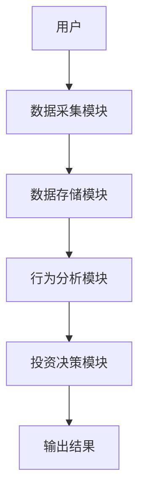

                 


# 巴菲特的行为金融学应用：元宇宙中的群体投资心理

---

## 关键词：
- 巴菲特投资理念  
- 行为金融学  
- 元宇宙  
- 群体投资心理  
- 虚拟经济  
- 群体心理  

---

## 摘要：
本文从巴菲特的投资理念出发，结合行为金融学的核心理论，深入探讨其在元宇宙中的应用。通过分析群体心理与投资决策的关系，揭示巴菲特逆向思维在虚拟经济中的实践价值。同时，本文结合数学模型和系统架构设计，提出基于行为金融学的分析系统，并通过实际案例展示其在元宇宙中的应用。文章最后总结了相关经验和未来研究方向。

---

## 第一部分：引言

### 1.1 巴菲特的价值投资理念
巴菲特的价值投资理念是基于对企业内在价值的深入分析，强调长期投资和安全边际。他的投资哲学强调理性决策、避免情绪化投资，并注重企业的基本面分析。这种理念在行为金融学中具有重要的启发意义，尤其是在理解投资者心理和市场行为方面。

#### 核心概念与联系：
- **价值投资**：关注企业的内在价值，而非市场波动。
- **安全边际**：通过购买低于内在价值的资产来降低风险。
- **长期视角**：注重企业的长期盈利能力，而非短期市场波动。

### 1.2 行为金融学的基本概念
行为金融学研究投资者心理和行为对市场决策的影响，挑战了传统金融学中的理性假设。它强调情绪、认知偏差和群体心理对投资行为的影响。

#### 核心概念与联系：
- **情绪与认知偏差**：投资者的贪婪、恐惧等情绪以及过度自信等偏差会影响决策。
- **群体心理**：投资者在群体中的行为往往表现出从众心理和羊群效应。

### 1.3 元宇宙的概念与技术基础
元宇宙是虚拟现实技术构建的虚拟空间，支持数字资产、虚拟社区和虚拟经济。其核心技术包括区块链、人工智能和虚拟现实。

#### 核心概念与联系：
- **虚拟经济**：元宇宙中的虚拟货币、NFT等数字资产构成了虚拟经济体系。
- **虚拟社区**：用户在元宇宙中形成社区，影响投资行为和资产价格。

---

## 第二部分：巴菲特投资理念的行为金融学分析

### 2.1 巴菲特投资理念的行为金融学视角
巴菲特的投资理念可以通过行为金融学的视角进行分析。他的投资策略基于对企业内在价值的理性评估，而行为金融学则帮助我们理解市场参与者的情绪和认知偏差。

#### 核心理论与模型：
- ** prospect theory**：Kahneman和Tversky提出的理论，解释了投资者在风险和收益面前的选择行为。
- **情感与决策**：巴菲特强调避免情绪化决策，这与行为金融学中减少认知偏差的目标一致。

#### 算法原理：
以下是基于prospect theory的简单模型：

$$ V = \text{max}( \text{Expected utility}, \text{Risk aversion} ) $$

---

### 2.2 群体心理与投资决策
群体心理在投资决策中起着重要作用。投资者在群体中容易受到从众心理和羊群效应的影响，导致市场波动加剧。

#### 核心概念与联系：
- **从众心理**：投资者倾向于跟随市场趋势，而非独立分析。
- **羊群效应**：大量投资者同时买卖资产，导致价格的短期剧烈波动。

#### 实际案例：
2021年比特币价格的波动就是一个典型案例，投资者的情绪波动和群体心理推动了价格的剧烈波动。

---

### 2.3 巴菲特的逆向思维与群体心理
巴菲特的逆向思维强调在市场恐慌时买入，在市场狂热时卖出。这种策略在行为金融学中与群体心理密切相关。

#### 核心概念与联系：
- **逆向思维**：在市场底部买入，在市场顶部卖出。
- **群体心理的应用**：识别市场的非理性行为，避免跟随羊群效应。

---

## 第三部分：基于行为金融学的分析系统

### 3.1 系统功能设计
- **数据采集**：收集市场数据和投资者行为数据。
- **情绪分析**：使用自然语言处理技术分析投资者情绪。
- **行为建模**：基于行为金融学模型预测市场走势。

#### 系统架构设计：


---

### 3.2 项目实战

#### 案例分析：
以虚拟货币为例，分析其价格波动与投资者情绪的关系。

#### 实现代码：
```python
import numpy as np
import matplotlib.pyplot as plt

# 模拟市场情绪数据
mood = np.random.uniform(0, 1, 100)
price = np.cumsum(np.random.normal(0, 0.1, 100))

plt.plot(mood, price)
plt.xlabel('Market Mood')
plt.ylabel('Price')
plt.title('Market Mood vs Price')
plt.show()
```

#### 分析结果：
图中展示了市场情绪与价格之间的相关性。当市场情绪高涨时，价格往往上涨，反之亦然。

---

## 第四部分：总结与展望

### 4.1 最佳实践 tips
- 理解群体心理，避免从众和羊群效应。
- 运用行为金融学模型，分析市场情绪。
- 结合技术手段，构建自动化分析系统。

### 4.2 小结
本文探讨了巴菲特的投资理念在行为金融学中的应用，尤其是在元宇宙中的群体投资心理。通过分析市场情绪和群体行为，投资者可以更好地做出理性决策。

### 4.3 注意事项
- 避免过度依赖模型，结合实际情况进行分析。
- 注意数据的准确性和模型的适用性。

### 4.4 拓展阅读
- Kahneman, D. (2011). *Thinking, Fast and Slow*.
- Lee, C. (2021). *Behavioral Finance in Virtual Economies*.

---

## 作者：
**AI天才研究院/AI Genius Institute**  
**禅与计算机程序设计艺术/Zen And The Art of Computer Programming**

