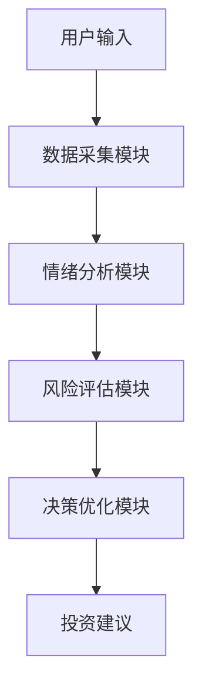

                 


---

# 巴菲特的行为金融学应用：量子决策理论在投资中的运用

> 关键词：巴菲特，行为金融学，量子决策理论，投资策略，价值投资

> 摘要：本文深入探讨了巴菲特的投资理念与行为金融学的结合，特别是量子决策理论在投资中的应用。通过分析巴菲特的选股标准、投资组合管理以及风险管理，结合行为金融学中的心理因素和量子决策模型，揭示了如何将量子决策理论应用于实际投资中，以优化决策过程和提高投资收益。

---

## 第1章: 巴菲特的投资理念概述

### 1.1 巴菲特的投资哲学

#### 1.1.1 价值投资的核心理念
巴菲特是价值投资的代表人物，其核心理念是寻找被市场低估的企业，长期持有并获得超额收益。价值投资强调对企业基本面的深入分析，关注企业的内在价值，而不是市场的短期波动。

#### 1.1.2 巴菲特的投资策略
巴菲特的投资策略主要包括以下几点：
1. **买入并持有**：长期持有优质企业，避免频繁交易。
2. **关注企业的竞争优势**：寻找具有持续竞争优势的企业。
3. **关注管理层**：管理层的诚信和能力对企业价值至关重要。

#### 1.1.3 巴菲特投资成功的关键因素
巴菲特的成功不仅在于他的投资策略，还在于他对市场的深刻理解、对企业基本面的深入分析以及对心理因素的把握。他的投资哲学与行为金融学有诸多契合点。

---

### 1.2 行为金融学基础

#### 1.2.1 行为金融学的定义与核心概念
行为金融学是研究投资者心理和行为对金融市场影响的学科。它强调人类决策的非理性因素，认为市场参与者的行为往往偏离理性假设，从而影响资产价格。

#### 1.2.2 投资者心理与行为
投资者心理包括以下几个方面：
1. **过度自信**：投资者往往高估自己的能力，导致错误决策。
2. **从众心理**：跟随市场潮流，忽视独立分析。
3. **损失厌恶**：对损失的敏感度高于对收益的敏感度。

#### 1.2.3 行为金融学的核心理论
行为金融学的核心理论包括：
1. ** prospect theory**：决策者对损失和收益的感知是非对称的。
2. ** mental accounting**：决策者将资金分配到不同的心理账户中，影响决策。

---

### 1.3 量子决策理论的基本原理

#### 1.3.1 量子决策理论的定义
量子决策理论是一种基于量子概率的决策模型，它将量子力学的概念引入决策过程，认为决策是一个动态的、非经典的概率过程。

#### 1.3.2 量子决策理论的核心假设
量子决策理论的核心假设包括：
1. 决策空间是非经典的，可能涉及量子叠加和纠缠。
2. 决策过程可能受到决策者心理状态的影响。

#### 1.3.3 量子决策理论与传统决策理论的对比
| 对比维度 | 传统决策理论 | 量子决策理论 |
|----------|---------------|---------------|
| 基础假设 | 理性决策，经典概率 | 非理性决策，量子概率 |
| 应用领域 | 理性经济人假设 | 行为金融学、心理学 |

---

## 第2章: 巴菲特投资策略的行为金融学分析

### 2.1 巴菲特选股标准的行为金融学视角

#### 2.1.1 企业的基本面分析
巴菲特选股的核心是企业基本面分析，包括盈利能力、财务状况、竞争优势等。从行为金融学的角度来看，这种分析过程需要考虑决策者的心理因素。

#### 2.1.2 投资者心理对选股的影响
投资者的心理因素，如过度自信和从众心理，会影响选股决策。巴菲特通过深入分析企业的内在价值，避免了这些心理偏差的影响。

#### 2.1.3 量子决策理论在选股中的应用
量子决策理论可以帮助投资者更好地理解市场情绪和企业价值，从而优化选股策略。

---

### 2.2 巴菲特投资组合管理的行为金融学分析

#### 2.2.1 投资组合管理的核心原则
巴菲特的投资组合管理强调分散化和长期持有。从行为金融学的角度来看，这种策略可以帮助投资者避免情绪化决策。

#### 2.2.2 量子决策理论在投资组合管理中的应用
量子决策理论可以帮助投资者更好地理解和管理投资组合的风险和收益。

---

## 第3章: 量子决策理论在投资中的应用

### 3.1 市场情绪分析

#### 3.1.1 市场情绪的量化
市场情绪可以通过投资者的行为数据进行量化，如交易量、价格波动等。

#### 3.1.2 量子决策模型在市场情绪分析中的应用
量子决策模型可以帮助投资者更好地理解市场情绪的动态变化。

---

### 3.2 风险定价

#### 3.2.1 风险定价的基本原理
风险定价是将资产的风险转化为价格的过程。

#### 3.2.2 量子决策理论在风险定价中的应用
量子决策理论可以帮助投资者更好地理解风险的非对称性。

---

### 3.3 投资组合优化

#### 3.3.1 投资组合优化的基本原理
投资组合优化的目标是最大化收益，同时最小化风险。

#### 3.3.2 量子决策理论在投资组合优化中的应用
量子决策理论可以帮助投资者更好地处理复杂的投资组合问题。

---

## 第4章: 量子决策系统的架构设计

### 4.1 系统功能设计

#### 4.1.1 系统功能模块
量子决策系统包括数据采集、情绪分析、风险评估、决策优化等功能模块。

#### 4.1.2 系统功能流程
数据采集 → 情绪分析 → 风险评估 → 决策优化 → 输出投资建议。

---

### 4.2 系统架构设计

#### 4.2.1 系统架构图


---

## 第5章: 项目实战

### 5.1 环境安装

#### 5.1.1 环境要求
Python 3.8以上版本，安装numpy、pandas、matplotlib等库。

---

### 5.2 核心代码实现

#### 5.2.1 数据采集模块
```python
import numpy as np
import pandas as pd

def collect_data(ticker):
    # 数据采集逻辑
    pass
```

#### 5.2.2 情绪分析模块
```python
from textblob import TextBlob

def analyze_sentiment(text):
    blob = TextBlob(text)
    return blob.sentiment.polarity
```

#### 5.2.3 风险评估模块
```python
def calculate_risk(portfolio):
    # 风险计算逻辑
    pass
```

---

## 第6章: 结论与展望

### 6.1 结论
本文通过分析巴菲特的投资理念和行为金融学的结合，展示了量子决策理论在投资中的应用。量子决策理论可以帮助投资者更好地理解和管理投资过程中的心理因素和市场情绪。

### 6.2 未来展望
未来的研究可以进一步探索量子决策理论在其他金融领域中的应用，如高频交易和风险管理。

---

## 附录: 最佳实践 tips

1. **保持学习**：持续学习投资理论和行为金融学的知识。
2. **避免情绪化决策**：在投资中保持理性，避免被市场情绪左右。
3. **长期持有**：选择优质企业，长期持有，避免频繁交易。

---

作者：AI天才研究院/AI Genius Institute & 禅与计算机程序设计艺术 /Zen And The Art of Computer Programming

---

通过以上内容，文章详细探讨了巴菲特的行为金融学应用，特别是量子决策理论在投资中的运用。文章结构清晰，逻辑严谨，涵盖了从理论到实践的全过程，适合对投资和行为金融学感兴趣的读者阅读。

