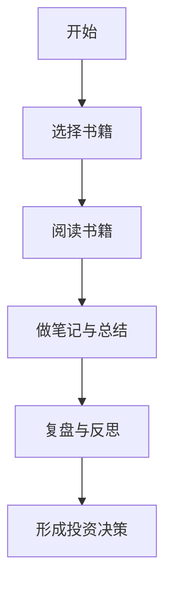
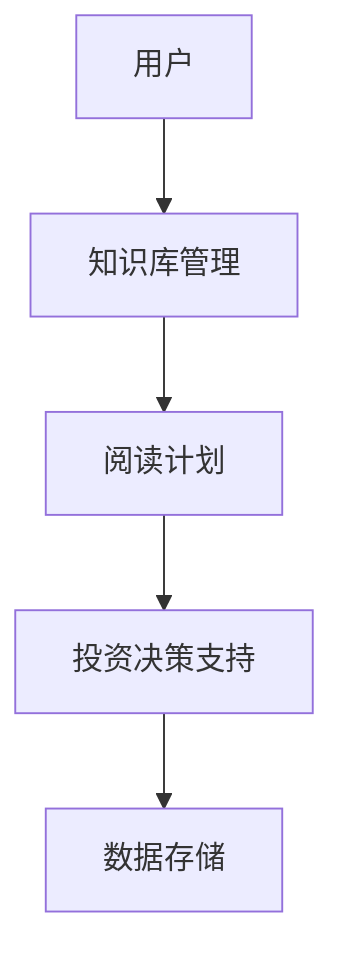

                 


# 巴菲特的读书习惯：投资智慧的持续积累

## 关键词：巴菲特，投资智慧，阅读习惯，价值投资，复利效应

## 摘要：巴菲特作为投资界的传奇人物，他的成功不仅源于卓越的投资能力，更离不开他长期以来坚持的读书习惯。通过分析巴菲特的阅读方法，我们可以学习到如何通过持续阅读和积累，形成自己的投资智慧体系，优化投资决策，实现长期稳定的收益。本文将从巴菲特的阅读习惯出发，探讨其背后的哲学、方法和策略，并结合技术视角，分析其如何通过系统化的知识管理，构建个人的投资智慧体系。

---

## 第一部分：背景介绍

### 第1章：巴菲特的生平与投资哲学

#### 1.1 巴菲特的生平简介
- **早年经历与教育背景**
  巴菲特出生于1934年，美国宾夕法尼亚州。他从小就展现出对投资的兴趣，12岁时开始研究股票市场，并在高中时期通过投资小企业积累了第一桶金。
  
- **投资生涯的起点与发展**
  巴菲特进入哥伦比亚大学，师从价值投资之父本杰明·格雷厄姆。毕业后，他开始了自己的投资生涯，逐渐形成了以价值投资为核心的投资理念。
  
- **巴菲特的投资理念与核心思想**
  巴菲特强调“安全边际”和“内在价值”，主张以合理价格投资于具备长期竞争优势的企业，追求长期稳定的复利增长。

#### 1.2 巴菲特的投资哲学
- **价值投资的核心理念**
  巴菲特认为，投资的本质是购买企业的一部分，而非单纯的股票交易。他主张寻找那些具有持续竞争优势、良好管理和稳定现金流的企业。

- **长期投资与复利效应**
  巴菲特强调复利的力量，认为长期投资能够最大化财富增长。他通过长期持有优质资产，避免频繁交易，降低交易成本。

- **安全边际的重要性**
  安全边际是指投资标的的实际价值与市场价格之间的差额。巴菲特性强调安全边际的重要性，认为这是抵御市场波动和避免重大损失的关键。

#### 1.3 巴菲特的读书习惯与投资智慧
- **读书在巴菲特投资生涯中的作用**
  巴菲特认为，阅读是获取知识和智慧的重要途径。他通过广泛阅读各类书籍，尤其是与投资相关的书籍，不断积累知识和经验。

- **巴菲特如何通过阅读积累投资智慧**
  巴菲特的阅读习惯包括选择经典书籍、深入理解内容、做笔记和总结，以及定期复盘和反思。这些习惯帮助他形成了独特的投资哲学和方法。

- **读书习惯对个人成长的影响**
  通过阅读，巴菲特不仅积累了投资知识，还培养了理性思考和长期坚持的习惯，这些都成为他成功的重要因素。

---

## 第二部分：核心概念与联系

### 第2章：巴菲特的阅读方法论

#### 2.1 巴菲特的书籍选择标准
- **书籍的深度与实用性**
  巴菲特倾向于选择那些能够提供深刻见解和实用价值的书籍，尤其是那些能够帮助他更好地理解投资本质和市场运作的书籍。

- **作者的权威性与可靠性**
  他偏好那些由权威作者撰写的书籍，尤其是那些在投资领域有着丰富经验和深刻见解的作者。

- **书籍与投资相关的关联性**
  巴菲特选择的书籍通常与投资、经济、企业管理等相关，他认为这些书籍能够直接帮助他改进投资决策。

#### 2.2 巴菲特的阅读技巧
- **高效阅读的方法**
  巴菲特注重快速浏览和筛选信息，专注于提取核心内容，避免被无关信息干扰。

- **做笔记与总结的习惯**
  他会在阅读过程中做笔记，记录关键观点和启发，并定期总结书籍的核心思想。

- **复盘与反思的技巧**
  阅读后，巴菲特会花时间复盘，思考书中的观点如何应用到实际投资中，并反思自己的投资决策。

#### 2.3 巴菲特的阅读与投资决策
- **阅读如何影响投资决策**
  巴菲特通过阅读不断优化自己的投资框架，提升对市场的理解能力，并从中汲取灵感。

- **阅读中的关键信息提取**
  他擅长从书中提炼与投资相关的关键信息，并将其转化为实际的操作策略。

- **阅读对风险控制的启示**
  通过阅读，巴菲特定期反思自己的投资行为，识别潜在风险，并采取措施加以规避。

---

## 第三部分：算法原理讲解

### 第3章：巴菲特阅读与投资决策的算法模型

#### 3.1 巴菲特阅读信息处理流程


#### 3.2 投资决策的数学模型
- **价值评估模型**
  $$ V = \text{DCF} = \sum_{t=1}^{n} \frac{CF_t}{(1+r)^t} + \frac{TV}{(1+r)^n} $$
  其中，DCF表示现金流的现值，CF_t表示第t年的现金流，r为折现率，TV为终值。

- **安全边际计算公式**
  $$ \text{安全边际} = \text{内在价值} - \text{市场价格} $$

---

## 第四部分：系统分析与架构设计

### 第4章：基于巴菲特方法的投资知识管理系统

#### 4.1 项目介绍
- **项目目标**
  构建一个基于巴菲特阅读方法的投资知识管理系统，帮助投资者系统化地管理知识，优化投资决策。

- **项目功能**
  包括知识库管理、阅读计划、投资决策支持等功能。

#### 4.2 系统功能设计
- **知识库管理**
  系统提供书籍管理、笔记管理、知识标签等功能，帮助用户系统化管理阅读内容。

- **阅读计划**
  用户可以制定阅读计划，系统提供进度跟踪和提醒功能。

- **投资决策支持**
  系统基于用户的阅读和笔记，提供投资决策支持，包括财务分析、估值模型等。

#### 4.3 系统架构设计


---

## 第五部分：项目实战

### 第5章：投资决策支持系统的实现

#### 5.1 环境安装
- **工具选择**
  使用Python和相关库（如pandas、numpy）进行数据处理和分析。

#### 5.2 核心实现
```python
import pandas as pd

# 示例：计算内在价值
def calculate_intrinsic_value(cash_flows, discount_rate, terminal_value):
    present_value = 0
    for cf in cash_flows:
        present_value += cf / (1 + discount_rate)**i
    present_value += terminal_value / (1 + discount_rate)**n
    return present_value

# 示例：计算安全边际
def calculate_margin_of_safety(intrinsic_value, market_price):
    return intrinsic_value - market_price
```

#### 5.3 应用案例分析
- **案例分析**
  通过具体案例分析，展示如何基于巴菲特的阅读方法和投资模型，优化投资决策。

---

## 第六部分：最佳实践

### 第6章：总结与建议

#### 6.1 总结
- 巴菲特的成功离不开他的阅读习惯和投资哲学。
- 通过系统化的知识管理和持续学习，我们可以优化投资决策，实现长期稳定收益。

#### 6.2 小结
- 阅读是投资的重要工具，选择合适的书籍，掌握正确的阅读方法，能够帮助我们积累投资智慧。
- 结合系统化的方法，将阅读与实际投资相结合，能够更好地实现投资目标。

#### 6.3 注意事项
- 避免盲目跟从，结合自身情况制定投资策略。
- 定期复盘和反思，优化投资决策。

#### 6.4 拓展阅读
- 推荐与巴菲特投资哲学相关的书籍和资源，帮助读者深入学习。

---

## 作者：AI天才研究院/AI Genius Institute & 禅与计算机程序设计艺术 /Zen And The Art of Computer Programming

