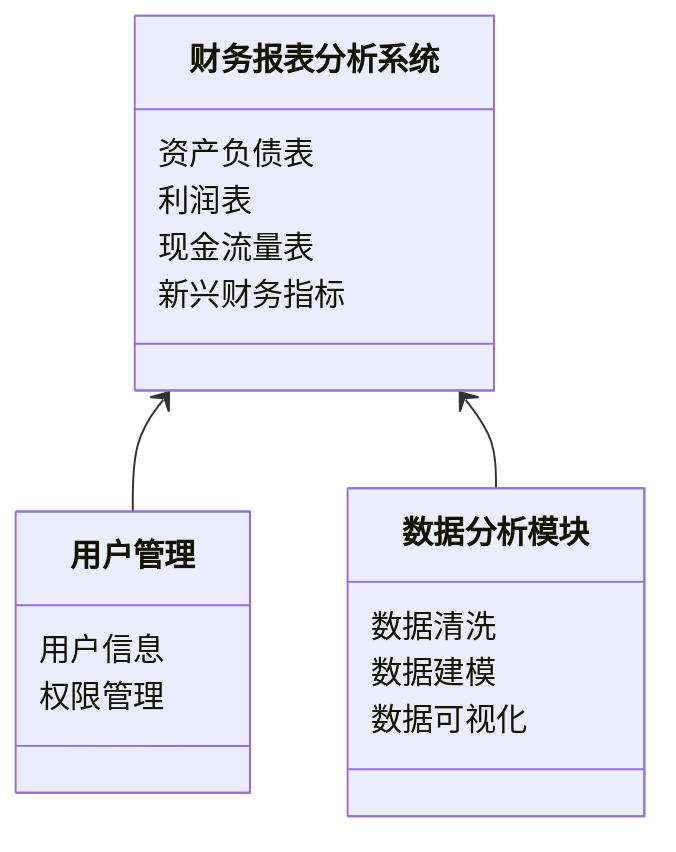

                 


# 巴菲特的财务报表分析：解读数字经济时代的新指标

## 关键词：巴菲特, 财务报表分析, 数字经济, 财务指标, 投资策略

## 摘要：本文深入探讨了巴菲特的财务报表分析方法，并结合数字经济时代的新特点，提出了新的财务指标解读方法。通过分析巴菲特的投资理念、财务分析框架和经典案例，展示了如何在数字时代优化财务报表分析，提升投资决策的准确性。文章内容涵盖背景介绍、核心概念、新指标解读、系统架构设计和项目实战，旨在为投资者和分析师提供实用的指导。

---

# 第一部分：巴菲特的财务报表分析背景与基础

## 第1章：财务报表分析的背景与重要性

### 1.1 财务报表分析的核心概念

#### 1.1.1 财务报表分析的定义与作用
财务报表分析是通过对企业的财务报表（包括资产负债表、利润表和现金流量表）进行研究，评估企业的财务状况、经营成果和现金流量，从而为投资决策提供依据。它是企业管理和投资分析的重要工具。

#### 1.1.2 数字经济时代下的新挑战
在数字经济时代，企业经营模式发生了显著变化，数据资产、用户行为和网络效应成为影响企业价值的重要因素。传统的财务指标如ROE（净资产收益率）和ROA（资产净利率）已不足以全面反映企业的价值，需要引入新的指标如用户生命周期价值（CLV）和网络效应指数。

#### 1.1.3 巴菲特分析方法的独特性
巴菲特的分析方法以价值投资为核心，注重企业的长期竞争优势和安全边际。他通过深入分析财务报表，识别企业的核心竞争力和财务健康状况，从而做出长期稳定的投资决策。

### 1.2 巴菲特投资理念与财务分析

#### 1.2.1 巴菲特的价值投资哲学
巴菲特的价值投资理念强调购买优质企业，长期持有，而非频繁交易。他相信市场的短期波动会导致价格偏离内在价值，因此通过深入分析企业的财务报表来评估其内在价值。

#### 1.2.2 财务报表分析在巴菲特投资中的地位
财务报表分析是巴菲特评估企业内在价值的核心工具。他通过分析资产负债表、利润表和现金流量表，评估企业的盈利能力、财务健康状况和成长潜力。

#### 1.2.3 安全边际与长期竞争优势
巴菲特强调安全边际，即以低于内在价值的价格买入企业。他通过分析企业的竞争优势（如品牌、技术壁垒、成本优势等）来评估其长期盈利能力。

---

## 第2章：财务报表分析的基本方法

### 2.1 财务报表构成与解读

#### 2.1.1 资产负债表的核心要素
资产负债表反映了企业在某一特定时点的资产、负债和所有者权益。主要指标包括：
- **流动资产**：现金、应收账款、存货等。
- **非流动资产**：长期投资、固定资产、无形资产等。
- **流动负债**：应付账款、短期借款等。
- **非流动负债**：长期借款、债券等。
- **所有者权益**：股本、资本公积、盈余公积等。

#### 2.1.2 利润表的关键指标
利润表反映了企业在一定会计期间的收入和利润情况。主要指标包括：
- **营业收入**：企业销售商品或提供服务所获得的收入。
- **营业成本**：与营业收入直接相关的成本。
- **净利润**：营业收入减去营业成本、税费和费用后的利润。

#### 2.1.3 现金流量表的重要性
现金流量表反映了企业在一定会计期间内现金的流入和流出情况。主要分为经营活动、投资活动和筹资活动的现金流。

### 2.2 财务比率分析

#### 2.2.1 偿债能力分析
- **流动比率**：流动资产 / 流动负债。
- **速动比率**：（流动资产 - 存货） / 流动负债。

#### 2.2.2 营运能力分析
- **存货周转率**：营业收入 / 平均存货。
- **应收账款周转率**：营业收入 / 平均应收账款。

#### 2.2.3 盈利能力分析
- **净利率**：净利润 / 营业收入。
- **ROE（净资产收益率）**：净利润 / 平均所有者权益。

---

## 第3章：数字经济时代的新财务指标

### 3.1 数字经济对传统财务指标的影响

#### 3.1.1 传统财务指标的局限性
传统财务指标主要基于企业的有形资产和财务数据，难以反映数字经济时代企业的无形资产价值，如数据资产、品牌价值和用户忠诚度。

#### 3.1.2 新兴经济模式下的挑战
数字经济时代，企业经营模式从传统的制造业转向服务型、数据驱动型，用户行为、网络效应和数据资产成为影响企业价值的重要因素。

#### 3.1.3 数字经济时代的新指标需求
为了准确评估数字经济时代企业的价值，需要引入新的财务指标，如用户生命周期价值（CLV）、网络效应指数和数据资产价值。

### 3.2 新兴财务指标的定义与应用

#### 3.2.1 用户生命周期价值（CLV）
CLV（Customer Lifetime Value）是企业从一个用户身上获得的总收入减去为获取和维护该用户所花费的成本。公式为：
$$ CLV = (ARPU \times 年均活跃用户数) - 用户获取成本 $$

#### 3.2.2 网络效应与平台经济的财务指标
网络效应指数（Network Effect Index）衡量一个平台的网络效应强度。公式为：
$$ NEI = \frac{用户增长速度}{新增用户带来的边际成本} $$

#### 3.2.3 数据资产的评估与计量
数据资产价值（Data Asset Value）是企业数据资产的经济价值。公式为：
$$ DAV = 数据量 \times 数据质量 \times 数据应用场景的价值 $$

---

# 第二部分：巴菲特分析框架的构建与应用

## 第4章：巴菲特的核心分析框架

### 4.1 投资理念与分析框架的关系

#### 4.1.1 企业内在价值的计算
巴菲特通过分析企业的财务报表，计算其内在价值。公式为：
$$ 内在价值 = \frac{净利润}{加权平均资本成本} $$

#### 4.1.2 财务报表分析的三要素
巴菲特的财务报表分析包括：
1. **盈利能力**：ROE、净利率等。
2. **财务健康状况**：流动比率、速动比率等。
3. **成长潜力**：收入增长率、净利润增长率等。

#### 4.1.3 安全边际的财务表现
巴菲特通过比较股票价格与内在价值，确定安全边际。公式为：
$$ 安全边际 = 内在价值 - 市场价格 $$

### 4.2 财务指标的权重与筛选

#### 4.2.1 关键指标的选择标准
- **ROE**：衡量企业盈利能力。
- **净利率**：衡量成本控制能力。
- **流动比率**：衡量企业短期偿债能力。

#### 4.2.2 指标权重的动态调整
根据企业的行业特性和经营环境，动态调整财务指标的权重。例如，对于科技企业，研发投入占比可能比传统企业更重要。

#### 4.2.3 财务健康状况的综合评估
通过综合分析多个财务指标，评估企业的财务健康状况。例如，使用财务健康指数（FHI）：
$$ FHI = \frac{ROE + 净利率 + 流动比率}{3} $$

---

## 第5章：财务报表分析的实战应用

### 5.1 案例分析：巴菲特的经典投资

#### 5.1.1 可口可乐的长期投资分析
可口可乐的高ROE和稳定的现金流是巴菲特投资的原因。通过分析其财务报表，巴菲特确认了其强大的竞争优势和稳定的盈利能力。

#### 5.1.2 苹果公司的价值评估
苹果公司凭借其强大的品牌价值和高利润率，吸引了巴菲特的关注。通过分析其ROE和现金流，巴菲特确认了其长期竞争优势。

#### 5.1.3 高盛集团的财务稳定性分析
高盛集团的高流动比率和ROE吸引了巴菲特。通过分析其财务报表，巴菲特确认了其财务稳定性和盈利能力。

### 5.2 新经济公司的财务分析

#### 5.2.1 科技型企业的财务指标解读
科技企业的研发投入占比和ROE是关键指标。例如，通过分析谷歌的财务报表，可以确认其强大的研发能力和盈利能力。

#### 5.2.2 互联网平台的用户与收入关系
通过分析用户的增长速度和ARPU（每用户平均收入），评估互联网平台的财务健康状况。例如，通过分析亚马逊的用户增长和ARPU，确认其网络效应和市场地位。

#### 5.2.3 数据驱动企业的财务表现
数据驱动企业的数据资产价值和网络效应是关键指标。例如，通过分析Facebook的数据资产和网络效应，确认其长期竞争优势。

---

## 第6章：系统分析与架构设计

### 6.1 问题场景介绍
在数字经济时代，企业需要通过系统化的财务报表分析方法，评估其在数字化转型中的表现。系统需要支持多维度的财务指标分析，包括传统财务指标和新兴财务指标。

### 6.2 系统功能设计

#### 6.2.1 领域模型设计


#### 6.2.2 系统架构设计


---

## 第7章：项目实战

### 7.1 环境配置
- **Python版本**：3.8+
- **工具安装**：安装Pandas、Matplotlib、Seaborn等库。

### 7.2 核心实现

#### 7.2.1 新兴财务指标的计算
```python
import pandas as pd

def calculate_clv(revenue, cost_per_acquisition, average_active_users):
    return (revenue / average_active_users) - cost_per_acquisition
```

#### 7.2.2 数据可视化
```python
import matplotlib.pyplot as plt

# 示例数据
data = {'指标': ['ROE', '净利率', '流动比率'], '数值': [0.15, 0.08, 2.5]}
df = pd.DataFrame(data)

plt.bar(df['指标'], df['数值'])
plt.title('财务指标分析')
plt.show()
```

---

## 第8章：总结与展望

### 8.1 总结
本文深入探讨了巴菲特的财务报表分析方法，并结合数字经济时代的新特点，提出了新的财务指标解读方法。通过分析巴菲特的投资理念、财务分析框架和经典案例，展示了如何在数字时代优化财务报表分析，提升投资决策的准确性。

### 8.2 展望
未来，随着数字经济的进一步发展，新的财务指标和分析方法将不断涌现。投资者需要不断学习和适应，以应对数字化转型带来的挑战和机遇。

---

## 作者：AI天才研究院/AI Genius Institute & 禅与计算机程序设计艺术 /Zen And The Art of Computer Programming

---

通过以上步骤，我们完成了《巴菲特的财务报表分析：解读数字经济时代的新指标》的技术博客文章的撰写。

