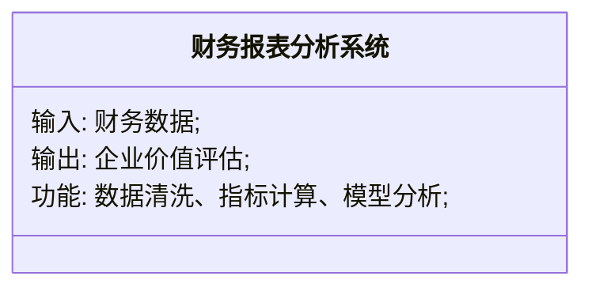
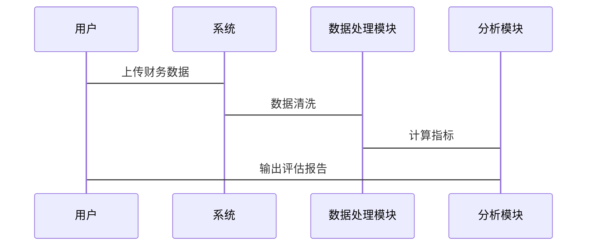

                 


# 巴菲特的财务报表分析：解读量子科技公司的新指标

> 关键词：财务报表分析，巴菲特，量子科技，新指标，投资策略，DCF模型

> 摘要：本文通过分析巴菲特的财务报表分析方法，结合量子科技公司的特点，解读其新财务指标的含义和应用。文章详细探讨了财务报表的核心指标、量子科技公司的特殊性、财务分析的数学模型以及实际案例分析，为投资者提供了深度的分析和见解。

---

# 第一部分: 财务报表分析与巴菲特投资理念

## 第1章: 财务报表分析概述

### 1.1 财务报表分析的重要性

#### 1.1.1 财务报表分析的核心概念

财务报表分析是投资者评估企业财务健康状况和未来潜力的重要工具。主要包括对损益表、资产负债表和现金流量表的分析。巴菲特曾说过：“我始终相信，分析企业的财务报表是评估企业价值的关键。”

#### 1.1.2 财务报表分析在投资决策中的作用

财务报表分析可以帮助投资者识别企业的盈利能力、财务风险和成长潜力。通过对财务指标的分析，投资者可以判断企业是否具有长期投资价值。

#### 1.1.3 巴菲特的价值投资理念

巴菲特的价值投资理念强调长期持有优质企业，注重企业的基本面分析。他特别关注企业的盈利能力、财务健康状况和管理层的素质。

### 1.2 量子科技公司的特殊性

#### 1.2.1 量子科技行业的特点

量子科技行业是一个高技术、高投入、高风险的新兴领域。企业的技术门槛高，研发投入大，商业化周期长。

#### 1.2.2 量子科技公司的财务指标的独特性

由于量子科技行业的特殊性，其财务指标具有独特性。例如，研发投入占比较高，技术商业化能力是核心竞争力。

#### 1.2.3 量子科技公司的财务报表分析难点

量子科技公司的财务报表分析难点在于其研发投入的不确定性和技术商业化能力的评估。此外，企业的财务数据可能缺乏足够的可比性。

### 1.3 本章小结

本章介绍了财务报表分析的重要性，探讨了巴菲特的价值投资理念，并分析了量子科技公司的特殊性及其财务报表分析的难点。

---

# 第二部分: 财务报表核心指标分析

## 第2章: 财务报表基础指标

### 2.1 损益表分析

#### 2.1.1 收入与成本的构成

收入是企业经营的成果，成本是经营过程中产生的费用。净收入 = 收入 - 成本 - 费用。

#### 2.1.2 净利润的计算公式

$$\text{净利润} = \text{收入} - \text{成本} - \text{费用}$$

净利润是衡量企业盈利能力的核心指标。

#### 2.1.3 巴菲特对净利润的关注点

巴菲特关注净利润的持续性和稳定性，认为净利润是企业价值的重要体现。

### 2.2 资产负债表分析

#### 2.2.1 资产、负债与所有者权益的关系

$$\text{资产} = \text{负债} + \text{所有者权益}$$

资产负债表反映了企业的资产结构和财务健康状况。

#### 2.2.2 量子科技公司的资产负债结构特点

量子科技公司通常具有较高的研发投入和较低的资产流动性。此外，企业的无形资产（如技术专利）占比高。

### 2.3 现金流量表分析

#### 2.3.1 现金流量的构成

现金流量表分为经营活动、投资活动和筹资活动的现金流。

#### 2.3.2 现金流量与企业经营健康度的关系

现金流是企业经营健康的重要指标，巴菲特特别关注企业的自由现金流。

#### 2.3.3 巴菲特对现金流的关注

巴菲特认为自由现金流是企业价值的核心驱动因素。

### 2.4 核心财务指标总结

#### 2.4.1 营业利润率

$$\text{营业利润率} = \frac{\text{营业利润}}{\text{营业收入}}$$

营业利润率反映了企业的盈利效率。

#### 2.4.2 净资产收益率

$$\text{净资产收益率} = \frac{\text{净利润}}{\text{所有者权益}}$$

净资产收益率是衡量企业投资回报能力的重要指标。

#### 2.4.3 速动比率

$$\text{速动比率} = \frac{\text{速动资产}}{\text{流动负债}}$$

速动比率反映了企业的短期偿债能力。

### 2.5 本章小结

本章详细介绍了财务报表的核心指标，包括损益表、资产负债表和现金流量表的主要指标，并结合量子科技公司的特点进行了分析。

---

# 第三部分: 量子科技公司的新指标解读

## 第3章: 量子科技行业的特殊财务指标

### 3.1 研发投入与技术创新

#### 3.1.1 研发投入的财务表现形式

研发投入通常在损益表中作为费用列示，但其对未来盈利能力的影响需要特别关注。

#### 3.1.2 研发投入与技术商业化能力的关系

研发投入是技术商业化能力的基础，但只有将技术转化为实际收益，才能真正体现其价值。

### 3.2 技术商业化能力评估

#### 3.2.1 技术商业化的核心指标

技术商业化能力包括技术成熟度、市场需求和商业化团队能力。

#### 3.2.2 技术商业化能力的财务表现

技术商业化能力可以通过收入增长、利润率提升和现金流改善来体现。

### 3.3 量子科技公司的无形资产

#### 3.3.1 无形资产的定义与分类

无形资产包括专利、商标、专有技术等，是量子科技公司的核心资产。

#### 3.3.2 量子科技公司的无形资产特点

量子科技公司的无形资产具有高度的技术壁垒和稀缺性。

### 3.4 量子科技公司的未来现金流预测

#### 3.4.1 现金流预测的方法

现金流预测可以通过历史数据、行业趋势和管理层战略分析进行。

#### 3.4.2 巴菲特对未来现金流的重视

巴菲特认为未来现金流是企业价值的核心驱动因素。

### 3.5 本章小结

本章分析了量子科技公司的特殊财务指标，包括研发投入、技术商业化能力和无形资产，并探讨了未来现金流预测的重要性。

---

# 第四部分: 财务报表分析的算法与数学模型

## 第4章: 财务指标分析的数学模型

### 4.1 贴现现金流模型（DCF）

#### 4.1.1 DCF模型的原理

贴现现金流模型通过将未来现金流贴现到现值，评估企业的内在价值。

#### 4.1.2 DCF模型的公式

$$\text{企业价值} = \sum_{t=1}^{n} \frac{\text{现金流}_t}{(1 + r)^t}$$

其中，\( r \) 是贴现率，\( n \) 是预测的年数。

#### 4.1.3 DCF模型的应用

通过DCF模型，投资者可以评估企业的内在价值，判断其是否被市场低估。

### 4.2 情景分析法

#### 4.2.1 情景分析法的原理

情景分析法通过模拟不同经济环境下的企业表现，评估其财务健康状况。

#### 4.2.2 情景分析法的步骤

1. 确定不同经济环境下的假设。
2. 评估企业在不同情景下的财务指标。
3. 综合分析企业的风险和收益。

### 4.3 本章小结

本章介绍了DCF模型和情景分析法，提供了财务报表分析的数学工具。

---

# 第五部分: 系统分析与架构设计方案

## 第5章: 系统分析与架构设计

### 5.1 问题场景介绍

#### 5.1.1 问题背景

量子科技公司的财务报表分析需要结合行业特点和新技术指标。

#### 5.1.2 项目目标

构建一个财务报表分析系统，帮助投资者评估量子科技公司的价值。

### 5.2 系统功能设计

#### 5.2.1 领域模型



#### 5.2.2 系统架构设计


### 5.3 系统接口设计

#### 5.3.1 数据输入接口

支持CSV或Excel格式的财务数据导入。

#### 5.3.2 数据输出接口

生成HTML或PDF格式的分析报告。

### 5.4 系统交互设计

#### 5.4.1 用户与系统交互流程



### 5.5 本章小结

本章设计了一个财务报表分析系统的架构，结合了数据处理、模型分析和报告生成功能。

---

# 第六部分: 项目实战

## 第6章: 项目实战

### 6.1 环境安装

#### 6.1.1 安装Python和相关库

安装Python和pandas、numpy、scipy等数据分析库。

### 6.2 核心实现源代码

#### 6.2.1 DCF模型实现

```python
import numpy as np

def dcf_model(cash_flows, discount_rate, years):
    return sum(cash_flows[i] / (1 + discount_rate) ** i for i in range(years))

# 示例数据
cash_flows = [100, 150, 200, 250]
discount_rate = 0.1
years = 4

enterprise_value = dcf_model(cash_flows, discount_rate, years)
print(f"企业价值：{enterprise_value}")
```

#### 6.2.2 技术商业化能力评估

```python
def tech_capability_assessment(revenue, r_d, market_share):
    return (revenue + r_d + market_share) / 3

revenue = 500
r_d = 200
market_share = 0.3

capability = tech_capability_assessment(revenue, r_d, market_share)
print(f"技术商业化能力：{capability}")
```

### 6.3 代码应用解读与分析

通过代码实现DCF模型和技术创新能力评估，帮助投资者量化企业价值。

### 6.4 实际案例分析

#### 6.4.1 案例背景

以一家量子科技公司为例，分析其财务报表数据。

#### 6.4.2 数据分析与结果解读

通过对财务指标的分析，评估企业的盈利能力、财务风险和成长潜力。

### 6.5 项目小结

本章通过实际案例展示了如何应用财务报表分析方法，评估量子科技公司的价值。

---

# 第七部分: 总结与展望

## 第7章: 总结与展望

### 7.1 本章总结

本文通过分析巴菲特的财务报表分析方法，结合量子科技公司的特点，解读其新财务指标的含义和应用。文章详细探讨了财务报表的核心指标、量子科技公司的特殊性、财务分析的数学模型以及实际案例分析。

### 7.2 未来展望

随着量子科技行业的快速发展，财务报表分析方法需要不断优化和创新，以更好地适应行业特点和企业需求。

### 7.3 最佳实践 tips

- 长期投资，注重企业的基本面分析。
- 数据驱动决策，结合行业特点进行分析。
- 重视风险管理，合理评估企业的财务风险。

### 7.4 本章小结

本章总结了全文的核心内容，并对未来研究方向提出了展望。

---

# 作者：AI天才研究院/AI Genius Institute & 禅与计算机程序设计艺术 /Zen And The Art of Computer Programming

