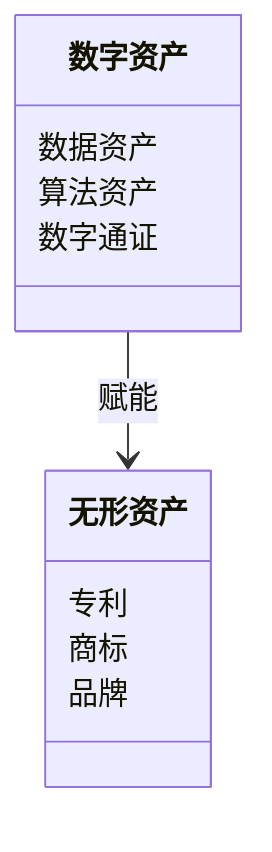

                 


# 巴菲特的资产负债表分析：数字资产和无形资产的重新定义

## 关键词：巴菲特, 资产负债表, 数字资产, 无形资产, 评估模型

## 摘要：  
本文从巴菲特的视角重新定义数字资产和无形资产，结合技术与投资的双重维度，构建新的资产负债表分析框架。通过详细分析数字资产与无形资产的核心概念、评估模型、系统架构以及项目实战，为读者提供全面的理论与实践指导。

---

# 第1章: 巴菲特的资产负债表分析概述

## 1.1 资产负债表的基本概念

### 1.1.1 资产负债表的定义与作用  
资产负债表是反映企业财务状况的核心报表，包含资产、负债和所有者权益三大部分。它不仅是企业价值评估的基础，也是投资者决策的重要依据。  

### 1.1.2 巴菲特对资产负债表的独特见解  
巴菲特认为，资产负债表不仅仅是数字的堆砌，更是企业内在价值的映射。他注重企业的资产质量、负债结构以及所有者权益的稳定性。  

### 1.1.3 数字资产与无形资产的定义与特征  
数字资产是指以数字形式存在的资产，如数据、算法、知识产权等；无形资产则是指企业长期积累的非实物资产，如品牌、商誉、技术等。两者都具有轻资产、高附加值的特点，但在定义和评估方法上存在差异。

---

## 1.2 传统资产负债表分析的局限性

### 1.2.1 传统资产分类的不足  
传统资产负债表将资产分为流动资产和非流动资产，但这种分类方式难以准确反映数字资产和无形资产的价值。  

### 1.2.2 无形资产与数字资产的挑战  
传统评估方法忽视了数字资产的动态性和无形资产的复杂性，导致企业价值被低估。  

### 1.2.3 巴菲特分析方法的创新  
巴菲特通过引入“经济护城河”和“持续竞争优势”等概念，重新定义了资产的评估标准。

---

## 1.3 数字资产与无形资产的重新定义

### 1.3.1 数字资产的内涵与外延  
数字资产包括数据、算法、区块链资产等，具有可扩展性、可分割性和高流动性。  

### 1.3.2 无形资产的重新分类  
无形资产可分为知识型无形资产（如专利、商标）和关系型无形资产（如客户关系、品牌价值）。  

### 1.3.3 数字资产与无形资产的对比分析  
数字资产更注重技术驱动，而无形资产更注重长期积累；数字资产具有更强的流动性，而无形资产则具有更强的稳定性。

---

# 第2章: 数字资产与无形资产的核心概念

## 2.1 数字资产的属性与特征

### 2.1.1 数字资产的分类  
数字资产可以分为数据资产、算法资产和数字通证资产。  

### 2.1.2 数字资产的核心属性  
- **可量化性**：数字资产的价值可以通过数据和算法进行精确计算。  
- **可扩展性**：数字资产可以通过技术手段无限扩展。  
- **可流动性**：数字资产可以在不同场景间快速流动和转化。  

---

## 2.2 无形资产的重新定义

### 2.2.1 无形资产的传统分类  
传统无形资产包括专利、商标、版权等。  

### 2.2.2 无形资产的数字化转型  
随着数字化转型的推进，无形资产逐渐与数字资产融合，形成了新的资产类别。  

### 2.2.3 无形资产的新分类标准  
- **技术驱动型**：如人工智能算法、大数据分析能力。  
- **关系驱动型**：如客户关系、品牌价值。  
- **知识驱动型**：如专利、技术诀窍。  

---

## 2.3 数字资产与无形资产的关系

### 2.3.1 数字资产与无形资产的关联  
数字资产是无形资产的重要组成部分，而无形资产是数字资产的延伸和应用。  

### 2.3.2 数字化对无形资产价值的影响  
数字化使得无形资产的价值更加可量化，同时也增加了其贬值的风险。  

### 2.3.3 数字资产与无形资产的协同效应  
通过数字资产的支撑，无形资产可以实现更快的变现和增值。

---

## 2.4 核心概念对比分析

### 2.4.1 数字资产与传统资产的对比  
| 属性         | 数字资产              | 传统资产             |
|--------------|-----------------------|----------------------|
| 存在形式     | 数字化                | 实物化               |
| 价值评估     | 数据驱动              | 财务驱动             |
| 流动性        | 高                    | 低                   |

### 2.4.2 无形资产与传统资产的对比  
| 属性         | 无形资产              | 传统资产             |
|--------------|-----------------------|----------------------|
| 实物形态     | 无                    | 有                   |
| 价值来源     | 知识、技术             | 实物资源             |
| 贡献能力     | 高                    | 低                   |

### 2.4.3 数字资产与无形资产的对比  
| 属性         | 数字资产              | 无形资产             |
|--------------|-----------------------|----------------------|
| 依赖性       | 技术驱动              | 知识驱动             |
| 变现能力     | 高                    | 中                   |
| 风险因素     | 技术风险              | 市场风险             |

---

# 第3章: 数字资产与无形资产的评估模型

## 3.1 评估模型的构建逻辑

### 3.1.1 模型构建的基本原则  
评估模型应基于数据驱动、技术支撑和业务场景。  

### 3.1.2 模型构建的步骤与方法  
1. **数据采集**：收集数字资产和无形资产的相关数据。  
2. **数据清洗**：去除无效数据，确保数据质量。  
3. **模型训练**：使用机器学习算法进行模型训练。  
4. **模型验证**：通过回测和交叉验证确保模型的准确性。  
5. **模型优化**：调整参数，提升模型性能。  

### 3.1.3 模型的适用场景  
适用于高技术企业、互联网公司和数据驱动型行业。  

---

## 3.2 数字资产的评估指标

### 3.2.1 数字资产的量化指标  
- **数据价值**：数据的规模、质量和应用能力。  
- **算法能力**：算法的准确性和效率。  
- **数字通证**：通证的流通性和认可度。  

### 3.2.2 数字资产的非量化指标  
- **技术壁垒**：技术的独占性和复杂性。  
- **应用场景**：数据和算法的应用范围和深度。  

---

## 3.3 无形资产的评估方法

### 3.3.1 无形资产的传统评估方法  
- **成本法**：基于资产的重置成本。  
- **市场法**：基于市场可比交易价格。  
- **收益法**：基于资产的未来收益。  

### 3.3.2 数字化背景下无形资产的评估创新  
- **数据驱动法**：结合大数据分析和机器学习进行评估。  
- **场景化评估法**：根据具体业务场景进行动态评估。  

### 3.3.3 无形资产评估的挑战与解决方案  
挑战：无形资产的不确定性高，难以量化。  
解决方案：引入动态评估模型和实时数据监控。

---

## 3.4 数字资产与无形资产的综合评估

### 3.4.1 综合评估模型的设计  
综合评估模型将数字资产和无形资产的评估指标结合，形成一个统一的评估框架。  

### 3.4.2 模型的数学表达  
综合评估公式：  
$$ V = \alpha D + \beta I $$  
其中，\( V \) 为综合价值，\( D \) 为数字资产价值，\( I \) 为无形资产价值，\( \alpha \) 和 \( \beta \) 为权重系数。  

---

# 第4章: 数字资产与无形资产的系统架构

## 4.1 问题场景介绍  
以一家互联网公司为例，分析其数字资产和无形资产的管理与评估问题。  

## 4.2 系统功能设计  
### 4.2.1 领域模型设计  


### 4.2.2 系统架构设计  


### 4.2.3 系统接口设计  
- 数据采集接口：用于获取数字资产和无形资产的相关数据。  
- 评估接口：提供资产评估服务，返回评估结果。  

---

# 第5章: 数字资产与无形资产的项目实战

## 5.1 环境安装  
- 安装Python、Jupyter Notebook和相关库（如scikit-learn、pandas）。  

## 5.2 系统核心实现源代码  
```python
import pandas as pd
from sklearn.linear_model import LinearRegression

# 数据采集
data = pd.read_csv('assets.csv')

# 数据清洗
data = data.dropna()

# 模型训练
model = LinearRegression()
model.fit(data[['数字资产', '无形资产']], data['综合价值'])

# 模型验证
print(model.score(data[['数字资产', '无形资产']], data['综合价值']))
```

---

# 第6章: 总结与展望

## 6.1 总结  
本文从巴菲特的视角重新定义了数字资产和无形资产，构建了新的资产负债表分析框架，并通过技术手段提供了具体的实现方法。  

## 6.2 未来展望  
未来，随着技术的进步，数字资产和无形资产的评估将更加智能化和动态化。建议进一步研究多模态评估模型和实时监控系统。

---

作者：AI天才研究院/AI Genius Institute & 禅与计算机程序设计艺术 /Zen And The Art of Computer Programming

