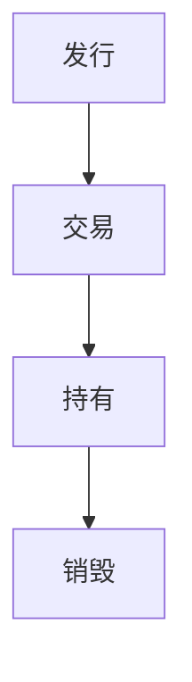

                 


# 巴菲特的资产负债表分析：数字资产和智能合约的影响

> 关键词：巴菲特，资产负债表分析，数字资产，智能合约，区块链技术，价值评估模型

> 摘要：本文系统地分析了数字资产和智能合约对巴菲特资产负债表分析方法的影响。首先，介绍了巴菲特的经典分析框架，然后深入探讨了数字资产的基本概念、特点及其对传统资产负债表的影响。接着，分析了智能合约的原理及其在财务分析中的应用。最后，结合实际案例，提出了数字资产和智能合约在现代投资分析中的整合策略。

---

# 第1章 巴菲特的资产负债表分析概述

## 1.1 巴菲特的分析背景

### 1.1.1 资产负债表的基本概念

资产、负债和所有者权益是资产负债表的三大核心要素。巴菲特认为，资产负债表是企业财务健康状况的晴雨表，是评估企业内在价值的重要工具。

$$
\text{资产} = \text{负债} + \text{所有者权益}
$$

### 1.1.2 巴菲特的分析方法

巴菲特的分析方法强调企业基本面，他通过分析资产负债表、利润表和现金流量表来评估企业的内在价值。他的"三步分析法"包括：

1. 行业分析：选择具有持续竞争优势的行业。
2. 企业分析：评估企业的财务健康状况。
3. 估值分析：确定企业的内在价值是否低于市场价格。

### 1.1.3 数字资产与传统资产的对比

数字资产（如比特币、以太坊）与传统资产（如股票、债券）有显著差异：

| 对比维度 | 数字资产 | 传统资产 |
|----------|----------|----------|
| 所有权   | 去中心化 | 中央化   |
| 交易效率 | 高       | 低       |
| 资产特性 | 不可分割 | 可分割   |

---

## 1.2 巴菲特分析的核心理念

### 1.2.1 资产负债表的构成要素

巴菲特特别关注资产负债表中的"经济护城河"，即企业核心竞争力的财务表现。例如，他倾向于投资具有强大护城河的公司，如苹果和可口可乐。

### 1.2.2 数字资产的基本概念与特点

数字资产具有以下特点：

1. **去中心化**：基于区块链技术，无须依赖中央机构。
2. **可编程性**：通过智能合约实现自动化的价值转移。
3. **透明性**：所有交易记录在区块链上，公开可查。

### 1.2.3 智能合约的基本原理

智能合约是一种自动执行的协议，其核心原理如下：

1. **定义条件**：通过代码预设合约的执行条件。
2. **自动执行**：当条件满足时，合约自动执行。
3. **不可篡改**：智能合约存储在区块链上，无法被篡改。

---

# 第2章 数字资产与智能合约的技术分析

## 2.1 数字资产的价值评估模型

### 2.1.1 数字资产的价值评估指标

数字资产的价值评估需要考虑以下指标：

1. **市场流动性**：交易量和市场深度。
2. **技术特性**：区块链的去中心化程度。
3. **网络效应**：用户基数和生态发展。

### 2.1.2 数字资产的回归模型

通过回归分析，可以建立数字资产价格的预测模型：

$$
P = \beta_0 + \beta_1 \times \text{流动性} + \beta_2 \times \text{网络效应} + \epsilon
$$

其中，$P$ 是数字资产价格，$\beta$ 是回归系数，$\epsilon$ 是误差项。

### 2.1.3 数字资产的价格波动分析

数字资产价格波动可以用时间序列模型（如ARIMA）进行分析：

$$
P_t = \phi P_{t-1} + \theta \epsilon_t + \epsilon_{t-1}
$$

---

## 2.2 智能合约的数学建模

### 2.2.1 智能合约的状态转移方程

智能合约的状态转移可以通过状态机模型表示：

$$
\text{状态}_t = \begin{cases}
\text{初始状态} & \text{if } t=0 \\
f(\text{状态}_{t-1}, \text{输入}_t) & \text{otherwise}
\end{cases}
$$

### 2.2.2 智能合约的执行概率模型

智能合约的执行概率可以用贝叶斯网络建模：

$$
P(\text{执行} | \text{条件}) = \prod_{i=1}^{n} P(\text{条件}_i | \text{执行})
$$

---

# 第3章 数字资产与智能合约的系统架构

## 3.1 数字资产的生命周期

数字资产的生命周期包括：发行、交易、持有和销毁。智能合约在每个阶段都发挥重要作用。

### 数字资产生命周期图



## 3.2 智能合约的系统架构

智能合约的系统架构包括：用户界面、智能合约执行层和区块链网络层。

### 智能合约系统架构图

```mermaid
graph LR
User--(提交交易)->Contract
Contract--(执行)->Blockchain
Blockchain--(确认)->User
```

---

# 第4章 数字资产与智能合约的案例分析

## 4.1 案例：以太坊智能合约在金融中的应用

以太坊的智能合约可以用于自动化金融衍生品的结算。例如，可以创建一个自动执行的期权合约，当触发条件满足时，自动进行资金划转。

### 以太坊智能合约代码示例

```solidity
// SPDX-License-Identifier: MIT
pragma solidity ^0.8.0;

contract Option {
    address payable public buyer;
    address payable public seller;
    uint256 public strikePrice;
    uint256 public expirationTime;

    constructor(address payable _buyer, address payable _seller, uint256 _strikePrice, uint256 _expirationTime) {
        buyer = _buyer;
        seller = _seller;
        strikePrice = _strikePrice;
        expirationTime = _expirationTime;
    }

    function exercise() public {
        if (block.timestamp >= expirationTime) {
            buyer.transfer(strikePrice);
        }
    }
}
```

---

# 第5章 结论与展望

## 5.1 结论

数字资产和智能合约正在改变传统的财务分析方法。巴菲特的资产负债表分析需要结合这些新兴技术，才能更好地评估企业的内在价值。

## 5.2 展望

未来，随着区块链技术的进一步发展，数字资产和智能合约将在金融领域发挥更大的作用。投资者需要掌握这些新技术，才能在数字资产时代保持竞争优势。

---

# 作者：AI天才研究院/AI Genius Institute & 禅与计算机程序设计艺术 /Zen And The Art of Computer Programming

---

**小结**：通过本文的分析，我们了解了数字资产和智能合约对巴菲特资产负债表分析方法的深远影响。数字资产的透明性和可编程性为传统财务分析提供了新的视角，而智能合约的自动化特性则为金融交易的效率和安全性提供了保障。未来，随着技术的进一步发展，数字资产和智能合约将在金融领域发挥更大的作用。

