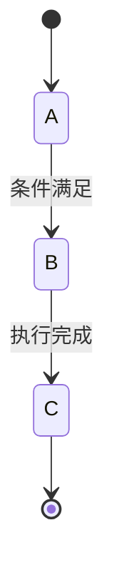
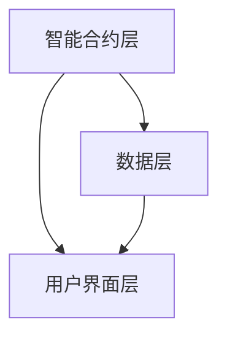

                 


# 巴菲特的资产负债表分析：智能合约对公司治理的影响

> **关键词**：智能合约，区块链，公司治理，资产负债表分析，巴菲特，财务分析

> **摘要**：本文探讨了智能合约在公司治理中的潜在应用，特别是其对传统资产负债表分析的优化。通过结合巴菲特的财务分析方法与区块链技术，文章分析了智能合约如何提升公司治理的透明度和效率，解决了传统财务分析中的痛点。

---

## 第一部分：引言

### 第1章：主题背景与研究意义

#### 1.1 问题背景

##### 1.1.1 资产负债表分析的重要性
资产负债表是企业财务健康状况的核心反映，是投资者、债权人和管理层决策的重要依据。巴菲特以其独特的财务分析方法闻名，他通过深入分析企业的资产负债表来评估其长期价值。

##### 1.1.2 智能合约的兴起与应用
智能合约是一种基于区块链技术的自动执行合同，能够自动验证和执行条款。随着区块链技术的发展，智能合约在金融、法律和企业治理领域的应用越来越广泛。

##### 1.1.3 传统公司治理的痛点与挑战
传统公司治理依赖于中心化的管理机构，存在效率低下、透明度不足、信息不对称等问题。如何利用技术手段优化公司治理，成为当前的重要课题。

#### 1.2 问题描述

##### 1.2.1 资产负债表分析的核心要素
资产负债表主要包括资产、负债和所有者权益三部分。传统分析方法依赖人工审核，存在耗时长、易出错的问题。

##### 1.2.2 智能合约在公司治理中的潜在作用
智能合约可以通过自动化和去中心化的方式，提升财务数据的透明度和准确性，优化公司治理流程。

##### 1.2.3 当前公司治理中的效率与透明度问题
传统公司治理模式存在效率低、信息不透明等问题，尤其是在跨部门和跨机构协作中，问题更加突出。

#### 1.3 问题解决

##### 1.3.1 利用智能合约优化资产负债表分析
通过智能合约自动验证和更新财务数据，减少人为错误，提升分析效率。

##### 1.3.2 提升公司治理的透明度与效率
智能合约的自动执行特性可以确保财务数据的实时更新和透明共享，提升公司治理的效率。

##### 1.3.3 实现智能合约与传统财务分析的结合
通过将智能合约嵌入到财务管理系统中，结合传统的财务分析方法，优化资产负债表分析流程。

#### 1.4 边界与外延

##### 1.4.1 智能合约的应用范围
智能合约主要应用于需要自动执行和验证的场景，如金融交易、合同履行等。

##### 1.4.2 资产负债表分析的边界
资产负债表分析主要关注企业的财务状况，不涉及企业的经营策略和市场行为。

##### 1.4.3 公司治理的数字化转型
智能合约是公司治理数字化转型的重要工具，但需要结合其他技术手段，如大数据和人工智能。

#### 1.5 核心概念结构与要素

##### 1.5.1 资产负债表分析的四要素
- 资产：企业的资源和权利。
- 负债：企业的债务和义务。
- 所有者权益：企业净资产的价值。
- 财务健康度：企业的综合财务状况。

##### 1.5.2 智能合约的核心属性
- 自动性：自动执行合同条款。
- 去中心化：基于区块链的分布式账本。
- 不可篡改性：数据的安全性和不可篡改性。

##### 1.5.3 公司治理的数字化架构
- 数字化决策：基于数据的决策支持。
- 实时监控：财务数据的实时更新和监控。
- 自动化执行：智能合约自动执行治理流程。

---

## 第二部分：智能合约与区块链基础

### 第2章：智能合约的核心原理

#### 2.1 智能合约的定义与特点

##### 2.1.1 智能合约的定义
智能合约是基于区块链技术的自动执行合同，能够在满足特定条件时自动执行或强制执行合同条款。

##### 2.1.2 智能合约的不可篡改性
智能合约的数据存储在区块链的分布式账本中，具有不可篡改的特性，确保数据的安全性和可靠性。

##### 2.1.3 智能合约的自动执行特性
智能合约能够在预设条件下自动执行，减少人为干预，提高效率。

#### 2.2 智能合约的工作原理

##### 2.2.1 智能合约的执行流程
1. 用户提交交易请求。
2. 智能合约验证交易条件。
3. 条件满足后，智能合约自动执行交易。
4. 交易结果记录在区块链中。

##### 2.2.2 智能合约的触发条件
智能合约的执行由预设的条件触发，例如时间、金额、特定事件等。

##### 2.2.3 智能合约的代码执行机制
智能合约的代码运行在区块链虚拟机中，通过区块链网络中的节点共同验证和执行。

#### 2.3 智能合约与区块链的关系

##### 2.3.1 区块链的分布式账本
区块链是一个去中心化的分布式账本，确保数据的安全性和不可篡改性。

##### 2.3.2 智能合约在区块链中的作用
智能合约是区块链上的可编程性体现，能够实现复杂的逻辑和自动化操作。

##### 2.3.3 智能合约的去中心化特性
智能合约通过去中心化的机制，避免了传统中心化机构的依赖，提高了系统的可靠性和安全性。

---

### 第3章：智能合约的数学模型与算法

#### 3.1 智能合约的数学模型

##### 3.1.1 智能合约的状态表示
智能合约的状态可以用布尔变量表示，例如：

$$
\text{状态} = \begin{cases}
\text{未执行} & \text{if } \text{条件未满足} \\
\text{执行中} & \text{if } \text{条件正在执行} \\
\text{已执行} & \text{if } \text{条件已满足}
\end{cases}
$$

##### 3.1.2 智能合约的条件判断
智能合约的条件判断可以用逻辑表达式表示：

$$
\text{条件} = (a \geq b) \land (c \leq d)
$$

##### 3.1.3 智能合约的执行流程
智能合约的执行流程可以用状态机模型表示，如图：



#### 3.2 智能合约的算法原理

##### 3.2.1 智能合约的条件判断逻辑
智能合约根据预设条件自动执行，例如：

```python
def execute_contract(a, b):
    if a >= b:
        return "执行成功"
    else:
        return "执行失败"
```

##### 3.2.2 智能合约的自动执行机制
智能合约的自动执行机制可以用以下伪代码表示：

```python
def automatic_execution():
    while True:
        check_conditions()
        if conditions_met():
            execute_transaction()
        else:
            continue
```

---

## 第三部分：智能合约在公司治理中的应用

### 第4章：智能合约与公司治理

#### 4.1 公司治理的数字化转型

##### 4.1.1 数字化决策
智能合约可以实时更新财务数据，支持基于数据的决策。

##### 4.1.2 实时监控
智能合约可以实时监控企业的财务状况，及时发现异常。

##### 4.1.3 自动化执行
智能合约可以自动执行治理流程，减少人为干预。

#### 4.2 智能合约在资产负债表分析中的应用

##### 4.2.1 资产的自动验证
智能合约可以自动验证资产的权属和价值。

##### 4.2.2 负债的自动核销
智能合约可以根据预设条件自动核销负债。

##### 4.2.3 所有者权益的自动更新
智能合约可以实时更新所有者权益，确保数据的准确性。

---

## 第五部分：项目实战

### 第5章：智能合约的实现与案例分析

#### 5.1 项目背景与目标

##### 5.1.1 项目背景
本项目旨在通过智能合约优化企业的资产负债表分析流程。

##### 5.1.2 项目目标
实现智能合约自动更新和验证企业的财务数据，提升公司治理的效率和透明度。

#### 5.2 系统功能设计

##### 5.2.1 系统功能模块
- 智能合约管理模块：负责智能合约的部署和管理。
- 财务数据更新模块：负责财务数据的自动更新和验证。
- 财务分析模块：负责资产负债表的分析和展示。

##### 5.2.2 系统功能流程
1. 用户提交财务数据。
2. 智能合约验证数据的准确性。
3. 数据验证通过后，更新到区块链中。
4. 财务分析模块自动生成资产负债表。

#### 5.3 系统架构设计

##### 5.3.1 系统架构
- 智能合约层：负责智能合约的执行和管理。
- 数据层：负责数据的存储和管理。
- 用户界面层：负责用户交互和数据展示。

##### 5.3.2 系统架构图



---

## 第六部分：总结与展望

### 第6章：挑战与未来展望

#### 6.1 智能合约在公司治理中的挑战

##### 6.1.1 技术挑战
智能合约的开发和部署需要高度的技术能力和专业知识。

##### 6.1.2 法律挑战
智能合约的法律地位和合规性问题尚未完全解决。

##### 6.1.3 监管挑战
智能合约的广泛应用需要监管机构的支持和规范。

#### 6.2 智能合约的未来展望

##### 6.2.1 智能合约与人工智能的结合
智能合约可以与人工智能技术结合，实现更智能的财务分析和决策。

##### 6.2.2 智能合约的普及与应用
随着技术的成熟，智能合约将在更多领域得到广泛应用。

##### 6.2.3 公司治理的全面数字化
智能合约将推动公司治理的全面数字化转型，实现更高效的管理。

---

## 结论

智能合约作为区块链技术的重要应用，为公司治理提供了新的可能性。通过结合巴菲特的资产负债表分析方法，智能合约可以在提升财务分析效率和透明度的同时，优化公司治理流程。尽管面临诸多挑战，但智能合约的未来发展潜力巨大，值得进一步研究和探索。

---

**作者：AI天才研究院/AI Genius Institute & 禅与计算机程序设计艺术 /Zen And The Art of Computer Programming**

