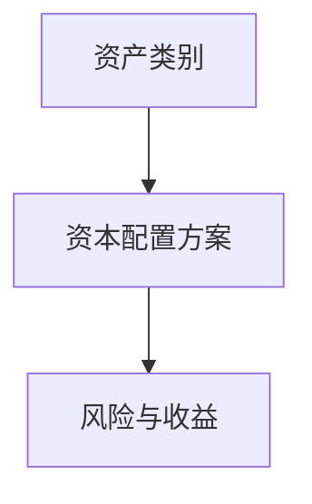
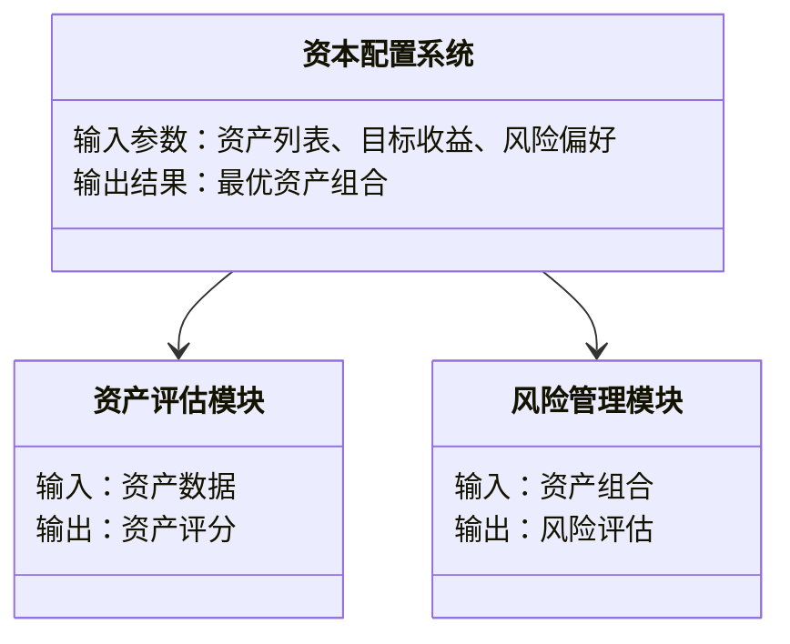
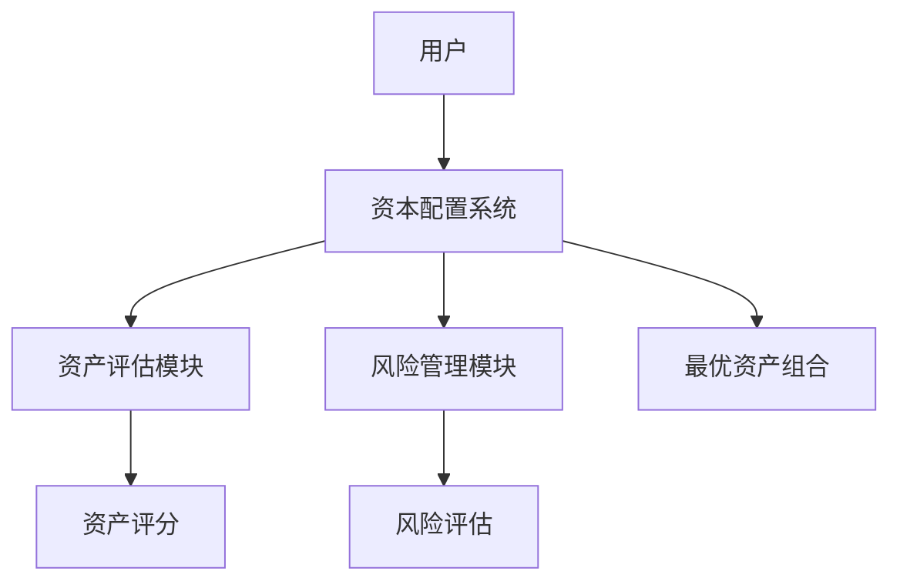
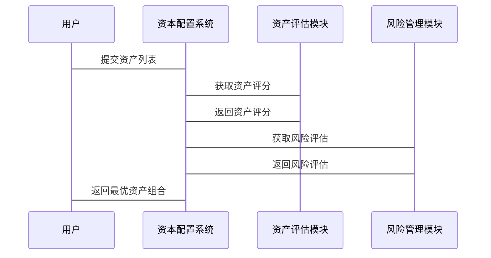

                 


# 巴菲特的资本配置艺术：如何有效分配公司资源

> **关键词**：资本配置、巴菲特、投资策略、资产分配、风险管理、收益最大化

> **摘要**：本文深入探讨了巴菲特的资本配置艺术，分析了其核心理念、策略和方法。从资本配置的基本概念到具体的算法原理，再到系统的架构设计和项目实战，结合现代投资组合理论和风险管理模型，详细解读了如何通过科学的资本分配实现公司资源的最优配置。本文还通过实际案例分析，展示了资本配置在企业战略中的重要性，并提供了可操作的实践建议。

---

## 第1章：资本配置的背景与重要性

### 1.1 资本配置的定义与背景

#### 1.1.1 资本配置的基本概念
资本配置是指将企业的可用资金分配到不同的资产或项目中，以实现收益最大化和风险最小化的过程。资本配置的核心在于如何在不同的资产类别之间分配资金，以平衡风险和收益。

#### 1.1.2 资本配置的历史发展
资本配置的理论和实践经历了从传统到现代的演变。传统资本配置方法注重单一资产的分析，而现代方法则强调资产组合的优化和风险分散。

#### 1.1.3 资本配置在企业中的地位
资本配置是企业财务管理的核心环节，直接影响企业的价值创造和风险控制。有效的资本配置能够帮助企业实现资源的最优利用，提升整体竞争力。

#### 1.1.4 巴菲特的资本配置理念
巴菲特的资本配置理念以长期投资和价值投资为核心，强调对企业内在价值的理解和市场机会的把握。他将资本配置视为企业创造价值的关键，注重资产的质量和长期增长潜力。

---

### 1.2 资本配置的重要性

#### 1.2.1 资本配置对企业价值的影响
资本配置直接决定了企业的投资回报。通过合理的资本分配，企业可以在不同资产之间找到最佳的平衡点，实现收益的最大化。

#### 1.2.2 资本配置与风险控制的关系
资本配置不仅是收益的分配，更是风险的管理。通过分散投资和优化资产组合，资本配置能够有效降低企业的整体风险。

#### 1.2.3 资本配置在不同行业中的应用
资本配置在不同行业中的应用策略有所不同。例如，制造业可能更注重固定资产的投资，而科技企业则更关注研发和创新。

---

### 1.3 巴菲特的资本配置成功案例

#### 1.3.1 巴菲特的长期投资策略
巴菲特以长期投资著称，他注重企业的内在价值，选择那些具有持续增长潜力的企业进行投资。

#### 1.3.2 巴菲特的资产分配策略
巴菲特的资产分配策略注重资产的质量和流动性，他倾向于投资那些具有稳定收益和良好管理的公司。

#### 1.3.3 巴菲特的风险管理方法
巴菲特通过分散投资和严格的风险评估，有效控制了投资组合的整体风险。

---

## 第2章：资本配置的核心概念与联系

### 2.1 资本配置的基本原理

#### 2.1.1 资产配置策略
资产配置策略是资本配置的核心，包括确定资产的类型、比例和分配方式。

#### 2.1.2 投资组合优化
投资组合优化是通过数学模型和算法，找到最优的资产组合，以实现收益和风险的平衡。

#### 2.1.3 风险管理与收益平衡
风险管理是资本配置的重要组成部分，通过有效的风险管理，可以在不影响收益的情况下降低整体风险。

---

### 2.2 资本配置的核心要素对比

#### 2.2.1 传统投资与现代投资组合理论的对比
| 对比维度       | 传统投资                   | 现代投资组合理论                 |
|----------------|----------------------------|----------------------------------|
| 投资理念       | 个别资产分析               | 资产组合优化                   |
| 风险管理       | 侧重单个资产风险           | 侧重组合风险                   |
| 收益目标       | 追求单个资产收益           | 追求组合收益最大化               |

#### 2.2.2 不同资产类别之间的关系
资产类别之间的关系可以通过ER实体关系图来表示：



---

## 第3章：资本配置的算法原理

### 3.1 现代投资组合理论（MPT）

#### 3.1.1 均值-方差优化
均值-方差优化是MPT的核心方法，通过最小化投资组合的方差，实现收益的最大化。

$$ \text{方差} = \sigma^2 = \frac{1}{n}\sum_{i=1}^{n}(x_i - \bar{x})^2 $$

#### 3.1.2 马科维茨的有效前沿
马科维茨的有效前沿是指在给定风险下，收益最大的投资组合，或者在给定收益下，风险最小的投资组合。

#### 3.1.3 资本资产定价模型（CAPM）
CAPM用于计算资产的预期收益，公式为：

$$ E(r_i) = r_f + \beta_i (E(r_m) - r_f) $$

---

### 3.2 资本配置的数学模型

#### 3.2.1 方差和协方差的计算
$$ \text{协方差} = \text{Cov}(x, y) = \frac{1}{n}\sum_{i=1}^{n}(x_i - \bar{x})(y_i - \bar{y}) $$

#### 3.2.2 资本资产定价模型（CAPM）
$$ E(r_i) = r_f + \beta_i (E(r_m) - r_f) $$

---

## 第4章：资本配置的系统分析与架构设计

### 4.1 问题场景介绍
资本配置系统需要解决的问题包括：如何优化资产组合、如何控制风险、如何实现收益最大化。

### 4.2 系统功能设计

#### 4.2.1 领域模型


### 4.3 系统架构设计


### 4.4 接口设计与交互流程


---

## 第5章：资本配置的项目实战

### 5.1 环境安装
安装Python和相关库（如NumPy、Pandas、Matplotlib）。

### 5.2 核心实现代码
```python
import numpy as np
import pandas as pd
import matplotlib.pyplot as plt

# 示例数据
assets = ['股票', '债券', '现金']
returns = [0.1, 0.05, 0]

# 计算方差
mean_return = np.mean(returns)
variance = np.var(returns)

print(f"平均收益：{mean_return}")
print(f"方差：{variance}")
```

### 5.3 代码应用解读与分析
通过上述代码，我们可以计算资产的平均收益和方差，从而评估资产的风险和收益。

---

## 第6章：资本配置的最佳实践

### 6.1 小结
资本配置是企业财务管理的核心，通过科学的资本分配，可以实现收益的最大化和风险的最小化。

### 6.2 注意事项
- 资本配置需要结合企业的实际情况。
- 资本配置需要动态调整。
- 资本配置需要结合市场环境。

### 6.3 拓展阅读
- 现代投资组合理论（MPT）
- 资本资产定价模型（CAPM）
- 风险管理与投资组合优化

---

## 作者：AI天才研究院/AI Genius Institute & 禅与计算机程序设计艺术 /Zen And The Art of Computer Programming

---

这篇文章通过系统的分析和详细的代码示例，深入探讨了巴菲特的资本配置艺术，结合现代投资组合理论和风险管理模型，为读者提供了科学的资本分配方法和实践建议。

