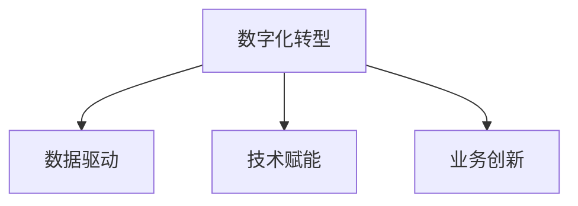
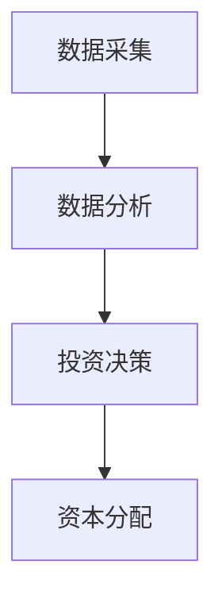
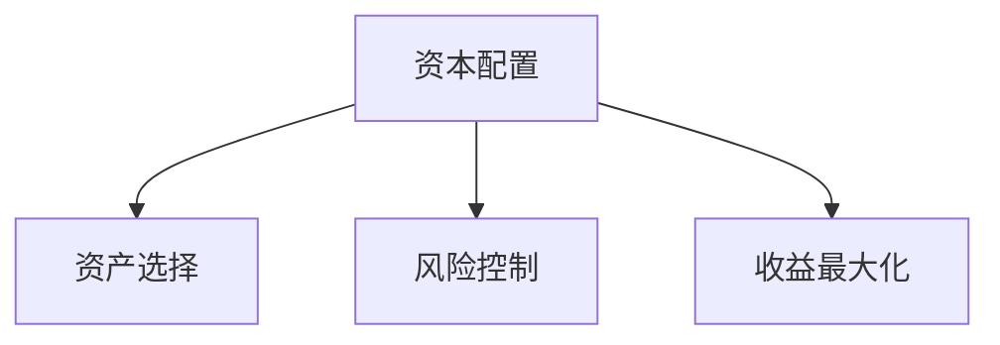
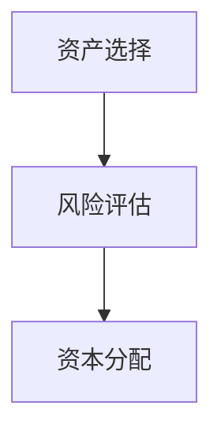
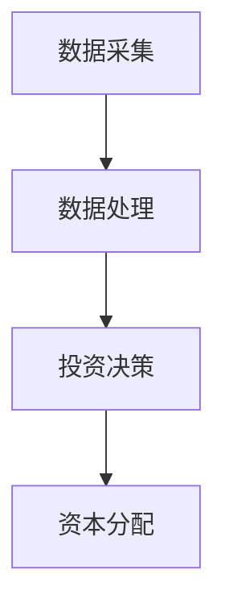
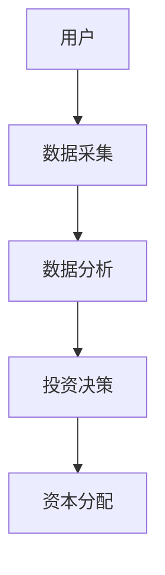

                 


# 巴菲特的资本配置艺术：数字化转型中的资源优化

## 关键词：
- 巴菲特
- 资本配置艺术
- 数字化转型
- 资源优化
- 价值投资
- 企业架构

## 摘要：
本文系统阐述了巴菲特的资本配置艺术在数字化转型中的应用，分析了资本配置的核心理论与数字化转型的结合方式，探讨了数据驱动的资本配置策略、技术赋能的资本优化路径，以及资本配置在数字化转型中的风险控制与长期价值实现。通过理论分析与实际案例结合，本文提出了在数字化时代如何优化资源配置、实现股东价值最大化的实践方案。

---

# 第一部分：资本配置艺术的背景与概念

## 第1章：资本配置艺术的背景与概念

### 1.1 资本配置艺术的定义与核心要素

#### 1.1.1 资本配置的基本概念
资本配置是指将企业的资金分配到不同的资产或项目中，以实现股东价值最大化的过程。资本配置的核心在于优化资源分配，平衡风险与收益，确保企业资产的最优利用。

$$资本配置 = \text{资源分配} + \text{风险控制} + \text{价值创造}$$

#### 1.1.2 资本配置的核心要素
资本配置涉及多个关键要素，包括：
- 资产类别：现金、股票、债券等。
- 投资目标：收益最大化、风险最小化等。
- 时间维度：短期与长期投资的平衡。

**资本配置的核心要素对比表：**

| 要素 | 描述 |
|------|------|
| 资产类别 | 不同资产的收益与风险特征 |
| 投资目标 | 收益与风险的权衡 |
| 时间维度 | 短期与长期投资的平衡 |

#### 1.1.3 资本配置的边界与外延
资本配置的边界在于企业的财务资源限制和战略目标，而其外延则涉及企业内外部资源的协同优化。

---

### 1.2 数字化转型的背景与特征

#### 1.2.1 数字化转型的定义
数字化转型是指企业通过数字技术的深度应用，重构业务模式、组织架构和运营流程，以实现价值创造的过程。

#### 1.2.2 数字化转型的核心特征
- 数据驱动：依赖数据进行决策。
- 技术赋能：利用人工智能、大数据等技术优化资源。
- 业务创新：通过数字化实现业务模式的创新。

**数字化转型的核心特征对比图（mermaid）：**



#### 1.2.3 数字化转型与资本配置的关系
数字化转型通过技术赋能和数据驱动，为资本配置提供了新的工具和方法，而资本配置则为数字化转型提供了资金和资源支持。

---

## 第2章：资本配置艺术的核心理论

### 2.1 股东价值最大化原则

#### 2.1.1 股东价值最大化的内涵
股东价值最大化是资本配置的核心目标，强调通过优化资源分配，实现企业价值的最大化。

$$股东价值 = \text{企业价值} - \text{债务价值}$$

#### 2.1.2 股东价值最大化的实现路径
- 优化资产配置。
- 控制财务风险。
- 提高投资回报率。

#### 2.1.3 股东价值最大化与企业资源配置的关系
股东价值最大化依赖于有效的资源配置，而资源配置的优化又能进一步推动股东价值的增长。

---

### 2.2 资源优化配置的原理

#### 2.2.1 资源优化配置的基本原理
资源优化配置通过数学模型和算法，实现资源的最优分配。

$$\text{资源配置优化} = \min_{x} \{c^T x \mid A x = b, x \geq 0\}$$

#### 2.2.2 资源优化配置的数学模型
资源优化配置可以通过线性规划模型实现。

$$\text{最大化} \quad z = c^T x$$
$$\text{约束} \quad A x = b$$
$$x \geq 0$$

#### 2.2.3 资源优化配置的实现方法
- 线性规划。
- 动态规划。
- 遗传算法。

---

## 第3章：资本配置艺术与数字化转型的结合

### 3.1 数字化转型中的资本配置特点

#### 3.1.1 数据驱动的资本配置
数据驱动的资本配置通过分析历史数据和市场趋势，优化投资决策。

**数据驱动的资本配置流程图（mermaid）：**



#### 3.1.2 技术赋能的资本配置
技术赋能的资本配置利用人工智能和大数据技术，提高资本配置的效率和准确性。

#### 3.1.3 数字化转型中的资本分配优化
数字化转型通过技术手段优化资本分配，降低投资风险，提高投资回报。

---

## 第4章：资本配置艺术的核心概念与联系

### 4.1 资本配置的核心概念与原理

#### 4.1.1 资本配置的原理
资本配置的原理包括资产选择、风险控制和收益最大化。

**资本配置的原理图（mermaid）：**



#### 4.1.2 资本配置的核心要素
资本配置的核心要素包括资产类别、投资目标和时间维度。

---

## 第5章：资本配置艺术的数字化转型应用

### 5.1 数字化转型中的资本配置策略

#### 5.1.1 数据驱动的资本配置策略
数据驱动的资本配置策略通过分析市场数据和企业内部数据，优化资本分配。

#### 5.1.2 技术赋能的资本配置策略
技术赋能的资本配置策略利用人工智能和大数据技术，提高资本配置的效率和准确性。

---

# 第二部分：资本配置艺术的核心概念与联系

## 第6章：资本配置的核心概念与原理

### 6.1 资本配置的原理

#### 6.1.1 资本配置的基本原理
资本配置的基本原理包括资产选择、风险控制和收益最大化。

---

## 第7章：资本配置的核心要素与联系

### 7.1 资本配置的核心要素

#### 7.1.1 资本配置的核心要素
资本配置的核心要素包括资产类别、投资目标和时间维度。

---

# 第三部分：资本配置艺术的系统分析与架构设计

## 第8章：资本配置系统的系统分析与架构设计

### 8.1 问题场景介绍

#### 8.1.1 问题背景
在数字化转型中，企业需要优化资本配置，实现资源的最优利用。

#### 8.1.2 项目介绍
本项目旨在通过数字化技术优化资本配置，实现股东价值最大化。

### 8.2 系统功能设计

#### 8.2.1 领域模型设计
领域模型设计包括资产选择、风险评估和资本分配。

**领域模型设计图（mermaid）：**



### 8.3 系统架构设计

#### 8.3.1 系统架构图
系统架构图展示了数字化转型中的资本配置系统架构。

**系统架构图（mermaid）：**



### 8.4 系统接口设计

#### 8.4.1 系统接口设计
系统接口设计包括数据接口和投资决策接口。

### 8.5 系统交互设计

#### 8.5.1 系统交互图
系统交互图展示了资本配置系统的交互流程。

**系统交互图（mermaid）：**



---

# 第四部分：资本配置艺术的项目实战

## 第9章：资本配置项目的实战分析

### 9.1 环境安装

#### 9.1.1 环境要求
- 操作系统：Windows 10 或更高版本。
- Python版本：Python 3.8 或更高版本。
- 软件工具：Jupyter Notebook、Python库（如NumPy、Pandas、Scikit-learn）。

### 9.2 核心代码实现

#### 9.2.1 数据处理代码
```python
import pandas as pd
import numpy as np

# 数据加载
data = pd.read_csv('data.csv')

# 数据清洗
data = data.dropna()
```

#### 9.2.2 投资决策代码
```python
from sklearn.linear_model import LinearRegression

# 模型训练
model = LinearRegression()
model.fit(X_train, y_train)

# 模型预测
y_pred = model.predict(X_test)
```

### 9.3 案例分析

#### 9.3.1 案例背景
假设某企业需要优化资本配置，实现股东价值最大化。

#### 9.3.2 案例分析
通过数据驱动的方法，分析企业的资产配置情况，优化资本分配。

### 9.4 项目小结

#### 9.4.1 项目总结
通过数字化技术优化资本配置，实现资源的最优利用，提高企业价值。

---

# 第五部分：资本配置艺术的总结与展望

## 第10章：资本配置艺术的总结与展望

### 10.1 总结

#### 10.1.1 核心观点总结
资本配置艺术在数字化转型中具有重要作用，通过数据驱动和技术创新，实现资源的优化配置。

### 10.2 展望

#### 10.2.1 未来发展方向
未来，资本配置艺术将更加依赖于数字化技术，实现更高效的资源配置。

---

## 作者

**作者：AI天才研究院/AI Genius Institute & 禅与计算机程序设计艺术 /Zen And The Art of Computer Programming**

---

以上是完整的博客文章目录和内容框架，您可以根据需要进一步补充具体章节的内容。

