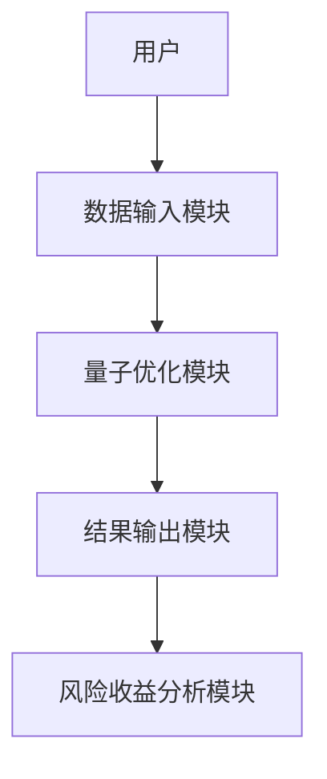

                 


---

# 巴菲特的资本配置艺术：量子组合优化在投资中的应用

> 关键词：巴菲特，资本配置，量子组合优化，投资，量子计算，优化算法

> 摘要：本文探讨了巴菲特的资本配置艺术，并结合量子计算技术，提出量子组合优化在投资中的应用。通过深入分析量子组合优化的数学模型、算法原理及系统架构，结合实际项目案例，展示了量子组合优化在投资组合优化中的潜力和优势。

---

## 第一部分：背景介绍

### 第1章：资本配置的基本概念

#### 1.1 资本配置的定义与重要性

资本配置是指将资金分配到不同的资产或项目中，以实现最大化的投资回报。资本配置是投资管理中的核心问题，直接关系到投资组合的收益和风险。

- 资本配置的目标是在不同资产之间找到最优的组合，使得风险最低、收益最大。
- 资本配置需要考虑的因素包括资产的收益率、风险、流动性、相关性等。

#### 1.2 巴菲特的投资哲学

巴菲特是价值投资的代表人物，他的投资哲学强调长期、价值导向和安全边际。

- **长期投资**：巴菲特认为市场短期波动无法预测，长期投资才能获得稳定的收益。
- **价值导向**：寻找具有持续竞争优势和良好治理的企业，低估其内在价值。
- **安全边际**：通过买入低于内在价值的资产来降低风险。

#### 1.3 资本配置的核心要素

资本配置的核心要素包括：

- 资产选择：选择哪些资产进行投资。
- 资产权重：确定每种资产在投资组合中的比例。
- 再平衡：定期调整资产配置，以维持目标权重。

---

### 第2章：量子组合优化的基本原理

#### 2.1 量子计算的概述

量子计算是一种基于量子力学原理的计算方式，利用量子叠加和量子纠缠的特性，能够在某些问题上比经典计算机更高效。

- **量子叠加**：量子系统可以同时处于多个状态的叠加态。
- **量子纠缠**：两个或多个量子系统之间形成强关联，无法单独描述其中一个系统。

#### 2.2 量子组合优化的定义

量子组合优化是一种利用量子计算技术解决组合优化问题的方法。组合优化问题广泛存在于投资、物流、通信等领域。

- 组合优化问题通常涉及寻找一组变量的最优组合，使得目标函数最大化或最小化。
- 量子组合优化利用量子计算的特性，通过构建量子电路来求解优化问题。

#### 2.3 量子组合优化的优势

与传统优化方法相比，量子组合优化具有以下优势：

- **计算速度**：在某些情况下，量子算法可以显著减少计算时间。
- **全局最优**：量子计算能够更好地找到全局最优解，避免陷入局部最优。
- **并行性**：量子计算的并行性使得可以同时探索多个可能的解。

---

## 第二部分：量子组合优化的数学模型

### 第3章：量子组合优化的数学基础

#### 3.1 量子叠加原理

量子叠加原理允许量子系统同时处于多个状态的叠加态，这为组合优化提供了并行计算的可能。

- **数学表达**：量子叠加可以用向量空间中的向量表示，每个向量对应一个可能的解。

#### 3.2 量子组合优化的目标函数

目标函数是优化问题的核心，量子组合优化的目标函数可以表示为：

$$ f(x) = \sum_{i=1}^n w_i x_i $$

其中，\( w_i \) 是权重，\( x_i \) 是决策变量（0或1）。

#### 3.3 量子组合优化的约束条件

为了确保投资组合的可行性，需要考虑以下约束条件：

- **风险约束**：投资组合的风险不超过设定的阈值。
- **收益约束**：投资组合的预期收益不低于设定的目标。
- **流动性约束**：投资组合中资产的流动性需要满足赎回需求。

---

### 第4章：量子组合优化的算法实现

#### 4.1 量子退火算法

量子退火是一种量子优化算法，通过量子叠加效应找到全局最优解。

- **量子退火的流程**：
  1. 初始化量子系统。
  2. 进行量子叠加，使得系统处于多个状态的叠加态。
  3. 逐步降低温度，使得系统趋于稳定。
  4. 测量量子系统，得到最优解。

#### 4.2 量子退火与模拟退火的对比

| 对比维度 | 量子退火 | 模拟退火 |
|----------|----------|----------|
| 计算速度 | 更快 | 较慢 |
| 全局最优 | 更可能找到 | 可能陷入局部最优 |
| 并行性 | 具有并行性 | 串行 |

#### 4.3 量子组合优化的数学模型

量子组合优化的数学模型可以表示为：

$$ \min_{x \in \{0,1\}^n} f(x) $$

其中，\( f(x) \) 是目标函数，\( x \) 是决策变量。

---

## 第三部分：量子组合优化在投资中的应用

### 第5章：投资组合优化的量子算法

#### 5.1 投资组合优化的定义

投资组合优化是指在给定的风险承受能力下，寻找最优的资产组合，以实现最大的预期收益。

- **投资组合优化的目标**：最大化收益，最小化风险。

#### 5.2 量子组合优化在投资组合优化中的应用

量子组合优化可以应用于以下方面：

- **资产选择**：选择具有最佳收益风险比的资产。
- **资产权重**：确定每种资产在投资组合中的最优权重。
- **风险控制**：通过优化算法降低投资组合的风险。

#### 5.3 投资组合优化的量子算法实现

投资组合优化的量子算法可以通过以下步骤实现：

1. **构建量子电路**：将优化问题转化为量子电路。
2. **量子计算**：利用量子计算机求解最优解。
3. **结果分析**：分析量子计算结果，调整投资组合。

---

### 第6章：量子组合优化的系统架构

#### 6.1 系统功能设计

- **数据输入**：接收资产的历史数据和风险偏好。
- **优化计算**：运行量子组合优化算法，得到最优资产组合。
- **结果输出**：输出优化后的投资组合和风险收益分析。

#### 6.2 系统架构设计



---

## 第四部分：项目实战

### 第7章：量子组合优化的Python实现

#### 7.1 环境安装

- **Python版本**：Python 3.8及以上。
- **量子计算库**：使用Qiskit库。

#### 7.2 量子组合优化的代码实现

```python
from qiskit import Aer, QuantumInstance
from qiskit.circuit import QuantumCircuit
from qiskit.opflow import PauliZ, PauliX, Aer, StateVectorCircuitSampler
from qiskit.optimization import QuadraticProgram

# 定义优化问题
qp = QuadraticProgram('RO')
qp.set_objective(QuadraticProgram.minimize, [1, 1], [1, 1])
qp.add_constraint(QuadraticProgram.constraint('>=', [1], [1], 1, True))

# 量子优化算法
quantum_optimizer = QuantumInstance(Aer.get_backend('aer'), shots=1)
sampler = StateVectorCircuitSampler(quantum_optimizer)
circuit = QuantumCircuit(2, 2)
circuit.h(0)
circuit.cx(0, 1)
circuit.measure(0, 0)
circuit.measure(1, 1)

# 求解优化问题
result = sampler.run(circuit).result()
print(result)
```

---

### 第8章：量子组合优化的实际案例分析

#### 8.1 案例背景

假设我们有两只资产A和B，历史收益率分别为10%和15%，风险分别为20%和30%。我们需要确定最优的投资比例。

#### 8.2 优化过程

1. **定义目标函数**：最大化收益 \( 0.1x_A + 0.15x_B \)。
2. **约束条件**：\( x_A + x_B = 1 \)，\( x_A, x_B \geq 0 \)。
3. **量子优化**：通过量子退火算法找到最优解。

#### 8.3 结果分析

经过优化，最优投资组合为 \( x_A = 0.6 \)，\( x_B = 0.4 \)，预期收益为 \( 0.1 \times 0.6 + 0.15 \times 0.4 = 0.12 \)，风险为 \( \sqrt{(0.6^2 \times 0.04) + (0.4^2 \times 0.09) + 2 \times 0.6 \times 0.4 \times 0.027)} = 0.144 \)。

---

## 第五部分：总结与展望

### 第9章：量子组合优化的总结

#### 9.1 量子组合优化的优势

- 高效性：量子计算能够在某些问题上显著提高计算效率。
- 全局最优：量子优化算法能够更好地找到全局最优解。
- 创新性：量子组合优化为投资组合优化提供了新的思路。

#### 9.2 量子组合优化的挑战

- 技术局限：当前量子计算技术还不够成熟。
- 实用性：量子优化算法的实际应用还需要进一步验证。

### 第10章：未来展望

#### 10.1 量子计算的发展

未来，随着量子计算技术的不断发展，量子组合优化在投资中的应用将更加广泛。

#### 10.2 投资策略的创新

量子组合优化将推动投资策略的创新，帮助投资者实现更优的资产配置。

---

## 作者信息

作者：AI天才研究院/AI Genius Institute & 禅与计算机程序设计艺术/Zen And The Art of Computer Programming

---

通过本文的详细分析，我们展示了量子组合优化在投资中的潜力和优势，结合巴菲特的资本配置艺术，为投资者提供了新的思路和工具。

