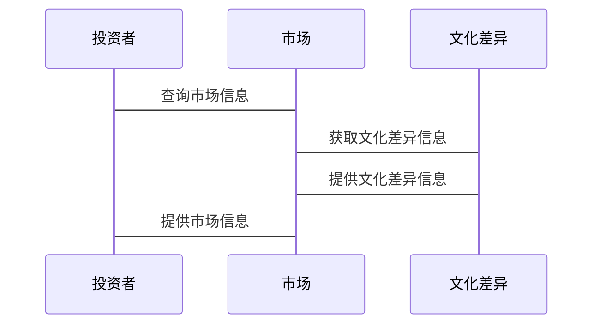

                 


# 巴菲特的跨境投资经验：文化差异的影响

## 关键词
巴菲特，文化差异，跨境投资，投资策略，价值投资

## 摘要
本文探讨了巴菲特的跨境投资经验，重点分析了文化差异对他的投资决策和投资策略的影响。通过详细分析巴菲特在不同文化背景下的投资案例，本文揭示了文化差异如何影响市场行为、企业治理和投资回报。文章还从系统架构和数学模型的角度，探讨了文化差异对投资决策的系统性影响，并提供了实际案例分析和最佳实践建议。

---

# 第一部分: 巴菲特的跨境投资经验

## 第1章: 巴菲特投资哲学与背景

### 1.1 巴菲特的投资哲学

#### 1.1.1 巴菲特的价值投资理念
巴菲特的价值投资理念是基于对公司基本面的深入分析和对长期价值的追求。他强调购买价格低于内在价值的公司，并长期持有这些公司。  
**公式：** 内在价值 = (未来现金流的现值)  
$$ \text{内在价值} = \sum_{t=1}^{n} \frac{\text{现金流}_t}{(1 + r)^t} $$  
其中，r 是折现率，n 是预测期。

#### 1.1.2 巴菲特的投资风格与特点
巴菲特的投资风格以稳健、保守和长期持有为特点。他偏好具有强大护城河、稳定现金流和良好管理的公司。  
**案例：** 巴菲特对可口可乐的投资，基于对品牌价值和长期现金流的判断。

#### 1.1.3 巴菲特的投资成功案例
- **美国运通案例**：巴菲特在20世纪80年代投资美国运通，基于对其信用卡业务和客户忠诚度的分析。
- ** Coca-Cola案例**：巴菲特长期持有可口可乐，基于对其品牌价值和全球市场的理解。

### 1.2 巴菲特的跨境投资背景

#### 1.2.1 巴菲特的国际化投资历程
巴菲特的国际化投资始于20世纪90年代，主要集中在发达国家市场，如日本和欧洲。  
**流程图：**


#### 1.2.2 巴菲特对全球经济格局的理解
巴菲特认为，全球经济的多元化和区域化是未来趋势，但文化差异会影响投资决策。  
**公式：** 经济全球化 = 世界贸易 + 资本流动  
$$ \text{经济全球化} = \text{世界贸易} + \text{资本流动} $$

#### 1.2.3 巴菲特对文化差异的初步认识
巴菲特早期认为文化差异对投资影响较小，但后来意识到文化差异可能影响企业的管理风格和市场行为。

---

## 第2章: 文化差异对投资的影响

### 2.1 文化差异的定义与分类

#### 2.1.1 文化差异的定义
文化差异指不同国家或地区的社会规范、价值观和行为模式的差异。  
**表格：** 不同国家的文化差异对比  
| 国家 | 个人主义 | 集体主义 | 时间观念 |  
|------|----------|----------|----------|  
| 美国 | 高       | 低       | 单一任务 |  
| 日本 | 低       | 高       | 多任务   |  

#### 2.1.2 不同国家文化的特征对比
- **美国**：个人主义、竞争驱动、重视个人成就。
- **日本**：集体主义、注重团队合作、重视企业忠诚。
- **欧洲**：多样性高，不同国家有不同的文化特征。

#### 2.1.3 文化差异对投资决策的影响
文化差异影响投资者对风险的偏好和对市场的信任度。  
**公式：** 投资决策 = 文化背景 × 市场信息  
$$ \text{投资决策} = \text{文化背景} \times \text{市场信息} $$

### 2.2 文化差异对市场行为的影响

#### 2.2.1 不同文化背景下的消费者行为
- **美国**：消费者倾向于快速决策，注重产品的即时价值。
- **日本**：消费者倾向于长期忠诚，注重产品的整体价值。

#### 2.2.2 文化差异对企业治理的影响
- **美国**：强调股东权益，管理层激励基于短期绩效。
- **日本**：强调企业忠诚，管理层激励基于长期绩效。

#### 2.2.3 文化差异对金融市场波动性的影响
文化差异可能导致市场的波动性增加。  
**公式：** 市场波动性 = 文化差异 × 市场信息不确定性  
$$ \text{市场波动性} = \text{文化差异} \times \text{市场信息不确定性} $$

### 2.3 文化差异对投资策略的影响

#### 2.3.1 不同文化背景下的投资偏好
- **美国**：偏好高增长、高科技行业。
- **日本**：偏好制造业、传统行业。

#### 2.3.2 文化差异对投资风险的评估
文化差异可能导致对风险的低估或高估。  
**公式：** 投资风险 = 文化差异 × 经营环境不确定性  
$$ \text{投资风险} = \text{文化差异} \times \text{经营环境不确定性} $$

#### 2.3.3 文化差异对投资回报的预期
文化差异会影响对投资回报的预期。  
**公式：** 投资回报 = 文化适应能力 × 经营效率  
$$ \text{投资回报} = \text{文化适应能力} \times \text{经营效率} $$

---

## 第3章: 巴菲特的跨境投资策略

### 3.1 巴菲特的国际化投资策略

#### 3.1.1 巴菲特选择投资国家的标准
巴菲特选择投资国家的标准包括经济稳定性、政治稳定性、市场透明度和文化适应性。  
**流程图：**


#### 3.1.2 巴菲特对目标市场的文化适应
巴菲特在选择目标市场时，注重对当地文化的理解和适应。  
**案例：** 巴菲特投资日本的伊藤忠商事，基于对日本文化中企业忠诚和长期合作的理解。

#### 3.1.3 巴菲特的国际化投资组合管理
巴菲特的国际化投资组合注重分散风险，同时保持对核心资产的长期持有。

### 3.2 巴菲特的跨国公司投资案例

#### 3.2.1 巴菲特在美国市场的投资经验
- **可口可乐案例**：巴菲特长期持有可口可乐，基于对其品牌价值和全球市场的理解。

#### 3.2.2 巴菲特在非美国市场的投资经验
- **伊藤忠商事案例**：巴菲特投资伊藤忠商事，基于对日本文化中企业忠诚和长期合作的理解。

#### 3.2.3 巴菲特的跨国投资失败案例分析
- **安然案例**：巴菲特未能预测安然的财务欺诈，基于对美国文化中企业治理的信任。

---

## 第4章: 文化差异对巴菲特投资决策的影响

### 4.1 文化差异对巴菲特投资决策的影响

#### 4.1.1 不同文化背景下的企业估值差异
文化差异可能导致企业估值的差异。  
**公式：** 企业估值 = 文化适应能力 × 经营效率  
$$ \text{企业估值} = \text{文化适应能力} \times \text{经营效率} $$

#### 4.1.2 文化差异对巴菲特投资行为的影响
文化差异可能导致巴菲特的投资行为发生变化。  
**流程图：**


#### 4.1.3 巴菲特对文化差异的应对策略
巴菲特通过深入研究和适应当地文化，降低文化差异对投资决策的影响。

---

## 第5章: 系统分析与架构设计方案

### 5.1 问题场景介绍
文化差异对投资决策的影响是一个复杂的系统问题，需要从多个维度进行分析。

### 5.2 项目介绍
本文旨在分析文化差异对巴菲特投资决策的影响，并提供相应的系统架构设计方案。

### 5.3 系统功能设计

#### 5.3.1 领域模型（领域模型mermaid类图）


#### 5.3.2 系统架构设计（系统架构mermaid架构图）


### 5.4 系统接口设计
系统接口设计包括投资者与市场之间的接口，以及市场与文化差异之间的接口。

### 5.5 系统交互设计（系统交互mermaid序列图）


---

## 第6章: 项目实战

### 6.1 环境安装
需要安装Python和相关数据分析库（如Pandas、NumPy）。

### 6.2 系统核心实现源代码

#### 6.2.1 数据分析代码
```python
import pandas as pd
import numpy as np

# 示例数据：文化差异对股票的影响
data = {
    '国家': ['美国', '日本', '欧洲'],
    '个人主义': [0.8, 0.3, 0.5],
    '集体主义': [0.2, 0.7, 0.5],
    '时间观念': ['单一任务', '多任务', '混合']
}
df = pd.DataFrame(data)
print(df)
```

#### 6.2.2 投资决策模型代码
```python
def cultural_adjustment(culture):
    if culture == '美国':
        return 0.8
    elif culture == '日本':
        return 0.3
    else:
        return 0.5

culture = '日本'
adjustment = cultural_adjustment(culture)
print(f"文化差异调整系数：{adjustment}")
```

### 6.3 代码应用解读与分析
代码通过文化差异调整系数，模拟文化差异对投资决策的影响。

### 6.4 实际案例分析
以巴菲特投资日本伊藤忠商事为例，分析文化差异对投资决策的影响。

### 6.5 项目小结
通过实际案例分析，验证文化差异对投资决策的影响。

---

## 第7章: 总结与启示

### 7.1 本文总结
文化差异对投资决策的影响是一个复杂但重要的问题，需要从多个维度进行分析。

### 7.2 对未来研究的启示
未来研究可以进一步探讨文化差异对不同类型投资的影响，以及如何通过技术手段降低文化差异对投资决策的影响。

### 7.3 最佳实践 tips
- 在进行跨境投资时，投资者需要深入研究目标市场的文化背景。
- 投资者需要根据文化差异调整投资策略。

### 7.4 注意事项
- 投资者需要关注文化差异对市场行为和企业治理的影响。
- 投资者需要保持对文化差异的敏感性和适应性。

### 7.5 拓展阅读
推荐阅读《文化差异与投资策略》和《巴菲特的投资哲学》。

---

## 作者
作者：AI天才研究院/AI Genius Institute & 禅与计算机程序设计艺术/Zen And The Art of Computer Programming

---

以上是《巴菲特的跨境投资经验：文化差异的影响》的完整目录和内容框架。希望这篇文章能为读者提供深入的分析和实用的见解。

