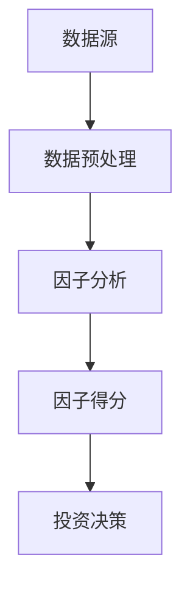

                 


# 巴菲特的跨界投资：从纺织到科技的转变

## 关键词：巴菲特，价值投资，科技投资，投资策略，跨界转型

## 摘要：本文探讨了巴菲特从传统的纺织业投资转向科技行业的策略转变，分析了其投资理念的演变、科技行业的特点、价值投资与成长投资的对比，以及在科技领域的投资案例。通过因子分析模型和投资决策支持系统的构建，详细阐述了巴菲特的投资策略及其在科技行业的应用。

---

### 第1章：巴菲特投资理念概述

#### 1.1 价值投资的核心理念

巴菲特的价值投资理念强调以低于内在价值的价格买入优秀的公司，并长期持有。其核心在于对公司基本面的深入分析，寻找具有持续竞争优势和良好管理的公司。

- **内在价值**：公司未来现金流的现值。
- **安全边际**：买入价格与内在价值的差距，确保投资的安全性。

#### 1.2 从纺织业到科技行业的转变

随着科技行业的崛起，纺织业的低增长和高竞争使巴菲特的投资组合逐渐转向科技领域。科技行业的高增长潜力和创新性吸引了巴菲特的关注。

- **纺织业的局限性**：低利润率，受经济周期影响大。
- **科技行业的优势**：高增长，技术创新能力强。

---

### 第2章：科技行业的投资特点

#### 2.1 科技行业的定义与分类

科技行业涵盖软件、硬件、互联网等多个领域，其特点是创新速度快，市场变化剧烈。

- **软件行业**：依赖于技术更新，边际成本低。
- **硬件行业**：技术壁垒高，研发投入大。

#### 2.2 科技行业的投资风险与机遇

科技行业的高波动性和高风险与高回报并存。技术变革和市场周期对投资决策影响深远。

- **风险**：技术淘汰、竞争激烈。
- **机遇**：技术创新、市场扩张。

---

### 第3章：价值投资与成长投资的对比

#### 3.1 价值投资与成长投资的定义对比

- **价值投资**：寻找被市场低估的公司，注重安全边际。
- **成长投资**：投资于高成长潜力的公司，注重未来收益。

| 投资策略 | 价值投资 | 成长投资 |
|----------|-----------|----------|
| 标准     | 低于内在价值 | 高成长性 |
| 持股时间 | 长期持有 | 长期持有 |
| 风险     | 中等 | 高 |

#### 3.2 价值与成长投资的属性特征对比

价值投资注重安全性和稳定性，而成长投资注重增长和潜力。两种策略在不同市场环境下表现各异。

---

### 第4章：巴菲特投资决策的因子分析模型

#### 4.1 因子分析模型的定义

因子分析模型用于识别影响股票价值的关键因素，帮助投资者做出决策。

#### 4.2 因子分析模型的实现步骤

1. 数据收集：选取相关财务指标和市场数据。
2. 数据预处理：去除异常值和缺失值。
3. 因子提取：使用主成分分析提取主要因子。
4. 因子旋转：优化因子结构。
5. 计算因子得分。

#### 4.3 Python代码实现

```python
import pandas as pd
import numpy as np
from sklearn.decomposition import FactorAnalysis

# 假设df是包含财务数据的DataFrame
df = pd.DataFrame({'Revenue': [...], 'Profit': [...], ...})

# 数据预处理
data = df.dropna().select_dtypes(exclude=['object'])

# 因子分析
fa = FactorAnalysis(n_components=3)
fa.fit(data)

# 提取因子得分
factor_scores = fa.transform(data)
```

---

### 第5章：投资决策支持系统的构建

#### 5.1 系统功能设计

- **数据收集模块**：实时收集市场数据。
- **分析模块**：应用因子分析模型。
- **决策模块**：生成投资建议。

#### 5.2 系统架构设计



#### 5.3 接口设计与交互流程

- **数据接口**：通过API获取实时数据。
- **用户界面**：直观展示分析结果。

---

### 第6章：科技行业投资案例分析

#### 6.1 案例选择与分析

以苹果公司为例，分析其投资价值。

- **基本面分析**：高利润率，持续创新。
- **市场地位**：全球领先。

#### 6.2 代码实现与应用解读

```python
import pandas as pd
import numpy as np
from sklearn.decomposition import FactorAnalysis

# 数据处理
df = pd.read_csv('tech_stocks.csv')
data = df[['Revenue', 'Profit', 'Growth']]
data = data.apply(lambda x: (x - x.mean()) / x.std())

# 因子分析
fa = FactorAnalysis(n_components=2)
fa.fit(data)
factor_scores = fa.transform(data)

# 分析结果
print(factor_scores)
```

---

### 第7章：投资策略的转变

巴菲特的投资策略从传统行业转向科技行业，体现了对市场变化的敏锐洞察和灵活调整。科技行业的高增长潜力和创新性为投资提供了新的机会。

---

作者：AI天才研究院 & 禅与计算机程序设计艺术

