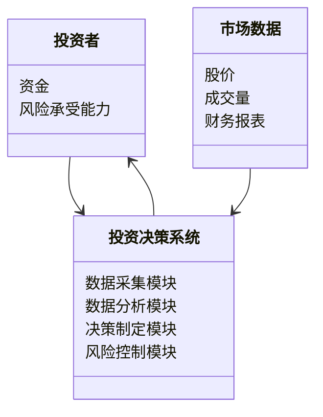
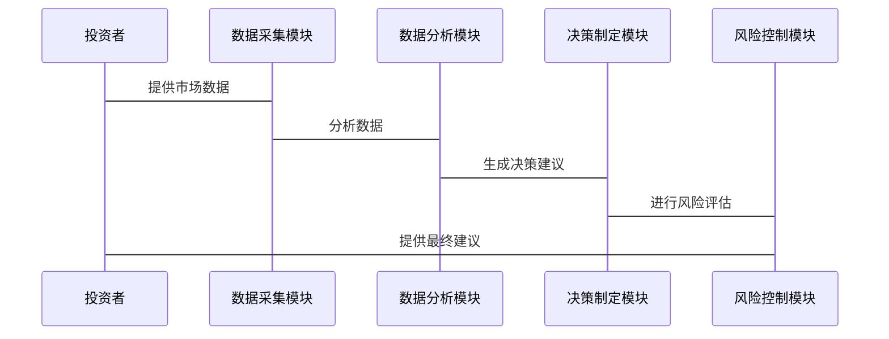

                 


# 巴菲特的逆向投资心理学：在市场恐慌中保持理性

> **关键词**：巴菲特、逆向思维、市场恐慌、理性决策、投资心理学  
> **摘要**：本文深入探讨了巴菲特的投资心理学，特别是逆向思维在市场恐慌中的应用，分析了投资者在恐慌中的心理偏差，并提出了系统化的投资策略，帮助投资者在市场恐慌中保持理性。

---

## # 第一部分: 巴菲特投资理念与逆向思维基础

### ## 第1章: 巴菲特投资理念概述

#### ### 1.1 巴菲特投资哲学的核心思想

##### - **巴菲特的价值投资理念**  
巴菲特强调以合理价格买入具有持续竞争优势的优秀企业。他主张长期持有优质资产，而非短期交易。  
- **企业的长期价值评估**  
企业价值不在于其市盈率或股价波动，而在于其未来现金流的现值。  
- **安全边际的概念**  
巴菲特通过购买低于内在价值的资产，确保投资的安全性，降低市场波动带来的风险。

#### ### 1.2 逆向思维在投资中的重要性

##### - **逆向思维的定义与特点**  
逆向思维是指在市场普遍悲观时寻找机会，而在市场乐观时保持警惕。  
- **逆向思维在投资决策中的应用**  
在恐慌时，市场参与者往往情绪化，导致资产价格被低估，此时是买入的好时机。  
- **逆向思维与市场情绪的关系**  
市场情绪通常是非理性的，逆向思维帮助投资者避免被市场情绪左右。

#### ### 1.3 投资者心理偏差与行为偏差

##### - **常见心理偏差分析**  
- **过度自信**：投资者高估自己的判断能力，忽视风险。  
- **从众心理**：跟随市场潮流，忽视独立思考。  
- **损失厌恶**：对潜在损失的恐惧导致决策失误。  

##### - **行为偏差对投资决策的影响**  
- **追涨杀跌**：在市场上涨时买入，下跌时卖出，导致亏损。  
- **过度交易**：频繁交易增加成本，降低收益。  
- ** confirmation bias**：只关注支持自己观点的信息，忽略反面证据。

##### - **如何克服心理偏差**  
- 通过学习和反思，识别自己的偏差。  
- 设定明确的投资策略，避免情绪化决策。  
- 寻求外部意见，减少认知局限。

---

### ## 第2章: 市场恐慌与人类认知偏差

#### ### 2.1 市场恐慌的根源

##### - **市场恐慌的定义与表现**  
市场恐慌是指投资者因害怕亏损而大量抛售资产，导致资产价格急剧下跌。  
- **市场恐慌的触发因素**  
经济衰退、突发事件、市场传闻等都可能引发恐慌。  
- **市场恐慌与羊群效应**  
投资者往往跟随市场潮流，导致恐慌加剧。

#### ### 2.2 投资者的认知偏差与行为偏差

##### - **认知偏差的类型与影响**  
- **Availability bias**：容易受到最近事件的影响，高估其概率。  
- **Anchoring bias**：过度依赖某一个参考点，影响判断。  
- **Hindsight bias**：事后诸葛亮，认为结果可预见，忽视不确定性。

##### - **行为偏差的具体表现**  
- **Herding behavior**：跟随市场趋势，忽略独立分析。  
- **Avoidance of losses**：过于害怕亏损，错失投资机会。  
- **Overtrading**：频繁交易，增加成本。

#### ### 2.3 逆向思维在市场恐慌中的应用

##### - **在恐慌中寻找机会**  
市场恐慌时，优质资产价格被低估，为长期投资者提供了买入机会。  
- **如何评估被低估的资产**  
通过分析企业的财务报表、行业地位和竞争优势，识别具有长期价值的资产。  
- **恐慌中的决策策略**  
制定明确的投资计划，避免情绪化决策，坚持长期投资。

---

### ## 第3章: 逆向思维在投资中的应用

#### ### 3.1 寻找恐慌中的投资机会

##### - **识别被低估的资产**  
通过比较市盈率、市净率等指标，寻找低于市场平均水平的资产。  
- **评估企业的内在价值**  
计算企业的未来现金流现值，确定其内在价值。  
- **如何在恐慌中找到优质标的**  
关注行业龙头、具有强大竞争优势的企业，避免短期波动影响判断。

#### ### 3.2 价值投资的核心要素

##### - **企业的财务健康状况**  
关注企业的盈利能力、资产负债情况和现金流健康。  
- **管理团队的稳定性**  
稳定且有经验的管理团队是企业长期发展的保障。  
- **行业竞争优势**  
企业在行业中的地位、市场份额和技术优势。

#### ### 3.3 逆向投资策略的具体实施

##### - **制定逆向投资计划**  
明确投资目标、资金分配和风险承受能力。  
- **风险管理与仓位控制**  
分散投资，避免过度集中，降低风险。  
- **在恐慌中坚持策略**  
市场恐慌时，坚持既定策略，避免随市场情绪调整。

---

### ## 第4章: 行为心理学与投资决策

#### ### 4.1 投资者的心理陷阱

##### - **过度自信与从众心理**  
投资者容易高估自己的判断能力，跟随市场趋势，导致错误决策。  
- **恐惧与贪婪的双重影响**  
市场恐慌时，恐惧主导决策；市场繁荣时，贪婪可能导致过度投资。  
- **如何识别和避免心理陷阱**  
通过学习和反思，识别心理偏差，制定明确的投资策略。

#### ### 4.2 人类认知偏差与投资决策

##### - **认知偏差对投资决策的影响**  
- **选择性记忆**：只记住支持自己观点的信息。  
- **过度简化**：将复杂问题简单化，忽视关键因素。  
- **自我归因**：成功归因于自己，失败归因于外部因素。

##### - **如何通过心理调节保持理性**  
- **冥想与放松**：通过冥想减少情绪干扰，保持冷静。  
- **记录投资日志**：记录决策过程和原因，反思错误。  
- **寻求外部意见**：咨询专家或信任的伙伴，减少认知偏差。

---

## # 第五部分: 系统分析与架构设计方案

### ## 第5章: 投资决策系统的系统化分析

#### ### 5.1 问题场景介绍

##### - **市场恐慌中的投资决策问题**  
投资者在恐慌中容易做出错误决策，缺乏系统化的分析和判断。  
- **系统化投资决策的必要性**  
通过系统化的分析，帮助投资者在恐慌中保持理性。

#### ### 5.2 项目介绍

##### - **项目目标**  
设计一个基于逆向思维的投资决策系统，帮助投资者在市场恐慌中做出理性的决策。  
- **项目范围**  
包括数据采集、分析、决策制定和风险控制模块。

#### ### 5.3 系统功能设计（领域模型Mermaid类图）



#### ### 5.4 系统架构设计（Mermaid架构图）


#### ### 5.5 系统接口设计和交互（Mermaid序列图）



---

## # 第六部分: 项目实战

### ## 第6章: 逆向投资策略的实战应用

#### ### 6.1 环境安装

##### - **工具与环境**  
安装Python，使用Pandas、NumPy等库进行数据处理，使用Matplotlib进行数据可视化。

#### ### 6.2 系统核心实现源代码

##### - **数据处理代码**

```python
import pandas as pd
import numpy as np

# 示例数据：股票价格
data = {'Date': ['2023-01-01', '2023-01-02', '2023-01-03', '2023-01-04'],
        'Price': [100, 98, 95, 105]}
df = pd.DataFrame(data)
print(df)
```

##### - **数据分析代码**

```python
# 计算平均值和标准差
mean_price = df['Price'].mean()
std_price = df['Price'].std()

print(f'平均价格: {mean_price}\n标准差: {std_price}')
```

#### ### 6.3 代码应用解读与分析

##### - **数据分析解读**  
计算股票价格的平均值和标准差，帮助评估价格波动风险。  
- **数据可视化**  
使用Matplotlib绘制股价趋势图，帮助识别价格波动模式。

#### ### 6.4 实际案例分析和详细讲解

##### - **案例分析**  
假设市场恐慌，某企业股价下跌至历史低点，但财务状况健康。通过数据分析，识别其投资价值。  
- **详细讲解**  
从财务报表、行业地位和竞争优势等方面，评估企业的长期价值，制定买入策略。

#### ### 6.5 项目小结

##### - **小结**  
通过系统化的分析和实战案例，投资者可以在市场恐慌中识别机会，制定合理的投资策略，实现长期收益。

---

## # 第七部分: 最佳实践 tips、小结、注意事项、拓展阅读

### ## 第7章: 结论与最佳实践

#### ### 7.1 小结

##### - **逆向思维的重要性**  
在市场恐慌时，逆向思维帮助投资者发现被低估的机会。  
- **理性决策的关键**  
通过系统化分析和心理调节，保持理性，避免情绪化决策。

#### ### 7.2 最佳实践 tips

##### - **长期投资**  
坚持价值投资，避免短期波动影响判断。  
- **风险管理**  
分散投资，控制仓位，降低风险。  
- **持续学习**  
不断提升自己的投资知识和技能，适应市场变化。

#### ### 7.3 注意事项

##### - **避免过度自信**  
不要低估市场的复杂性，保持谦逊和谨慎。  
- **关注基本面**  
投资决策基于企业的基本面，而非市场情绪。  
- **保持耐心**  
市场恐慌是暂时的，耐心等待价值回归。

#### ### 7.4 拓展阅读

##### - **推荐书籍**  
1. 《巴菲特致股东的信》  
2. 《逆向思维：巴菲特的成功哲学》  
3. 《投资心理学》

---

## # 作者信息

**作者：** AI天才研究院/AI Genius Institute & 禅与计算机程序设计艺术/Zen And The Art of Computer Programming

