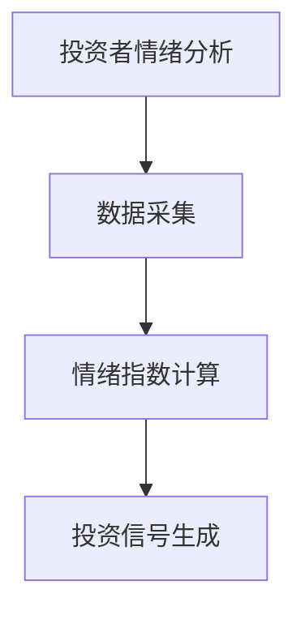

                 


```markdown
# 巴菲特的逆向投资策略：在社交媒体影响下的执行

> 关键词：逆向投资，巴菲特，社交媒体，情绪分析，投资策略，数据分析，技术实现

> 摘要：本文探讨了巴菲特的逆向投资策略在社交媒体环境下的应用，通过分析市场情绪、投资者心理以及社交媒体对投资决策的影响，提出了一套基于社交媒体数据的逆向投资算法，并通过项目实战展示了如何利用这些数据进行投资决策。

---

## 第一章: 逆向投资策略的背景与起源

### 1.1 逆向投资策略的定义与核心理念

逆向投资是一种投资策略，强调在市场低迷时买入，在市场繁荣时卖出。其核心理念是“别人恐惧我贪婪，别人贪婪我恐惧”。这种方法与传统投资策略相反，传统策略依赖于市场趋势和价格走势，而逆向投资则关注市场情绪和心理因素。

#### 1.1.1 逆向投资的定义
逆向投资是一种反向市场趋势的投资策略，强调在市场低谷时寻找被低估的资产，在市场高点时规避风险。

#### 1.1.2 逆向投资的核心理念
- 市场情绪分析：通过分析市场情绪，识别市场的非理性波动。
- 投资者心理：利用投资者的心理偏差，寻找投资机会。

#### 1.1.3 逆向投资与传统投资策略的对比
| 特性 | 逆向投资 | 传统投资 |
|------|----------|----------|
| 基础 | 市场情绪 | 市场趋势 |
| 决策 | 反向操作 | 顺势操作 |
| 风险 | 高 | 低 |

### 1.2 巴菲特的逆向投资理念

#### 1.2.1 巴菲特的投资哲学
巴菲特认为，市场先生是疯狂的，而聪明的投资者应该在市场恐慌时买入优质资产，在市场狂热时卖出。

#### 1.2.2 巴菲特的“别人恐惧我贪婪”的投资策略
- 在市场恐慌时，利用市场的非理性低价买入资产。
- 在市场狂热时，避免参与泡沫，保护资本。

#### 1.2.3 巴菲特逆向投资的经典案例分析
- 2008年金融危机期间，巴菲特大量买入 Goldman Sachs 的股票。
- 在市场恐慌时，巴菲特选择投资那些具有长期价值的公司。

### 1.3 社交媒体时代下的投资环境变化

#### 1.3.1 社交媒体对投资环境的影响
社交媒体的兴起改变了投资者获取信息的方式，信息传播速度更快，投资者情绪更容易受到外部影响。

#### 1.3.2 信息过载与投资者情绪波动
社交媒体上的信息爆炸导致投资者情绪波动加剧，市场情绪分析变得更加复杂。

#### 1.3.3 社交媒体对市场情绪的影响
社交媒体上的信息传播可能引发市场恐慌或过度乐观，影响市场情绪和价格走势。

---

## 第二章: 逆向投资策略的核心概念与联系

### 2.1 逆向投资的原理

#### 2.1.1 市场情绪分析
市场情绪是投资者在特定时间点对市场的看法，通常分为乐观和悲观两种状态。

#### 2.1.2 投资者心理
投资者心理是市场情绪的根源，包括贪婪和恐惧两种主要心理状态。

#### 2.1.3 逆向投资的框架
$$\text{投资决策} = \text{市场情绪} \times \text{逆向思维}$$

### 2.2 核心概念之间的联系

#### 2.2.1 市场情绪与投资者心理的对比
| 情绪状态 | 投资者心理 |
|----------|------------|
| 乐观     | 贪婪       |
| 悲观     | 恐惧       |

#### 2.2.2 逆向投资的框架
$$\text{投资机会} = \text{市场情绪} \times \text{逆向操作}$$

---

## 第三章: 社交媒体对投资策略的影响

### 3.1 社交媒体对市场情绪的影响

#### 3.1.1 信息传播的速度与广度
社交媒体使得信息传播速度极快，影响范围广。

#### 3.1.2 社交媒体上的投资者情绪
社交媒体上的讨论可能放大市场情绪，导致市场波动加剧。

### 3.2 社交媒体信息的分析与处理

#### 3.2.1 自然语言处理技术
自然语言处理（NLP）技术用于分析社交媒体上的文本，提取情绪倾向。

#### 3.2.2 情感分析算法
情感分析算法可以将社交媒体上的文本分为正面、负面或中性情绪。

### 3.3 社交媒体数据与投资决策

#### 3.3.1 数据采集
从社交媒体平台获取相关数据，如推特、Reddit等。

#### 3.3.2 数据处理
对获取的数据进行清洗和预处理，提取有用信息。

#### 3.3.3 数据分析
通过数据分析，识别市场情绪，辅助投资决策。

---

## 第四章: 逆向投资策略的数学模型与算法

### 4.1 情绪指数计算

#### 4.1.1 情绪指数公式
$$\text{情绪指数} = \frac{\text{正面情绪数量} - \text{负面情绪数量}}{\text{总样本数量}}$$

### 4.2 投资信号生成

#### 4.2.1 投资信号生成公式
$$\text{投资信号} = \text{情绪指数} \times \text{逆向因子}$$

---

## 第五章: 系统架构与实现

### 5.1 系统架构设计

#### 5.1.1 系统功能模块
- 数据采集模块
- 情绪分析模块
- 投资信号生成模块

### 5.2 系统流程图



---

## 第六章: 项目实战

### 6.1 环境安装

#### 6.1.1 Python环境配置
安装Python和必要的库，如NLTK、TextBlob等。

### 6.2 数据获取与处理

#### 6.2.1 数据获取
从社交媒体平台获取相关数据。

#### 6.2.2 数据清洗
对数据进行清洗和预处理。

### 6.3 情绪分析与投资信号生成

#### 6.3.1 情绪分析代码示例
```python
from textblob import TextBlob

def sentiment_analysis(text):
    blob = TextBlob(text)
    return blob.sentiment.polarity

text = "The stock market is booming!"
print(sentiment_analysis(text))  # 输出：0.8
```

---

## 第七章: 总结与展望

### 7.1 总结

#### 7.1.1 逆向投资在社交媒体环境下的应用
逆向投资策略可以通过分析社交媒体上的市场情绪，辅助投资者做出更明智的投资决策。

#### 7.1.2 技术实现的关键点
- 数据采集与处理
- 情绪分析算法
- 投资信号生成

### 7.2 展望

#### 7.2.1 未来的研究方向
- 更复杂的市场情绪分析模型
- 多源数据融合分析

---

## 作者：AI天才研究院/AI Genius Institute & 禅与计算机程序设计艺术 /Zen And The Art of Computer Programming
```

