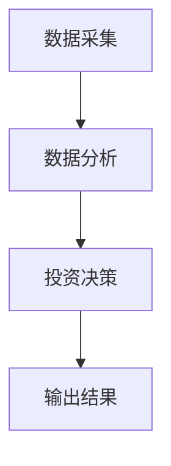

                 

# 巴菲特的银行股投资逻辑：经济的晴雨表

**关键词：** 巴菲特，银行股，价值投资，经济晴雨表，投资策略

**摘要：** 巴菲特的银行股投资逻辑是其价值投资理念的重要组成部分。本文将从巴菲特的投资哲学出发，分析银行股作为经济晴雨表的独特地位，探讨其选股标准和投资策略，结合数学模型和系统分析，揭示其成功背后的深层逻辑，并通过实际案例帮助读者理解如何应用这些逻辑进行投资决策。

---

# 第一部分：巴菲特的银行股投资逻辑概述

## 第1章：巴菲特投资理念的核心思想

### 1.1 价值投资的定义与核心理念

#### 1.1.1 价值投资的定义
价值投资是一种以低于内在价值的价格买入优质资产的投资策略。其核心在于寻找市场先生情绪化定价中的错误，通过深入分析企业的基本面，找到那些被市场低估的投资标的。

#### 1.1.2 巴菲特投资理念的演变
巴菲特的投资理念深受其老师本杰明·格雷厄姆的影响，但他在实践中不断进化，形成了自己独特的投资体系。他强调安全边际、长期持有的投资策略，以及对管理层的信任。

#### 1.1.3 巴菲特投资理念的核心要素
- **安全边际**：买入价格低于内在价值，确保投资的安全性。
- **长期持有**：关注企业的长期价值，而非短期波动。
- **管理层信任**：选择值得信赖的管理层，确保企业稳健发展。

### 1.2 巴菲特的银行股投资哲学
#### 1.2.1 银行股的特殊性
银行作为金融体系的核心，其经营状况直接反映整个经济的健康程度。巴菲特选择银行股时，特别关注其资本充足率、贷款质量、净息差等关键指标。

---

## 第2章：银行股作为经济晴雨表的特殊地位

### 2.1 银行股与宏观经济的关系
#### 2.1.1 经济周期对银行股的影响
银行股的表现与经济周期密切相关。在经济繁荣时期，银行盈利能力增强；在经济衰退时期，银行可能面临资产质量下降的风险。

#### 2.1.2 银行股作为经济晴雨表的原理
银行股的股价波动反映了市场对经济前景的预期。通过分析银行股的表现，投资者可以洞察整体经济的走向。

#### 2.1.3 银行股在股市中的权重与影响力
银行股在股市中占据重要地位，其走势对整体市场指数有显著影响。巴菲特选择投资银行股，也是看中其对市场整体走势的代表性。

---

## 第3章：巴菲特的银行股投资策略

### 3.1 选股标准

#### 3.1.1 财务指标分析
巴菲特关注的关键指标包括：
- **ROE（净资产收益率）**：衡量银行的盈利能力。
- **ROA（资产净利率）**：衡量资产使用效率。
- **资本充足率**：确保银行的资本安全性。
- **净息差**：衡量银行的盈利能力。

#### 3.1.2 估值方法
巴菲特采用多种估值方法，包括：
- **市盈率（P/E）**：市盈率 = 股价 / 每股净利润。
- **市净率（P/B）**：市净率 = 股价 / 每股净资产。
- **股息率**：股息率 = 每股股息 / 股价。

#### 3.1.3 风险评估
巴菲特注重银行的资本结构和管理层素质，避免选择杠杆过高或管理不善的银行。

### 3.2 投资策略

#### 3.2.1 长期持有
巴菲特始终坚持长期持有的策略，他认为短期市场的波动不应影响长期投资的决策。

#### 3.2.2 安全边际
在买入银行股时，巴菲特确保买入价格低于其内在价值，以降低投资风险。

#### 3.2.3 管理层信任
巴菲特重视银行的管理层，选择那些值得信赖且具备良好管理能力的银行。

---

# 第二部分：数学模型与系统分析

## 第4章：银行股投资的数学模型与公式

### 4.1 常用的银行股估值公式

#### 4.1.1 市盈率（P/E）计算
$$ P/E = \frac{\text{股价}}{\text{每股净利润}} $$

#### 4.1.2 市净率（P/B）计算
$$ P/B = \frac{\text{股价}}{\text{每股净资产}} $$

#### 4.1.3 股息率计算
$$ 股息率 = \frac{\text{每股股息}}{\text{股价}} \times 100\% $$

---

## 第5章：银行股投资的系统分析

### 5.1 系统架构设计

#### 5.1.1 系统功能模块
- 数据采集模块：收集银行股的财务数据、市场数据。
- 数据分析模块：计算各项指标，评估银行股的内在价值。
- 投资决策模块：基于分析结果，制定投资策略。

#### 5.1.2 系统架构图

---

## 第6章：银行股投资的风险管理与控制

### 6.1 风险管理策略

#### 6.1.1 分散投资
通过投资不同银行股，降低单一银行的风险。

#### 6.1.2 设置止损
在投资组合中设定止损点，避免亏损过大。

#### 6.1.3 定期复盘
定期评估投资组合的表现，及时调整策略。

---

## 第7章：实际案例分析

### 7.1 案例分析：巴菲特投资美国银行

#### 7.1.1 背景
2008年金融危机期间，巴菲特投资美国银行，看重其稳健的资本结构和管理层能力。

#### 7.1.2 投资决策
- **估值分析**：计算市盈率和市净率，确认价格合理。
- **财务分析**：评估资本充足率和净息差。

#### 7.1.3 结果
巴菲特的投资最终获得丰厚回报，验证了其投资逻辑的有效性。

---

# 结语

巴菲特的银行股投资逻辑不仅是价值投资的典范，也是理解经济晴雨表的重要工具。通过深入分析银行股的财务指标和市场表现，投资者可以更好地把握经济趋势，制定科学的投资策略。

**作者：AI天才研究院 & 禅与计算机程序设计艺术**

---

这篇博客文章系统地介绍了巴菲特的银行股投资逻辑，结合了理论分析和实际案例，帮助读者理解其投资策略的精髓。

