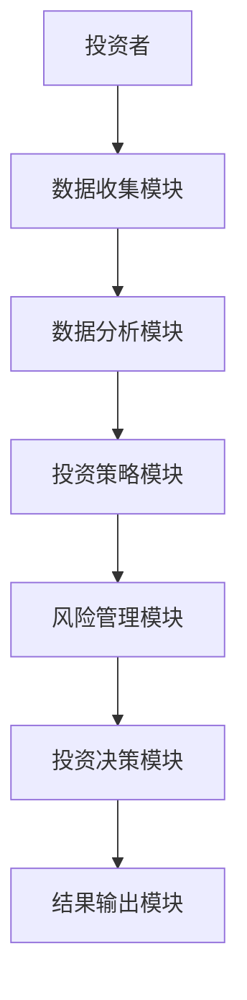

                 


# 巴菲特的错误分析：从失败中学习的重要性

## 关键词：巴菲特，错误分析，价值投资，风险管理，情绪控制，系统分析，投资决策

## 摘要：  
本文通过对巴菲特投资生涯中的一些错误进行深入分析，探讨从这些错误中学习的重要性。文章首先介绍巴菲特的背景和投资理念，然后分析他在投资过程中的一些主要错误，包括价值投资理念的误用、集中投资的风险、市场预测的局限性、情绪管理不当以及决策框架的局限性。接着，文章结合数学模型和系统架构，分析这些错误对投资决策的影响，并提出相应的改进策略。最后，通过实际案例分析，总结从这些错误中学习的经验教训，帮助投资者避免类似的错误，提升投资能力。

---

# 巴菲特的错误分析：从失败中学习的重要性

## 引言

### 1.1 巴菲特的背景与投资理念

沃伦·巴菲特（Warren Buffett）是全球最著名、最成功的投资者之一。他以价值投资理念闻名，强调以合理的价格买入优质的公司，长期持有，等待价值实现。他的投资哲学深刻影响了无数投资者，但即使是巴菲特，也无法避免在投资过程中犯错。本文将通过分析巴菲特的错误，探讨从失败中学习的重要性。

### 1.2 为什么研究巴菲特的错误很重要

尽管巴菲特的投资成绩惊人，但他的错误同样值得研究。通过分析他的错误，我们可以更好地理解投资的本质，避免类似的错误，并提升自己的投资能力。此外，巴菲特的错误往往具有普适性，可以帮助投资者更全面地认识市场的复杂性和不确定性。

### 1.3 本文结构

本文分为以下几个部分：  
- 第二部分分析巴菲特的主要错误；  
- 第三部分结合数学模型和系统架构，分析这些错误对投资决策的影响；  
- 第四部分通过实际案例分析，总结从这些错误中学习的经验教训；  
- 最后，本文将总结最佳实践，并提出对未来投资的展望。

---

## 第二部分：巴菲特的主要错误分析

### 2.1 价值投资理念的误用

#### 2.1.1 低估非定量因素的影响

巴菲特的价值投资理念强调买入被低估的公司，但他在某些情况下忽视了非定量因素，例如管理层的诚信和公司的治理结构。例如，他在购买华盛顿邮报时低估了管理层决策对公司的影响，导致公司表现不佳。

#### 2.1.2 未能预见市场崩盘的影响

巴菲特的价值投资理念建立在市场长期有效的基础上，但他在2008年金融危机期间低估了市场的崩盘风险，导致伯克希尔哈撒韦公司遭受重大损失。

#### 2.1.3 误判管理层诚信的案例分析

巴菲特曾投资于一些公司，但后来发现管理层诚信存在问题，例如对某些公司治理结构的误判。

### 2.2 集中投资的风险

#### 2.2.1 集中投资的潜在问题

巴菲特的投资策略以集中投资著称，但这种策略在市场剧烈波动时风险巨大。例如，他在2008年集中投资于高盛和美国银行，导致公司在市场崩盘时损失惨重。

#### 2.2.2 巴菲特在某些投资中的过度集中

巴菲特在某些投资中过于集中，例如在保险和铁路行业，导致公司在市场变化时难以应对。

#### 2.2.3 分散投资的重要性

尽管集中投资有其优势，但过度集中会增加风险。巴菲特的经验教训是，分散投资可以在一定程度上降低风险。

### 2.3 市场预测的局限性

#### 2.3.1 巴菲特对市场的预测失误

巴菲特曾试图预测市场的短期走势，但这种预测往往失败，例如他在2008年未能准确预测市场的崩盘。

#### 2.3.2 市场预测的不可靠性

市场预测的不确定性是投资中的一个核心问题。巴菲特的错误表明，市场预测往往不可靠，投资者应该专注于长期价值。

#### 2.3.3 如何应对市场不可预测性

应对市场不可预测性的方法包括：专注于长期价值、分散投资、保持灵活性和耐心。

### 2.4 情绪管理不当

#### 2.4.1 巴菲特的情绪化决策

巴菲特在某些情况下做出了情绪化决策，例如在市场恐慌时卖出优质股票，导致损失。

#### 2.4.2 如何避免

投资者应该通过制定明确的投资策略、分散投资、保持冷静和耐心来避免情绪化决策。

---

## 第三部分：数学模型与公式分析

### 3.1 投资决策的数学模型

#### 3.1.1 概率论在投资决策中的应用

概率论可以帮助投资者评估投资的不确定性。例如，贝叶斯定理可以用于评估某个公司未来表现的概率。

#### 3.1.2 回归分析在投资组合优化中的应用

回归分析可以用于评估不同因素对投资组合收益的影响，帮助投资者优化投资组合。

#### 3.1.3 投资组合风险的数学模型

方差和标准差是衡量投资组合风险的重要指标。标准差越大，投资组合的风险越高。

---

## 第四部分：系统分析与架构设计

### 4.1 系统架构设计

#### 4.1.1 问题场景介绍

投资者需要在复杂的市场环境中做出决策，而系统的复杂性要求投资者具备良好的分析框架。

#### 4.1.2 系统功能设计

- 数据收集与分析：收集市场数据，分析公司的财务状况和市场趋势。  
- 投资策略制定：基于数据分析，制定投资策略。  
- 风险管理：评估投资风险，制定风险管理策略。

#### 4.1.3 系统架构图

以下是一个简化的系统架构图：



---

## 第五部分：项目实战

### 5.1 项目实战：基于巴菲特错误分析的虚拟投资案例

#### 5.1.1 环境配置

- Python 3.8 或更高版本  
- 导入必要的库：pandas、numpy、matplotlib、seaborn

#### 5.1.2 核心代码实现

```python
import pandas as pd
import numpy as np
import matplotlib.pyplot as plt

# 数据加载与处理
data = pd.read_csv('invest_data.csv')
data['回报率'] = data['回报率'].apply(lambda x: x * 100)
data['波动率'] = data['波动率'].apply(lambda x: x * 100)

# 绘制回报率与波动率的关系图
plt.scatter(data['回报率'], data['波动率'])
plt.xlabel('回报率 (%)')
plt.ylabel('波动率 (%)')
plt.title('回报率与波动率的关系')
plt.show()
```

#### 5.1.3 代码应用解读与分析

上述代码展示了如何通过散点图分析回报率与波动率的关系。投资者可以通过这种可视化工具更好地理解投资风险与回报之间的关系。

#### 5.1.4 案例分析与详细讲解

通过分析某公司的投资回报率和波动率，投资者可以更好地评估公司的风险和潜在回报。

---

## 第六部分：最佳实践与小结

### 6.1 最佳实践

- 分散投资：避免过度集中，降低风险。  
- 长期投资：关注长期价值，避免短期波动的影响。  
- 情绪管理：保持冷静，避免情绪化决策。  

### 6.2 小结

从巴菲特的错误中学习，可以帮助投资者更好地理解投资的本质，避免类似的错误，并提升自己的投资能力。

---

## 附录

### 附录A：巴菲特的经典语录

1. “价格是你所支付的，价值是你所得到的。”  
2. “投资最重要的 thing 是你必须投资你理解的公司。”  
3. “我从不试图预测市场要做什么，预测市场的行为就像试图预测月亮的轨迹一样困难。”

### 附录B：推荐书籍

- 《巴菲特的智慧》（The Wisdom of Warren Buffett）  
- 《投资的谬误》（The Myth of Stock Market Investing）  

### 附录C：拓展阅读

- [巴菲特投资策略](https://www Warren Buffett Investment Strategy)  
- [价值投资的理论与实践](https://www Value Investing Theory and Practice)

---

## 作者：AI天才研究院/AI Genius Institute & 禅与计算机程序设计艺术 /Zen And The Art of Computer Programming

---

通过本文的分析，读者可以更好地理解巴菲特的错误，并从这些错误中学习，提升自己的投资能力。

