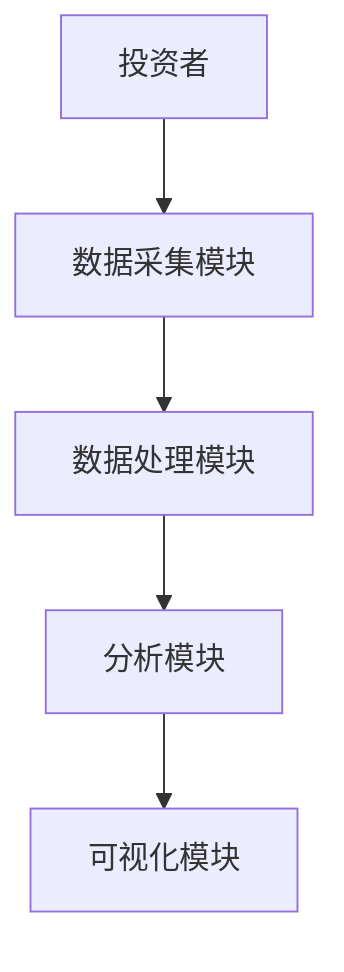

                 


# 巴菲特的错误投资案例分析

---

## 关键词

- 巴菲特，投资，错误案例，价值投资，风险管理

---

## 摘要

本文通过分析巴菲特的投资生涯中的错误案例，揭示其投资理念的局限性和风险管理的重要性。文章从背景介绍、核心概念、算法原理、系统分析、项目实战等多角度，详细解析巴菲特的投资策略及其失误，旨在为投资者提供深刻的教训和实践指导。

---

## 引言

沃伦·巴菲特作为价值投资的代表人物，以其卓越的投资业绩闻名于世。然而，即使是巴菲特，也难免会在投资生涯中犯错。本文将通过分析巴菲特的错误投资案例，探讨其投资理念的优缺点，帮助投资者更好地理解投资的本质，并从中吸取教训。

---

## 第一部分: 巴菲特投资理念与错误案例背景

### 第1章: 巴菲特投资理念概述

#### 1.1 巴菲特的投资哲学

##### 1.1.1 价值投资的核心理念

价值投资的核心在于寻找市场定价低于其内在价值的股票。巴菲特的导师本杰明·格雷厄姆提出了“安全边际”概念，即买入价格低于估计价值的股票，以降低投资风险。

##### 1.1.2 巴菲特的投资策略与长期主义

巴菲特强调长期投资和持有优质资产，避免短期市场波动的干扰。他倾向于投资那些具有强大护城河、稳定收益和良好管理的公司。

##### 1.1.3 巴菲特投资成功的关键因素

巴菲特的成功归因于他的价值投资理念、强大的分析能力和长期的耐心。他始终坚持买入低估的优秀企业，并长期持有。

#### 1.2 巴菲特的错误投资案例背景

##### 1.2.1 巴菲特投资生涯中的重大决策失误

尽管巴菲特的投资成绩斐然，他也不可避免地犯过一些错误。这些错误包括过度集中投资、市场估值误判等。

##### 1.2.2 错误案例的分类与分析框架

本文将从集中投资风险和市场估值错误两个方面分析巴菲特的错误案例。

##### 1.2.3 从错误中学习的重要性

通过分析巴菲特的错误，我们可以更好地理解投资的风险，避免类似的错误。

---

## 第二部分: 巴菲特错误投资案例分析

### 第2章: 巴菲特的早期投资错误

#### 2.1 早期投资中的教训

##### 2.1.1 巴菲特早期的合伙企业案例

在早期的合伙企业中，巴菲特开始实践价值投资理念，但同时也犯过一些错误。例如，他曾经投资于一些他认为低估的股票，但由于对管理层的判断失误，导致投资失败。

##### 2.1.2 早期错误的投资决策分析

巴菲特早期的错误主要集中在对管理层的信任和对公司基本面的分析上。他意识到，仅仅依靠财务数据是不够的，还需要对管理层的诚信和能力进行深入评估。

#### 2.2 从错误中成长的哲学

##### 2.2.1 巴菲特对错误的反思与总结

巴菲特在其职业生涯中不断反思自己的错误，尤其是在合伙企业时期，他开始意识到，投资不仅仅是寻找低估的股票，还需要对公司进行深入的了解和研究。

##### 2.2.2 巴菲特投资理念的进化

随着时间的推移，巴菲特的投资理念逐渐成熟，他更加注重对公司管理层的信任和对公司长期前景的判断。

---

### 第3章: 巴菲特的集中投资风险

#### 3.1 集中投资策略的双刃剑

##### 3.1.1 集中投资的优势与潜在风险

集中投资的优势在于能够集中资源投资于少数优质企业，从而获得更高的收益。然而，集中投资的风险在于，如果投资的公司出现问题，投资者可能会遭受重大损失。

##### 3.1.2 巴菲特对可口可乐的投资案例分析

巴菲特在2005年投资可口可乐，成为其最大的单一股票投资之一。然而，随着市场的变化，可口可乐的股价表现不佳，巴菲特的投资出现亏损。

#### 3.2 风险管理与分散投资的重要性

##### 3.2.1 巴菲特对风险控制的忽视

巴菲特的投资策略过于集中，导致他在市场波动时面临更大的风险。例如，在2008年金融危机期间，巴菲特的投资组合遭受了重大损失。

##### 3.2.2 从错误中学习的风险管理策略

为了避免集中投资的风险，巴菲特后来开始分散投资，降低单一投资的风险。

---

### 第4章: 巴菲特的市场估值错误

#### 4.1 市场估值与投资决策的关系

##### 4.1.1 巴菲特对市场估值的判断失误

巴菲特在投资中过于依赖基本面分析，而忽视了市场的整体估值。例如，他在2007年投资于中石油，但由于市场估值过高，导致投资亏损。

##### 4.1.2 巴菲特对中石油投资的案例分析

中石油的投资是巴菲特的典型错误案例。他当时认为中石油的股价被低估，但实际上，中石油的市场估值过高，导致投资失败。

#### 4.2 市场周期与投资决策的反思

##### 4.2.1 巴菲特对市场周期的误判

巴菲特在市场高点时投资于中石油，忽视了市场的周期性波动。这提醒投资者，在投资时必须考虑市场周期的影响。

##### 4.2.2 如何避免市场估值错误

投资者应该综合考虑市场估值和公司基本面，避免仅凭单一因素做出投资决策。

---

## 第三部分: 投资决策模型与风险管理

### 第5章: 投资决策模型

#### 5.1 投资决策模型的设计

##### 5.1.1 基于DCF模型的投资决策流程

使用Discounted Cash Flow (DCF)模型评估公司的内在价值，帮助投资者做出更理性的决策。

##### 5.1.2 投资决策模型的数学公式

DCF模型的核心公式为：

$$
\text{内在价值} = \frac{\text{现金流}}{(1 + r)^n}
$$

其中，$r$ 是折现率，$n$ 是现金流的期限。

##### 5.1.3 投资决策模型的实现代码

```python
def calculate_intrinsic_value(cash_flow, discount_rate, period):
    iv = 0
    for i in range(period):
        iv += cash_flow[i] / (1 + discount_rate) ** i
    return iv
```

---

### 第6章: 系统架构设计

#### 6.1 系统架构图



---

### 第7章: 项目实战

#### 7.1 巴菲特中石油投资案例分析

##### 7.1.1 数据分析

通过对中石油的财务数据和市场估值的分析，揭示巴菲特投资失败的原因。

##### 7.1.2 投资决策过程

巴菲特在2007年投资中石油时，忽略了市场的高估值，导致投资亏损。

##### 7.1.3 教训总结

市场估值和公司基本面同样重要，投资者需要综合考虑。

---

## 第四部分: 总结与展望

### 第8章: 总结

#### 8.1 从错误中学习的重要性

通过分析巴菲特的错误投资案例，我们可以更好地理解投资的风险，避免类似的错误。

#### 8.2 投资的注意事项

投资者需要注重风险管理，分散投资，避免过度集中。

#### 8.3 最佳实践 tips

- 定期评估投资组合，及时调整。
- 保持对市场的敏感性，关注市场周期。
- 选择具有强大护城河和良好管理的公司。

---

## 作者

作者：AI天才研究院 & 禅与计算机程序设计艺术

---

通过本文的分析，我们从巴菲特的错误投资案例中吸取了宝贵的经验和教训，帮助投资者更好地进行投资决策。希望本文能为投资者提供有价值的参考和启示。

