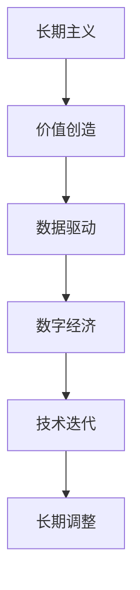
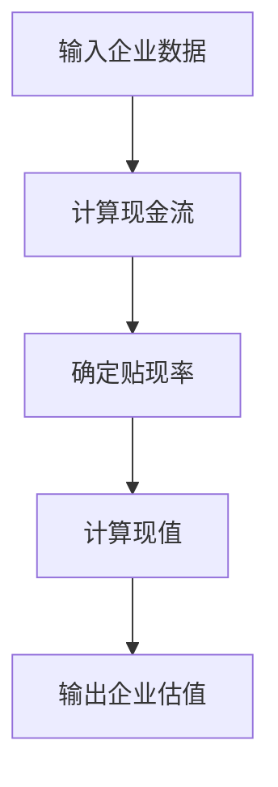
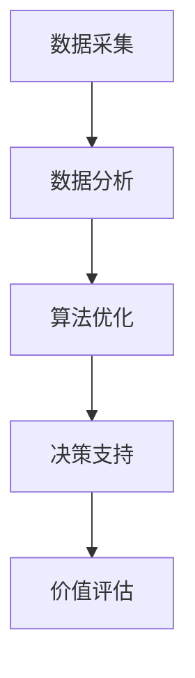
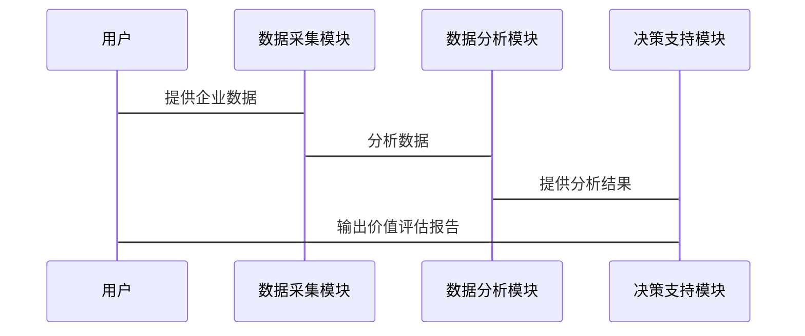

                 


# 巴菲特的长期主义在快速迭代的数字经济中的调整

## 关键词：长期主义, 数字经济, 投资策略, 快速迭代, 数字化转型

## 摘要：  
在数字经济快速发展的背景下，长期主义作为一种投资和管理策略，正在面临新的挑战和调整。本文从长期主义的核心概念出发，结合数字经济的特点，探讨如何在快速迭代的环境中调整长期主义策略。文章通过对比分析、算法设计、系统架构和实际案例，深入剖析长期主义在数字经济中的应用，并提出相应的优化建议。

---

## 第一章: 长期主义的定义与核心要素

### 1.1 长期主义的定义  
长期主义是一种以长远目标为导向的投资和管理策略，强调通过持续的价值创造实现长期收益。其核心在于关注企业的内在价值，而非短期市场波动。  

### 1.2 长期主义的核心要素  
- **价值创造**：关注企业的核心竞争力和可持续发展能力。  
- **时间的复利效应**：通过时间的积累，实现价值的指数级增长。  
- **系统性思考**：从整体角度出发，关注系统性风险和机会。  

### 1.3 长期主义的演变与调整  
- **传统长期主义的局限性**：在快速变化的环境中，传统长期主义难以应对技术变革和市场波动。  
- **数字经济时代对长期主义的挑战**：技术迭代加速，市场不确定性增加。  
- **新型长期主义的特征**：更加注重灵活性和适应性，结合短期目标与长期愿景。  

---

## 第二章: 数字经济的特点与挑战

### 2.1 数字经济的定义与关键特征  
- **定义**：数字经济是以数字技术为核心驱动力的经济形态，涵盖数据、算法、网络等方面。  
- **关键特征**：  
  - 数据驱动：数据是核心资源。  
  - 技术迭代快：技术更新换代迅速。  
  - 市场不确定性高：市场波动频繁且难以预测。  

### 2.2 数字经济中的长期主义  
- **长期价值创造**：在数字经济中，企业需要通过技术创新和数据驱动实现长期价值。  
- **复利效应的实现**：通过数据积累和算法优化，实现价值的指数级增长。  

### 2.3 数字经济中的挑战与调整  
- **技术变革的加速性**：技术快速迭代，企业需要不断调整战略。  
- **市场波动的加剧**：数字经济的不确定性增加，投资决策面临更大挑战。  
- **短期与长期的平衡**：如何在快速变化的环境中保持长期主义的稳定性。  

---

## 第三章: 长期主义与数字经济的核心概念对比

### 3.1 长期主义与数字经济的核心概念对比  

| **核心概念** | **长期主义**                          | **数字经济**                          |
|--------------|--------------------------------------|--------------------------------------|
| **目标**     | 长期价值创造                          | 数据驱动的经济增长                    |
| **驱动因素** | 企业的内在价值                        | 数字技术的应用                        |
| **时间维度** | 强调长期复利效应                      | 技术迭代快，强调短期收益             |
| **风险因素** | 系统性风险                           | 数据安全、技术风险                   |

### 3.2 长期主义与数字经济的联系  



---

## 第四章: 长期主义在数字经济中的算法与数学模型

### 4.1 动态贴现现金流模型  

#### 4.1.1 模型简介  
动态贴现现金流模型是一种基于未来现金流折现的估值方法，适用于长期主义下的企业价值评估。  

#### 4.1.2 模型流程  



#### 4.1.3 模型实现  

```python
def discounted_cash_flow(cash_flows, discount_rate):
    present_value = sum(cash_flow / (1 + discount_rate)**i for i, cash_flow in enumerate(cash_flows))
    return present_value

# 示例数据
cash_flows = [100, 200, 300, 400]
discount_rate = 0.1

print(discounted_cash_flow(cash_flows, discount_rate))
```

#### 4.1.4 数学公式  
未来现金流的现值计算公式为：  
$$ PV = \sum_{t=1}^{n} \frac{CF_t}{(1 + r)^t} $$  
其中，$CF_t$ 为第 $t$ 年的现金流，$r$ 为贴现率。  

---

## 第五章: 数字经济中的长期主义系统架构

### 5.1 系统功能设计  

#### 5.1.1 领域模型  


#### 5.1.2 系统架构  



### 5.2 系统接口设计  

#### 5.2.1 系统交互流程  



---

## 第六章: 项目实战

### 6.1 环境配置  

- **Python版本**：3.8以上  
- **依赖库**：pandas、numpy、scikit-learn  

### 6.2 核心代码实现  

```python
import pandas as pd
import numpy as np

def calculate_discounted_cash_flow(dataframe, discount_rate):
    dataframe['Present Value'] = dataframe['Cash Flow'] / (1 + discount_rate)**dataframe.index
    return dataframe['Present Value'].sum()

# 示例数据
data = {'Cash Flow': [100, 200, 300, 400]}
df = pd.DataFrame(data)
discount_rate = 0.1

print(calculate_discounted_cash_flow(df, discount_rate))
```

#### 代码解读  
- **数据输入**：企业未来现金流数据。  
- **贴现率计算**：根据市场环境动态调整贴现率。  
- **现值计算**：通过公式计算未来现金流的现值。  

### 6.3 案例分析  

#### 6.3.1 案例背景  
某科技公司未来四年的现金流分别为100、200、300、400万元，贴现率为10%。  

#### 6.3.2 计算结果  
现值 = 100/1.1 + 200/1.21 + 300/1.331 + 400/1.4641 ≈ 674.16万元。  

#### 6.3.3 投资建议  
基于计算结果，该公司的长期价值约为674.16万元，建议长期投资者关注其技术优势和数据驱动能力。  

---

## 第七章: 长期主义在数字经济中的最佳实践

### 7.1 小结  
- 长期主义在数字经济中的应用需要结合动态贴现现金流模型和系统性思考。  
- 数字经济的快速迭代要求长期主义更加注重灵活性和适应性。  

### 7.2 注意事项  
- **数据质量**：确保数据的准确性和完整性。  
- **模型优化**：根据市场变化动态调整贴现率和现金流预测。  
- **风险管理**：关注系统性风险和数据安全问题。  

### 7.3 拓展阅读  
- 建议阅读《The Intelligent Investor》和《Digital Economics》了解更多细节。  

---

## 结论  

在数字经济快速发展的背景下，长期主义需要进行相应的调整和优化。通过结合动态贴现现金流模型和系统性思考，投资者可以在快速迭代的环境中实现长期价值创造。未来，随着技术的进一步发展，长期主义将在数字经济中发挥更加重要的作用。

---

## 作者：AI天才研究院 & 禅与计算机程序设计艺术

