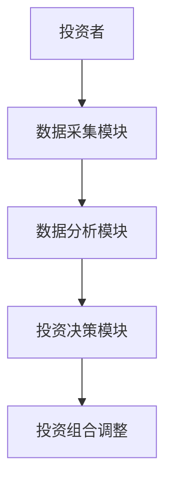
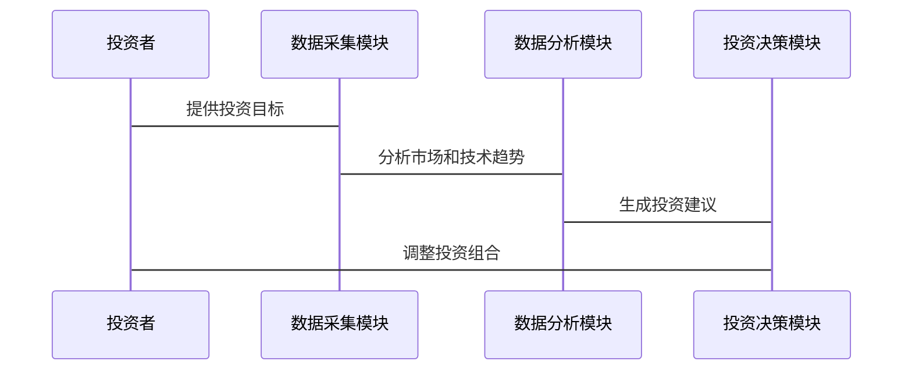

                 


# 巴菲特的长期主义在快速迭代的生物技术领域的调整

> 关键词：长期主义，生物技术，快速迭代，投资策略，风险管理，动态调整，系统架构

> 摘要：本文探讨了巴菲特的长期主义投资理念在快速迭代的生物技术领域的应用与调整。通过分析生物技术领域的特点，结合长期主义的核心原则，提出了动态调整模型和系统架构设计方案，以应对生物技术领域的高风险和高回报特性。文章还提供了实际案例分析和最佳实践建议。

---

## 第1章: 背景介绍

### 1.1 长期主义的背景与定义

#### 1.1.1 长期主义的核心概念
长期主义是一种投资和管理策略，强调以长期价值为导向，注重企业的基本面和可持续发展能力。巴菲特的长期主义理念认为，投资的本质是寻找那些能够在未来持续创造价值的企业。

#### 1.1.2 生物技术领域的特点
生物技术领域具有高度的不确定性和快速的创新周期。技术创新、政策变化和市场波动都可能对企业的价值产生重大影响。

#### 1.1.3 长期主义与生物技术的结合
在生物技术领域，长期主义需要在快速变化的环境中保持稳定性，同时灵活应对技术和市场的变化。这种结合要求投资者在坚持长期价值的同时，具备快速调整的能力。

### 1.2 生物技术领域的快速迭代

#### 1.2.1 生物技术的创新周期
生物技术的创新周期短，新技术和新产品不断涌现，这使得传统的长期主义策略面临挑战。

#### 1.2.2 技术的不确定性和风险
生物技术领域的研发具有高度不确定性，技术失败或政策变化可能导致企业的价值大幅波动。

#### 1.2.3 长期主义在生物技术中的适应性
为了应对快速迭代和技术不确定性，长期主义需要引入动态调整机制，以平衡长期价值和短期风险。

---

## 第2章: 长期主义的核心概念与联系

### 2.1 长期主义的核心原理

#### 2.1.1 长期主义的投资策略
长期主义强调投资于具有强大护城河和持续盈利能力的企业，关注企业的内在价值和竞争优势。

#### 2.1.2 生物技术领域的长期价值
生物技术领域的长期价值体现在其技术创新和市场潜力上，尤其是在医疗健康和农业等领域具有广阔的应用前景。

### 2.2 生物技术领域的动态调整

#### 2.2.1 动态调整的必要性
为了应对快速变化的生物技术领域，投资者需要定期评估企业的创新能力和市场适应性，及时调整投资策略。

#### 2.2.2 动态调整的机制
动态调整机制包括定期重新评估企业的基本面、关注行业趋势和政策变化，以及根据新的信息调整投资组合。

---

## 第3章: 长期主义与生物技术领域的数学模型

### 3.1 数学模型的构建

#### 3.1.1 收益与风险的平衡
$$收益 = 短期收益 + 长期收益$$
$$风险 = 技术风险 + 市场风险$$

#### 3.1.2 动态调整模型
$$调整因子 = \frac{新技术的潜力}{当前投资的回报率}$$
$$新投资组合 = 原投资组合 \times 调整因子$$

### 3.2 算法原理

#### 3.2.1 动态调整算法
```python
def dynamic_adjustment(current_portfolio, new_technology_potential):
    adjustment_factor = new_technology_potential / current_portfolio.return_rate
    new_portfolio = current_portfolio * adjustment_factor
    return new_portfolio
```

#### 3.2.2 模型验证
通过历史数据验证动态调整模型的有效性，评估其在生物技术领域的适应性。

---

## 第4章: 生物技术领域的系统架构设计

### 4.1 系统架构概述

#### 4.1.1 系统功能设计
- 数据采集：收集生物技术领域的市场数据、技术趋势和政策变化。
- 数据分析：利用大数据和机器学习技术评估企业的长期价值和风险。
- 投资决策：基于分析结果动态调整投资组合。

#### 4.1.2 系统架构图


### 4.2 接口设计与交互流程

#### 4.2.1 数据接口
- 数据源接口：与生物技术企业的财务数据、市场数据和研发投入数据对接。
- 技术接口：与技术评估机构和研发团队对接，获取新技术的潜力评估。

#### 4.2.2 交互流程


---

## 第5章: 项目实战与案例分析

### 5.1 项目背景

#### 5.1.1 案例选择
选择一家专注于基因编辑技术的生物技术企业作为案例，分析其在快速迭代环境中的长期价值和动态调整策略。

### 5.2 核心代码实现

#### 5.2.1 环境安装
安装必要的库和工具，如Python的pandas、numpy和scikit-learn。

#### 5.2.2 核心代码
```python
import pandas as pd
import numpy as np

def evaluate_risk_factors(risk_factors):
    return np.mean(risk_factors)

def calculate_adjustment(new_technology_potential, current_return):
    return new_technology_potential / current_return

# 示例数据
risk_factors = [0.2, 0.3, 0.4]
new_technology_potential = 0.8
current_return = 0.1

risk_assessment = evaluate_risk_factors(risk_factors)
adjustment_factor = calculate_adjustment(new_technology_potential, current_return)

print(f"风险评估：{risk_assessment}")
print(f"调整因子：{adjustment_factor}")
```

### 5.3 案例分析

#### 5.3.1 风险评估
通过对基因编辑技术的风险因素进行评估，计算出风险评估值。

#### 5.3.2 动态调整
根据新技术的潜力和当前投资的回报率，计算调整因子，动态调整投资组合。

---

## 第6章: 结论与展望

### 6.1 结论

长期主义在生物技术领域的应用需要结合动态调整机制，以应对快速变化和技术不确定性。通过系统架构设计和数学模型的支持，投资者可以在保持长期价值的同时，灵活应对市场的变化。

### 6.2 展望

未来，随着生物技术的进一步发展，长期主义的投资策略需要不断创新和优化，以适应新的技术和市场环境。

---

## 第7章: 最佳实践与注意事项

### 7.1 最佳实践

#### 7.1.1 保持灵活性
在生物技术领域，投资者需要保持灵活性，及时调整投资策略以应对新技术和市场的变化。

#### 7.1.2 关注长期价值
尽管生物技术领域变化快，投资者仍需关注企业的长期价值和竞争优势。

#### 7.1.3 风险管理
建立完善的风险管理体系，定期评估投资组合的风险和收益平衡。

### 7.2 注意事项

#### 7.2.1 避免短期波动
尽管需要动态调整，但投资者应避免因短期波动而频繁调整投资策略。

#### 7.2.2 保持长期视角
长期主义的核心在于长期价值，投资者需要在动态调整中保持对长期目标的专注。

---

## 作者：AI天才研究院 & 禅与计算机程序设计艺术

---

以上是《巴菲特的长期主义在快速迭代的生物技术领域的调整》的技术博客文章的详细目录和内容框架。文章从背景介绍、核心概念、数学模型、系统架构、项目实战和最佳实践等多个方面，全面分析了长期主义在生物技术领域的应用与调整策略，为投资者提供了理论支持和实践指导。

