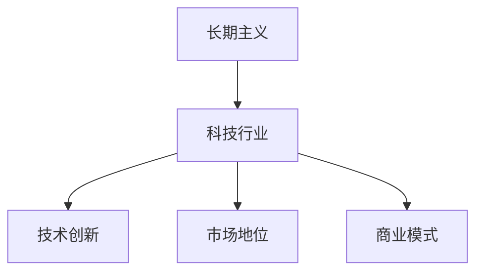
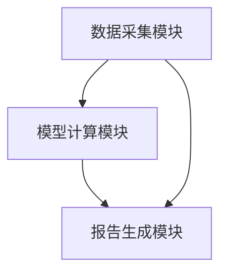

                 


# 巴菲特的长期主义在快速迭代的科技行业中的适应

> 关键词：长期主义，巴菲特，科技行业，价值投资，系统架构，数学模型

> 摘要：本文探讨了巴菲特的长期主义投资理念在快速迭代的科技行业中的适应性。通过分析科技行业的特点，结合长期主义的核心概念，本文提出了在科技行业中应用长期主义的具体方法，包括算法模型、系统架构设计以及实际项目案例。文章最后总结了长期主义在科技行业中的应用前景，并提出了相应的建议。

---

## 第一部分：长期主义的定义与核心理念

### 第1章：长期主义的定义与核心理念

#### 1.1 长期主义的定义

长期主义是一种注重长期价值和可持续发展的思维方式。它强调在决策时不仅考虑眼前的收益，还要考虑未来可能的影响和后果。长期主义的核心理念在于追求稳健的增长和持续的价值创造，而不是短期的利润最大化。

#### 1.2 巴菲特的长期主义投资理念

沃伦·巴菲特作为长期主义的代表人物，其投资理念以价值投资为核心。他主张寻找那些具有强大护城河、良好管理和持续盈利能力的企业进行长期投资。巴菲特的价值投资理念强调以下几点：

1. **企业基本面分析**：关注企业的财务状况、盈利能力、市场地位和竞争优势。
2. **安全边际**：在投资时，确保买入价格低于企业的内在价值，以降低风险。
3. **长期持有**：避免频繁交易，长期持有优质资产，以时间复利效应最大化收益。

---

## 第二部分：科技行业的特点与挑战

### 第2章：科技行业的特点与挑战

#### 2.1 科技行业的快速迭代特点

科技行业以其快速迭代和技术更新为特点，新产品和新技术层出不穷。这种快速变化的特性使得科技行业的投资决策具有高度的不确定性和风险。科技行业的创新驱动力主要来自于市场需求、技术进步和竞争压力。

#### 2.2 科技行业的长期主义适应性

尽管科技行业具有快速变化的特点，但长期主义仍可以在其中找到适用的空间。科技行业的长期价值体现在以下几个方面：

1. **技术创新**：具备持续创新能力的企业能够保持竞争优势。
2. **市场领导地位**：占据市场主导地位的企业能够在长期中获得更高的市场份额和利润。
3. **商业模式的可持续性**：具备稳定商业模式的企业能够在市场波动中保持稳健增长。

---

## 第三部分：长期主义在科技行业的核心概念与联系

### 第3章：长期主义与科技行业的核心概念

#### 3.1 长期主义与科技行业的核心概念

在科技行业中，长期主义的核心概念包括：

1. **技术创新**：技术创新是科技行业发展的核心驱动力。
2. **市场地位**：企业的市场地位决定了其长期的竞争优势。
3. **商业模式**：可持续的商业模式是企业长期发展的基础。

#### 3.2 长期主义与科技行业的关系图

为了更好地理解长期主义与科技行业的关系，我们可以通过以下关系图来分析：



---

## 第四部分：长期主义在科技行业的算法原理

### 第4章：长期主义价值评估算法

#### 4.1 算法原理

长期主义价值评估算法的核心在于预测企业的未来现金流，并将其贴现为当前价值。该算法基于以下步骤：

1. **企业基本面分析**：分析企业的财务状况、盈利能力、市场地位等因素。
2. **现金流预测**：预测企业在未来各年的自由现金流。
3. **贴现率计算**：确定合适的贴现率，通常使用加权平均资本成本（WACC）。
4. **估值计算**：将未来现金流贴现，得到企业的内在价值。

#### 4.2 数学模型与公式

长期主义价值评估的数学模型如下：

$$ V = \sum_{t=1}^{n} \frac{CF_t}{(1 + r)^t} $$

其中：
- \( V \) 表示企业的内在价值
- \( CF_t \) 表示第 \( t \) 年的现金流
- \( r \) 表示贴现率
- \( n \) 表示预测的年数

---

## 第五部分：长期主义在科技行业的系统架构设计

### 第5章：系统架构设计

#### 5.1 系统应用场景

长期主义在科技行业的系统应用场景包括：

1. **长期价值评估**：评估企业的内在价值。
2. **长期投资策略**：制定长期的投资策略。
3. **长期风险管理**：管理长期投资中的风险。

#### 5.2 系统功能设计

系统功能设计包括以下模块：

1. **数据采集模块**：采集企业的财务数据、市场数据等。
2. **模型计算模块**：计算企业的内在价值、风险指标等。
3. **报告生成模块**：生成长期价值评估报告、投资策略报告等。

#### 5.3 系统架构图

以下是系统架构的Mermaid图：



---

## 第六部分：长期主义在科技行业的项目实战

### 第6章：项目实战

#### 6.1 项目环境安装与配置

1. **环境搭建**：安装Python、Jupyter Notebook等工具。
2. **工具安装**：安装Pandas、NumPy、Scipy等库。

#### 6.2 系统核心实现源代码

以下是长期价值评估算法的Python代码示例：

```python
import numpy as np
import pandas as pd

def calculate_intrinsic_value(fcf, discount_rate):
    """
    计算企业的内在价值
    """
    n = len(fcf)
    discounted_cash_flows = [cf / (1 + discount_rate)**t for t, cf in enumerate(fcf)]
    return sum(discounted_cash_flows)

# 示例数据
fcf = [100, 150, 200, 250, 300]
discount_rate = 0.1

# 计算内在价值
intrinsic_value = calculate_intrinsic_value(fcf, discount_rate)
print(f"企业的内在价值为：{intrinsic_value}")
```

---

## 第七部分：总结与展望

### 7.1 总结

长期主义在科技行业中的应用需要结合行业的特点和企业的实际情况。通过算法模型和系统架构设计，可以更好地实现长期价值评估和投资决策。科技行业的快速迭代要求投资者具备更强的洞察力和耐心，以捕捉长期价值。

### 7.2 展望

未来，随着科技行业的进一步发展，长期主义的应用将更加广泛。投资者需要不断优化算法模型，提升系统架构设计的能力，以应对科技行业中的各种挑战。

---

## 作者：AI天才研究院/AI Genius Institute & 禅与计算机程序设计艺术 /Zen And The Art of Computer Programming

