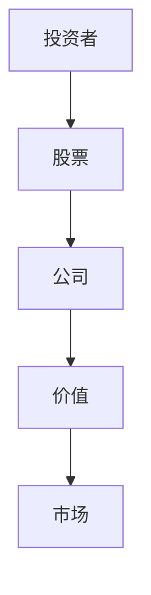
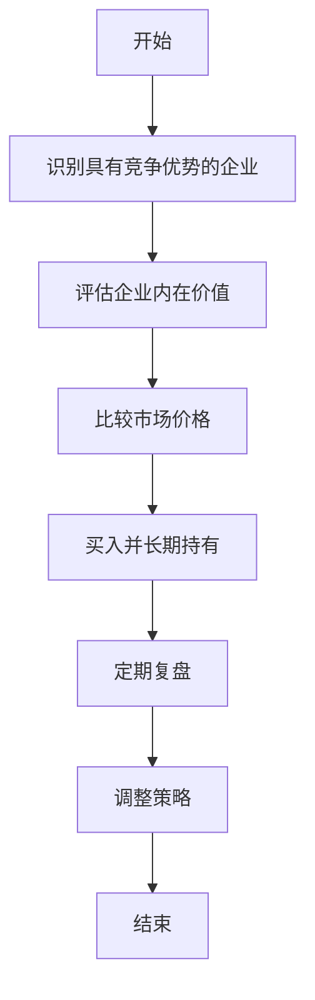
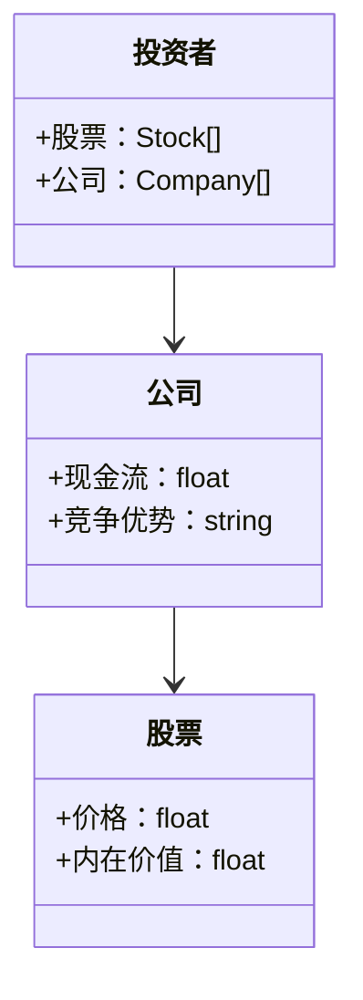
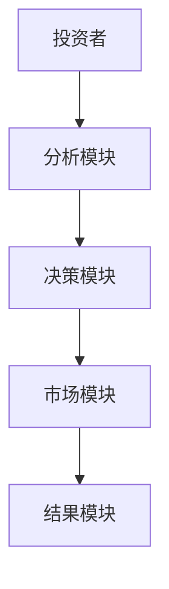

                 


# 巴菲特的长期持股策略

> **关键词**：巴菲特、长期持股、价值投资、投资策略、股票分析  
> **摘要**：本文深入分析了巴菲特的长期持股策略，探讨其投资理念、分析方法和成功案例。通过系统的结构和详细的案例分析，揭示了长期持股策略的核心原理和实际应用。

---

## 第一章：引言

### 1.1 巴菲特的生平与投资理念

沃伦·巴菲特（Warren Buffett）是世界上最著名的投资者之一，被誉为“股神”。他出生于1934年，毕业于哥伦比亚大学，师从本杰明·格雷厄姆（Benjamin Graham），后者是价值投资的鼻祖。巴菲特的投资理念深受格雷厄姆的影响，但他后来发展出一套独特的投资策略，尤其是长期持股策略。

巴菲特的投资理念核心是“价值投资”，即寻找那些被市场低估的企业，长期持有这些股票，直到其内在价值被市场发现。他认为，市场短期是投票机，但长期是称重机，因此长期持股能够忽略短期波动，获得企业成长带来的收益。

### 1.2 长期持股策略的定义与特点

长期持股策略是指投资者在选择优质企业后，持有其股票数年甚至更长时间，而不是频繁买卖。这种策略的核心在于寻找那些具有持续竞争优势、良好管理和强大财务状况的企业。

#### 1.2.1 长期持股的定义
长期持股策略强调持有优质企业的股票，长期不动摇，以时间换空间，获得复利效应。

#### 1.2.2 长期持股的核心特点
- **稳定性**：避免频繁交易，减少交易成本。
- **长期视角**：关注企业的长期价值，而非短期波动。
- **精选个股**：选择具有竞争优势和良好管理的企业。

#### 1.2.3 长期持股与短线交易的区别
| 特性       | 长期持股           | 短线交易           |
|------------|--------------------|--------------------|
| 时间跨度   | 数年甚至更长       | 几周或几天         |
| 风险承受   | 较低              | 较高              |
| 交易频率   | 极低              | 高                |
| 分析重点   | 企业基本面         | 市场情绪和短期趋势 |

### 1.3 长期持股策略的背景与意义

在金融市场中，短期波动往往受到情绪和市场噪声的影响，而长期趋势则由企业的基本面决定。长期持股策略的意义在于帮助投资者避免短期波动的干扰，专注于企业的长期价值。

---

## 第二章：长期持股策略的核心概念与联系

### 2.1 核心概念原理

长期持股策略的核心在于对企业内在价值的准确评估。巴菲特强调，投资的第一步是确定企业的内在价值，然后比较其市场价格。当市场价格低于内在价值时，就是买入的时机。

#### 2.1.1 企业内在价值的评估
企业内在价值是未来现金流的现值。巴菲特通常使用以下公式来评估内在价值：

$$
\text{内在价值} = \sum_{t=1}^{n} \frac{\text{现金流}_t}{(1 + r)^t}
$$

其中，\( r \) 是折现率，\( \text{现金流}_t \) 是第 \( t \) 年的现金流。

#### 2.1.2 企业的竞争优势
巴菲特特别关注那些具有“护城河”的企业，即那些能够长期保持竞争优势的企业。例如，可口可乐和苹果就具有强大的品牌和产品优势。

### 2.2 核心概念属性特征对比表格

| 属性          | 长期持股           | 短期交易           |
|---------------|--------------------|--------------------|
| 投资目标      | 企业长期价值       | 短期价格波动       |
| 风险承受能力  | 较低              | 较高              |
| 分析周期      | 长期（数年）       | 短期（数周或数天）  |

### 2.3 ER实体关系图（使用 Mermaid）



---

## 第三章：长期持股策略的算法原理讲解

### 3.1 算法原理概述

长期持股策略的算法核心在于对企业进行深入分析，识别出具有长期竞争优势的企业，并在合理的价格下买入并持有。

#### 3.1.1 投资决策流程

1. **识别企业**：寻找具有强大竞争优势的企业。
2. **评估价值**：计算企业的内在价值。
3. **比较价格**：确定市场价格是否低于内在价值。
4. **买入并持有**：在合理价格下买入并长期持有。

#### 3.1.2 数学模型

巴菲特的内在价值公式：

$$
\text{内在价值} = \frac{\text{年现金流}}{\text{折现率}}
$$

例如，假设某企业每年产生1000万美元的现金流，折现率为10%，则内在价值为：

$$
\text{内在价值} = \frac{1000}{0.10} = 10000 \text{万美元}
$$

### 3.2 算法流程图（使用 Mermaid）



---

## 第四章：长期持股策略的系统分析与架构设计方案

### 4.1 问题场景介绍

投资者在面对市场波动时，常常因为情绪影响做出错误决策。长期持股策略帮助投资者避免情绪干扰，专注于企业的长期价值。

### 4.2 系统功能设计

#### 4.2.1 领域模型（使用 Mermaid 类图）



### 4.3 系统架构设计



---

## 第五章：长期持股策略的实战案例

### 5.1 环境安装

假设我们选择苹果公司作为长期持股的案例。

### 5.2 核心实现源代码

```python
# 计算苹果公司的内在价值
cash_flow = 1000000000  # 假设每年现金流为10亿美元
discount_rate = 0.10  # 折现率10%
intrinsic_value = cash_flow / discount_rate
print(f"苹果公司的内在价值为：{intrinsic_value}亿美元")
```

### 5.3 代码应用解读与分析

运行上述代码，得到苹果公司的内在价值为100亿美元。如果市场价格低于这个价值，就是买入的好时机。

### 5.4 案例分析与详细讲解

苹果公司具有强大的品牌和技术创新能力，是巴菲特眼中的优质企业。长期持有苹果股票，能够获得其技术创新和市场份额扩大的收益。

---

## 第六章：长期持股策略的最佳实践

### 6.1 投资建议

- **精选个股**：选择具有强大竞争优势的企业。
- **长期持有**：避免频繁交易，降低交易成本。
- **定期复盘**：定期评估企业的基本面，确保长期价值。

### 6.2 注意事项

- 风险管理：即使长期持股，也需要分散投资，避免过度集中。
- 市场波动：长期持股不等于忽视市场波动，需要定期评估。

### 6.3 拓展阅读

建议阅读巴菲特的《聪明的投资者》和彼得·林奇的《战胜市场的人》。

---

## 第七章：总结与展望

### 7.1 小结

巴菲特的长期持股策略强调对企业内在价值的深入分析和长期持有，帮助投资者规避短期波动，获得长期收益。

### 7.2 作者观点

长期持股策略的成功关键在于对企业的深刻理解和耐心持有。在选择企业时，必须关注其竞争优势和财务健康，同时保持对市场的敏感性。

---

## 第八章：附录

### 8.1 参考文献

- 巴菲特，《巴菲特致股东的信》
- 格雷厄姆，《证券投资分析》

### 8.2 工具推荐

- 网站：Yahoo Finance
- 工具：Excel、Python

---

## 作者信息

作者：AI天才研究院/AI Genius Institute & 禅与计算机程序设计艺术/Zen And The Art of Computer Programming

---

通过本文的详细分析，我们可以看到巴菲特长期持股策略的核心在于对企业内在价值的评估和长期持有的耐心。希望本文能为投资者提供有价值的见解和指导。

