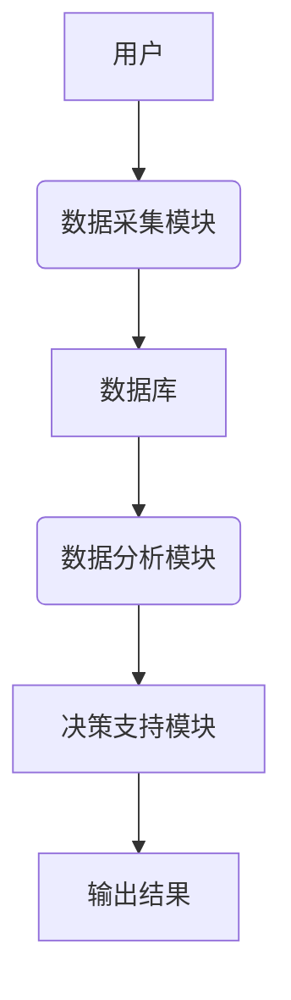

                 


# 巴菲特的集中投资理念

> 关键词：集中投资，巴菲特，价值投资，安全边际，竞争优势，DCF模型，投资策略

> 摘要：本文深入探讨了巴菲特的集中投资理念，分析了其背后的核心概念、算法原理、数学模型以及系统架构，并结合实际案例进行项目实战，最后总结了最佳实践和注意事项。

---

## 第一部分：背景介绍

### 第1章：巴菲特投资理念的起源

#### 1.1 巴菲特投资哲学的形成

- **1.1.1 巴菲特的早期投资经历**
  巴菲特在青少年时期就开始接触投资，他的第一桶金来自于购买和出售股票。他的导师本杰明·格雷厄姆的价值投资理念对他的影响深远，格雷厄姆强调安全边际和长期价值。

- **1.1.2 价值投资理念的起源**
  巴菲特继承并发展了格雷厄姆的价值投资理念，强调以合理的价格投资于具有持续竞争优势的公司。他注重企业的基本面分析，寻找那些具有长期竞争优势且管理良好的企业。

- **1.1.3 集中投资策略的提出**
  巴菲特在20世纪70年代提出了集中投资策略，认为通过集中投资于少数几家优秀的公司，可以最大限度地提高投资收益并降低风险。

#### 1.2 集中投资的定义与背景

- **1.2.1 集中投资的定义**
  集中投资是指将大部分资金投资于少数几只股票，尤其是那些具有强大竞争优势和长期增长潜力的企业。

- **1.2.2 集中投资的背景与现状**
  在传统的投资策略中，投资者倾向于分散投资以降低风险，但巴菲特认为，通过集中投资于少数优质企业，可以实现更高的长期回报。

- **1.2.3 集中投资的核心要素**
  集中投资的核心要素包括：选择具有长期竞争优势的企业、合理的价格、强大的管理层和安全边际。

#### 1.3 集中投资与传统投资的对比

- **1.3.1 传统投资策略的特点**
  传统投资策略强调分散投资，通过投资于多种资产或股票来降低风险。这种方法适合风险厌恶型投资者，但可能无法获得超额收益。

- **1.3.2 集中投资与分散投资的优缺点**
  集中投资的优点在于能够专注于少数优质企业，提高收益潜力；缺点是风险较高，一旦投资失误，损失可能较大。分散投资则相反，风险较低但收益潜力有限。

- **1.3.3 集中投资的适用场景**
  集中投资适用于市场环境稳定、投资者具备较高的选股能力且能够长期持有的情况。在市场波动较大时，分散投资可能更为稳妥。

---

## 第二部分：核心概念与联系

### 第2章：安全边际与竞争优势

#### 2.1 安全边际的定义与作用

- **2.1.1 安全边际的定义**
  安全边际是指股票的市场价格低于其内在价值的部分，即内在价值与市场价格的差额。安全边际越大，投资风险越小。

- **2.1.2 安全边际的作用与重要性**
  安全边际是巴菲特选股的重要标准之一，它确保投资者在市场价格波动时不会出现重大损失，同时提供了长期收益的保障。

- **2.1.3 安全边际的计算方法**
  安全边际 = 内在价值 - 市场价格

#### 2.2 核心竞争优势的识别

- **2.2.1 核心竞争优势的定义**
  核心竞争优势是指企业在行业中独特的、难以被竞争对手复制的竞争优势，例如品牌、技术、成本优势或市场准入等。

- **2.2.2 核心竞争优势的识别方法**
  识别核心竞争优势的方法包括分析企业的财务状况、管理层质量、行业地位、产品差异化和客户忠诚度等。

- **2.2.3 核心竞争优势的评估标准**
  核心竞争优势的评估标准包括：市场领导地位、持续盈利能力、强大的管理层和独特的商业模式。

#### 2.3 长期价值与市场波动

- **2.3.1 长期价值的定义与计算**
  长期价值是指企业在未来数年内的预期收益折现后的总和，通常通过DCF模型计算。

- **2.3.2 市场波动对长期价值的影响**
  市场波动可能导致股票价格短期偏离其长期价值，但长期来看，价格会回归其内在价值。

- **2.3.3 如何应对市场波动**
  投资者应保持冷静，避免因短期波动而做出错误决策，同时利用波动寻找优质资产的投资机会。

---

## 第三部分：算法原理

### 第3章：DCF模型的算法原理

#### 3.1 现金流贴现模型（DCF模型）

- **3.1.1 DCF模型的定义与作用**
  DCF模型是一种用于估计企业内在价值的方法，通过将未来现金流折现到现值来计算企业的估值。

- **3.1.2 DCF模型的算法步骤**
  1. 预测未来现金流
  2. 确定合适的折现率
  3. 计算未来现金流的现值
  4. 估算终值
  5. 总和计算内在价值

#### 3.2 DCF模型的Python实现

```python
import pandas as pd
import numpy as np

def dcf_cy_value(free_cash_flow, discount_rate, growth_rate, perpetuity_growth_rate):
    # 计算终值
    terminal_value = free_cash_flow * (1 + perpetuity_growth_rate) / (discount_rate - perpetuity_growth_rate)
    
    # 计算现值
    present_value = 0
    for year in range(1, 11):
        if year < 10:
            cash_flow = free_cash_flow * (1 + growth_rate) ** (year - 1)
        else:
            cash_flow = free_cash_flow * (1 + growth_rate) ** 9 * (1 + perpetuity_growth_rate)
        present_value += cash_flow / (1 + discount_rate) ** year
    
    return present_value + terminal_value

# 示例计算
free_cash_flow = 100
discount_rate = 0.08
growth_rate = 0.05
perpetuity_growth_rate = 0.02

intrinsic_value = dcf_cy_value(free_cash_flow, discount_rate, growth_rate, perpetuity_growth_rate)
print(f"计算得到的内在价值为：{intrinsic_value:.2f}")
```

---

## 第四部分：数学模型

### 第4章：DCF模型的数学推导

#### 4.1 现金流贴现公式

- **终值计算公式**
  $$ terminal\_value = \frac{CF_{10} \times (1 + g)}{r - g} $$
  
- **现值计算公式**
  $$ PV = \sum_{t=1}^{10} \frac{CF_t}{(1 + r)^t} $$

#### 4.2 示例计算

- 假设第10年的现金流为 $CF_{10} = 100$，增长率为 $g = 2\%$，折现率为 $r = 8\%$。
- 终值计算：
  $$ terminal\_value = \frac{100 \times 1.02}{0.08 - 0.02} = \frac{102}{0.06} = 1700 $$
- 现值计算（以第1年现金流为 $CF_1 = 100$，增长率为 $g = 5\%$）：
  $$ PV = \sum_{t=1}^{10} \frac{100 \times (1.05)^{t-1}}{(1.08)^t} \approx 625.67 $$

---

## 第五部分：系统分析

### 第5章：投资决策支持系统

#### 5.1 系统功能设计

- **数据采集模块**
  - 采集目标公司的财务数据、行业数据和市场数据。
  
- **数据分析模块**
  - 计算内在价值、安全边际和其他关键指标。
  
- **决策支持模块**
  - 提供投资建议，包括是否投资、投资比例和风险评估。

#### 5.2 系统架构设计



---

## 第六部分：项目实战

### 第6章：DCF模型的实战应用

#### 6.1 环境安装

- **安装必要的库**
  ```bash
  pip install pandas numpy
  ```

#### 6.2 核心代码实现

```python
import pandas as pd
import numpy as np

def calculate_intrinsic_value(free_cash_flow, discount_rate, growth_rate, perpetuity_growth_rate):
    # 终值计算
    terminal_value = free_cash_flow * (1 + perpetuity_growth_rate) / (discount_rate - perpetuity_growth_rate)
    
    # 现值计算
    present_value = 0
    for year in range(1, 11):
        if year < 10:
            cash_flow = free_cash_flow * (1 + growth_rate) ** (year - 1)
        else:
            cash_flow = free_cash_flow * (1 + growth_rate) ** 9 * (1 + perpetuity_growth_rate)
        present_value += cash_flow / (1 + discount_rate) ** year
    
    return present_value + terminal_value

# 示例计算
free_cash_flow = 100
discount_rate = 0.08
growth_rate = 0.05
perpetuity_growth_rate = 0.02

intrinsic_value = calculate_intrinsic_value(free_cash_flow, discount_rate, growth_rate, perpetuity_growth_rate)
print(f"计算得到的内在价值为：{intrinsic_value:.2f}")
```

---

## 第七部分：最佳实践

### 第7章：总结与注意事项

#### 7.1 总结

- 巴菲特的集中投资理念强调长期价值、安全边际和竞争优势。
- DCF模型是一种有效的工具，用于评估企业的内在价值。

#### 7.2 注意事项

- **市场风险**：集中投资在市场波动时可能面临更大的风险。
- **选股能力**：投资者需要具备较高的选股能力，否则可能导致重大损失。
- **长期持有**：集中投资需要长期持有，避免频繁交易。

#### 7.3 小结

- 巴菲特的投资理念不仅是一种投资策略，更是一种长期的思维方式。
- 通过集中投资，投资者可以专注于优质企业，实现长期的超额收益。

---

## 作者：AI天才研究院 & 禅与计算机程序设计艺术

