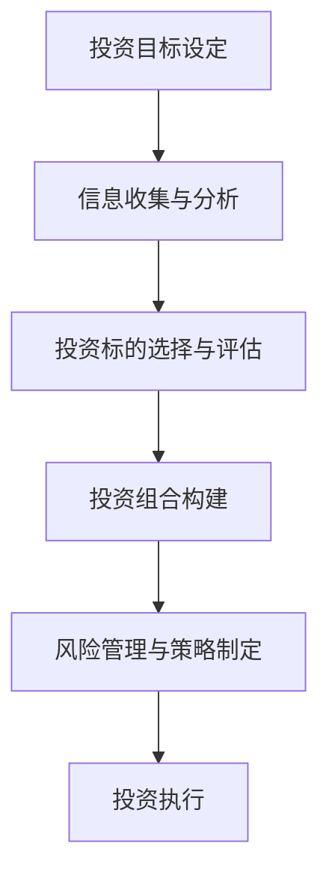

                 

# 巴菲特的集中投资理念：下重注于最佳机会

> **关键词**：巴菲特，集中投资，价值投资，投资哲学，风险管理，长期思维

> **摘要**：本文深入探讨了巴菲特的集中投资理念，分析其背后的哲学、方法和实践。通过详细阐述巴菲特的投资哲学、集中投资的核心理念、经典投资案例、投资决策框架、风险管理策略以及投资心态，本文为读者提供了全面的视角，帮助他们在投资领域做出明智决策。

---

## 第1章: 巴菲特的投资哲学

### 1.1 巴菲特的投资理念

#### 1.1.1 价值投资的定义与核心思想

价值投资是一种以基本面分析为基础的投资方法，强调购买被市场低估的优质企业股票。巴菲特的价值投资理念强调企业内在价值的评估，而不是短期市场波动的预测。他主张以合理的价格购买具有强大竞争优势的企业。

$$
\text{价值投资} = \text{内在价值} \times \text{安全边际}
$$

#### 1.1.2 集中投资的起源与背景

集中投资理念起源于巴菲特的导师本杰明·格雷厄姆的价值投资理论。格雷厄姆主张通过购买廉价的股票并长期持有，以实现财富的积累。巴菲特在此基础上发展了自己的投资策略，将资金集中在少数优质企业中，以追求超额收益。

#### 1.1.3 巴菲特投资哲学的核心要素

巴菲特的投资哲学可以总结为以下几点：
1. **长期思维**：关注企业的长期价值，而非短期价格波动。
2. **安全边际**：以低于内在价值的价格买入优质企业股票。
3. **竞争优势**：投资具有强大护城河的企业。
4. **集中投资**：将大部分资金投入到少数优质企业中。

### 1.2 集中投资的理论基础

#### 1.2.1 集中投资与分散投资的对比

集中投资与分散投资在风险和收益上存在显著差异：

| 对比维度 | 集中投资 | 分散投资 |
|----------|----------|----------|
| 风险     | 较高     | 较低     |
| 收益     | 较高     | 平稳     |
| 管理难度 | 较高     | 较低     |

#### 1.2.2 巴菲特对投资组合的数学模型分析

巴菲特认为，投资组合的收益与资产质量密切相关。他倾向于将资金集中在少数优质企业中，以实现更高的收益。数学模型如下：

$$
\text{投资组合收益} = \sum_{i=1}^{n} w_i \times r_i
$$

其中，$w_i$ 是第 $i$ 项资产的权重，$r_i$ 是第 $i$ 项资产的收益率。

#### 1.2.3 集中投资的风险与收益权衡

集中投资虽然可能带来更高的收益，但也伴随着较高的风险。巴菲特通过选择具有强大竞争优势的企业，并保持足够的安全边际，来降低投资风险。

### 1.3 巴菲特的投资策略

#### 1.3.1 长期投资与价值发现

巴菲特强调长期投资，认为短期市场波动无法预测，而优质企业的长期价值是可衡量的。他倾向于持有优质企业股票至数十年，以实现资本增值。

#### 1.3.2 股票选择的三大标准

巴菲特选择股票的标准如下：

1. **强大的竞争优势**：企业应具有护城河，能够在竞争中长期保持优势。
2. **优秀的管理层**：管理层应具备诚信和能力，能够为股东创造价值。
3. **合理的估值**：股票价格应低于企业的内在价值。

#### 1.3.3 投资组合的动态调整

巴菲特的投资组合并非一成不变，他会根据企业的基本面变化和市场环境进行动态调整。例如，当发现新的优质企业或原有企业的竞争优势减弱时，他会重新评估并调整投资比例。

---

## 第2章: 集中投资的核心理念

### 2.1 投资标的选择标准

#### 2.1.1 企业的核心竞争力分析

企业的核心竞争力是其长期竞争优势的来源。巴菲特通过分析企业的商业模式、市场份额、品牌影响力等因素，评估其核心竞争力。

#### 2.1.2 财务健康状况的评估

财务健康状况是评估企业价值的重要指标。巴菲特关注企业的盈利能力、资产负债情况、现金流状况等。

#### 2.1.3 管理团队的稳定性与能力

优秀的管理团队是企业成功的关键。巴菲特倾向于投资由诚信且有能力的管理层领导的企业。

### 2.2 内在价值的计算方法

#### 2.2.1 现金流折现模型的数学公式

内在价值的计算通常采用现金流折现模型（DCF）。公式如下：

$$
\text{内在价值} = \sum_{t=1}^{n} \frac{\text{现金流}}{(1 + r)^t} + \frac{\text{残值}}{(1 + r)^n}
$$

其中，$r$ 是折现率，$n$ 是企业寿命。

#### 2.2.2 市盈率与市净率的对比分析

市盈率（P/E）和市净率（P/B）是常用的估值指标。市盈率适用于盈利稳定的行业，市净率适用于资产密集型行业。

| 指标 | 市盈率（P/E） | 市净率（P/B） |
|------|----------------|----------------|
| 适用场景 | 盈利稳定的行业 | 资产密集型行业 |

#### 2.2.3 企业生命周期对估值的影响

企业生命周期分为初创期、成长期、成熟期和衰退期。不同阶段的企业估值方法和预期收益不同。

### 2.3 投资组合的构建与优化

#### 2.3.1 集中投资的数学模型

集中投资的数学模型如下：

$$
\text{投资组合收益} = \sum_{i=1}^{k} w_i \times r_i
$$

其中，$k$ 是投资的股票数量，$w_i$ 是第 $i$ 只股票的权重，$r_i$ 是第 $i$ 只股票的收益率。

#### 2.3.2 投资组合的风险分散策略

尽管集中投资风险较高，但可以通过选择具有较强相关性的资产来分散风险。

#### 2.3.3 投资比例的动态调整

巴菲特的投资比例动态调整基于企业的基本面变化和市场环境。例如，当市场出现系统性风险时，他会适当降低投资比例。

---

## 第3章: 巴菲特的经典投资案例分析

### 3.1 可口可乐的投资分析

#### 3.1.1 可口可乐的核心竞争优势

可口可乐的核心竞争优势包括强大的品牌影响力、全球分销网络和稳定的现金流。

#### 3.1.2 投资决策的财务分析

可口可乐的财务状况良好，具有稳定的现金流和较低的负债率。

#### 3.1.3 长期持有策略的收益表现

长期持有可口可乐股票带来了显著的资本增值。

### 3.2 苹果公司的投资分析

#### 3.2.1 苹果的创新能力和市场地位

苹果以其创新能力和强大的市场地位著称，具有强大的护城河。

#### 3.2.2 投资决策的财务指标分析

苹果的财务状况健康，具有较高的净利润率和稳定的现金流。

#### 3.2.3 投资组合的动态调整

巴菲特在苹果的投资中，根据公司的业绩和市场环境进行动态调整。

### 3.3 其他经典投资案例

#### 3.3.1 巴菲特对银行股的投资策略

银行股的投资需要关注其资本充足率和资产质量。

#### 3.3.2 巴菲特对能源股的投资分析

能源股的投资需要考虑行业周期和政策影响。

#### 3.3.3 巴菲特对消费股的投资逻辑

消费股的投资需要关注企业的市场份额和品牌影响力。

---

## 第4章: 投资决策的框架与流程

### 4.1 投资决策的基本框架

#### 4.1.1 投资目标的设定

明确投资目标是制定投资策略的基础。例如，短期投资目标可能是获取资本增值，长期投资目标可能是实现财富保值。

#### 4.1.2 信息收集与分析

投资者需要收集企业的财务报表、行业分析报告和市场动态等信息。

#### 4.1.3 投资标的选择与评估

根据企业的竞争优势、财务状况和估值指标，选择具有投资价值的标的。

#### 4.1.4 投资组合的构建与优化

根据企业的分析结果，构建投资组合，并定期进行优化。

#### 4.1.5 风险管理与投资策略

制定风险管理策略，如设定止损点和分散投资。

### 4.2 投资决策的流程图

### 4.3 投资决策的数学模型

#### 4.3.1 投资组合优化模型

$$
\text{最大化} \sum_{i=1}^{n} w_i \times r_i
$$

$$
\text{约束} \sum_{i=1}^{n} w_i = 1
$$

其中，$w_i$ 是第 $i$ 项资产的权重，$r_i$ 是第 $i$ 项资产的收益率。

#### 4.3.2 风险管理模型

$$
\text{风险调整后收益} = \text{预期收益} - \text{风险溢价}
$$

---

## 第5章: 风险管理与投资策略

### 5.1 集中投资的风险

集中投资的主要风险包括市场波动风险、企业特定风险和流动性风险。

### 5.2 风险管理策略

#### 5.2.1 分散投资

通过选择具有相关性的资产来分散风险。

#### 5.2.2 风险对冲

利用衍生品进行风险对冲，例如使用期货和期权。

### 5.3 应对市场波动的策略

#### 5.3.1 保持冷静

市场波动是投资的常态，投资者需要保持冷静，避免情绪化决策。

#### 5.3.2 重新评估投资组合

定期评估投资组合，根据市场环境和企业基本面进行调整。

---

## 第6章: 投资心态与长期思维

### 6.1 长期思维的重要性

长期思维是巴菲特投资成功的关键。他关注企业的长期价值，而非短期价格波动。

### 6.2 耐心与纪律

耐心和纪律是集中投资成功的重要因素。投资者需要耐心持有优质企业股票，并在市场波动时保持纪律。

### 6.3 投资心态的培养

投资者需要培养积极的投资心态，避免贪婪和恐惧的干扰。

---

## 第7章: 总结与展望

### 7.1 本章总结

本文深入探讨了巴菲特的集中投资理念，分析了其投资哲学、核心理念、经典案例、决策框架、风险管理策略和投资心态。集中投资是一种高风险高收益的投资策略，需要投资者具备深刻的企业分析能力和长期投资的耐心。

### 7.2 对未来投资的展望

未来投资环境的不确定性增加，但集中投资的理念依然适用。投资者需要根据市场环境和企业基本面，灵活调整投资策略。

---

## 附录: 巴菲特的经典语录

1. “时间是优秀企业的朋友，是平庸企业的敌人。”
2. “我从未见过 Forbes 富豪榜上有我的名字，因为我不需要它。”
3. “投资的第一条准则是：不要亏损，保住本金。”
4. “成功的投资=正确的思想+正确的方法+耐心等待。”

---

## 作者信息

**作者：AI天才研究院/AI Genius Institute & 禅与计算机程序设计艺术 /Zen And The Art of Computer Programming**

---

通过以上章节的详细分析和讲解，读者可以全面理解巴菲特的集中投资理念，并将其应用于实际投资中。

