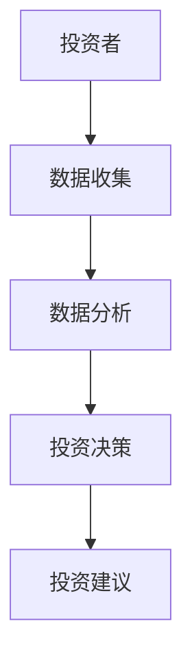

                 

# 巴菲特的集中投资策略：高确信度机会的重要性

**关键词**：巴菲特，集中投资，高确信度，投资策略，价值投资，安全边际

**摘要**：本文详细探讨了巴菲特的集中投资策略，分析了高确信度机会的重要性，结合数学模型和系统架构，提供了投资决策的最佳实践和案例分析。

---

## 第一部分: 巴菲特集中投资策略的背景与基础

### 第1章: 巴菲特投资哲学概述

#### 1.1 巴菲特的生平与投资理念
- **1.1.1 巴菲特的早年经历与投资启蒙**：巴菲特的童年、教育背景及其早期投资经历。
- **1.1.2 巴菲特的价值投资哲学**：买入并持有优质资产的核心理念。
- **1.1.3 巴菲特投资理念的核心思想**：长期价值、安全边际和分散风险的平衡。

#### 1.2 集中投资策略的背景
- **1.2.1 传统投资策略的局限性**：分散投资的优缺点及其适用场景。
- **1.2.2 巴菲特集中投资策略的起源**：巴菲特如何从格雷厄姆的老师学到集中投资。
- **1.2.3 高确信度机会的背景介绍**：高确信度机会的定义与重要性。

---

## 第二部分: 高确信度机会的核心要素

### 第2章: 高确信度机会的核心要素组成

#### 2.1 高确信度机会的核心要素
- **2.1.1 公司基本面分析**：包括公司财务状况、盈利能力、管理层质量等。
- **2.1.2 财务状况评估**：ROE、债务情况、现金流等关键指标。
- **2.1.3 竞争优势分析**：护城河、市场地位和创新能力。

#### 2.2 高确信度机会的属性特征对比
- **2.2.1 与其他投资机会的对比分析**：集中投资与分散投资的优缺点对比。
- **2.2.2 高确信度机会的稳定性与风险特征**：低波动性、高确定性。
- **2.2.3 高确信度机会的长期收益特征**：长期稳定收益高于短期高风险回报。

### 第3章: 高确信度机会的数学模型分析

#### 3.1 安全边际的数学模型
- **3.1.1 安全边际的计算公式**：$$安全边际 = 投资价值 - 市场价格$$
- **3.1.2 实例分析**：假设某公司内在价值为100，市场价格为80，安全边际为20%。

#### 3.2 内在价值的评估模型
- **3.2.1 DCF模型**：$$DCF = \sum_{t=1}^{n} \frac{CF_t}{(1 + r)^t} + \frac{TV}{(1 + r)^n}$$
- **3.2.2 市盈率与市净率分析**：$$合理市盈率 = 行业平均市盈率 \times 公司盈利能力$$

### 第4章: 投资决策系统架构

#### 4.1 系统功能设计
- **4.1.1 数据收集模块**：获取公司财务数据和市场信息。
- **4.1.2 数据分析模块**：应用数学模型评估内在价值和安全边际。
- **4.1.3 决策模块**：根据评估结果生成投资建议。

#### 4.2 系统架构设计

---

## 第三部分: 项目实战与案例分析

### 第5章: 环境安装与数据收集

#### 5.1 环境安装
- **安装工具**：Python、Pandas、Matplotlib、Scikit-learn。
- **数据源**：使用Yahoo Finance API获取股票数据。

### 第6章: 数据分析与投资组合构建

#### 6.1 数据分析
- **财务数据处理**：计算ROE、市盈率、市净率等指标。
- **模型应用**：使用DCF模型评估内在价值。

#### 6.2 投资组合构建
- **选择高确信度公司**：筛选出具有高安全边际和竞争优势的公司。
- **投资组合分配**：将大部分资金分配给少数优质公司。

### 第7章: 案例分析

#### 7.1 案例1：苹果公司投资分析
- **基本面分析**：苹果的盈利能力、市场地位和创新能力强。
- **内在价值评估**：使用DCF模型计算其内在价值。
- **投资决策**：确认安全边际，决定投资。

#### 7.2 案例2：可口可乐公司投资分析
- **财务状况评估**：高分红、稳定的现金流。
- **竞争优势分析**：强大的品牌和全球分销网络。
- **投资决策**：评估安全边际，决定投资。

---

## 第四部分: 总结与展望

### 第8章: 总结与注意事项

#### 8.1 投资策略总结
- **集中投资的优势**：高确信度机会带来长期稳定收益。
- **分散投资的局限性**：难以捕捉高收益机会，风险分散。

#### 8.2 小结与注意事项
- **持续学习**：关注市场变化和公司动态。
- **风险管理**：定期评估投资组合，调整安全边际。

### 第9章: 拓展阅读与最佳实践

#### 9.1 拓展阅读推荐
- 《巴菲特的思维方式》
- 《投资的谬误》
- 《价值投资实战》

#### 9.2 最佳实践 tips
- **长期持有优质资产**：避免频繁交易。
- **保持安全边际**：确保投资决策的高确信度。
- **分散风险**：虽然集中投资，但定期评估和调整。

---

**作者：AI天才研究院 & 禅与计算机程序设计艺术**

