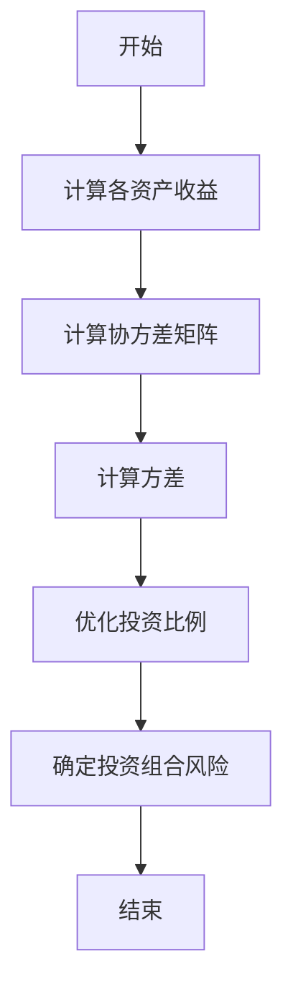
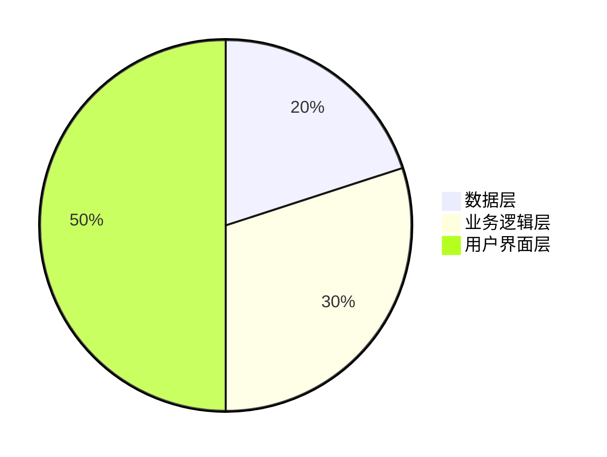
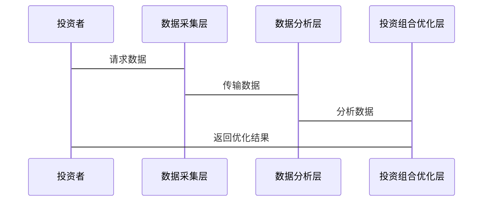
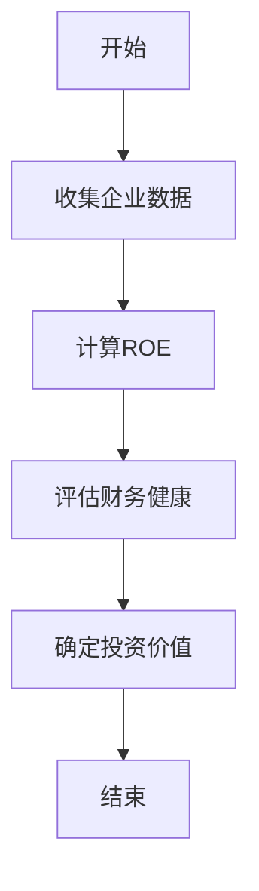

                 


# 巴菲特的风险定义：永久性资本损失的避免

## 关键词：巴菲特，风险定义，永久性资本损失，价值投资，投资策略

## 摘要：本文探讨了巴菲特关于永久性资本损失的定义及其避免策略，分析了其投资理念、风险管理方法和价值评估体系，并通过系统化的方法提供了实际应用的指导。文章从理论到实践，详细阐述了如何在投资中识别和规避永久性资本损失，帮助投资者构建稳健的投资组合。

---

# 第一部分：背景介绍

## 第1章：巴菲特的投资理念概述

### 1.1 巴菲特的投资哲学

#### 1.1.1 价值投资的核心理念
- 巴菲特的“价值投资”强调寻找被市场低估的优质企业，关注企业的内在价值。
- 投资的三大要素：价格、价值和安全边际。

#### 1.1.2 投资中的安全边际概念
- 安全边际是投资价格低于内在价值的部分，确保在市场波动中不会遭受永久性损失。
- 通过安全边际，投资者可以在市场恐慌时买入，恐慌时卖出。

#### 1.1.3 长期投资与复利效应
- 巴菲特强调长期投资的重要性，通过复利效应实现财富的稳步增长。
- 避免短期波动的干扰，专注于企业的长期价值。

### 1.2 风险的定义与分类

#### 1.2.1 风险的多维度定义
- 风险可以是市场风险、流动性风险、信用风险等。
- 永久性资本损失是一种特殊的风险，指投资本金的永久性损失。

#### 1.2.2 金融投资中的主要风险类型
| 风险类型       | 描述                       |
|----------------|---------------------------|
| 市场风险       | 市场波动导致的资产价值下降 |
| 利率风险       | 利率变化影响资产价值       |
| 信用风险       | 债务人违约风险             |
| 流动性风险       | 资产难以快速变现的风险     |
| 操作风险       | 操作失误导致的损失         |

#### 1.2.3 永久性资本损失与非永久性损失的对比
- 永久性损失：资产价值的永久性下降，无法通过市场回升恢复。
- 非永久性损失：暂时的市场波动导致的价值下降，最终可恢复。

---

## 第2章：永久性资本损失的避免策略

### 2.1 永久性资本损失的定义与特征

#### 2.1.1 永久性资本损失的定义
- 永久性资本损失是指投资本金的不可逆损失，通常由于企业基本面恶化或行业衰落导致。
- 例如，购买一家夕阳产业企业的股票，因企业无法扭亏为盈，股价持续下跌至零。

#### 2.1.2 永久性资本损失与非永久性损失的对比
| 特性              | 永久性资本损失       | 非永久性资本损失       |
|-------------------|----------------------|------------------------|
| 恢复性            | 无法恢复             | 可以恢复               |
| 时间因素          | 长期或永久           | 短期                   |
| 原因              | 企业基本面恶化       | 市场波动               |

#### 2.1.3 永久性资本损失的实体关系图（ER图）
- 实体：投资者、资产、损失
- 关系：投资者持有资产，资产遭受永久性损失。
- 属性：投资金额、损失金额、时间戳。

### 2.2 巴菲特的选股标准

#### 2.2.1 高质量企业的识别标准
- 高质量企业：市场地位稳固、盈利能力强、财务健康。
- 例如，可口可乐、IBM等企业符合巴菲特的选股标准。

#### 2.2.2 财务健康状况的分析方法
- 关注企业的ROE（净资产收益率）、债务水平、现金流。
- 例如，ROE长期高于行业平均水平的企业更值得投资。

#### 2.2.3 管理层诚信与能力的评估
- 管理层应具备诚信和卓越的管理能力。
- 例如，巴菲特倾向于投资由优秀管理层领导的企业。

### 2.3 风险控制措施

#### 2.3.1 分散投资策略
- 通过投资多个行业和企业分散风险。
- 例如，投资股票组合中的企业来自不同行业，降低单一行业风险。

#### 2.3.2 设置止损点
- 在投资组合中设定止损点，避免损失扩大。
- 例如，当某股票价格跌破买入价的20%，立即卖出。

---

## 第3章：投资组合的风险管理

### 3.1 投资组合的构建原理

#### 3.1.1 投资组合的分散化策略
- 分散化投资可以降低非系统性风险。
- 例如，投资股票、债券、房地产等多种资产类别。

#### 3.1.2 风险-收益平衡的数学模型
- 风险与收益的权衡是投资组合优化的核心。
- 使用均值-方差模型优化投资组合。

#### 3.1.3 投资组合优化的均值-方差模型
- 通过数学模型确定最优投资比例。
- 公式：$$ \text{最小化} \sum_{i=1}^n w_i^2 \sigma_i^2 + 2w_i w_j \sigma_{ij} $$

### 3.2 风险评估的数学公式

#### 3.2.1 风险的度量公式
- 标准差：$$ \sigma = \sqrt{\frac{1}{N-1} \sum_{i=1}^N (x_i - \bar{x})^2} $$
- 贝塔系数：$$ \beta = \frac{\text{协方差}(r_i, r_m)}{\text{方差}(r_m)} $$

#### 3.2.2 投资组合风险的计算流程图


---

## 第4章：价值投资的系统化分析

### 4.1 投资决策的系统架构

#### 4.1.1 投资决策系统的功能模块
- 数据采集、分析、优化、监控。

#### 4.1.2 系统架构的分层设计


#### 4.1.3 系统接口与数据流的交互图


### 4.2 投资分析的算法实现

#### 4.2.1 价值评估的算法流程


#### 4.2.2 投资组合优化的Python代码实现
```python
import numpy as np
import pandas as pd

# 假设returns是各资产的回报率矩阵
cov_matrix = np.cov(returns)
weights = np.array([0.3, 0.2, 0.5])
risk = np.sqrt(weights.T @ cov_matrix @ weights)
print("投资组合风险：", risk)
```

---

## 第5章：项目实战与案例分析

### 5.1 环境搭建与工具安装

#### 5.1.1 Python环境的配置
- 安装Python 3.8及以上版本。

#### 5.1.2 数据分析库的安装
```bash
pip install pandas numpy matplotlib
```

### 5.2 核心代码实现

#### 5.2.1 股票筛选算法的Python代码
```python
import pandas as pd

# 数据加载
data = pd.read_csv('stock_data.csv')

# 计算ROE
data['ROE'] = data['净利润'] / data['净资产']

# 筛选高ROE企业
selected = data[data['ROE'] > data['ROE'].mean()]
print("高ROE企业：", selected['公司名称'])
```

#### 5.2.2 投资组合优化的数学模型
- 使用均值-方差模型优化投资组合。

### 5.3 实际案例分析

#### 5.3.1 案例背景
- 投资者希望投资于5家企业的股票，构建一个低风险的投资组合。

#### 5.3.2 数据分析与优化
- 计算各股票的协方差矩阵。
- 使用优化算法确定最优投资比例。

#### 5.3.3 结果解读
- 确定各股票的投资比例，计算投资组合的风险和收益。

### 5.4 项目小结

#### 5.4.1 项目总结
- 成功构建了一个低风险的投资组合。
- 确定了各资产的投资比例，降低了永久性资本损失的风险。

---

## 第6章：最佳实践与小结

### 6.1 最佳实践 Tips

#### 6.1.1 风险控制
- 定期评估投资组合，及时调整。
- 设置止损点，避免损失扩大。

#### 6.1.2 长期投资
- 长期持有优质企业股票，享受复利效应。
- 避免短期交易，减少交易成本。

### 6.2 小结

- 巴菲特的价值投资理念强调长期持有优质企业，避免永久性资本损失。
- 通过分散投资、风险管理和系统化分析，可以有效降低投资风险。

### 6.3 注意事项

- 投资者需具备基本面分析能力。
- 定期评估投资组合，适应市场变化。

### 6.4 拓展阅读

- 《巴菲特致股东的信》
- 《投资最重要的事情》

---

作者：AI天才研究院/AI Genius Institute & 禅与计算机程序设计艺术/Zen And The Art of Computer Programming

---

这篇文章详细探讨了巴菲特关于永久性资本损失的定义及其避免策略，通过理论与实践相结合，帮助投资者构建稳健的投资组合，避免永久性资本损失。

